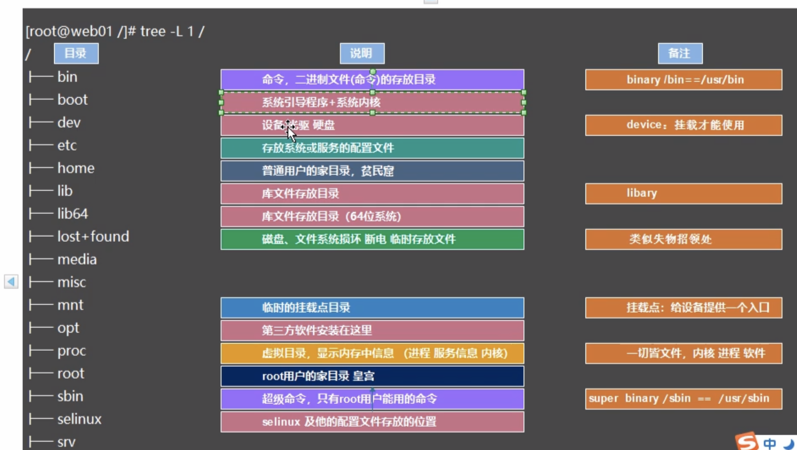

### 第一天

```bash
#进入centos光盘安装界面后，按tab键，出来一堆字母，后面接着输入……
#注意……后面的空格，省略号代表自带的命令
> …… net.ifnames=0 biosdevname=0
```

### 第二天

```bash
#克隆虚拟机,修改克隆副本的ip地址
vim /etc/sysconfig/network-scripts/ifcfg-eth0
#重启网卡
/etc/init.d/network restart
```

### 第四天


```bash
#man 在线命令手册
man ls

#创建多级目录
mkdir -p /dsf/ert/fghd

# -r 递归复制
cp -r

# -a 递归并保持文件属性（常用）
cp -a

#mv指代剪切功能兼具重命名
mv  
```

### 第六天

#### 1.文件作用




#### 2.命令

```bash
#挂载外部磁盘设备
#确认房子是否建好
ls -l /dev/cdrom
#确认门是否为空
ls -l /mnt
#门安装到房子上
mount /dev/cdrom /mnt

#卸载磁盘
umount /mnt

#查看挂在状态
df -h

#centos7重启服务
systemctl restart network
#centos6重启服务
/etc/init.d/network restart

#查看ip
ip address show eth0

#配置DNS服务
vim /etc/resolv.conf
#写入
nameserver 233.5.5.5
```


### 第七天 /etc配置文件

```bash
#一、centos改主机名
vim /etc/hostname


#二、自动挂载流程
1.购买硬件设备，重启服务器
2.查看是否识别到新设备并分区
fdisk -l
3.格式化设备
mkfs.xfs /dev/sdb1
4.挂载（临时）
mount /dev/sdb1 /mnt
#磁盘自动挂载文件配置（永久挂载）
vim /etc/fstab
#查看挂载情况
df -h

#三、文件中是启动时候自动运行的命令，类似自启动
echo 'ls -l ~' >> /etc/rc.local

#四、设置运行级别
cat /etc/inittab
systemctl set-default rescue.target
#查看当前级别
systemctl get-default

#五、设置环境变量信息
echo 'test=34343' >> /etc/profile
#设置以后需要加载
source /etc/profile

#可以用source命令加载的文件
/etc/profile      #全局作用域
/etc/bashrc				#全局作用域
~/.bashrc					#用户作用域
~/.bashrc_profile	#用户作用域

#六、登陆文件
#登陆之前提示文件
/etc/issue
#登陆之后提示文件
/etc/motd

#systemctl其他命令
systemctl ... disable  #开机不自动运行
systemctl ... enable	 #开机自动运行
```

### 第八天 

```bash
#/usr目录 系统软件包安装位置********

#监控审计
/usr/local/jumpserver

#系统中如何安装软件
#一. yum安装
yum -y install bash-completion
#查看是否安装成功
rpm -qa bash-completion
# -qa 还可用于搜索软件包
rpm -qa vim-*

#yum查看locate命令属于哪个软件包
yum provides locate
#查到以后安装这个包
yum y install mlocate

#查看某个软件安装文件的所有位置
rpm -ql bash-completion

#二、rpm安装(需要注意自己解决依赖关系，安装其他的依赖包)
rpm -ivh bash-completion

#三、编译安装
./configure  参数信息 #安装配置
make								 #编译过程
make install 				 #编译安装


#/var 目录**********
/var/log/messages  #系统运行中的一些错误信息
/var/log/secure		 #记录登录用户的成功失败信息

head /etc/services #显示文件前面10行信息
tail /etc/services #显示文件最后10行信息
#加个-f参数是实时监控查看
tail -f /etc/services 
#大F表示监控的文件被删除以后会有报错信息，且当文件恢复之后继续监控
#而小f文件被删除以后，就需要重启监控，所以一般用大F
tail -F /etc/services 

#这个软件包能在宿主机和虚拟机之间传输文件
yum -y install lrzsz

#查看指令三剑客
grep	#擅长过滤
sed		#擅长对行进行处理，对文件内容进行编辑修改
awk		#擅长对列进行处理，对日志文件进行分析

#命令代表过滤出来以后只显示前5行
# ｜是管道，用来按顺序执行命令
# ；是连接命令，多个命令可以一起执行
eg:
grep "Failed" /oldboy/2022-5-5.log|head -5
# -i 忽略大小写
grep -i "failed" /oldboy/2022-5-5.log|head -5

#日志文件进行保存备份（注意一定要切割）
vim /etc/logrotate.conf
weely 			#按照周切割
rotate 4 		#只保留最近的4份
create 			#分割之后创建新文件，一般默认
dateext 		#日志文件名后缀
compress 		#是否压缩，把注释解开就行
include  		#包含的其他文件，这个需要额外注意

# /proc目录 ********
# 目录中的数据是系统硬件信息，这些都保存在内存中
#查看cpu信息 
cat /proc/cpuinfo 或 lscpu
#查看内存信息 
cat /proc/meminfo 或 free -h


#运维工作流程
1.查看系统版本
cat /etc/redhat-release
2.查看系统内核
uname -r
3.添加用户
useradd oldboy
passwd oldboy
4.切换用户(标准的切换root用户一般都会在中间加上-，不加-有些环境变量会引起某些意外)
su - root

#显示当前登陆主机的用户身份信息
whoami
```


### 第九天 

#### 设置环境变量

```bash
# 1.打开文件
vim /etc/profile
# 2.写入
export PS1='dffddffdfd'
#3.重载文件
source /etc/profile
```

#### 修改yum源

[阿里巴巴镜像源(一定要注意centos系统版本)](https://developer.aliyun.com/mirror/centos?spm=a2c6h.13651102.0.0.3e221b11mP40o1)

#### 推荐卸载软件的方法

```bash
rpm -e 软件名称 --nodepth
```

#### yum命令

```bash
yum list  	  #显示仓库中可以下载软件的列表
yum repolist  #显示可用软件仓库信息
yum reinstall #重新安装软件
```

#### 优化安全策略

```bash
#selinux 控制root的权限
#开启/关闭，修改之后需要重启服务器，但企业一般不重启服务器，所以只需要临时关闭
vim /etc/selinux/config

#临时关闭selinux
setenforce 0
#检测是否关闭
getenforce

#临时防火墙的开关
#centos7
systemctl stop firewalld.service
systemctl status firewalld.service

#centos6
/etc/init.d/iptables stop
/etc/init.d/iptables status

#永久防火墙的开关
#centos7
systemctl disable firewalld.service #关
systemctl enable firewalld.service  #开

#centos6
chkconfig iptables off
```

#### 优化字符编码

[安装中文man命令手册](https://blog.csdn.net/weixin_62964420/article/details/121226708)

```bash
#修改命令提示符，用处不大
export PS1=

#设置系统字符编码
export LANG=en_US.UTF-8 >> /etc/profile
#还可以改成这个，让安装软件的时候显示中文，不过没必要
export LANG=zh_CN.UTF-8 >> /etc/profile

#显示系统所有环境变量
env
```

#### 批量创建

```bash
#批量创建文件
touch oldboy{01..20}

#批量创建目录
mkdir -p oldboy{01..20}/{01..03}
```

#### 查看文件信息

```bash
cat file1 file2
cat -n file
less file  #空格向下翻，b向上翻，/搜索

# -B代表before，匹配oldboy的字符串并显示之前的5行
# -A代表after		代表后5行
# -C代表center 代表上下5行
grep -B 5 'oldboy' ./2046-6-5.log

# 字符串最后的p需要带着,表示输出显示内容 -n代表不显示其他数据行
sed -n '/oldboy03/p' ./2046-6-5.log
#sed修改(这种的万一改错了怎么办)
sed -i 's#oldboy#oldgirl#g' ./2046-6-5.log
#sed修改并备份原件
sed -i.bak 's#oldboy#oldgirl#g' ./2046-6-5.log

awk '/oldboy03/' ./2046-6-5.log

#文件类型
- 普通文件
d 目录
l 快捷方式
c 字符设备文件
b 数据存储的磁盘文件
```


### 第十一天

```bash
#解决vim编辑错误产生的临时文件
开始 vim file.txt, 按R恢复，再vim打开文件，按D删除临时文件
```

#### 别名

```bash
#查看所有别名
alias

#临时设置别名
alias rm='echo sdfsfds'

#永久修改(两个文件作用是一样的),不过一般别修改系统文件，可以修改用户文件
vim /etc/profile
vim /etc/bashrc
#设置
alias rm='echo sdfsfds'
source /etc/profile

#取消别名
unalias rm

#1.显示命令的绝对路径信息
which alias

#2.显示命令路径及文件
whereis alias

#3.还可以使用其他软件查找命令文件，比如安装mlocate,使用locate命令，
#不过使用这个命令之前需要先执行
updatedb
#然后
locate file.txt

#4.find, type代表文件类型, 10c代表10字节（10b），+代表大于
# -maxdepth代表查找的目录深度，这个参数必须在所有参数之前，不然会有警告
find / -maxdepth 1 -type f -name 'aaa' -size +10c

#反引号表示把引号里面的命令执行结果交给引号外面的命令使用
`\which cat` /etc/profile


#目录操作
#只显示目录的结构信息
tree -d /etc

#显示目录层级结构
tree -L 1 /etc
```

#### 快捷方式

```bash
#软链接
ln -s 源文件 目标文件

#硬链接
ln 源文件 目标文件

#区别
1.软链接删除源文件，链接不可用，硬链接删除源文件，还可以使用
2.软链接可以对目录使用，硬链接不可以
3.硬链接和源文件必须在同一个分区

#ls快捷方式在文件类型上显示的是 lrwxrwx
```

#### 压缩文件

```bash
#压缩
tar zcvf aa.tar.gz. /etc
#解压
tar xvf  aa.tar.gz
```

#### 文件时间


```bash
#查看文件3个时间，访问（每次都变） 修改（编辑会变） 改变（属性变了就变）
stat file.txt

#时间的作用，方便查找，比如找7天以前的文件, + 代表以前
find /etc -type f -mtime +7

#用于自动同步时间信息，需要安装这个软件包
ntpdate
```

### 企业磁盘满了该怎么处理

```bash
# 1.看第5列 Use%使用情况
df -h   #查看block空间是不是不够了
df -i		#查看inode空间是不是不够了

#2. 查看哪个目录占用的磁盘大,一层一层找
du -sh /*
du -sh /var

#3.删除大的文件（比如nginx的log文件）

#4.重启产生该文件的服务（nginx）
```
#### xargs（一般经常和管道配合使用）

> 1.可以将多行信息利用空格整合为1条
> 2.可以将1条信息利用空格切割为多行

```bash
# （整合）把1天以前的文件都删除，因为可能会查出来多个文件，所以加上了xargs
# 1.批量删除
find / -type f -name 'aaa*' -mtime +1 |xargs rm
# 2.批量删除
find / -type f -delete
# 3.批量删除，-exec和-delete都是find自带参数
# -exec 把查找的信息放入{}中，让后面的命令处理
# -delete 把查找的信息删除
find / -type f -exec rm -f {} \;


#1.批量复制，注意花括号的位置，i代表input,把获取的结果插入到花括号中，按照cp命令的格式处理
find / -type f -name 'aaa*' |xargs -i cp {} /oldboy/
#2.批量复制，t代表target，指定目标目录，要么input插入位置，要么指定目标位置
find / -type f -name 'aaa*' |xargs cp -t /oldboy/

# （拆分）-n 代表分组显示，1 代表每组1个
xargs -n 1 < text01.txt
```
### 基础符号

#### $

> 1.表示变量信息
>
> 2.区分用户类型，$代表普通用户
>
> 3.结合awk对文件进行取列

```bash
#获取所有列
xargs -n 2 <test01.txt|awk '{print $0}'
#获取第2列
xargs -n 2 <test01.txt|awk '{print $2}'
```
#### ！

> 1.强制作用，例如 wq!
>
> 2.取反

```bash
awk '!/oldboy/' test01.txt
find /oldboy/ ! -type f
```
#### #

> 1.配置文件进行注释
>
> 2.表示用户身份，即为超级管理员，与$的普通用户对应

#### "" '' ``

>双引号：可以解析变量
>
>单引号：所见即所得
>
>反引号：只能包含命令，且将命令执行的结果交给其他命令

#### > >> < << 2> 2>>

>1.标准输出重定向
>
>2.标准输出追加重定向
>
>3.标准输入重定向
>
>4.标准输入追加重定向
>
>5.错误输出重定向
>
>6.错误输出追加重定向

```bash
#输入多行，输入完成后最后一行也要输出EOF
cat >>oldboy.txt<<EOF
```
#### &&

> 逻辑与，链接多个命令
>
> 与分号的区别：
>
> 分号：没有逻辑的一堆逻辑，前面出错了不影响后面
>
> &&：有逻辑的一堆逻辑，前面出错了后面也执行不了

#### {}

> 产生序列信息

```bash
#快速备份
cp oldboy.txt{,.bak} == cp oldboy.txt oldboy.txt.bak

#快速还原
cp oldboy.txt{.bak,}
```
### 正则

>结论：
>
>1.按照每行信息进行匹配筛选
>
>2.禁止使用中文
>
>3.附上颜色信息进行正则过滤  --color=auto/--color
>
>4.基础正则可以被三剑客命令识别 grep sed awk 
>
>5.扩展正则符号不可以被三剑客中的老二老三直接识别

```bash
# ^ 以……开头，获取所有非注释的配置
grep -v "^#" nginx.conf.default >nginx.conf

# $ 以……结尾, -A after后两行 -B before前一行
grep "m$" -A 2 -B 1 ~/aaa.txt 
#有时候明明有但就是过滤不出来，看看是不是匹配的内容有空格
cat -A ~/aaa.txt 

#过滤空行
grep "^$" ~/aaa.txt 
#过滤空行取反
grep -v "^$" ~/aaa.txt 

. 匹配任意一个字符且只有一个字符，-o 查看匹配过程
grep "." ~/aaa.txt -o

* 匹配*号前的字符一次或多次
grep "a*" ~/aaa.txt -o

[] 匹配括号中的每一个字符
grep "[0-9]" ~/aaa.txt
grep "oldb[oe]y" ~/aaa.txt
#将数字和字母都排除，^ 代表取反
grep "[^0-9a-zA-Z]" ~/aaa.txt

#以 I 或者 m 开头
grep "^[Im]" ~/aaa.txt

() 匹配一个整体
grep "(oldboy)|(oldbey)" ~/aaa.txt

{} 匹配花括号前的字符连续匹配多少次
区分：
* 匹配 0 次或多次
+ 匹配 1 次或多次
{n,m} 匹配最少n次,最多m次,还可以写为 {n},只匹配n次，{n,}最少n次，最多无限 {,m}这个代表至少0次
grep "0{2,3}" ~/aaa.txt

？匹配0次或1次
```
#### 扩展正则

```bash
# + 属于扩展正则，匹配1次或n次，所以grep需要加 -e
grep -e "0+" ~/aaa.txt
# 或
egrep "0+" ~/aaa.txt

#后项引用前项,后面尖括号里的数字代表前面的第n组括号匹配的内容
echo '123456'|sed -r "s#(.*)#<\1>#g"
结果：<123456>

echo '123456'|sed -r "s#(..)(..)(..)#<\1><\2><\3>#g"
结果：<12><34><56>

#匹配开启selinux,\1 指代的就是第1个括号中匹配的
sed -rn "s#(^S.*UX=).*#\1enforcing#gp" /etc/selinux/config
```
### sed

> 1.经常用来修改配置文件
>
> 2.一行一行处理，每次读取一条放入内存，处理完后再读取一条
>
> 3.-n 取消默认输出
>
> 4.对文件进行真正编辑时要用 -i， 必须在所有参数后面，同时最好加上 .bak，如果操作错误了还有备份
>
> 5.如果使用了正则匹配，对于扩展的正则符号需要使用 -r


```bash
#查询 p 代表输出 
1.根据字符串查找单行
sed -n '/aaaa/p' ./aaa.txt

2.根据字符串查找多行，这样查找的是一个范围，aa到bb中间的行也会输出出来
sed -n '/aa/,/bb/p' ./aaa.txt

3.根据字符串查找多行，如果只需要aa，bb两行，则
sed -n '/aa/;/bb/p' ./aaa.txt

4.根据行号查找，第3行
sed -n '3p' ./aaa.txt

5.根据行号查找，第2到4行
sed -n '2,4p' ./aaa.txt

5.根据行号查找，第2和4行
sed -n '2;4p' ./aaa.txt

#增加信息 a 代表 add
1.单行
sed '4a aaaaaaaa' ./aaa.txt

2.多行
sed '4a aaaaaaaa\bbbbbb' ./aaa.txt

3.第4行前面 ii代表 insert
sed '4i aaaaaaaa' ./aaa.txt

4.最后
sed '$a aaaaaaaa' ./aaa.txt

#删除第2和4行，d 代表 delete
sed -n '2;4d' ./aaa.txt
sed -ri.bak '2;4d' ./aaa.txt

#获取所有非空行，^$代表空行，p输出 ！取反
sed -n '/^$/!p' ./aaa.txt

#修改,c 代表change，整行替换，3和4最前面的s代表部分字符串匹配替换
1.单行都修改， c 代表change,第3行改为aaaa
sed -n '3c aaaaaa' ./aaa.txt

2.多行都修改,第3行改为aaaa,第6行改为bbbb
sed -n '3c aaaaaa' -e '6c bbbbb' ./aaa.txt

3.单行或多行部分修改，把Alex替换为goodman
sed -n 's#Alex#goodman#g' ./aaa.txt
只替换第4行
sed -n '4s#Alex#goodman#g' ./aaa.txt
根据aaa匹配的行进行替换
sed -n '/aaa/s#Alex#goodman#g' ./aaa.txt

#批量修改图片后缀名，& 代表把前面的都拿过来 |bash负责运行这些命令
find /root/ -type f -name "oldboy*jpg"|sed -r 's#(.*)jpg#mv & \1png#g'|bash
还可以
rename 'jpg' 'png'  oldboy*jpg

#批量创建用户，设置密码，并把这些保存进文件
```
### grep

> 经常用来分析日志文件


```bash
#sed 获取本机IP地址
-n #行
-r #扩展正则需要此参数
3  #第3行
s  #第一个代表正则匹配
\1 #反向获取前项
p  #输出
ip address show eth0|sed -nr '3s#^.*net (.*)/24.*$#\1#gp'

#grep 获取本机IP地址
-E #识别扩展正则符号
-o #只显示匹配过滤的内容
head -1 #只显示第一个匹配的内容
ip address show eth0|grep -E "([0-9]+\.?){4}" -o|head -1
```
### cat日志小技巧

```bash
#把日志文件每一列对齐查看
cat ~/aaa.log|column -t
#把日志文件每一列对齐并修改源文件
cat ~/aaa.log|column -t >~/aaa.log
```
### AWK

>-v 用于设置变量

```bash
#只查看第二行
awk 'NR==2' ./aaa.txt

#范围查看
awk 'NR>=3 && NR<=5' ./aaa.txt

#查看第二行的第1列和第3列
awk 'NR==2{print $1,$3}' ./aaa.txt

#查看正则匹配的第1列和第3列，这种方式所有的列都会去匹配正则
awk '/aaa/{print $1,$3}' ./aaa.txt

#如果正则只匹配第2列，～ 代表家
awk '$2~/aaa/{print $1,$3}' ./aaa.txt

#匹配第2列 ！取反
awk '$2!~/aaa/{print $1,$3}' ./aaa.txt

# -F 用于指定分割符号，在这里表示以空格和冒号进行分割，后面的+号表示1次或多次，因为分割的空格可能存在多个
awk -F "[ :]+" '/^aaa/{print $2,$5}' ./aaa.txt
# NF 代表从末尾开始找，获取第2行和倒数第2行
awk -F "[ :]+" '/^aaa/{print $2,$(NF-1)}' ./aaa.txt

#匹配并替换，替换需要使用gsub函数
#gsub函数格式  gsub(要替换修改的信息，"修改为目标值"，需要修改的列)，目标值一定要使用双引号
#这里表示把第4列的冒号都替换为$符号，最后必须用print打印出来，不然看不到
awk  '$2~/aaa/{gsub(/:/, "$", $4);print $4}' ./aaa.txt

# BEGIN 一般用于给列加表头
awk 'BEGIN{print "姓","名","ID","记录"}{print $0}' ./aaa.txt|column -t

# END
#统计有多少个空行,每一行都打印 i
awk '/^$/{i=i+1;print i}' /etc/services

#统计有多少个空行,只打印最后的 i
awk '/^$/{i=i+1}END{print i}' /etc/services
```


