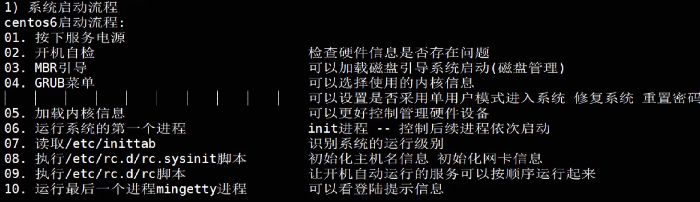
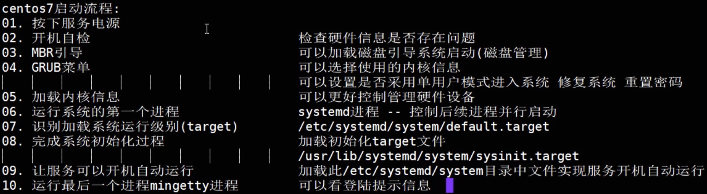
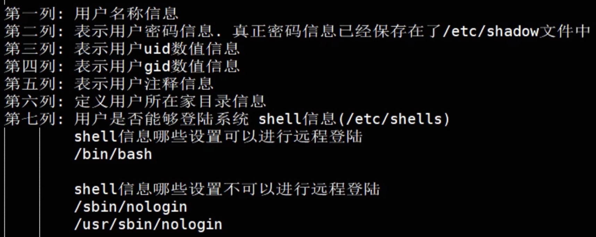
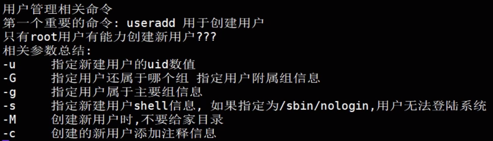
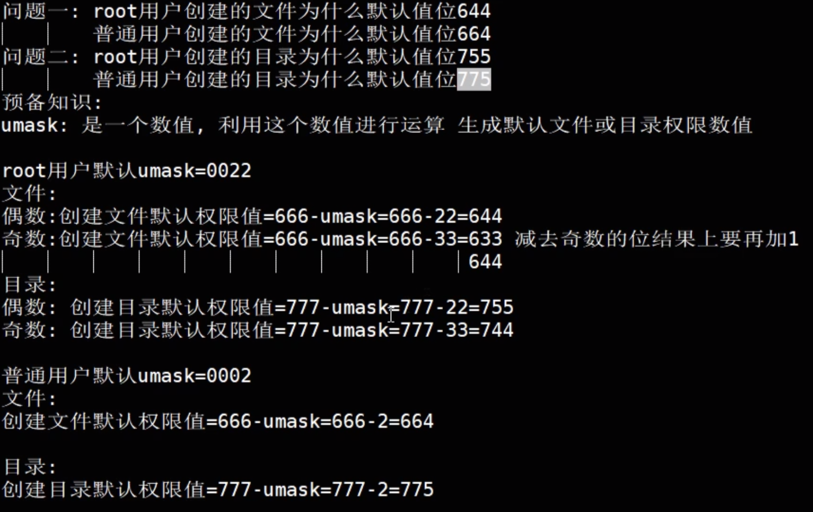
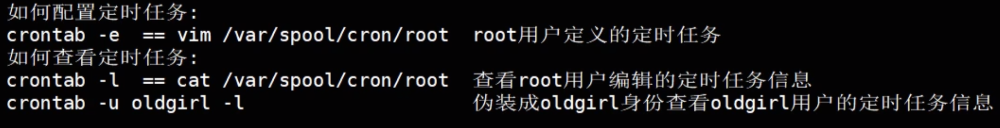

### 第十八天 系统启动





#### [忘记密码](https://blog.51cto.com/lidao/1932128)

#### 用户相关文件

/etc/passwd文件解释



```bash
cat /etc/passwd  #保存用户信息

cat /etc/shadow  #保存用户密码，只有root能查看

cat /etc/shells #查看哪些方式可以登录，主要作用于/etc/passwd文件最后一列

cat /etc/group  #组信息文件

cat /etc/gshadow #组密码，一般不用

#用户的家目录继承于这个目录，所以这个目录中有什么，新创建的用户登录之后家目录中也有什么
#比如在这个目录中创建一个readme文件，新用户家目录中也会有 
ll /etc/skel 

#检测aaa用户是否存在
id aaa
```
#### useradd命令



#### usermod（参数和useradd一样）

#### userdel

```bash
#彻底删除aaa用户，包括用户、家目录、邮件等
userdel -r aaa

#如果删除用户时，有残留的信息没有删除怎么办？
1.通过/etc/passwd查看用户uid
2.useradd -u uid原值 相同用户名
3.userdel -r 用户名
```
#### passwd

```bash
#适用于超级管理员给其他用户
#1.设置aaa密码
passwd aaa
#2.设置aaa密码 免交互
echo 123456|passwd --stdin aaa

#普通用户
passwd
```
#### 查询命令

```bash
id 				#查询用户的信息，uid gid
w					#显示主机工作时间 负载情况，连接主机的用户信息
last			#哪个用户在哪里什么时候登录了主机
lastlog		#显示所有用户最近一次远程登录的信息
```
#### 目录文件权限计算



#### 定时任务



```bash
# 定时任务执行命令经常会产生正确或错误的大量日志，所以不要让他记录错误，就在命令后面加上信息黑洞 &>/dev/null
* * * * * echo 'assa' >> /tmp/aaa.txt &>/dev/null

# 配置文件
/var/spool/cron

#日志文件
/var/log/cron
```
```bash

```
```bash

```
```bash

```
```bash

```
```bash

```
```bash

```
```bash

```
```bash

```
```bash

```
```bash

```
```bash

```
```bash

```
```bash

```
```bash

```

