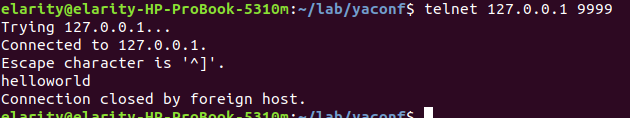
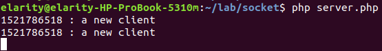

**socket**又叫**套接字**，它就是对TCP/IP的“封装”。现实中的网络实际上只有四层而已，从上至下分别是应用层、传输层、网络层、数据链路层。最常用的http协议则是属于应用层的协议，而socket，可以简单粗暴的理解为传输层的一种东西。如tcp://218.221.11.23:9999，使用tcp协议，这就是一个tcp socket。socket赋予了我们操控传输层和网络层的能力，从而得到更强的性能和更高的效率，socket编程是解决高并发网络服务器的最常用解决和成熟的解决方案。

php中可以操控socket的函数一共有两套，一套是**socket_**系列，另一套是**stream_**系列。**socket_**系列是php直接将C语言中的socket抄过来得到的实现，而**stream_**系列则是php使用流的概念将其进行了一层封装。

##### 简单demo

```php
// 将文件保存为server.php，然后执行php server.php运行起来
$host = '0.0.0.0';
$port = 9999;
// 创建一个tcp socket
$listen_socket = socket_create( AF_INET, SOCK_STREAM, SOL_TCP );
// 将socket bind到IP：port上
socket_bind( $listen_socket, $host, $port );
// 开始监听socket
socket_listen( $listen_socket );
// 进入while循环，不用担心死循环死机，因为程序将会阻塞在下面的socket_accept()函数上
while( true ){
  // 此处将会阻塞住，一直到有客户端来连接服务器。阻塞状态的进程是不会占据CPU的
  // 所以你不用担心while循环会将机器拖垮，不会的 
  $connection_socket = socket_accept( $listen_socket );
  // 向客户端发送一个helloworld
  $msg = "helloworld\r\n";
  socket_write( $connection_socket, $msg, strlen( $msg ) );
  socket_close( $connection_socket );
}
socket_close( $listen_socket );

//客户端是打开个dos窗口执行
telnet 127.0.0.1 9999
```


上面这个案例中，有两个很大的缺陷：

- 1.一次只可以为一个客户端提供服务，如果正在为第一个客户端发送helloworld期间有第二个客户端来连接，那么第二个客户端就必须要等待片刻才行。
- 2.很容易受到攻击，造成拒绝服务。

分析了上述问题后，我们可以fork出多个子进程来处理客户端请求，这样当accept了第二个客户端后再fork一个子进程来处理第二个客户端的请求，代码改造：

```php
$host = '0.0.0.0';
$port = 9999;
// 创建一个tcp socket
$listen_socket = socket_create( AF_INET, SOCK_STREAM, SOL_TCP );
// 将socket bind到IP：port上
socket_bind( $listen_socket, $host, $port );
// 开始监听socket
socket_listen( $listen_socket );
// 进入while循环，不用担心死循环死机，因为程序将会阻塞在下面的socket_accept()函数上
while( true ){
  // 此处将会阻塞住，一直到有客户端来连接服务器。阻塞状态的进程是不会占据CPU的
  // 所以你不用担心while循环会将机器拖垮，不会的 
  $connection_socket = socket_accept( $listen_socket );
  // 当accept了新的客户端连接后，就fork出一个子进程专门处理
  $pid = pcntl_fork();
  // 在子进程中处理当前连接的请求业务(这里为什么要==0，看pcntl_fork()函数的介绍)
  if( 0 == $pid ){
    // 向客户端发送一个helloworld
    $msg = "helloworld\r\n";
    socket_write( $connection_socket, $msg, strlen( $msg ) );
    // 休眠5秒钟，可以用来观察时候可以同时为多个客户端提供服务
    echo time().' : a new client'.PHP_EOL;
    sleep( 5 );
    socket_close( $connection_socket );
    exit;
  }
}
socket_close( $listen_socket );
```


### pcntl_fork()函数

```php
$one = 123;
$one++;
$two = time();
$pid = [];
$pid = pcntl_fork();
$three = time();


private function convertAssoc($data)
    {
        if ($data instanceof \stdClass) {
            return $this->convertAssoc((array) $data);
        } elseif (is_array($data)) {
            return array_map([$this, 'convertAssoc'], $data);
        } else {
            return $data;
        }
    }
```

pcntl_fork()函数执行的时候，会创建一个子进程。子进程会复制父进程的所有：数据，代码，还有状态。
1.当pcntl_fork（）创建子进程成功后，在父进程内，返回0，在子进程内返回自身的进程号，失败则返回-1

2.子进程会复制父进程的代码，数据。那么就说明：子，父进程拥有的代码和数据会一模一样。

3.重点：子进程会复制父进程的状态，那么就有上面的示例代码：在第五行执行了pcntl_fork，那么创建出的子进程，代码也是从第五行开始执行的。又子进程复制了数据，代码。所以，在子进程内同理存在：$one,$two等变量