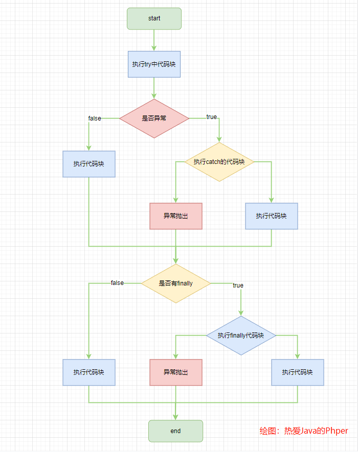

try 块和 catch 块中逻辑基本相同，try 中出现异常 catch 捕获异常并抛出，若 catch 中出现异常则跳转到 finally，try 或 catch 正常执行若存在 return 则先执行 return 的代码并保存返回值信息再执行 finally，若 finally 中出现异常或包含 return 则执行结束，若无异常且没有 return 则会执行 try 或 catch 中的 return 或结束。整体执行流程如下：



#### 代码说明与示例

> 当 try-catch-finally 中都没有 return 时：
>
> 如果 try 块中出现异常则进入 catch 中，执行完 catch 中代码后进入 finally，
>
> 如果 catch 中出现异常仍然会执行 finally 代码块，finally 块执行结束后抛出异常。try 块中无异常时执行完 try 块直接执行 finally。
>
> 总之，当try和catch中出现异常都会执行 finally 代码块
>
> 
>
> 如果 try和catch 中有 return时：
>
>
> finally 里面有 return，非 finally 代码段的 return（try和catch） 后面的代码不执行， finally 里面的 return 会覆盖前面 return 的值
>
> finally 里面无 return，非 finally 代码段的 return（try和catch） 后面的代码不执行，finally 代码段肯定会执行。

```php
public function test()
{
    $a = 1;
    try {
        $a = 1 / 0;
        app('log')->info("try ======== res:".$a);
        return $a;
    } catch (\Exception $exception) {
        $a++;
        app('log')->info("catch ======== res:".$a);
        return $a;
    } finally {
        $a++;
        app('log')->info("finally ======== res:".$a);
        return $a;
    }
}
```


