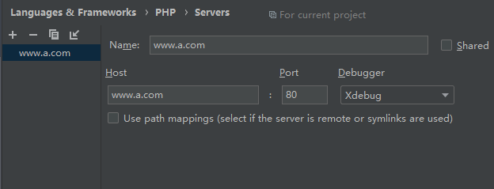
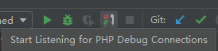
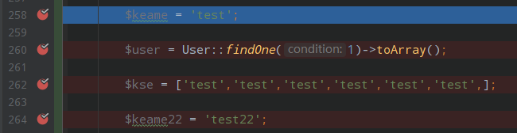
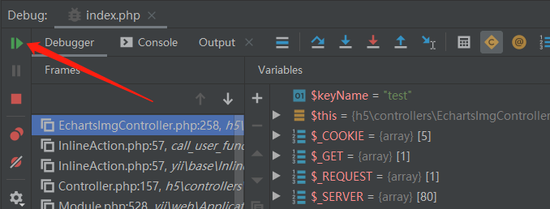

### php.ini配置
因为phpstudy集成环境自带XDebug，所以php.ini配置大概如下：

```ini
zend_extension=D:/phpstudy/Extensions/php/php7.0.9nts/ext/php_xdebug.dll
xdebug.collect_params=1
xdebug.collect_return=1
xdebug.auto_trace=Off
xdebug.trace_output_dir=D:/phpstudy/Extensions/php_log/php7.0.9nts.xdebug.trace
xdebug.profiler_enable=Off
xdebug.profiler_output_dir=D:/phpstudy/Extensions/php_log/php7.0.9nts.xdebug.profiler
#这一行切记要开启
xdebug.remote_enable=On
xdebug.remote_host=localhost
xdebug.remote_port=9100
xdebug.remote_handler=dbgp
```


### 设置PhpStorm

打开PhpStorm，菜单 File -> Settings  -> `Languages & Frameworks -> PHP -> Debug`
设置`Debug port`为`9100`，为什么不是9000？因为会和一些集成环境的php-cgi或者php-fpm端口冲突.


然后配置`Languages & Frameworks -> PHP -> Servers`



然后找到PhpStorm右上角电话图标，开始监听php debug的链接



打开cmd运行以下命令，如果有9100端口，就说明监听成功

```bash
netstat -aon|findstr "9100"
```

### 触发断点调试

在需要的代码处打断点



刷新浏览器之后，一直点即可
