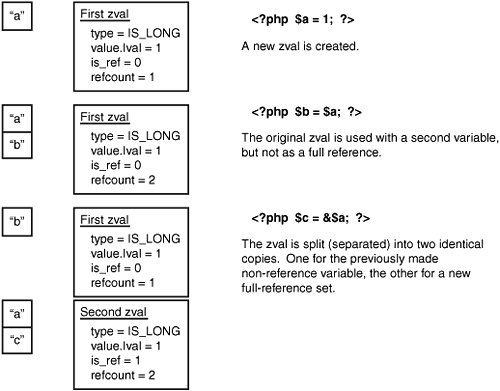
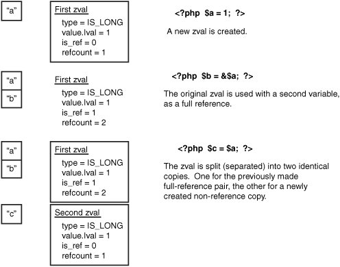

## 变量存储

**[传值、传址、传引用的区别](https://blog.csdn.net/damys/article/details/21241069)**

**zval：**内核中存储PHP变量的结构体，也可以理解为一个由value、type、refcount_gc、is_ref_gc组成的对象。

```c
struct _zval_struct {
    zvalue_value value;    /* 变量的值 */
    zend_uint refcount_gc; /* 变量被使用的次数，初始值为1，本身算一次 */
    zend_uchar type;       /* 变量当前的数据类型 */
    zend_uchar is_ref_gc;  /* 表示当前变量是否被传引用，初始值为0，传引用（&）之后是1*/
};
```

**- zend_uchar type:**基于zval结构体,衍生出了8种数据类型，即php语言对应的8种类型

- IS_NULL	变量的默认类型，此类型值只有一个就是NULL，不同于0和false。
- IS_BOOL	布尔类型的变量，只有两个值true和false。
- IS_LONG	PHP语言中的整型。
- IS_DOUBLE	PHP中的浮点数据。
- IS_STRING	PHP中的字符串类型。
- IS_ARRAY	数组类型，它唯一的功能就是聚集别的变量。
- IS_OBJECT	对象类型，和数组一样，也是用来存储复合数据的，但是与数组不同的是，对象还需要保存以下信息：方法、访问权限、类常量以及其它的处理逻辑。
- IS_RESOURCE	资源类型，存储一些内容可能无法直接呈现给PHP用户的，但实际中却是需要的东西，比如mysql服务器的链接

#### 如何检测变量的类型和值

Z_TYPE、Z_TYPE_P、Z_TYPE_PP

#### 如何存储变量
当PHP中定义了一个变量，内核会自动的把它的信息储存到一个用HashTable实现的符号表里。全局作用域的符号表是在调用扩展的RINIT方法(一般都是MINIT方法里)前创建的，并在RSHUTDOWN方法执行后自动销毁。此时，当在PHP中调用一个函数或者类的方法时，内核会创建一个新的符号表并激活，一个代表全局作用域，另一个代表当前作用域(现在懂了内核是怎么区分局部变量了吧，这也是为什么我们无法在函数中使用在函数外定义的变量的原因) 。源码中$GLOBAL的定义：

```c
struct _zend_executor_globals {
    ...
    HashTable symbol_table;
    HashTable *active_symbol_table;
    ...
}; 
```

#### 内核创建存储一个变量的过程

```php
$cbs = '咖啡色的羊驼';
```

```c
{
    zval *cbsval; //声明一个zval的指针，*代表指针，跟go类似
    MAKE_STD_ZVAL(cbsval); //申请一块内存
    ZVAL_STRING(cbsval, "咖啡色的羊驼", 1); //通过ZVAL_STRING宏将值设置为"咖啡色的羊驼"
    ZEND_SET_SYMBOL( EG(active_symbol_table) ,  "cbs" , cbsval); //将这个zval加入到当前的符号表里去，并将	其label定义成变量名cbs
}  
```


## 内存管理

假设存在以下代码：
```php
$a = 1;
$b = $a;
```

我们知道每次赋值系统都会申请一块内存供变量存放，假设$a申请了50b内存，$b也申请了50b内存。那么万一程序里操作的变量很多(文件内容等)而且又是相同的数据那岂不是要申请很多内存？
答案是 no，php会进行**合并同类项**(内存管理)。还记得zval结构体中有两个参数**refcount_gc**和**is_ref_gc**吗?是的，就是用它来进行合并同类项。

**真实过程是这样**：

```php
//初始化zval结构体中 refcount_gc = 1
$a = 1; 
//发现$b和$a相同，将refcount_gc = 2，因为现在两个变量都在用这个zval结构所以不再重复申请内存。
$b = $a;
//unset的时候，把refcount_gc = 1
unset($a);
```

**那如果来个 $b+=5呢？**

```php
//同上
$a = 1; 
//同上
$b = $a;
//内核首先查看refcount_gc属性，如果它大于1则为$b从原zval结构中复制出一份新的专属于$b的结构体并改变其值，同时将原zval结构体中的refcount_gc减1
$b+=100;
```

**如果存在引用呢？$b=&$a?**

```php
//同上
$a = 1;
//refcount_gc属性加1变成2，而且is_ref_gc属性也同时变为了1，代表是引用，如果有值的变化就无需再次为$b复制一个zval结构体
$b = &$a;
//因为是引用，所以$b改变时，&$a也变成了101
$b += 100;
```

> 注意：是否需要复制一个zval结构体的条件是：refcount_gc==2 && is_ref_gc == 0

**那如果加入一个第三者呢？：**

```php
//同上
$a = 1;
//同上
$b = $a;
//$bzval结构体不变，为$a复制一份新的zval结构体，同时$a新结构体的refcount_gc属性加1变成2，is_ref_gc属性变为1
$c = &$a;
```

	


**那如果地址的赋值在第二步？**

```php
//同上
$a = 1;
//refcount_gc属性加1变成2，is_ref_gc属性变为了1
$b = &$a;
//为$c复制一份新的zval结构体，同时$c新结构体的refcount_gc属性重置为1
$c = $a;
```

	


## 垃圾回收（GC）


