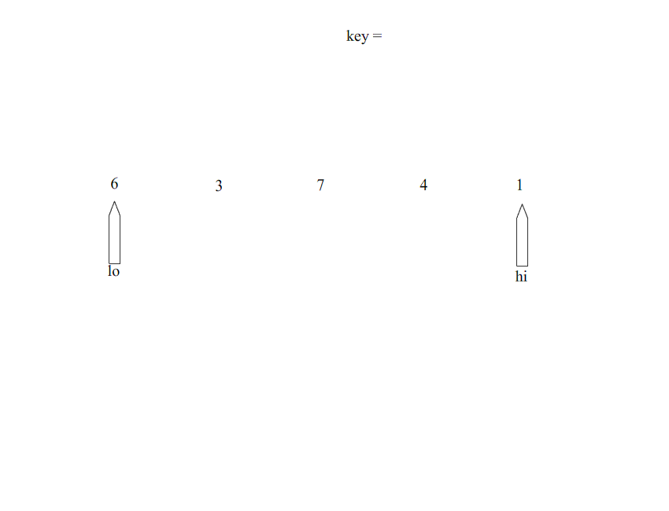

### 冒泡排序

> 它依次比较两个元素，如果他们的顺序错误就把他们交换过来。
>
> 步骤：
>
> 1. 比较相邻的元素。如果第一个比第二个大，就交换他们两个。
> 2. 对每一对相邻元素作同样的工作，从开始第一对到结尾的最后一对。在这一点，最后的元素应该会是最大的数。
> 3. 针对所有的元素重复以上的步骤，除了最后一个。
> 4. 持续每次对越来越少的元素重复上面的步骤，直到没有任何一对数字需要比较。

```php
function bubbleSort($arr) {
    $length = count($arr);
    //该层循环控制 需要冒泡的轮数
    for ($i = 1; $i < $length; $i++) {
        //该层循环用来控制每轮 冒出一个数 需要比较的次数
        for ($k = 0; $k < $length - $i; $k++) {
            if ($arr[$k] > $arr[$k + 1]) {    //从小到大 < || 从大到小 >
                $tmp         = $arr[$k + 1];
                $arr[$k + 1] = $arr[$k];
                $arr[$k]     = $tmp;
            }
        }
    }
    return $arr;
}

$arr = [1, 43, 54, 62, 21, 66, 32, 78, 36, 76, 39, 2];
$arr = bubbleSort($arr);
print_r($arr);
```


### 选择排序

> 工作原理：首先在未排序序列中找到最小元素，存放到排序序列的起始位置，然后，再从剩余未排序元素中继续寻找最小元素，然后放到排序序列末尾。以此类推，直到所有元素均排序完毕。

```php
//实现思路 双重循环完成，外层控制轮数，当前的最小值。内层控制比较次数
function selectSort($arr) {
    $length = count($arr);
    for ($i = 0; $i < $length - 1; $i++) {
        //记录我们认为最小值的下标
        $minKey = $i;

        for ($j = $i + 1; $j < $length; $j++) {
            //$arr[$minKey]是当前已知的最小值,比较发现更小的记录下最小值的位置；并且在下次比较时，应该采用已知的最小值进行比较。
            $minKey = ($arr[$minKey] <= $arr[$j]) ? $minKey : $j;
        }

        //如果发现 最小值的位置与当前假设的位置$i不同，则位置互换即可
        if ($minKey != $i) {
            $tmp     = $arr[$minKey];
            $arr[$minKey] = $arr[$i];
            $arr[$i] = $tmp;
        }
    }
    return $arr;
}

$arr = [1, 43, 54, 62, 21, 66, 32, 78, 36, 76, 39, 2];
$arr = selectSort($arr);
print_r($arr);
```


### 插入排序

> 工作原理是通过构建有序序列，对于未排序数据，在已排序序列中从后向前扫描，找到相应位置并插入。插入排序在实现上，通常采用in-place排序（即只需用到O(1)的额外空间的排序），因而在从后向前扫描过程中，需要反复把已排序元素逐步向后挪位，为最新元素提供插入空间。
>
> 步骤：
>
> 1. 从第一个元素开始，该元素可以认为已经被排序
> 2. 取出下一个元素，在已经排序的元素序列中从后向前扫描
> 3. 如果该元素（已排序）大于新元素，将该元素移到下一位置
> 4. 重复步骤3，直到找到已排序的元素小于或者等于新元素的位置
> 5. 将新元素插入到该位置中

```php
function insertSort($arr)
{
    $length = count($arr);
    for($i=1; $i < $length; $i++) {
        //获得当前需要比较的元素值
        $tmp = $arr[$i];
        for($j=$i-1; $j>=0; $j--) {
            if($tmp < $arr[$j]){   //从小到大 < || 从大到小 >
                //发现插入的元素要小，交换位置，将后边的元素与前面的元素互换
                $arr[$j+1] = $arr[$j];
                //将前面的数设置为 当前需要交换的数
                $arr[$j] = $tmp;
            } else {
                //如果碰到不需要移动的元素，由于是已经排序好是数组，则前面的就不需要再次比较了。
                break;
            }
        }
    }
    return $arr;
}

$arr = [1, 43, 54, 62, 21, 66, 32, 78, 36, 76, 39,2];
$arr = insertSort($arr);
print_r($arr);
```


### 快速排序

> 在平均状况下，排序 n 个项目要Ο(n log n)次比较。在最坏状况下则需要Ο(n2)次比较，但这种状况并不常见。事实上，快速排序通常明显比其他Ο(n log n) 算法更快，因为它的内部循环（inner loop）可以在大部分的架构上很有效率地被实现出来，且在大部分真实世界的数据，可以决定设计的选择，减少所需时间的二次方项之可能性。
>
> 步骤：
>
> 1. 从数列中挑出一个元素，称为 “基准”（pivot），
> 2. 重新排序数列，所有元素比基准值小的摆放在基准前面，所有元素比基准值大的摆在基准的后面（相同的数可以到任一边）。在这个分区退出之后，该基准就处于数列的中间位置。这个称为分区（partition）操作。
> 3. 递归地（recursive）把小于基准值元素的子数列和大于基准值元素的子数列排序。

```php
function quickSort($arr)
{
    //判断参数是否是一个数组
    if(!is_array($arr)) return false;

    //递归出口:数组长度为1，直接返回数组
    $length = count($arr);

    if($length <= 1) return $arr;

    //数组元素有多个,则定义两个空数组
    $left = $right = array();

    for($i=1; $i<$length; $i++) {
        if($arr[$i] < $arr[0]){  //从小到大 < || 从大到小 >
            $left[]=$arr[$i];
        }else{
            $right[]=$arr[$i];
        }
    }

    //递归调用
    $left  = quickSort($left);
    $right = quickSort($right);

    //将结果合并
    return array_merge($left,array($arr[0]),$right);
}

$arr = [1, 43, 54, 62, 21, 66, 32, 78, 36, 76, 39,2];
$arr = quickSort($arr);
print_r($arr);
```




### 归并排序

> 利用递归，先拆分、后合并、再排序。

> **步骤:**
>
> 1. 均分数列为两个子数列
> 2. 递归重复上一步骤，直到子数列只有一个元素
> 3. 父数列合并两个子数列并排序，递归返回数列

```php
function mergeSort($arr) {
    $len = count($arr);

    // 递归结束条件, 到达这步的时候, 数组就只剩下一个元素了, 也就是分离了数组
    if ($len <= 1) {
        return $arr;
    }

    $mid  = intval($len / 2);             	// 取数组中间
    $left = array_slice($arr, 0, $mid); 	// 拆分数组0-mid这部分给左边left
    $right= array_slice($arr, $mid);        // 拆分数组mid-末尾这部分给右边right
    $left = mergeSort($left);               // 左边拆分完后开始递归合并往上走
    $right= mergeSort($right);              // 右边拆分完毕开始递归往上走
    $arr  = merge($left, $right);           // 合并两个数组,继续递归
    return $arr;
}

//merge函数将指定的两个有序数组(arrA, arr)合并并且排序
function merge($arrA, $arrB) {
    $arrC = array();
    while (count($arrA) && count($arrB)) {
        // 这里不断的判断哪个值小, 就将小的值给到arrC, 但是到最后肯定要剩下几个值,
        // 不是剩下arrA里面的就是剩下arrB里面的而且这几个有序的值, 肯定比arrC里面所有的值都大所以使用
        //从小到大 < || 从大到小 >
        $arrC[] = $arrA[0] < $arrB[0] ? array_shift($arrA) : array_shift($arrB);
    }

    return array_merge($arrC, $arrA, $arrB);
}

$arr = [1, 43, 54, 62, 21, 66, 32, 78, 36, 76, 39,2];
$arr = mergeSort($arr);
print_r($arr);
```

