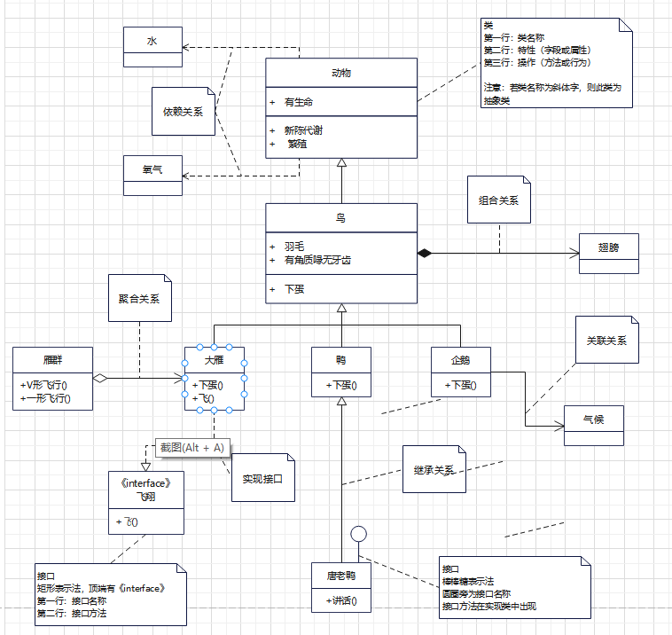
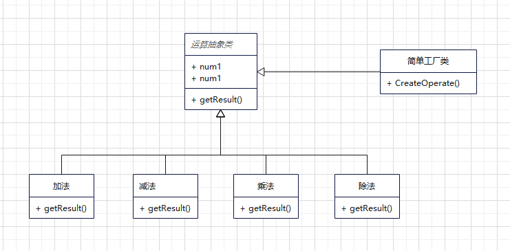

如果想成为一名优秀的软件设计师，了解优秀软件设计的演变过程比学习优秀设计本身更有价值，因为设计的演变过程中蕴藏着大智慧。古代只有石板雕刻技术没有活字印刷，曹操诗兴大发想写一首诗，分别经历了三个版本
第一天随性作诗：喝酒唱歌，人生太爽。命石匠连夜雕刻之……
第二天略作修改：对酒当歌，人生太爽。又命石匠连夜雕刻之……
第三天李白附体：对酒当歌，人生几何。又命石匠连夜雕刻之……
第四天，石匠卒。

石匠卒的原因就是每次曹操诗兴大发都要整个刻板重新刻画，而如果有了活字印刷，只需要变更几个字即可。
面对对象的四个好处：

* 可维护：只需要修改需要改的字
* 可复用：已经刻好的字以后也可以使用
* 可扩展：若需要加别的字，另外刻一个就行
* 灵活性好：字的顺序不对？排列一下就好

### UML图
接口图与类图：接口图顶部自带《interface》，类图没有
继承关系：空心三角形+实线
几种鸟中只有大雁能飞，所以【实现】了飞翔接口：空心三角形+虚线
关联关系，比如企鹅跟天气的关系：只有实线箭头
聚合关系，比如大雁群和大雁的关系：空心菱形+实线箭头
组合关系，比如鸟和翅膀的关系，表现为“强拥有”关系：实心菱形+实线箭头
依赖关系，比如动物需要氧气、水、食物：只有虚线箭头
关联关系、聚合关系、组合关系连线两端还有数字，被称为基数，表名这一端的类可以有几个实例，比如鸟有两个翅膀



### 简单工厂模式
* 属于创建型模式，是工厂模式的一种。简单工厂模式是由一个工厂对象决定创建出哪一种产品类的实例。
* 简单工厂模式：定义一个创建对象的接口，将对象的创建和本身的业务逻辑分离，降低系统的耦合度，使得修改起来相对容易些，当以后需求改变时，只需要修改工厂类即可。



```php
/**
 * 写一个计算器
 */
class ProGramV1
{
    public static function main($a, $b, $c)
    {
        if ($b == "+") {
            return $a + $c;
        } elseif ($b == "-") {
            return $a - $c;
        } elseif ($b == "*") {
            return $a * $c;
        } elseif ($b == "/") {
            return $a / $c;
        }
    }
}

/*$res = ProGramV1::main(1, '+', 5);
var_dump($res);die;*/

/**
 * 需求：一眼就看出来多处缺陷
 * 改进：1.命名不规范
 *      2.没有考虑除数为0的情况
 *      3.没有考虑其他异常
 */
class ProGramV2
{
    public static function main($numberA, $operate, $numberB)
    {
        try {
            if ($operate == "+") {
                return $numberA + $numberB;
            } elseif ($operate == "-") {
                return $numberA - $numberB;
            } elseif ($operate == "*") {
                return $numberA * $numberB;
            } elseif ($operate == "/") {
                if ($numberB == 0) {
                    echo '除数不能为0';
                    exit();
                }
                return $numberA / $numberB;
            }
        } catch (\Exception $e) {
            echo '其他异常';
            exit();
        }
    }
}

/*$res = ProGramV2::main(1, '*', 2);
var_dump($res);*/

/**
 * 需求：如果其他地方也需要用到这个计算器呢？
 * 改进：1.业务逻辑与界面逻辑分离，一个类专注于做一件事
 */
class OperationV1
{
    public static function getResult($numberA, $operate, $numberB)
    {
        switch ($operate) {
            case "+":
                return $numberA + $numberB;
            case "-":
                return $numberA - $numberB;
            case "*":
                return $numberA * $numberB;
            case "/":
                if ($numberB == 0) {
                    exit('除数不能为0');
                }
                return $numberA / $numberB;
            default:
                exit('请选择计算方式');
        }
    }
}

class ProGramV3
{
    public static function main($numberA, $operate, $numberB)
    {
        try {
            return OperationV1::getResult($numberA, $operate, $numberB);
        } catch (\Exception $e) {
            exit('其他异常');
        }
    }
}

/*$res = ProGramV3::main(1, '*', 3);
var_dump($res);*/

/**
 * 需求：1.如果新增其他运算呢？比如求平方、立方或者平方根呢？
 *      2.在修改过程中不小心碰到了其他运算方法（加减乘除）造成损失呢？
 * 改进：1.简单工厂模式
 */
abstract class OperationV2
{
    public $numberA;
    public $numberB;

    public function getResult(){}
}

class Add extends OperationV2 {
    public function getResult()
    {
        return $this->numberA + $this->numberB;
    }
}

class Div extends OperationV2 {
    public function getResult()
    {
        if ($this->numberB == 0) {
            exit('除数不能为0');
        }
        return $this->numberA / $this->numberB;
    }
}

class Factory {
    public static function CreateOperate($operate)
    {
        switch($operate){
            case "+":
                return new Add();
            case "/":
                return new Div();
            default:
                exit('请选择计算方式');
        }
    }
}

$operate = Factory::CreateOperate( '/');
$operate->numberA = 1;
$operate->numberB = 5;
echo $operate->getResult();
```

**简单工厂优缺点：**
**优点：**简单工厂模式提供专门的工厂类用于创建对象，实现了对象创建和使用的职责分离，客户端无需知道所创建的具体产品类的类名以及创建过程，只需知道具体产品类所对应的参数即可，通过设置参数可以在不修改任何客户端代码的情况下更换和增加新的具体产品类，在一定程度上提高了系统的灵活性。
**缺点：**不符合“开闭原则”，每次添加新产品就需要修改工厂类。在产品类型较多时，有可能造成工厂逻辑过于复杂，不利于系统的扩展维护，并且工厂类集中了所有产品创建逻辑，一旦不能正常工作，整个系统都要受到影响。
为了解决简单工厂模式的问题，出现了工厂方法模式。

```php
//1，构建Pizza抽象类：
abstract class Pizza {

    protected $name; //名字

    //准备原材料, 不同的披萨不一样，因此，我们做成抽象方法
    public abstract function prepare();

    public function bake(){
        echo $this->name . "烘烤……" . PHP_EOL;
    }

    public function cut(){
        echo $this->name . "分割……" . PHP_EOL;
    }

    //打包
    public function box(){
        echo $this->name . "打包……" . PHP_EOL;
    }

    public function setName($name) {
        $this->name = $name;
    }
}

//2.构建具体的pizza类
/**
 * 奶酪披萨
 */
class CheesePizza extends Pizza {
    public function prepare() {
        echo "给制作奶酪披萨准备原材料" . PHP_EOL;
    }
}

/**
 * 希腊披萨
 */
class GreekPizza extends Pizza {
    public function prepare() {
        echo "给希腊披萨准备原材料" . PHP_EOL;
    }
}

/**
 * 胡椒粉披萨
 */
class PepperPizza extends Pizza{
    public function prepare() {
        echo "给胡椒披萨准备原材料" . PHP_EOL;
    }
}

//3，创建Pizza的工厂
/**
 * 简单工厂模式 -- 制造披萨对象
 */
class SimplePizzaFactory {
    public function createPizza($operate) {
        switch($operate){
            case "奶酪":
                return new CheesePizza();
            case "希腊":
                return new GreekPizza();
            case "胡椒粉":
                return new PepperPizza();
            default:
                exit('请选择披萨');
        }
    }
}

//4，订购pizza，通过pizza建造工厂创建pizza对象
class OrderPizza {

    //定义一个简单工厂对象
    public $simpleFactory;

    //构造器
    public function __construct($simpleFactory) {
        $this->simpleFactory = $simpleFactory;
    }

    public function setFactory($operate) {
        do {
            //通过工厂对象创建pizza对象
            $pizza = $this->simpleFactory->createPizza($operate);
            $pizza->prepare();
            $pizza->setName($operate);
            $pizza->bake();
            $pizza->cut();
            $pizza->box();
            sleep(2);
        }while(true);
    }
}

$factory = new SimplePizzaFactory();
$order = new OrderPizza($factory);
$order->setFactory("希腊");
```

