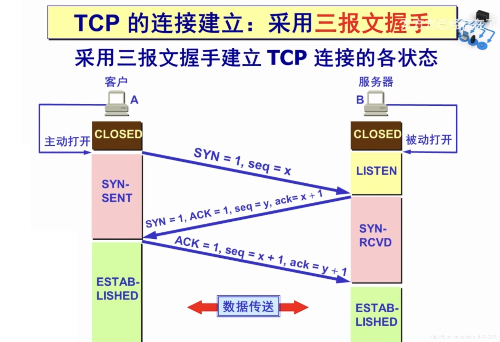
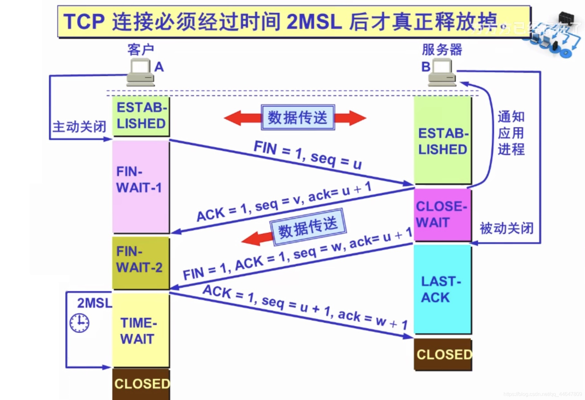

#### 基本概念

**SYN 同步**：SYN = 1 表示这是一个连接请求或连接接受报文。当 SYN = 1 而 ACK = 0 时，表明这是一个连接请求报文段。对方若同意建立连接，则应在响应的报文段中使 SYN = 1 且 ACK = 1。

**ACK 确认**：仅当 ACK = 1 时确认号字段才有效，当 ACK = 0 时确认号无效。TCP 规定，在连接建立后所有传送的报文段都必须把 ACK 置为 1。

**FIN 终止**：用来释放一个连接。当 FIN = 1时，表明此报文段的发送发的数据已发送完毕，并要求释放连接。

**ISN 初始序号**： 表示报文段发送的数据的第一个字节的序号。

#### 状态

> CLOSED：没有任何连接状态
>
> LISTEN：侦听来自远方 TCP 端口的连接请求
>
> SYN-SENT ：在发送连接请求后等待匹配的连接请求
>
> SYN-RECEIVED：在收到和发送一个连接请求后等待对连接请求的确认
>
> ESTABLISHED：代表一个打开的连接，数据可以传送给用户

#### 三次握手

> 初始状态：客户端 CLOSED，服务端 LISTEN

**1）第一次握手**：客户端向服务端发送一个 SYN=1 报文，并指明客户端的初始化序列号seq = ISN(x)（表示本报文段发送数据的第一个字节序号），此时客户端处于 `SYN_SENT ` 状态，等待服务端确认。

**2）第二次握手**：服务器收到客户端的 SYN=1 报文之后，会发送 SYN=1和ACK=1 报文作为应答，同时会把客户端 x+1 的值作为确认号 ack 的值，表示已经收到客户端发来的的报文并且指定自己的初始化序seq = y。并将该数据包发送给Client以确认连接请求，Server进入SYN_RCVD状态。

**3）第三次握手**：因为连接要是双向的，Server确认后只是Client到Server连通了，因此Client也要确认一下。客户端收到服务器端响应的 SYN=1和ACK=1 报文之后，会把服务端 y+1 的值作为确认号 ack 的值，表示已经收到了服务端发来的的报文，并指明此时客户端的序列号 seq = x + 1（初始为 seq = x，所以第二个报文段要 +1），此时

Client和Server都进入ESTABLISHED状态，完成三次握手，开始传输数据。

> 场景：
>
> 客户端：我可以给你发送数据吗？
>
> 服务器：可以，不过我可能也会给你发送数据。
>
> 客户端：好，那我开始互相发送数据吧。

**1.为什么要三次握手**

目的是为了建立可靠的通信信道。

**2.ISN是固定的吗？**

当一端为建立连接而发送它的 SYN 时，它会为连接选择一个初始序号。ISN 随时间而变化，因此每个连接都将具有不同的 ISN， ISN 是动态生成的。

**3.三次握手过程中可以携带数据吗？**

第三次握手的时候，是可以携带数据的。但是，**第一次、第二次握手绝对不可以携带数据**，这样可以防止重复发 SYN 报文进行攻击

#### 四次挥手

> FIN-WAIT-1: 等待远程TCP的连接中断请求，或先前的连接中断请求的确认；
>
> CLOSE-WAIT: 等待从本地用户发来的连接中断请求；
>
> FIN-WAIT-2 - 从远程TCP等待连接中断请求；
>
> LAST-ACK - 等待原来发向远程TCP的连接中断请求的确认；
>
> TIME-WAIT - 等待足够的时间以确保远程TCP接收到连接中断请求的确认；

> 初始状态：客户端 ESTABLISHED，服务端 ESTABLISHED

**1）第一次挥手**：客户端发送一个 FIN=1 报文，以及序列号 seq = u，并停止再发送数据，主动关闭 TCP 连接。此时客户端处于 FIN-WAIT-1 状态，等待服务端的确认。

**2）第二次挥手**：服务端收到 FIN=1 之后，会发送一个ACK=1且请求号seq=v和确认序号ack=u+1给客户端，此时服务端处于 CLOSE_WAIT 状态。**此时的 TCP 处于半关闭状态，客户端到服务端的连接释放了**，客户端收到服务端的确认后，进入`FIN-WAIT-2`（终止等待 2）状态，等待服务端发出的连接释放报文段。

**3）第三次挥手**：服务端发送一个FIN=1和ACK=1，请求号为seq=w和确认序号ack=u+1，用来关闭Server到Client的数据传送，Server进入LAST_ACK状态。

**4）第四次挥手**：客户端收到 FIN+1 之后，一样发送一个 ack= w+1 报文作为应答，且把服务端的序列值 +1 作为自己 ACK 报文的序号值（seq=u+1），此时客户端处于 TIME_WAIT （时间等待）状态。

🚨 注意 ！！！这个时候由服务端到客户端的 TCP 连接并未释放掉，需要经过时间等待计时器设置的时间 2MSL（一个报文的来回时间） 后才会进入 CLOSED 状态（这样做的目的是确保服务端收到自己的 ACK 报文。如果服务端在规定时间内没有收到客户端发来的 ACK 报文的话，服务端会重新发送 FIN 报文给客户端，客户端再次收到 FIN 报文之后，就知道之前的 ACK 报文丢失了，然后再次发送 ACK 报文给服务端）。服务端收到 ACK 报文之后，就关闭连接了，处于 CLOSED 状态。