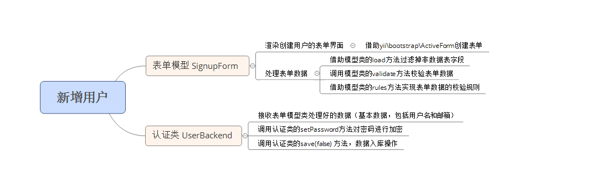
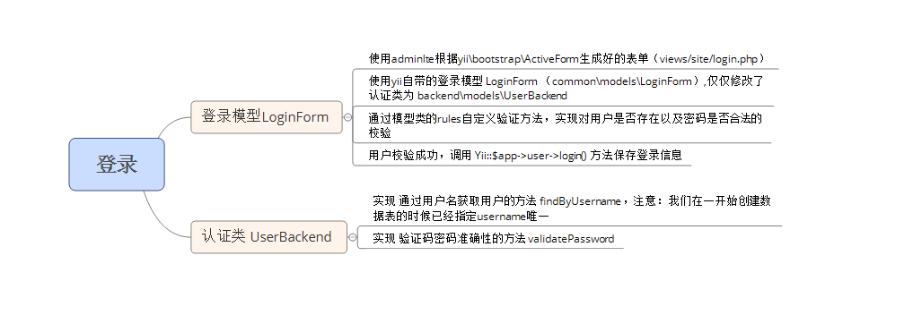
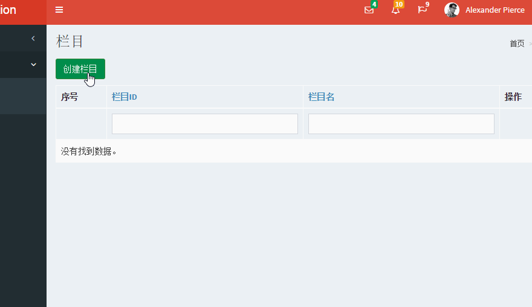
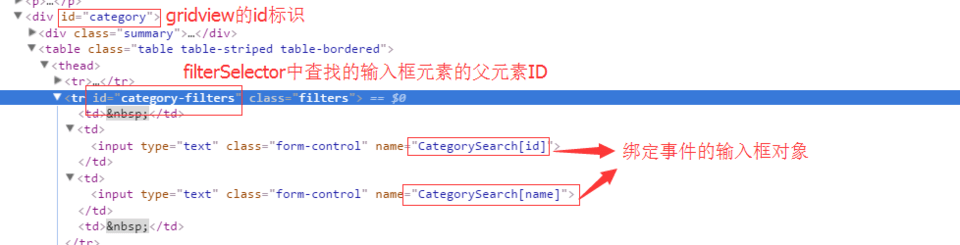
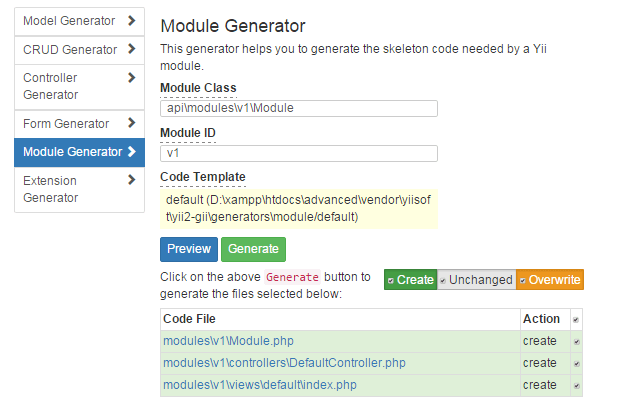
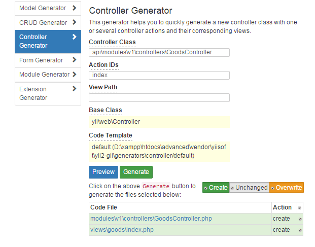
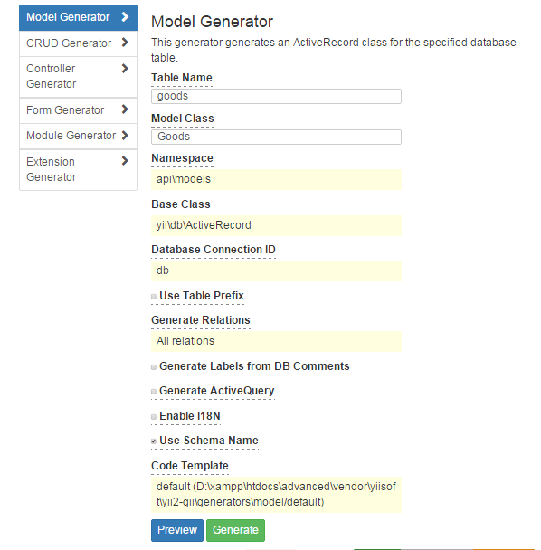

## 白狼栈Yii2.0学习

[TOC]

### 安装

1. [官网下载]: https://www.yiiframework.com/download

   > 切换到advanced目录
   >
   > ```bash
   > #初始化（windows请双击init.bat 文件）
   > php init
   > ```
   >
   > 回车后这里会让我们选择 environment 即开发环境，0开发环境 1生产环境 这里我们选择0 开发环境，输入后回车，输入yes确认即可，然后执行命令
   >
   > ```bash
   >  composer install
   > ```

2. composer

   > 切换composer国内镜像
   >
   > [Packagist/Composer中国全量镜像]: https://pkg.phpcomposer.com/
   > [阿里云的composer镜像]: https://developer.aliyun.com/composer
   >
   > ```bash
   > #确保composer是最新的
   > composer self-update
   > #安装
   > composer create-project yiisoft/yii2-app-advanced advanced
   > #重复1步骤
   > ```


### migrate创建表

> 创建表迁移文件，该命令生成的迁移文件位于 advanced\console\migrations 目录

```bash
yii migrate/create create_blog_table
```

```php
<?php
use yii\db\Migration;
/**
 * Handles the creation for table `blog_table`.
 */
class m160525_153315_create_blog_table extends Migration
{
    /**
     * @inheritdoc
     */
    public function up()
    {
        $this->createTable('blog', [
            'id' => $this->primaryKey(),
            'title' => $this->string(100)->notNull()->defaultValue(''),
            'content' => $this->text(),
            'create_time' => $this->datetime(),
        ]);
    }
    /**
     * @inheritdoc
     */
    public function down()
    {
        $this->dropTable('blog');
    }
}
```

> 生成表

```bash
./yii migrate
```


### composer 管理js css等静态文件

```bash
composer global require "fxp/composer-asset-plugin:^1.3.1"
```

> 在项目根目录中的**composer.json**中添加如下配置

```json
"config":
{
    "fxp-asset":
    {
        //安装后资源包的文件会被放到web/public/assets/res 这个目录
        "installer-paths":
        {
            "bower-asset-library": "web/public/assets"
        },
        "repositories":
        {
            //bower-assert这个不能变 res这个名字可以随便改动
            "bower-asset/res":
            {
                "type": "bower-vcs",
                "url": "http://github.com/xxxxxxx/admin.git"
            }
        }
    }
}
```

> 使用这个包

```bash
composer require bower-asset/res:dev-master
```


### 后台搭建

> yii2-adminlte-asset更是一款基于yii2框架进行开发的后台主题模版，通俗的说就是一款基于bootstrap的响应模块。

```bash
composer require dmstr/yii2-adminlte-asset
```

> 然后拷贝 vendor\dmstr\yii2-adminlte-asset\example-views\yiisoft\yii2-app 目录下面的文件到项目 backend\views, 可直接进行覆盖;

1. 打开backend\config\main.php 在components中添加assetManager

   ```php
   'components' => [
       'assetManager' => [
           'bundles' => [
               'dmstr\web\AdminLteAsset' => [
                   'skin' => 'skin-red',
                   /*其他主题可参考*/
                   "skin-blue",
                   "skin-black",
                   "skin-red",
                   "skin-yellow",
                   "skin-purple",
                   "skin-green",
                   "skin-blue-light",
                   "skin-black-light",
                   "skin-red-light",
                   "skin-yellow-light",
                   "skin-purple-light",
                   "skin-green-light"
               ],
           ],
       ],
   ],
   ```

2. 打开 backend\views\layouts\main.php，找到body将其class修改如下

   ```php
   <body class="hold-transition <?= \dmstr\helpers\AdminLteHelper::skinClass() ?> sidebar-mini">
   ```

> 然后，打开backend\controllers\SiteController.php文件，暂时先屏蔽掉 behaviors 方法的 access 部分（暂时避免登录拦截）。


### 配置yii2的user模块（后台）

> 创建后台用户表（其实自带的用户表就可以使用，UserBackend继承User类)

```mysql
CREATE TABLE `user_backend` (
  `id` int(11) NOT NULL AUTO_INCREMENT,
  `username` varchar(255) COLLATE utf8_unicode_ci NOT NULL,
  `auth_key` varchar(32) COLLATE utf8_unicode_ci NOT NULL,
  `password_hash` varchar(255) COLLATE utf8_unicode_ci NOT NULL,
  `email` varchar(255) COLLATE utf8_unicode_ci NOT NULL,
  `created_at` datetime NOT NULL,
  `updated_at` datetime NOT NULL,
  PRIMARY KEY (`id`),
  UNIQUE KEY `username` (`username`),
  UNIQUE KEY `email` (`email`)
) ENGINE=InnoDB DEFAULT CHARSET=utf8 COLLATE=utf8_unicode_ci;
```

> 通过gii模块生成UserBackend表的model和curd，然后配置backend\config\main.php
>
> 注意一点，如果后台用户使用UserBackend作为登录，则必须修改common\models\LoginForm.php 文件中的getUser方法，这里的User类使用的还是 common\models\User 类，这里我们修改为刚刚配置的认证类 UserBackend。

```php
'components' => [
    'user' => [
        /*该类掌管用户组件的认证，可更改*/
        'identityClass' => 'backend\models\UserBackend',
        'enableAutoLogin' => true,
    ],
],
```

> 虽然配置了认证类为UserBackend，但是还需要为该类增加一些必要的认证方法。

```php
<?php

namespace backend\models;

use Yii;
use yii\web\IdentityInterface;

/**
 * This is the model class for table "user_backend".
 *
 * @property integer $id
 * @property string $username
 * @property string $auth_key
 * @property string $password_hash
 * @property string $email
 * @property string $created_at
 * @property string $updated_at
 */
class UserBackend extends \yii\db\ActiveRecord implements IdentityInterface
{
    
    // 其他gii生成的代码，因为我们并未对其进行过改动，因此这里省略，下面只补充我们实现的几个抽象方法    

    /**
     * @inheritdoc
     * 根据user_backend表的主键（id）获取用户
     */
    public static function findIdentity($id)
    {
        return static::findOne(['id' => $id]);
    }

    /**
     * @inheritdoc
     * 根据access_token获取用户，我们暂时先不实现，我们在文章 http://www.manks.top/yii2-restful-api.html 有过实现，如果你感兴趣的话可以先看看
     */
    public static function findIdentityByAccessToken($token, $type = null)
    {
        throw new NotSupportedException('"findIdentityByAccessToken" is not implemented.');
    }

    /**
     * @inheritdoc
     * 用以标识 Yii::$app->user->id 的返回值
     */
    public function getId()
    {
        return $this->getPrimaryKey();
    }

    /**
     * @inheritdoc
     * 获取auth_key
     */
    public function getAuthKey()
    {
        return $this->auth_key;
    }

    /**
     * @inheritdoc
     * 验证auth_key
     */
    public function validateAuthKey($authKey)
    {
        return $this->getAuthKey() === $authKey;
    }
}
```


### 登录与注册功能实现

#### 创建新用户

打开模板文件 backend\views\user-backend\index.php，将【创建】按钮改为【添加新用户】，并修改其对应的路由

```php
<?= Html::a('添加新用户', ['signup'], ['class' => 'btn btn-success']) ?>
```

控制器

```php
/**
 *  create new user
 */
public function actionSignup ()
{
    // 实例化一个表单模型，这个表单模型我们还没有创建，等一下后面再创建
    $model = new \backend\models\SignupForm();

    // 下面这一段if是我们刚刚分析的第二个小问题的实现，下面让我具体的给你描述一下这几个方法的含义吧
    // $model->load() 方法，实质是把post过来的数据赋值给model的属性
    // $model->signup() 方法, 是我们要实现的具体的添加用户操作
    if ($model->load(Yii::$app->request->post()) && $model->signup()) {
        // 添加完用户之后，我们跳回到index操作即列表页
        return $this->redirect(['index']);
    }

    // 下面这一段是我们刚刚分析的第一个小问题的实现
    // 渲染添加新用户的表单
    return $this->render('signup', [
        'model' => $model,
    ]);
}
```

增加视图文件

```php
<?php
/* @var $this yii\web\View */
/* @var $form yii\bootstrap\ActiveForm */
/* @var $model \backend\models\SignupForm */
use yii\helpers\Html;
use yii\bootstrap\ActiveForm;

$this->title = '添加新用户';
$this->params['breadcrumbs'][] = $this->title;
?>
<div class="site-signup">
    <div class="row">
        <div class="col-lg-5">
            <?php $form = ActiveForm::begin(['id' => 'form-signup']); ?>
                <?= $form->field($model, 'username')->label('登陆名')->textInput(['autofocus' => true]) ?>
                <?= $form->field($model, 'email')->label('邮箱') ?>
                <?= $form->field($model, 'password')->label('密码')->passwordInput() ?>
                <div class="form-group">
                    <?= Html::submitButton('添加', ['class' => 'btn btn-primary', 'name' => 'signup-button']) ?>
                </div>
            <?php ActiveForm::end(); ?>
        </div>
    </div>
</div>
```

在backend\models 目录下创建SignupForm.php,代码如下

```php
<?php
namespace backend\models;

use yii\base\Model;
use backend\models\UserBackend;

/**
 * Signup form
 */
class SignupForm extends Model
{
    public $username;
    public $email;
    public $password;
    public $created_at;
    public $updated_at;

    /**
     * @inheritdoc
     * 对数据的校验规则
     */
    public function rules()
    {
        return [
            // 对username的值进行两边去空格过滤
            ['username', 'filter', 'filter' => 'trim'],
            // required表示必须的，也就是说表单提交过来的值必须要有, message 是username不满足required规则时给的提示消息
            ['username', 'required', 'message' => '用户名不可以为空'],
            // unique表示唯一性，targetClass表示的数据模型 这里就是说UserBackend模型对应的数据表字段username必须唯一
            ['username', 'unique', 'targetClass' => '\backend\models\UserBackend', 'message' => '用户名已存在.'],
            // string 字符串，这里我们限定的意思就是username至少包含2个字符，最多255个字符
            ['username', 'string', 'min' => 2, 'max' => 255],
            // 下面的规则基本上都同上，不解释了
            ['email', 'filter', 'filter' => 'trim'],
            ['email', 'required', 'message' => '邮箱不可以为空'],
            ['email', 'email'],
            ['email', 'string', 'max' => 255],
            ['email', 'unique', 'targetClass' => '\backend\models\UserBackend', 'message' => 'email已经被设置了.'],
            ['password', 'required', 'message' => '密码不可以为空'],
            ['password', 'string', 'min' => 6, 'tooShort' => '密码至少填写6位'],   
            // default 默认在没有数据的时候才会进行赋值
            [['created_at', 'updated_at'], 'default', 'value' => date('Y-m-d H:i:s')],
        ];
    }

    /**
     * Signs user up.
     *
     * @return true|false 添加成功或者添加失败
     */
    public function signup()
    {
        // 调用validate方法对表单数据进行验证，验证规则参考上面的rules方法，如果不调用validate方法，那上面写的rules就完全是废的啦
        if (!$this->validate()) {
            return null;
        }
        // 实现数据入库操作
        $user = new UserBackend();
        $user->username = $this->username;
        $user->email = $this->email;
        $user->created_at = $this->created_at;   
        $user->updated_at = $this->updated_at;
        // 设置密码，密码肯定要加密，暂时我们还没有实现，继续阅读下去，我们在下面有实现
        $user->setPassword($this->password);
        // 生成 "remember me" 认证key
        $user->generateAuthKey();
        // save(false)的意思是：不调用UserBackend的rules再做校验并实现数据入库操作
        // 这里这个false如果不加，save底层会调用UserBackend的rules方法再对数据进行一次校验，这是没有必要的。
    // 因为我们上面已经调用Signup的rules校验过了，这里就没必要再用UserBackend的rules校验了
        return $user->save(false);
    }
    
    /**
     * 为model的password_hash字段生成密码的hash值
     *
     * @param string $password
     */
    public function setPassword($password)
    {
        $this->password_hash = Yii::$app->security->generatePasswordHash($password);
    }


    /**
     * 生成 "remember me" 认证key
     */
    public function generateAuthKey()
    {
        $this->auth_key = Yii::$app->security->generateRandomString();
    }
}
```

回过头来缕缕整个代码实现的逻辑



#### 登录的实现

开始之前，参考刚刚实现的添加新用户，总结一下实现登录功能至少也需要下面几个步骤

①、创建一个登录的表单模型

②、利用 yii\bootstrap\ActiveForm 类创建一个表单页面

③、完善表单模型的rules方法，接收登录表单数据并校验过滤，然后不是入库了，是校验密码，正确后，登录的信息存session

上面三个小步骤advanced版本都帮我们实现了，实现了，实现了！

下面就来简单分析一下登录的流程

第①步，打开SiteController文件，找到actionLogin操作

```php
public function actionLogin()
{
    // 判断用户是访客还是认证用户 
    // isGuest为真表示访客，isGuest非真表示认证用户，认证过的用户表示已经登录了，这里跳转到主页面
    if (!Yii::$app->user->isGuest) {
        return $this->goHome();
    }
    // 实例化登录模型 common\models\LoginForm
    $model = new LoginForm();
    // 接收表单数据并调用LoginForm的login方法
    if ($model->load(Yii::$app->request->post()) && $model->login()) {
        return $this->goBack();
    } 
    // 非post直接渲染登录表单
    else {
        return $this->render('login', [
            'model' => $model,
        ]);
    }
}
```

②、看LoginForm的login等方法的具体实现

```php
use backend\models\UserBackend as User;
/**
 * @inheritdoc
 * 对表单数据进行验证的rule
 */
public function rules()
{
    return [
        // username和password必须
        [['username', 'password'], 'required'],
        // rememberMe是一个boolean值
        ['rememberMe', 'boolean'],
        // 这里需要注意的是 validatePassword 是自定义的验证方法！！！只需要在当前模型内增加对应的认证方法即可
        ['password', 'validatePassword'],
    ];
}
/**
 * 自定义的密码认证方法
 * This method serves as the inline validation for password.
 *
 * @param string $attribute the attribute currently being validated
 * @param array $params the additional name-value pairs given in the rule
 */
public function validatePassword($attribute, $params)
{
    // hasErrors方法，用于获取rule失败的数据
    if (!$this->hasErrors()) {
        // 调用当前模型的getUser方法获取用户
        $user = $this->getUser();
        // 获取到用户信息，然后校验用户的密码对不对，校验密码调用的是 backend\models\UserBackend 的validatePassword方法，
        // 这个我们下面会在UserBackend方法里增加
        if (!$user || !$user->validatePassword($this->password)) {
            // 验证失败，调用addError方法给用户提醒信息
            $this->addError($attribute, 'Incorrect username or password.');
        }
    }
}
/**
 * Logs in a user using the provided username and password.
 *
 * @return boolean whether the user is logged in successfully
 */
public function login()
{
    // 调用validate方法 进行rule的校验，其中包括用户是否存在和密码是否正确的校验
    if ($this->validate()) {
        // 校验成功后，session保存用户信息
        return Yii::$app->user->login($this->getUser(), $this->rememberMe ? 3600 * 24 * 30 : 0);
    } else {
        return false;
    }
}
/**
 * 根据用户名获取用户的认证信息
 *
 * @return User|null
 */
protected function getUser()
{
    if ($this->_user === null) {
        // 根据用户名 调用认证类 backend\models\UserBackend 的 findByUsername 获取用户认证信息
        // 这个我们下面会在UserBackend增加一个findByUsername方法对其实现
        $this->_user = User::findByUsername($this->username);
    }
    return $this->_user;
}
```

③、从上面的②操作中，需要在用户认证类 backend\models\UserBackend 中增加 findByUsername方法和validatePassword方法

```php
/**
 * 根据user_backend表的username获取用户
 *
 * @param string $username
 * @return static|null
 */
public static function findByUsername($username)
{
    return static::findOne(['username' => $username]);
}
/**
 * 验证密码的准确性
 *
 * @param string $password password to validate
 * @return boolean if password provided is valid for current user
 */
public function validatePassword($password)
{
    return Yii::$app->security->validatePassword($password, $this->password_hash);
}
```

登录的逻辑实现



### rbac权限生成

> 打开 common\config\main.php 文件，在 components 数组中加入 authManager 组件

```php
"authManager" => [        
    "class" => 'yii\rbac\DbManager',
],	
```

> 使用yii2自带的migrate生成权限表

```bash
./yii migrate --migrationPath=@yii/rbac/migrations/
```

> auth_item：用于存储角色、权限和路由，type=1表示的是角色，type=2表示的是权限和路由，至于权限跟路由是怎么区分的，这取决于name字段的第一个字符，有没有斜杠 "/"
>
> auth_item_child：角色-权限的关联表
>
> auth_assignment：用户-角色的关联表

创建一张blog表，使用gii生成curd，用于后面的操作。

```mysql
DROP TABLE IF EXISTS `blog`;
CREATE TABLE `blog` (
  `id` int(11) NOT NULL,
  `title` varchar(100) NOT NULL DEFAULT '' COMMENT '标题',
  `content` text NOT NULL COMMENT '内容',
  `views` int(11) NOT NULL DEFAULT '0' COMMENT '点击量',
  `is_delete` tinyint(4) NOT NULL DEFAULT '1' COMMENT '是否删除 1未删除 2已删除',
  `created_at` datetime NOT NULL COMMENT '添加时间',
  `updated_at` datetime NOT NULL COMMENT '更新时间',
  PRIMARY KEY (`id`)
) ENGINE=InnoDB DEFAULT CHARSET=utf8;
```

为了练习，手动创建一个控制器 RbacController 来做这些操作。

```php
<?php
namespace backend\controllers;
use Yii;
use yii\web\Controller;
class RbacController extends Controller
{
    public function actionInit ()
    {
        $auth = Yii::$app->authManager;
        // 添加 "/blog/index" 权限
        $blogIndex = $auth->createPermission('/blog/index');
        $blogIndex->description = '博客列表';
        $auth->add($blogIndex);
        // 创建一个角色 '博客管理'，并为该角色分配"/blog/index"权限
        $blogManage = $auth->createRole('博客管理');
        $auth->add($blogManage);
        $auth->addChild($blogManage, $blogIndex);
        // 为用户 test1（该用户的uid=1） 分配角色 "博客管理" 权限
        $auth->assign($blogManage, 1); // 1是test1用户的uid
    }
}
```

现在访问 /index.php?r=rbac/init 就意味着为用户test1分配了角色 "博客管理"，而博客管理包含着"blog/index"的访问权限。

分配好了以后还需要为 blog/index 实现一个校验方法，只有分配了权限的用户才可以访问，否则肯定要给用户403提示！

BlogController 的 index方法修改如下：

```php
/**
 * Lists all Blog models.
 * @return mixed
 */
public function actionIndex()
{
    if (!Yii::$app->user->can('/blog/index')) {
        throw new \yii\web\ForbiddenHttpException("没权限访问.");
    }
    $searchModel = new BlogSearch();
    $dataProvider = $searchModel->search(Yii::$app->request->queryParams);
    return $this->render('index', [
        'searchModel' => $searchModel,
        'dataProvider' => $dataProvider,
    ]);
}
```


### 行为的理解

> 实质就是一个类（yii\base\Behavior 或其子类的实例），通过某些特殊方式（注入，绑定），同另一个类（yii\base\Component 或其子类的实例）进行了绑定，然后二者可以进行交互。相当于对当前类进行了一个扩展。

**添加一个判断用户是否是访客的行为和方法**

```php
<?php
namespace backend\components;

use Yii;

class MyBehavior extends \yii\base\ActionFilter
{
    public function beforeAction ($action)
    {
        var_dump(111);
        return true;
    }
    
    public function isGuest ()
    {
        return Yii::$app->user->isGuest;
    }
}
```

> BlogController 的 index 操作的部分代码，看上去作用和trait类似

```php
public function behaviors()
{
    return [
        //附加行为，对应上面beforeAction行为方法
        'myBehavior' => \backend\components\MyBehavior::className(),
    ];
}

public function actionIndex()
{
    $myBehavior = $this->getBehavior('myBehavior');
    $isGuest = $myBehavior->isGuest();
    var_dump($isGuest);
    
    // 或者你也可以这样直接调用
    $isGuest = $this->isGuest();
    var_dump($isGuest);

    // ......
}
```


### yii2-admin组件配置及使用

```bash
composer require mdmsoft/yii2-admin "~2.0"
```

> 配置

```php
return [
    //......
    'modules' => [
        'admin' => [        
            'class' => 'mdm\admin\Module',   
        ],
        //......
    ],
    'aliases' => [    
        '@mdm/admin' => '@vendor/mdmsoft/yii2-admin',
    ],
    'components' => [
        //......
        'authManager' => [        
            'class' => 'yii\rbac\DbManager',
            'defaultRoles' => ['guest'],    
        ],
        //......
    ],
    'as access' => [
        'class' => 'mdm\admin\components\AccessControl',
        'allowActions' => [
            //这里是允许访问的action，不受权限控制
            //controller/action
        ]
    ],
    //......
];
```


### 权限菜单管理

> 1、利用migrate创建menu数据表
>
> ```bash
> ./yii migrate/to m140602_111327_create_menu_table.php  --migrationPath=@mdm/admin/migrations
> ```

> 打开布局文件left.php替换代码

```php
<?php

use mdm\admin\components\MenuHelper;
use dmstr\widgets\Menu;
?>

<aside class="main-sidebar">
    <section class="sidebar">
        <?=
            Menu::widget([
                'options' => ['class' => 'sidebar-menu tree', 'data-widget'=> 'tree'],
                'items' => MenuHelper::getAssignedMenu(Yii::$app->user->id)
            ]);
        ?>
    </section>
</aside>
```


### modal弹窗



首先先创建一个栏目表category

```mysql
CREATE TABLE `category` (
  `id` int(11) NOT NULL AUTO_INCREMENT COMMENT '栏目ID',
  `name` varchar(20) NOT NULL DEFAULT '' COMMENT '栏目名',
  PRIMARY KEY (`id`)
) ENGINE=InnoDB DEFAULT CHARSET=utf8 COMMENT='栏目表';
```

在视图文件 category/index.php 内在页面的底部添加一段下面的代码

```php
<?php
use yii\bootstrap\Modal;
Modal::begin([
    'id' => 'operate-modal',
    'header' => '<h4 class="modal-title"></h4>',
]); 
Modal::end();
?>
```

在视图文件 category/index.php 内创建一个按钮。为了调起modal这个按钮需要设置一个固定属性data-toggle=modal，一个data-target属性data-target属性指向刚刚创建的modal的id "operate-modal"。

```php
<?= 
    Html::a('创建栏目', ['create'], [
        'class' => 'btn btn-success',
        'id' => 'create', // 按钮的id随意
        'data-toggle' => 'modal', // 固定写法
        'data-target' => '#operate-modal', // 等于modal begin中设定的参数id值
    ]) 
?>
```

这段代码你可以放在GridView上面的p标签内。还需要搭配一段js

```js
<?php
use yii\helpers\Url;
// 异步请求的地址
$requestCreateUrl = Url::toRoute('create');
$js = <<<JS
// 创建操作
$('#create').on('click', function () {
    $('.modal-title').html('创建栏目');
    $.get('{$requestCreateUrl}',
        function (data) {    
            // 弹窗的主题渲染页面
            $('.modal-body').html(data);
        }  
    );
});
JS;
$this->registerJs($js);
?>
```

> 注意这里异步请求的内容是 CategoryController 的 create操作，输出的内容我们找到 CategoryController 的create方法，看到这里使用render方法渲染的表单页面，所以modal内加载的表单页面包含了布局，这看起来有点别扭，我们把render方法改为renderAjax方法去掉布局。

#### 栏目更新

栏目更新操作跟刚刚的操作并无太大差异，一点不同的是"创建按钮"是我们自己创建的更新的按钮是gridview生成的。gridview的操作按钮也需要自己另外修改。

找到视图文件 category/index.php 的GridView::widget一段把'class' => 'yii\grid\ActionColumn', 这一段修改如下

```php
[
    'class' => 'yii\grid\ActionColumn',
    'template' => '{update}  {delete}',
    'header' => '操作',
    'buttons' => [
        'update' => function ($url, $model, $key) {
            return Html::a("栏目信息", $url, [
                    'title' => '栏目信息', 
                    // btn-update 目标class
                    'class' => 'btn btn-default btn-update',
                    // 固定写法
                    'data-toggle' => 'modal',
                    // 指向modal中begin设定的id
                    'data-target' => '#operate-modal',
            ]); 
        },
        'delete' => function ($url, $model, $key) {
            return Html::a('删除', $url, [
                'title' => '删除',
                'class' => 'btn btn-default',
                'data' => [
                    'confirm' => '确定要删除么?',
                    'method' => 'post',
                ],
            ]); 
        },
    ],
],
```

为按钮增加触发事件跟创建有一点不同的是触发时需要获取gridview每一行的主键ID,利用jquery的closest方法获取即可

```js
<?php
// 更新
$requestUpdateUrl = Url::toRoute('update');
$js = <<<JS
    // 更新操作
    $('.btn-update').on('click', function () {
        $('.modal-title').html('栏目信息');
        $.get('{$requestUpdateUrl}', { id: $(this).closest('tr').data('key') },
            function (data) {
                $('.modal-body').html(data);
            }  
        );
    });
JS;
$this->registerJs($js);
?>
```

异步操作或者表单项我们在上一章节已经做好了。这里我们修改下update操作渲染视图同样不使用布局即可。

```php
public function actionUpdate($id)
{
    $model = $this->findModel($id);
    if ($model->load(Yii::$app->request->post()) && $model->save()) {
        return $this->redirect(['index']);
        // return $this->redirect(['view', 'id' => $model->id]);
    } else {
        return $this->renderAjax('update', [
            'model' => $model,
        ]);
    }
}
```


### 如何自定义后台的模版主题，针对后台（比如layui、H+）

> 1、拷贝gii默认的模版文件 vendor\yiisoft\yii2-gii\generators\crud\default 到 backend\components\gii-custom\crud\default，注意这里的components以及其目录下的gii-custom都是自定义的
>
> 2、打开backend\config\main-local.php 按照下面的样子对gii进行配置

```php
$config['modules']['gii'] = [
    'class' => 'yii\gii\Module',
    'allowedIPs' => ['127.0.0.1', '::1'], 
    'generators' => [ 
        'crud' => [ //生成器名称 
            'class' => 'yii\gii\generators\crud\Generator', 
            'templates' => [ //设置我们自己的模板 
                //自定义模板名 => 模板路径 
                'myCrud' => '@app/components/gii-custom/crud/default', 
            ] 
        ] 
    ], 
];
```

> 如上，我们配置了一套新的模板，叫myCrud，模板文件位于@app/components/gii-custom/crud/default， 下面我们就可以把模板文件修改为自己喜欢的任意风格啦。本文我们以modal风格为例。
>
> 提醒：修改模板有些麻烦，稍有不慎可能就会出现点问题，请认真对待。
>
> 1、打开 backend\components\gii-custom\crud\default\views\index.php ,在第 17行的位置，增加
>
> ```php
> use yii\bootstrap\Modal;
> use yii\helpers\Url;
> ```
>
> 2、修改create按钮为
>
> ```php
> <p>
>     <?= "<?= " ?>Html::a(<?= $generator->generateString('Create ' . Inflector::camel2words(StringHelper::basename($generator->modelClass))) ?>, ['create'], [
>         'class' => 'btn btn-success',
>         'id' => 'create',
>         'data-toggle' => 'modal',
>         'data-target' => '#operate-modal',
>     ]) ?>
> </p>
> ```
>
> 3、修改gridview的操作按钮为，72行的位置改掉
>
> ```php
> [
>     'class' => 'yii\grid\ActionColumn',
>     'template' => '{update}  {delete}',
>     'header' => '操作',
>     'buttons' => [
>         'update' => function ($url, $model, $key) {
>             return Html::a("信息", $url, [
>                     'title' => '栏目信息', 
>                     // btn-update 目标class
>                     'class' => 'btn btn-default btn-update',
>                     'data-toggle' => 'modal',
>                     'data-target' => '#operate-modal',
>             ]); 
>         },
>         'delete' => function ($url, $model, $key) {
>             return Html::a('删除', $url, [
>                 'title' => '删除',
>                 'class' => 'btn btn-default',
>                 'data' => [
>                     'confirm' => '确定要删除么?',
>                     'method' => 'post',
>                 ],
>             ]); 
>         },
>     ],
> ],
> ```
>
> 4、选择在页面底部，增加modal以及create和update的操作
>
> ```php
> <?= "<?php" ?>
> // 创建modal
> Modal::begin([
>     'id' => 'operate-modal',
>     'header' => '<h4 class="modal-title"></h4>',
> ]); 
> Modal::end();
> // 创建
> $requestCreateUrl = Url::toRoute('create');
> // 更新
> $requestUpdateUrl = Url::toRoute('update');
> $js = <<<JS
>     // 创建操作
>     $('#create').on('click', function () {
>         $('.modal-title').html('创建');
>         $.get('{$requestCreateUrl}',
>             function (data) {
>                 $('.modal-body').html(data);
>             }  
>         );
>     });
>     // 更新操作
>     $('.btn-update').on('click', function () {
>         $('.modal-title').html('信息');
>         $.get('{$requestUpdateUrl}', { id: $(this).closest('tr').data('key') },
>             function (data) {
>                 $('.modal-body').html(data);
>             }  
>         );
>     });
> JS;
> $this->registerJs($js);
> ?>
> ```
>
> index视图整理好之后，我们继续整理下表单页面
>
> 1、打开backend\components\gii-custom\crud\default\views\_form.php ,在第21行的位置增加
>
> ```php
> use yii\helpers\Url;
> ```
>
> 2、ActiveForm::begin处修改为
>
> ```php
> <?= "<?php " ?>$form = ActiveForm::begin([
>     'id' => '<?= Inflector::camel2id(StringHelper::basename($generator->modelClass)) ?>-id',
>     'enableAjaxValidation' => true,
>     'validationUrl' => Url::toRoute(['validate-form']),
> ]); ?>
> ```
>
> 表单也定义好了以后，我们就差最后一步，控制器层面的修改了
>
> 打开backend\components\gii-custom\crud\default\controller.php文件
>
> 1、在42行处增加
>
> ```php
> use yii\helpers\Url;
> ```
>
> 2、对create、update方法修改如下：
>
> ```php
> /**
>  * Creates a new <?= $modelClass ?> model.
>  * If creation is successful, the browser will be redirected to the 'view' page.
>  * @return mixed
>  */
> public function actionCreate()
> {
>     $model = new <?= $modelClass ?>();
>     if ($model->load(Yii::$app->request->post()) && $model->save()) {
>         return $this->redirect(['index']);
>     } else {
>         return $this->renderAjax('create', [
>             'model' => $model,
>         ]);
>     }
> }
> 
> /**
>  * 异步校验表单模型
>  */
> public function actionValidateForm() 
> {
>     $model = new <?= $modelClass ?>();
>     $model->load(Yii::$app->request->post()); 
>     Yii::$app->response->format = \yii\web\Response::FORMAT_JSON;
>     return \yii\widgets\ActiveForm::validate($model); 
> }
> 
> /**
>  * Updates an existing <?= $modelClass ?> model.
>  * If update is successful, the browser will be redirected to the 'view' page.
>  * <?= implode("\n     * ", $actionParamComments) . "\n" ?>
>  * @return mixed
>  */
> public function actionUpdate(<?= $actionParams ?>)
> {
>     $model = $this->findModel(<?= $actionParams ?>);
>     if ($model->load(Yii::$app->request->post()) && $model->save()) {
>         return $this->redirect(Url::toRoute('index'));
>     } else {
>         return $this->renderAjax('update', [
>             'model' => $model,
>         ]);
>     }
> }
> ```
>
> 最后，就是校验我们模版效果的时候，我们创建一个测试表进行测试
>
> 1、访问gii,先创建模型 /index.php?r=gii%2Fdefault%2Fview&id=model
>
> 2、接着创建crud的时候就要注意了，最后一项 Code Template，这里是下拉框效果，模版要选我们在gii中配置的模版，名字我们在上面配置的是：myCrud，所以，这里请选择myCrud。如果没有你的模板名，请检查gii的配置。
>
> ```mysql
> CREATE TABLE `test` (
>   `id` int(11) NOT NULL AUTO_INCREMENT,
>   `name` varchar(30) NOT NULL,
>   PRIMARY KEY (`id`)
> ) ENGINE=InnoDB DEFAULT CHARSET=utf8;
> ```


### 主题Theme的应用，针对前台（比如活动主题）

> 打开配置文件，app\config\main.php文件，在components中添加如下配置：
>
> basePath和baseUrl分别是对资源的目录和资源的url进行配置
>
> pathMap从名字上不难分析出其是路径的一个映射，说白了就是对@app/view路径替换为@app/themes/spring

```php
'components' => [
    // ...
    'view' => [
        'theme' => [
            // 'basePath' => '@app/themes/spring',
            // 'baseUrl' => '@web/themes/spring',
            'pathMap' => [ 
                '@app/views' => [ 
                    '@app/themes/spring',
                    //后面可以继续追加，不过都是以第一个为准，按照从上往下的顺序
                ]
            ],
        ],
    ],
],
```

> 不过上面的是固定的不方便，如何动态渲染主题呢？首先我们先把配置文件中的主题配置屏蔽掉，记得先屏蔽掉。

> 首先打开 backend\config\main.php 在components同级，增加如下的行为配置。记得是同级，不要放错了位置

```php
'as theme' => [
    'class' => 'backend\components\ThemeControl',
],
```

> 然后，我们在 backend\components 目录下新建 ThemeControl.php 文件,增加如下代码段

```php
<?php

namespace backend\components;

use Yii;
use yii\base\Object;

class ThemeControl extends \yii\base\ActionFilter
{
    public function init ()
    {
        $switch = intval(Yii::$app->request->get('switch'));
        $theme = $switch ? 'spring' : 'christmas';

        Yii::$app->view->theme = Yii::createObject([
            'class' => 'yii\base\Theme',
            'pathMap' => [ 
                '@app/views' => [ 
                    "@app/themes/{$theme}",
                ]
            ],
        ]);
    }
}
```


### filterModel搜索机制（列表页表头下面的搜索框）

```php
<?= GridView::widget([
    //可以为GridView设置id，方便jquery操作，在未对gridview指定id的情况下，系统自动生成对应的id属性值jQuery('#w0')
    'options' => ['id' => 'category'],
?>
```

此时右键源码，查看的代码是这样的：

```js
jQuery('#category').yiiGridView({"filterUrl":"\/index.php?r=category%2Findex","filterSelector":"#category-filters input, #category-filters select"});
```

也就是说yii为当前gridview对象绑定了yiiGridView方法。传递的参数是一个json对象，json对象键值分别是filterUrl和filterSelector, filterSelector即是表头下面的输入框和下拉框，这一点可以通过控制台查看Elements所得。如下图




假设想要在gridview的上面增加一栏对栏目id的搜索，而不是在gridview列表内显示搜索，怎么实现呢？

```html
<form class="form-inline" style="border-bottom: solid 1px #ccc; padding-bottom: 10px;">
	<div class="form-group">
		<label>ID</label>
		<input type="text" class="form-control" name="CategorySearch[id]">
	</div>
    <?= Html::hiddenInput('r', '/category/index') ?>
    <?= Html::submitButton('确定', ['class' => 'btn btn-primary']) ?>
</form>
```


### 多表关联操作

#### 任务需求：

假设要创建文章，在创建文章的表单页面，要同时选择相应的栏目。且文章跟栏目是一对多的关系，也就是说创建文章的时候要选择多个所属栏目。

#### 数据表的分析：

1. 需要博客表 blog
2. 需要栏目表 category
3. 需要博客和栏目的关联表 blog_category

一篇文章可以对应多个栏目，而一个栏目也对应着多篇文章。即二者之间是多对多的关系。

创建一个关联表 blog_category

```mysql
CREATE TABLE `blog_category` (
  `blog_id` int(11) NOT NULL COMMENT '文章ID',
  `category_id` int(11) NOT NULL COMMENT '栏目ID',
  KEY `blog_id` (`blog_id`),
  KEY `category_id` (`category_id`)
) ENGINE=InnoDB DEFAULT CHARSET=utf8 COMMENT='文章-栏目关联表';
```

先看controller层，只需要在 common\models\Blog 模型中声明一个栏目属性，并添加相应的rules。

```php
class Blog extends \yii\db\ActiveRecord
{
    public $category;
    public function rules()
    {
        return [
            [['title', 'content', 'category'], 'required'],
        ];
    }
}
```

该字段的展示形式是复选框checkbox。构建该字段之前，先在 common\models\Category 模型类中增加一个可以获取所有栏目的方法，common\models\Category类增加 dropDownList 方法，获取栏目id，栏目名的键值对。

```php
use yii\helpers\ArrayHelper;
/**
 * 获取栏目的枚举值，
 * key=>value的形式组合:key表示栏目ID,value表示栏目名称
 */
public static function dropDownList ()
{
    $query = static::find();
    $enums = $query->all();
    return $enums ? ArrayHelper::map($enums, 'id', 'name') : [];
}
```

回到文章的表单界面（views\blog\_form.php）,构建栏目字段

```php
use common\models\Category;

<?php $form = ActiveForm::begin(); ?>
<?= $form->field($model, 'title')->textInput(['maxlength' => true]) ?>
<?= $form->field($model, 'content')->textArea(['maxlength' => true, 'rows' => 10]) ?>
<?= $form->field($model, 'is_delete')->dropDownList(Blog::dropDownList('is_delete')) ?>
<?= $form->field($model, 'category')->label('栏目')->checkboxList(Category::dropDownList()) ?>
<div class="form-group">
    <?= Html::submitButton($model->isNewRecord ? '添加' : '更新', ['class' => $model->isNewRecord ? 'btn btn-success' : 'btn btn-primary']) ?>
</div>
<?php ActiveForm::end(); ?>
```

然后使用事务提交

```php
use common\models\Blog;
use yii\base\Exception;
use common\models\BlogCategory;

public function actionCreate()
{
    $model = new Blog();
    // 注意这里调用的是validate，非save,save放在事务中处理
    if ($model->load(Yii::$app->request->post()) && $model->validate()) {
        $transaction = Yii::$app->db->beginTransaction();
        try {
            // ($file = Upload::up($model, 'file')) && $model->file = $file;
            /**
             * current model save
             */
            $model->save(false);
            // 注意这里是获取刚刚插入blog表的id
            $blogId = $model->id;
            /**
             * batch insert category
             * 在Blog模型中设置过category字段的验证方式是required,因此下面foreach使用之前无需再做判断
             */
            $data = [];
            foreach ($model->category as $k => $v) {
                // 注意这里的属组形式[blog_id, category_id]，一定要跟下面batchInsert方法的第二个参数保持一致
                $data[] = [$blogId, $v];
            }
            // 获取BlogCategory模型的所有属性和表名
            $blogCategory = new BlogCategory;
            $attributes = ['blog_id', 'category_id'];
            $tableName = $blogCategory::tableName();
            $db = BlogCategory::getDb();
            // 批量插入栏目到BlogCategory::tableName表
            $db->createCommand()->batchInsert(
                $tableName, 
                $attributes,
                $data
            )->execute();
            // 提交
            $transaction->commit();
            return $this->redirect(['index']);
        } catch (\Exception $e) {
            // 回滚
            $transaction->rollback();
            throw $e;
        }
    } else {
        return $this->render('create', [
            'model' => $model,
        ]);
    }
}
```

#### 更新操作

1、BlogCategory 模型增加一个返回博客关联的栏目ID

```php
use yii\helpers\ArrayHelper;
/**
 * 获取博客关联的栏目,返回的是获取到的category_id
 */
public static function getRelationCategorys ($blogId)
{
    $res = static::find()->select('category_id')->where(['blog_id' => $blogId])->all();
    return $res ? ArrayHelper::getColumn($res, 'category_id') : [];
}
```

2、在渲染 update 页面之前为 Blog 模型的 category 赋值即可

```php
// 获取博客关联的栏目
$model->category = BlogCategory::getRelationCategorys($id);
```

这里暂且先给定一种全部删除，再批量插入的简单解决方案。即在 create 操作的基础之上再增加一个删除的动作，来看下 update 操作的完整实现：

```php
/**
 * Updates an existing Blog model.
 * @param integer $id
 * @return mixed
 */
public function actionUpdate($id)
{
    $model = $this->findModel($id);
    if ($model->load(Yii::$app->request->post()) && $model->validate()) {
        $transaction = Yii::$app->db->beginTransaction();
        try {
            /**
             * current model save
             */
            $model->save(false);
            // 注意这里是获取刚刚插入blog表的id
            $blogId = $model->id;
            /**
             * batch insert category
             * 在Blog模型中设置过category字段的验证方式是required,因此下面foreach使用之前无需再做判断
             */
            $data = [];
            foreach ($model->category as $k => $v) {
                // 注意这里的属组形式[blog_id, category_id]，一定要跟下面batchInsert方法的第二个参数保持一致
                $data[] = [$blogId, $v];
            }
            // 获取BlogCategory模型的所有属性和表名
            $blogCategory = new BlogCategory;
            $attributes = ['blog_id', 'category_id'];
            $tableName = $blogCategory::tableName();
            $db = BlogCategory::getDb();
            // 先全部删除对应的栏目
            $sql = "DELETE FROM `{$tableName}`  WHERE `blog_id` = :bid";
            $db->createCommand($sql, ['bid' => $id])->execute();
            
            // 再批量插入栏目到BlogCategory::tableName()表
            $db->createCommand()->batchInsert(
                $tableName, 
                $attributes,
                $data
            )->execute();
            // 提交
            $transaction->commit();
            return $this->redirect(['index']);
        } catch (Exception $e) {
            // 回滚
            $transaction->rollback();
            throw $e;
        }
    } else {
        // 获取博客关联的栏目
        $model->category = BlogCategory::getRelationCategorys($id);
        return $this->render('update', [
            'model' => $model,
        ]);
    }
}
```


### 事件的理解

事件的绑定要调用 yii\base\Component的on方法，on方法的第一个参数是事件名

```php
<?php

namespace backend\controllers;

use Yii;
use yii\web\Controller;

/**
 * 事件测试
 * @see http://www.manks.top/document/yii2-event.html
 */
class EventTestController extends Controller
{
    const EVENT_TEST = 'event_test';

    public function init ()
    {
        parent::init();
        //闭包
        $this->on(self::EVENT_TEST, function () {
            echo "I`m a test event.";
        });
        // 调用当前类的onEventTest方法
        $this->on(self::EVENT_TEST, [$this, 'onEventTest']);

        // 调用backend\components\event\Event类的test方法
        $this->on(self::EVENT_TEST, ['backend\components\event\Event', 'test']);
    }
}
```

> 事件的触发

```php
public function actionIndex ()
{
    $this->trigger(self::EVENT_TEST);
}
```


### 用事件优雅的发送邮件

yii2 advanced版本中，默认集成了邮件组件，只需要简单的配置下就可以。

打开 common\config\main-local.php 文件，对组件mailer配置如下

```php
'mailer' => [ 
    'class' => 'yii\swiftmailer\Mailer', 
    'viewPath' => '@common/mail', 
    // 这个要设置为false,才会真正的发邮件 
    'useFileTransport' => false, 
    'transport' => [ 
        'class' => 'Swift_SmtpTransport', 
        // 如果是163邮箱，host改为smtp.163.com
        'host' => 'smtp.qq.com', 
        // 邮箱登录帐号
        'username' => '422744746@qq.com',
        // 如果是qq邮箱，这里要填写第三方授权码，而不是你的qq登录密码，参考qq邮箱的帮助文档
        //http://service.mail.qq.com/cgi-bin/help?subtype=1&&id=28&&no=1001256
        'password' => '******', 
        'port' => '25', 
        'encryption' => 'tls', 
    ], 
    'messageConfig'=>[ 
        'charset'=>'UTF-8', 
        'from'=>['422744746@qq.com'=>'白狼栈'] 
    ], 
],
```

在backend\components\event目录下创建一个MailEvent，用于传递邮箱、主题和内容参数给邮件类Mail

```php
<?php

namespace backend\components\event;

use yii\base\Event;

class MailEvent extends Event
{
    public $email;

    public $subject;

    public $content;
}
```

接下来便需要在调用trigger方法的地方实例化该类并把实例化的对象作为第二个参数进行传递了

```php
public function actionSend ()
{
    // 触发邮件事件
    $event = new MailEvent;
    $event->email = '422744746@qq.com';
    $event->subject = '事件邮件测试';
    $event->content = '邮件测试内容';

    $this->trigger(self::SEND_MAIL, $event);
}
```

参数传递给了一开始使用on绑定事件的那个回调函数，就是 backend\components\Mail 类的sendMail方法

在sendMail中先接收下传递的参数，看看是不是这样

```
public function sendMail ($event)
{
    echo "email is {$event->email} <br>";
    echo "subject is {$event->subject} <br>";
    echo "content is {$event->content}";
}
```


### 预定义事件的使用

#### yii2-debug

充分利用yii2-debug，请务必打开yii自带的debug后再访问/index.php。

打开backend\web\index.php文件，然后刷新页面访问Log

```php
$application = new yii\web\Application($config);
Yii::$app->on(yii\base\Application::EVENT_BEFORE_REQUEST, function ($event) {
    yii::info('This is beforeRequest event.');
});
Yii::$app->on(yii\base\Application::EVENT_AFTER_REQUEST, function ($event) {
    yii::info('This is afterRequest event.');
});
$application->run();
```

上面的第一列是执行的先后顺序，第二列是执行的时间，第三列是日志级别，我们在index.php中用的是yii::info，因此这里的级别是info，第四列是分类，最后一列便是我们记录的消息了。

#### user组件相关事件

> 用户登录成功后，更新用户最后的登录时间，ip等信息，这个怎么去实现呢？

以当前项目的登录为例，我们找到common\models\LoginForm的login方法比并稍作修改

```php
public function login()
{
    // 调用validate方法 进行rule的校验，其中包括用户是否存在和密码是否正确的校验
    if ($this->validate()) {
        Yii::$app->user->on(yii\web\User::EVENT_AFTER_LOGIN, [$this, 'onAfterLogin']);
        // 校验成功后，session保存用户信息
        return Yii::$app->user->login($this->getUser(), $this->rememberMe ? 3600 * 24 * 30 : 0);
    } else {
        return false;
    }
}
```

上例中，我们在user组件调用login方法之前绑定了user组件的EVENT_AFTER_LOGIN事件，并指定事件触发的回调处理程序是当前类的onAfterLogin方法，我们来对该方法进行一下补充

``` php
public function onAfterLogin ($event)
{
    $identity = $event->identity;
    $date = date('Y-m-d H:i:s');
    yii::info("id={$identity->id}的用户最后一次登录系统的时间是{$date}");
}
```

此时我们退出系统并重新登录，登陆成功后，打开debug，在Log那里找我们刚刚post提交的那个操作的日志信息。

#### model层相关事件

定义了下面9个事件

```php
const EVENT_INIT = 'init';
const EVENT_AFTER_FIND = 'afterFind';
const EVENT_BEFORE_INSERT = 'beforeInsert';
const EVENT_AFTER_INSERT = 'afterInsert';
const EVENT_BEFORE_UPDATE = 'beforeUpdate';
const EVENT_AFTER_UPDATE = 'afterUpdate';
const EVENT_BEFORE_DELETE = 'beforeDelete';
const EVENT_AFTER_DELETE = 'afterDelete';
const EVENT_AFTER_REFRESH = 'afterRefresh';
```

打开common\models\Blog类，增加init方法如下

```php
public function init ()
{
    parent::init();
    $this->on(self::EVENT_BEFORE_INSERT, [$this, 'onBeforeInsert']);
    $this->on(self::EVENT_AFTER_INSERT, [$this, 'onAfterInsert']);
}
```


### 路由美化以及如何正确的生成链接

在配置文件backend\config\main.php中简单配置下该组件

```php
'urlManager' => [
	//是否开启美化效果
    'enablePrettyUrl' => false,
    //是否忽略脚本名index.php
    'showScriptName' => true,
    //是否开启严格解析路由
    'enableStrictParsing' => false,
    'suffix' => '',
    //包含了路由的匹配规则列表
    'rules' => [
    ],
],
```

> **enableStrictParsing：是否开启严格解析路由**
>
> 什么意思呢？假设我们在开启了路由美化的功能（enablePrettyUrl设置为true），enableStrictParsing设置为false的情况下，我们直接访问/index.php/blog/index肯定是没有问题的。但是如果我们直接访问/index.php?r=blog%2Findex呢？发现页面展示的效果是/site/index（实际上这里展示的默认的路由页面），并非是博客列表页面。如果我们把enableStrictParsing参数设置为true你会发现页面直接抛出404。因为这货设置为true之后，会匹配rules选项中设定的至少一个规则，那我们这里先设置一个路由，不然没法继续了。

rules不只支持正则匹配，我们还可以配置controller和action匹配所有满足的路由。比如我们在开启enableStrictParsing为true后，设置的

```php
"<controller:\w+>/<action:\w+>"=>"<controller>/<action>",
```

再比如如果我们想要所有的controller/id映射到controller/view界面，我们可以这样配置

```php
'rules' => [
    '/blogs' => '/blog/index',
    // '/blogs/<id:\d+>' => '/blog/view',
    '<controller:\w+>/<id:\d+>' => '<controller>/view',
    "<controller:\w+>/<action:\w+>"=>"<controller>/<action>",
],
```

此时我们访问 /index.php/blog/1 会正常显示/blog/view?id=1这个界面。

**suffix：url后缀**

有时候我们想要访问的页面都带上.html后缀，这个时候只需要简单的配置suffix参数即可

```php
'suffix' => '.html',
```

> 要求网站所有的链接都加后缀.html

```php
'urlManager' => [
    'enablePrettyUrl' => true,
    'showScriptName' => false,
    'enableStrictParsing' => true,
    'suffix' => '.html',
    'rules' => [
        '<controller:\w+>/<action:\w+>/<page:\d+>' => '<controller>/<action>',
        "<controller:\w+>/<action:\w+>"=>"<controller>/<action>",
    ],
],
```


### console应用

如果想通过cli向脚本中传入参数，只需要在命令后，以空格的形式分开传入不同的参数，在操作中通过各个参数接收即可

```php
public function actionIndex ($name, $age)
{
    echo "name is {$name}\n";
    echo "age is {$age}";
    // echo "This is my first console application.";
    return self::EXIT_CODE_NORMAL;
}
```

cli下调用

```bash
$ ./yii test/index zhangsan 20
name is zhangsan
age is 20
```


### 资源包管理

打开backend\assets目录，找到AppAssets类，在该类原有的基础之上补充了几个属性

```php
<?php

namespace backend\assets;

use yii\web\AssetBundle;

/**
 * Main backend application asset bundle.
 */
class AppAsset extends AssetBundle
{
    // public $sourcePath = '@common/widgets/upload';
    public $basePath = '@webroot';
    public $baseUrl = '@web';
    public $css = [
        'css/site.css',
    ];
    public $js = [
    ];
    public $depends = [
        'yii\web\YiiAsset',
        'yii\bootstrap\BootstrapAsset',
    ];
}
```

先来分析下上面的各项都是什么意思，然后再看看怎么使用这个资源包。

1、定义的资源包要继承 yii\web\AssetBundle 类

2、先解释下资源发布的概念：就是把我们资源包所定义的资源，拷贝一份到web可访问的目录中，也就是默认的@web/assets目录，即backend/web/assets目录

3、关于basePath和baseUrl属性：当我们要发布的资源位于web可访问的目录，比如backend/web/css/site.css，你需要设置basePath指向该目录且需要设置baseUrl。basePath属性表示我们要发布的资源所在的物理路径，baseUrl表示该资源文件可被web访问的URL，如上配置

4、下面解释下sourcePath的含义：这个属性需要跟basePath和baseUrl区分开，有很多人傻傻分不清楚。假设我们有一个资源位于common/widgets/upload目录，如common/widgets/upload/css/site.css，这个时候我们就需要设置sourcePath属性了，该属性表示资源所在的根目录，自动发布资源的时候会把该文件拷贝一份到默认的web可访问目录@web/assets，当然该目录可配置。

#### 发布

打开backend/views/blog/index.php，我们在这个视图文件内调用一个资源包的register方法即可

```php
backend\assets\TestAsset::register($this);
```

#### 依赖问题

```php
<?php

public $depends = [
    'backend\assets\Test2Asset'
];
```

> 客户端缓存造成请求到的资源文件还是修改之前的内容

```php
'assetManager' => [
    'appendTimestamp' => true,
],
```


### restful api

#### 业务分析

先来了解一下整个业务逻辑

1. 用户在客户端填写登录表单
2. 用户提交表单，客户端请求登录接口login
3. 服务端校验用户的帐号密码，并返回一个有效的token给客户端
4. 客户端拿到用户的token，将之存储在客户端比如cookie中
5. 客户端携带token访问需要校验的接口比如获取用户个人信息接口
6. 服务端校验token的有效性，校验通过，返回客户端需要的信息，校验失败，需要用户重新登录

#### 1、创建项目

> 用户表需要一个**api_token** 的字段，并保证该字段长度，拷贝backend项目，新建一个文件夹命名api,其目录结构如下所示：

```bash
├─assets
│      AppAsset.php
├─config
│      bootstrap.php
│      main-local.php
│      main.php
│      params-local.php
│      params.php
├─runtime
└─web
    │ index.php
    ├─assets
    └─css
```

#### 2、关闭user组件的session会话

> 找到api/config/main.php，对user组件的配置修改如下

```
'components' => [
    'user' => [ 
        'identityClass' => 'common\models\User',
        'enableAutoLogin' => true,
        'enableSession' => false,
        'loginUrl' => null,
    ],
],
```

#### 3、美化路由

```php
'components' => [
    // other config
    'urlManager' => [
        'enablePrettyUrl' => true,
        'showScriptName' => false,
        'enableStrictParsing' =>true,
        'rules' => require(__DIR__ . '/url-rules.php'),
    ]
],
```

>  url-rules.php

```php
<?php
/**
 * 在这里配置所有的路由规则
 */
$urlRuleConfigs = [
    [
        'controller' => ['v1/user'],
        'extraPatterns' => [
            'POST login' => 'login',
            'GET signup-test' => 'signup-test',
        ],
    ],
];
/**
 * 基本的url规则配置
 */
function baseUrlRules($unit)
{
    $config = [
        'class' => 'yii\rest\UrlRule',
    ];
    return array_merge($config, $unit);
}
return array_map('baseUrlRules', $urlRuleConfigs);
```

#### 4、利用gii生成modules

用了便于演示说明，我们新建一张数据表goods表，并向其中插入几条数据。

```mysql
CREATE TABLE `goods` (
  `id` int(11) NOT NULL AUTO_INCREMENT,
  `name` varchar(100) NOT NULL DEFAULT '',
  PRIMARY KEY (`id`)
) ENGINE=InnoDB DEFAULT CHARSET=utf8;

INSERT INTO `goods` VALUES ('1', '11111');
INSERT INTO `goods` VALUES ('2', '22222');
```

> module



> Controller



>  Model



现在，api目录结构应该多个下面这几个目录

```
│
├─models
│      Goods.php
│
├─modules
│  └─v1
│      │  Module.php
│      │
│      ├─controllers
│      │      DefaultController.php
│      │      GoodsController.php
│      │
│      └─views
│          └─default
│                  index.php
```

不要忘记在main.php配置代码

```php
<?php    
    ......
    'modules' => [
        'v1' => [
            'class' => 'api\modules\v1\Module',
        ],
    ],
    ......
```

#### 5、关于授权认证

校验用户权限有两种方式：

> get传递token（不推荐）：yii\filters\auth\QueryParamAuth 
>
> head头传递token： yii\filters\auth\HttpBearerAuth

重写api/modules/v1/controllers/UserController的behaviors方法

```php
<?php

namespace api\modules\v1\controllers;

use common\models\User;
use yii\rest\ActiveController;
use yii\helpers\ArrayHelper;
use yii\filters\auth\QueryParamAuth;

class UserController extends ActiveController
{
    public $modelClass = 'api\models\User';

    public function behaviors() {
        return ArrayHelper::merge (parent::behaviors(), [ 
                'authenticator' => [ 
                'class' => HttpBearerAuth::className(),
                'optional' => [
                    //不需要token的路由
                    'login',
                    'signup-test'
                ],
            ] 
        ] );
    }
    
    /**
     * 添加测试用户
     */
    public function actionSignupTest ()
    {
        $user = new User();
        $user->generateAuthKey();
        $user->setPassword('222');
        $user->username = '222';
        $user->email = '222@222.com';
        return $user->save(false);
    }
    //postman中返回的结果是true，这就显然很是问题了。实际上服务端应该有一套自定义的响应规则，放后面写。
    
    
    /**
     * 获取用户信息
     */
    public function actionUserProfile ()
    {
        // 到这一步，token都认为是有效的了
        // 下面只需要实现业务逻辑即可
        $user = $this->authenticate(Yii::$app->user, Yii::$app->request, Yii::$app->response);
        return [
            'id' => $user->id,
            'username' => $user->username,
            'email' => $user->email,
        ];
    }
}
```

> optional处填写要忽略校验的action，如果不写，而我们恰巧又没有token可以传递，那么服务端默认会响应如下信息给客户端

```json
{"code":401,"msg":"Unauthorized"}
```

##### 登录操作

假设用户在客户端输入用户名和密码进行登录，我们想让用户登录成功后，把 token 返回给用户。

新建 api\models\LoginForm.php

```php
<?php
namespace api\models;
use Yii;
use yii\base\Model;
use common\models\User;
/**
 * Login form
 */
class LoginForm extends Model
{
    public $username;
    public $password;
    private $_user;
    const GET_API_TOKEN = 'generate_api_token';
    public function init ()
    {
        parent::init();
        $this->on(self::GET_API_TOKEN, [$this, 'onGenerateApiToken']);
    }
    /**
     * @inheritdoc
     * 对客户端表单数据进行验证的rule
     */
    public function rules()
    {
        return [
            [['username', 'password'], 'required'],
            ['password', 'validatePassword'],
        ];
    }
    /**
     * 自定义的密码认证方法
     */
    public function validatePassword($attribute, $params)
    {
        if (!$this->hasErrors()) {
            $this->_user = $this->getUser();
            if (!$this->_user || !$this->_user->validatePassword($this->password)) {
                $this->addError($attribute, '用户名或密码错误.');
            }
        }
    }
    /**
     * @inheritdoc
     */
    public function attributeLabels()
    {
        return [
            'username' => '用户名',
            'password' => '密码',
        ];
    }
    /**
     * Logs in a user using the provided username and password.
     *
     * @return boolean whether the user is logged in successfully
     */
    public function login()
    {
        if ($this->validate()) {
            $this->trigger(self::GET_API_TOKEN);
            return $this->_user;
        } else {
            return null;
        }
    }
    /**
     * 根据用户名获取用户的认证信息
     *
     * @return User|null
     */
    protected function getUser()
    {
        if ($this->_user === null) {
            $this->_user = User::findByUsername($this->username);
        }
        return $this->_user;
    }
    /**
     * 登录校验成功后，为用户生成新的token
     * 如果token失效，则重新生成token
     */
    public function onGenerateApiToken ()
    {
        if (!User::apiTokenIsValid($this->_user->api_token)) {
            $this->_user->generateApiToken();
            $this->_user->save(false);
        }
    }
}
```

```php
use api\models\LoginForm;
/**
 * 登录
 */
public function actionLogin ()
{
    $model = new LoginForm;
    $model->setAttributes(Yii::$app->request->post());
    if (($user = $model->login())) {
        return [
            'code' => 0, 
            'data' => [
                'token' => $user->api_token
            ],
        ];
    } else {
        $errors = $model->errors;
        $firstError = current($errors);
        return [
            'code' => 10001, 
            'msg' => $firstError[0]
        ];
    }
}
```

> 简单的看一下，在 UserController的login操作中调用LoginForm的login操作后都发生了什么
>
> 1、调用LoginForm的login方法
>
> 2、调用validate方法，随后对rules进行校验
>
> 3、rules校验中调用validatePassword方法，对用户名和密码进行校验
>
> 4、validatePassword方法校验的过程中调用LoginForm的getUser方法，通过common\models\User类的findByUsername获取用户，找不到或者common\models\User的validatePassword对密码校验失败则返回error
>
> 5、触发LoginForm::GENERATE_API_TOKEN事件，调用LoginForm的onGenerateApiToken方法,通过common\models\User的apiTokenIsValid校验token的有效性，如果无效，则调用User的generateApiToken方法重新生成

下面补充 common\models\User 的相关方法

```php
/**
 * 生成 api_token
 */
public function generateApiToken()
{
    $this->api_token = Yii::$app->security->generateRandomString() . '_' . time();
}
/**
 * 校验api_token是否有效
 */
public static function apiTokenIsValid($token)
{
    if (empty($token)) {
        return false;
    }
    $timestamp = (int) substr($token, strrpos($token, '_') + 1);
    $expire = Yii::$app->params['user.apiTokenExpire'];
    return $timestamp + $expire >= time();
}
```

继续补充apiTokenIsValid方法中涉及到的token有效期，在 api\config\params.php 文件内增加

```php
<?php
return [
    // ...
    // token 有效期默认1天，可以按照自己的项目需求配置
    'user.apiTokenExpire' => 1*24*3600,
];
```

到这里呢，客户端登录服务端返回token就完成了。

##### 根据token请求用户的认证操作

yii\filters\auth\HttpBearerAuth 类是从header头的Authorization这个key中进行获取的，其格式如下

```
Authorization: Bearer your-token
```

注意 Authorization: Bearer 是固定格式，其中 Bearer 后面是 空格 + 真正的token值（token是login操作下发的那个token）

下面对userProfile操作配置一个路由规则，api/config/url-rules.php内

```php
'extraPatterns' => [
    'POST login' => 'login',
    'GET signup-test' => 'signup-test',
    'GET user-profile' => 'user-profile',
]
```

yii2还对该api封装了如下操作：

- GET /users: 逐页列出所有用户
- HEAD /users: 显示用户列表的概要信息
- POST /users: 创建一个新用户
- GET /users/123: 返回用户 123 的详细信息
- HEAD /users/123: 显示用户 123 的概述信息
- PATCH /users/123 and PUT /users/123: 更新用户123
- DELETE /users/123: 删除用户123
- OPTIONS /users: 显示关于末端 /users 支持的动词
- OPTIONS /users/123: 显示有关末端 /users/123 支持的动词

 common\models\User 类的 findIdentityByAccessToken 方法

```php
public static function findIdentityByAccessToken($token, $type = null)
{
    // 如果token无效的话，
    if(!static::apiTokenIsValid($token)) {
        throw new \yii\web\UnauthorizedHttpException("token is invalid.");
    }
    return static::findOne(['api_token' => $token, 'status' => self::STATUS_ACTIVE]);
    // throw new NotSupportedException('"findIdentityByAccessToken" is not implemented.');
}
```

##### 自定义错误处理机制和统一输出json

Reponse 组件有一个 EVENT_BEFORE_SEND 事件，我们可以为这个事件绑定一段事件处理程序，统一处理。

api\config\main.php文件中增加对response的配置

```php
'response' => [
    'class' => 'yii\web\Response',
    'on beforeSend' => function ($event) {
        $response = $event->sender;
        $code = $response->getStatusCode();
        $msg = $response->statusText;
        $rdata = [];
        if ($code != 200) {
            $response->setStatusCode(200);
            $rdata['msg'] = $msg;
            $rdata['code'] = $code;
        } else {
            $data = $response->data;
            if (isset($data['code'])) {
                $rdata['code'] = $data['code'];
            }
            if (isset($data['data'])) {
                $rdata['data'] = $data['data'];
            }
            if (isset($data['msg'])) {
                $rdata['msg'] = $data['msg'];
            }
        }
        $response->data = $rdata;
        $response->format = yii\web\Response::FORMAT_JSON;
    },
],
```

##### ajax跨域请求

1、对要请求的路由支持OPTIONS请求，以user-profile为例，其路由配置修改如下

```php
'GET,OPTIONS user-profile' => 'user-profile',
```

2、对应控制器的behaviors方法增加一个跨域过滤，允许请求来源域访问，同时允许请求头携带authorization，这个是携带token的key

```php
public function behaviors()
{
    return array_merge(parent::behaviors(), [
        'corsFilter'  => [
            'class' => \yii\filters\Cors::className(),
            'cors'  => [
                'Origin' => ['*'],
                'Access-Control-Request-Headers' => ['authorization'],
            ],
        ],
        // ...
    ]);
}
```

#### 6、速率限制

该操作是出于安全考虑，需要限制同一接口某时间段过多的请求。

速率限制默认不启用，启用速率限制，yii\web\User::identityClass 应该实现yii\filters\RateLimitInterface，也就是说common\models\User.php需要实现yii\filters\RateLimitInterface接口的三个方法，具体代码可参考：

```php
use yii\filters\RateLimitInterface;
use yii\web\IdentityInterface;

class User extends ActiveRecord implements IdentityInterface, RateLimitInterface
{
    // other code ...... 

    // 返回某一时间允许请求的最大数量，比如设置10秒内最多5次请求（小数量方便我们模拟测试）
    public  function getRateLimit($request, $action){  
         return [5, 10];  
    }
     
    // 回剩余的允许的请求和相应的UNIX时间戳数 当最后一次速率限制检查时
    public  function loadAllowance($request, $action){  
         return [$this->allowance, $this->allowance_updated_at];  
    }  
     
    // 保存允许剩余的请求数和当前的UNIX时间戳
    public  function saveAllowance($request, $action, $allowance, $timestamp){ 
        $this->allowance = $allowance;  
        $this->allowance_updated_at = $timestamp;  
        $this->save();  
    }  
}
```

需要注意的是，仍然需要在数据表User中新增加两个字段

1. allowance：剩余的允许的请求数量
2. allowance_updated_at：相应的UNIX时间戳数

在启用了速率限制后，Yii 会自动使用 yii\filters\RateLimiter 为 yii\rest\Controller 配置一个行为过滤器来执行速率限制检查。

现在通过postman请求v1/users再看看结果，会发现在10秒内调用超过5次API接口，得到状态为429太多请求的异常信息。

```php
{
  "name": "Too Many Requests",
  "message": "Rate limit exceeded.",
  "code": 0,
  "status": 429,
  "type": "yii\\web\\TooManyRequestsHttpException"
}
```

#### 7、状态代码

Yii的REST框架的HTTP状态代码可参考如下

- 200: OK。一切正常。
- 201: 响应 POST 请求时成功创建一个资源。Location header 包含的URL指向新创建的资源。
- 204: 该请求被成功处理，响应不包含正文内容 (类似 DELETE 请求)。
- 304: 资源没有被修改。可以使用缓存的版本。
- 400: 错误的请求。可能通过用户方面的多种原因引起的，例如在请求体内有无效的JSON 数据，无效的操作参数，等等。
- 401: 验证失败。
- 403: 已经经过身份验证的用户不允许访问指定的 API 末端。
- 404: 所请求的资源不存在。
- 405: 不被允许的方法。 请检查 Allow header 允许的HTTP方法。
- 415: 不支持的媒体类型。 所请求的内容类型或版本号是无效的。
- 422: 数据验证失败 (例如，响应一个 POST 请求)。 请检查响应体内详细的错误消息。
- 429: 请求过多。 由于限速请求被拒绝。
- 500: 内部服务器错误。 这可能是由于内部程序错误引起的。


### 第三方登录的实现

先来看一下OAuth2.0总体处理流程

- Step1：在各平台申请接入，获取appid和apikey；
- Step2：开发应用，并设置协作者帐号进行测试联调；
- Step3：放置第三方登录按钮（创建可访问链接）；
- Step4：通过用户登录验证和授权，获取Access Token；
- Step5：通过Access Token获取用户的OpenID；
- Step6：调用OpenAPI，来请求访问或修改用户授权的资源。

#### 安装

```bash
composer require --prefer-dist yiisoft/yii2-authclient
```

在应用的配置文件中添加authClientCollection组件

```php
'authClientCollection' => [
    'class' => 'yii\authclient\Collection',
    'clients' => [
        // qq这个键名我们后面访问链接的使用有用到
        'qq' => [
            'class' => 'frontend\components\AuthClientQq',
            'clientId' => '你的appid',
            'clientSecret' => '你的apikey',
        ],
        // etc.
    ],
],
```

AuthClientQq类，以后我们有新增的第三方登录，凡是遵循OAuth标准的，拷贝一份AuthClientQq类，改改配置即可

```php
<?php
namespace frontend\components;

use yii\authclient\OAuth2;
use yii\web\HttpException;
use Yii;

class AuthClientQq extends OAuth2
{
    /**
     * @inheritdoc
     */
    public $authUrl = 'https://graph.qq.com/oauth2.0/authorize';
    /**
     * @inheritdoc
     */
    public $tokenUrl = 'https://graph.qq.com/oauth2.0/token';
    /**
     * @inheritdoc
     */
    public $apiBaseUrl = 'https://graph.qq.com';
    
    /**
     * @inheritdoc
     */
    public function init()
    {
        parent::init();
        if ($this->scope === null) {
            $this->scope = implode(' ', [
                'get_user_info',
            ]);
        }
    }

    protected function initUserAttributes()
    {
        $userAttributes = $this->api(
            'user/get_user_info', 
            'GET', 
            [
                'oauth_consumer_key' => $this->user->client_id, 
                'openid' => $this->user->openid
            ]
        );

        $userAttributes['id'] = $this->user->openid;
        $userAttributes['login'] = $userAttributes['nickname'];
        return $userAttributes;
    }

    /**
     * @inheritdoc
     */
    protected function getUser()
    {
        $result = file_get_contents($this->apiBaseUrl . '/oauth2.0/me?access_token=' . $this->accessToken->token);

        if (strpos($result, "callback") !== false) {
            $result = str_replace(['callback( ', ' );'], '', $result);
        }

        return json_decode($result);
    }
    
    /**
     * @inheritdoc
     */
    protected function defaultName()
    {
        return 'qq';
    }
    /**
     * @inheritdoc
     */
    protected function defaultTitle()
    {
        return 'QQ';
    }
}
```

如何使用呢？控制器创建一个可访问的链接

> 1、此处的访问地址是 /user/auth，一定要保证该地址跟当初申请appid时的那个应用的回调地址一致！
>
> 2、successCallback指定qq登录成功后的将要调用的处理函数
>
> 现在，只需要访问 /user/auth?authclient=qq（authclient的值等同于clients配置的key）就会跳转到qq登录的页面了。

```php
<?php

namespace frontend\controllers;

use Yii;
use yii\web\Controller;
use yii\web\NotFoundHttpException;
use yii\helpers\ArrayHelper;

/**
 * UserController
 */
class UserController extends Controller
{
    /**
     * @inheritdoc
     */
    public function actions()
    {
        return [
            'auth' => [
                'class' => 'yii\authclient\AuthAction',
                'successCallback' => [$this, 'onAuthSuccess'],
            ],
        ];
    }

    public static function onAuthSuccess ($client)
    {
        $attributes = $client->getUserAttributes();
        $email = ArrayHelper::getValue($attributes, 'email');
        $id = ArrayHelper::getValue($attributes, 'id');
        $nickname = ArrayHelper::getValue($attributes, 'login');

        yii::info($email, 'qq-successCallback-email');
        yii::info($id, 'qq-successCallback-id');
        yii::info($nickname, 'qq-successCallback-nickname');
    }
}
```

> 把该用户的信息同步到我们自己的数据库中，看官方例子：
>
> [示例]: https://github.com/yiisoft/yii2-authclient/blob/master/docs/guide/quick-start.md


### 数据缓存

#### 配置

```php
'components' => [
    'cache' => [
        'class' => 'yii\caching\FileCache',
    ],
],
```

> 最新的2.0.11版本中，yii封装了一个getOrSet方法

```php
$data = $cache->getOrSet($key, function () use ($outVariable) {
    // $data = 数据库获取并处理
    return $data;
},$duration, $dependency);
```

> $duration是缓存的有效期，以秒为单位，这个是整数，不能使用time()+24*3600,写成这样猴年马月才能过期，该参数的值是0，即没有有效期
>
> $dependency 依赖，什么意思呢？
>
> 假设有多个数据缓存项都缓存了某个用户的相关的数据，比如用户的基本信息，用户的统计信息，当用户真实的数据变化了之后呢，如何保证缓存的用户基本信息和统计信息都是最新的呢？找到所有的缓存项，一个一个的更新？那以后如果我们还需要再缓存用户的其他数据呢？这个时候我们可以在使用set操作时，为该用户的所有缓存项指定某种依赖，比如用户的id,当用户的信息被更新的时候，可以让所有依赖这个用户id的缓存项都失效，这便是set的最后一个参数缓存依赖的含义。

举个例子，数据缓存的使用

```php
use yii\caching\TagDependency;

Yii::$app->cache->set('user_10_profile', $profile, 0, new TagDependency(['tags' => 'user-10']));
Yii::$app->cache->set('user_10_stats', $stats, 0, new TagDependency(['tags' => 'user-10']));
```

想让缓存失效，只需要调用缓存介质的invalidate方法即可

```php
\yii\caching\TagDependency::invalidate(Yii::$app->cache, 'user-10');
```

除了TagDependency，还有下面这些你也可以使用

1. yii\caching\ChainedDependency：如果依赖链上任何一个依赖产生变化，则缓存失效
2. yii\caching\DbDependency：如果指定 SQL 语句的查询结果发生了变化，则缓存失效
3. yii\caching\ExpressionDependency：如果指定的 PHP 表达式执行结果发生变化，则缓存失效
4. yii\caching\FileDependency：如果文件的最后修改时间发生变化，则缓存失效


### 集成第三方代码

#### composer包

> 不用说了，require即可

#### 官方自带的加载器（该扩展符合psr-4标准）

> 手动从github上下载并解压缩后放到vendor/test/ 目录下，并重命名为 yii2-swiftmailer

在应用的config/main.php文件中配置

```
'aliases' => [
    '@test' => '@vendor/test',
],
```

> aliases同components同级，位置不要放错。使用如下：

```
$mailer = new \test\Mailer(\test\Mailer::TYPE_1, $message)
```

#### 利用第三方自己的自动加载器（只有一个他自己的Autoloader类，如阿里大于）

把阿里大于的sdk下载下来放到应用的vendor/alidayu目录下面，即 frontend/vendor/alidayu/Autoloader.php，目录自己创建。

因为阿里大鱼的sdk比较特殊，需要在引入Autoloader之前定义一些常量，即TopSdk文件内定义的且该文件有require("Autoloader.php")，所以我们实际需要引入的则是这个文件。

在index.php文件中，require Yii.php文件之前添加下面一行代码

```php
require(__DIR__ . '/../vendor/alidayu/TopSdk.php');
```

因为没有具体的命名空间，所以在代码中new阿里大于类库中的类时，要在类名前面添加反斜杠 \

如阿里大于可以像下面这样使用

```php
$c = new \TopClient;
$c->appkey = $appkey ;
$c->secretKey = $secret ;
$req = new \AlibabaAliqinFcSmsNumSendRequest;
$req->setExtend("");
$req->setSmsType("normal");
$req->setSmsFreeSignName("");
$req->setSmsParam("");
$req->setRecNum("13000000000");
$req->setSmsTemplateCode("");
$resp = $c->execute($req);
```

#### 对于支付宝这种无composer,不满足psr-4，无Autoloader的“三无”第三方

把支付宝的sdk下载后放置在frontend\vendor\alipay 目录，可以这样使用

```php
require_once(Yii::getAlias('@frontend')."/vendor/alipay/alipay.config.php");
require_once(Yii::getAlias('@frontend')."/vendor/alipay/lib/alipay_submit.class.php");
```

同样，使用alipay包下面的类比如AlipaySubmit时，仍然需要在类的前面添加斜杠 \


### 图片上传之webuploader的使用

推荐使用composer进行安装

```bash
$ composer require bailangzhan/yii2-webuploader dev-master
```

params.php内增加webuploader和domain配置项

```php
// 图片服务器的域名设置，拼接保存在数据库中的相对地址，可通过web进行展示
'domain' => 'http://blog.m/',
'webuploader' => [
    // 后端处理图片的地址，value 是相对的地址
    'uploadUrl' => 'blog/upload',
    // 多文件分隔符
    'delimiter' => ',',
    // 基本配置
    'baseConfig' => [
        'defaultImage' => 'http://img1.imgtn.bdimg.com/it/u=2056478505,162569476&fm=26&gp=0.jpg',
        'disableGlobalDnd' => true,
        'accept' => [
            'title' => 'Images',
            'extensions' => 'gif,jpg,jpeg,bmp,png',
            'mimeTypes' => 'image/*',
        ],
        'pick' => [
            'multiple' => false,
        ],
    ],
],
```

视图文件

单图

```php
<?php 
    echo $form->field($model, 'file')->widget('manks\FileInput', []); 
?>
```

多图

```php
<?php 
echo $form->field($model, 'file2')->widget('manks\FileInput', [
    'clientOptions' => [
        'pick' => [
            'multiple' => true,
        ],
        // 'server' => Url::to('upload/u2'),
        // 'accept' => [
        //     'extensions' => 'png',
        // ],
    ],
]); ?>
```

看下 BlogController的实现

```php
use common\components\Upload as NewUpload;
use yii\web\Response;

public function actionUpload()
{
    try {
        Yii::$app->response->format = Response::FORMAT_JSON;

        $model = new NewUpload();
        $info = $model->upImage();

        if ($info && is_array($info)) {
            return $info;
        } else {
            return ['code' => 1, 'msg' => 'error'];
        }

    } catch (\Exception $e) {
        return ['code' => 1, 'msg' => $e->getMessage()];
    }
}
```

当然，你的common/components目录下还没有Upload.php，其代码参考如下

```php
<?php
namespace common\components;
use Yii;
use yii\base\Model;
use yii\web\UploadedFile;
use yii\base\Exception;
use yii\helpers\FileHelper;
/**
 * 文件上传处理
 */
class Upload extends Model
{   
    public $file;
    private $_appendRules;
    public function init () 
    {
        parent::init();
        $extensions = Yii::$app->params['webuploader']['baseConfig']['accept']['extensions'];
        $this->_appendRules = [
            [['file'], 'file', 'extensions' => $extensions],
        ];
    }
    public function rules()
    {
        $baseRules = [];
        return array_merge($baseRules, $this->_appendRules);
    }
    /**
     * 
     */
    public function upImage ()
    {
        $model = new static;
        $model->file = UploadedFile::getInstanceByName('file');
        if (!$model->file) {
            return false;
        }
        $relativePath = $successPath = '';
        if ($model->validate()) {
            $relativePath = Yii::$app->params['imageUploadRelativePath'];
            $successPath = Yii::$app->params['imageUploadSuccessPath'];
            $fileName = $model->file->baseName . '.' . $model->file->extension;
            if (!is_dir($relativePath)) {
                FileHelper::createDirectory($relativePath);    
            }
            $model->file->saveAs($relativePath . $fileName);
            return [
                'code' => 0,
                'url' => Yii::$app->params['domain'] . $successPath . $fileName,
                'attachment' => $successPath . $fileName
            ];
        } else {
            $errors = $model->errors;
            return [
                'code' => 1,
                'msg' => current($errors)[0]
            ];
        }
    }
}
```

注意，你需要额外在params.php或者params-local.php文件内增加 imageUploadRelativePath 和 imageUploadSuccessPath配置项，前者指定相对的图片路径，后者用于保存的图片前缀，参考如下

```php
'imageUploadRelativePath' => './uploads/', // 图片默认上传的目录
'imageUploadSuccessPath' => 'uploads/', // 图片上传成功后，路径前缀
```

对于原form对应的AR模型来看，我们假设file和file2字段分别是单图和多图字段，那么在数据库保存的时候，$model->file="src"; $model->file2="src1,src2,src3,...";

AR模型对应的rules我们可以这样写

```php
public function rules()
{
    return [
        [['file', 'file2'], 'required'],
        [['file', 'file2'], 'safe'],
        [['file'], 'string', 'max' => 255],
    ];
}
```

即保证file和file2必填且file限制255个字符。

此外，数据入库之前，你还需要对file2进行拆分处理

```php
is_array($this->file2) && $this->file2 && $this->file2 = implode(',', $this->file2);
```


### 组件化

- 一般公共类

  ```php
  namespace common\components;
  class Helper
  {
      public static function checkedMobile($mobile)
      {
          return $mobile;
      }
  }
  
  use common\components\Helper;
  
  Helper::checkMobile('186xxx');
  ```

- 改为组件化

  ```php
  'components' => [
      // other code...
      'helper' => [
          'class' => 'common\components\Helper',
          'property' => '123',
      ],
  ],
  
  var_dump(Yii::$app->helper->checkedMobile('186xxx'));
  var_dump(Yii::$app->helper->property);
  ```

  

### 收集的第三方扩展

[Yii2集成Mobile]: https://www.yiichina.com/tutorial/594

