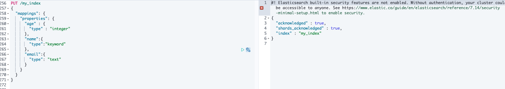

# elasticsearch操作

[toc]

### 1.基础操作

```sh
#查看所有的索引
GET /_cat/indices

yellow open users_20210827                  EWNcM5rSQs64W-UyiWX_-w 5 2 979701 18786 597.2mb 597.2mb
yellow open test1                           MUSajDCtQPq5F6bM_G7TTw 1 1      0     0    208b    208b
```

##### PUT保存一个索引(更新也可以)

```sh
PUT test1

#必须带ID
PUT test1/external/1
{
	"name" : "张三"
}

#结果
{
  "_index" : "test1",
  "_type" : "external",
  "_id" : "1",
  "_version" : 1,
  "result" : "created",
  "_shards" : {
    "total" : 2,
    "successful" : 1,
    "failed" : 0
  },
  "_seq_no" : 0,
  "_primary_term" : 2
}

#如果继续点击put方法，就变成了保存
#结果
{
  "_index" : "test1",
  "_type" : "external",
  "_id" : "1",
  "_version" : 2,       #版本增加了
  "result" : "updated",
  "_shards" : {
    "total" : 2,
    "successful" : 1,
    "failed" : 0
  },
  "_seq_no" : 1,
  "_primary_term" : 2
}

```

###### put修改需要注意的是，修改的值如果是单独的字段值，会把其余的字段置为空

```json
GET my_index/_search

#结果   
{
  "took" : 973,
  "timed_out" : false,
  "_shards" : {
    "total" : 1,
    "successful" : 1,
    "skipped" : 0,
    "failed" : 0
  },
  "hits" : {
    "total" : {
      "value" : 1,
      "relation" : "eq"
    },
    "max_score" : 1.0,
    "hits" : [
      {
        "_index" : "my_index",
        "_type" : "user",
        "_id" : "1",
        "_score" : 1.0,
        "_source" : {
          "name.keyword" : "李四",   #目前库里有name和age两个值
          "age" : 20
        }
      }
    ]
  }
}
#修改name为张三
PUT my_index/user/1
{
	"name.keyword" : "张三"
}
#结果
{
  "took" : 658,
  "timed_out" : false,
  "_shards" : {
    "total" : 1,
    "successful" : 1,
    "skipped" : 0,
    "failed" : 0
  },
  "hits" : {
    "total" : {
      "value" : 1,
      "relation" : "eq"
    },
    "max_score" : 1.0,
    "hits" : [
      {
        "_index" : "my_index",
        "_type" : "user",
        "_id" : "1",
        "_score" : 1.0,
        "_source" : {
          "name.keyword" : "张三"  #年龄字段消失了
        }
      }
    ]
  }
}
```

###### ==建议==修改需要用post

```json
POST my_index/user/1/_update
{
	"doc":{
	  "name.keyword" : "张三"
	}
}

#结果
{
  "took" : 99,
  "timed_out" : false,
  "_shards" : {
    "total" : 1,
    "successful" : 1,
    "skipped" : 0,
    "failed" : 0
  },
  "hits" : {
    "total" : {
      "value" : 1,
      "relation" : "eq"
    },
    "max_score" : 1.0,
    "hits" : [
      {
        "_index" : "my_index",
        "_type" : "user",
        "_id" : "1",
        "_score" : 1.0,
        "_source" : {
          "name.keyword" : "张三",
          "age" : 20
        }
      }
    ]
  }
}
```

##### POST保存一个索引

```sh
POST test1/external
{
	"name" : "李四"
}

#结果
{
  "_index" : "test1",
  "_type" : "external",
  "_id" : "xJUkl3wBNEMeGuMKEcKb",
  "_version" : 1,
  "result" : "created",
  "_shards" : {
    "total" : 2,
    "successful" : 1,
    "failed" : 0
  },
  "_seq_no" : 3,
  "_primary_term" : 2
}

#post是一个新增操作，重复点击，添加记录
{
  "_index" : "test1",
  "_type" : "external",
  "_id" : "x5Ukl3wBNEMeGuMK7cJZ",
  "_version" : 1,
  "result" : "created",
  "_shards" : {
    "total" : 2,
    "successful" : 1,
    "failed" : 0
  },
  "_seq_no" : 6,
  "_primary_term" : 2
}

#如果post后面也带id，那么重复点击也是保存
POST test1/external/1
{
	"name" : "李四"
}

{
  "_index" : "test1",
  "_type" : "external",
  "_id" : "1",
  "_version" : 3,
  "result" : "updated",
  "_shards" : {
    "total" : 2,
    "successful" : 1,
    "failed" : 0
  },
  "_seq_no" : 7,
  "_primary_term" : 2
}
```

##### 查询文档

```sh
GET test1/external/1

{
  "_index" : "test1",   #索引名称
  "_type" : "external", #类型
  "_id" : "1",          #记录ID
  "_version" : 3,       #版本号
  "_seq_no" : 7,        #并发控制字段，每次更新+1，用来做乐观锁
  "_primary_term" : 2,  #主分片重新分配，如果重启，就会变化
  "found" : true,
  "_source" : {
    "name" : "李四"
  }
}
```

##### 更新文档

###### _update

```sh
POST test1/external/1/_update
{
	"doc":{
		"name" : "李四1"
	}
}
#_update更新重复点击，数据会对比原数据，如果一样，不更新，版本号(_version)和序列号(_seq_no)都不会变更
#结果
{
  "_index" : "test1",
  "_type" : "external",
  "_id" : "1",
  "_version" : 4,
  "result" : "noop",
  "_shards" : {
    "total" : 0,
    "successful" : 0,
    "failed" : 0
  },
  "_seq_no" : 8,
  "_primary_term" : 2
}
```

###### POST

```sh
POST test1/external/1
{
	"name" : "李四2"
}
#重复点击，版本号(_version)和序列号(_seq_no)都会增加,重复更新
#结果
{
  "_index" : "test1",
  "_type" : "external",
  "_id" : "1",
  "_version" : 5,
  "result" : "updated",
  "_shards" : {
    "total" : 2,
    "successful" : 1,
    "failed" : 0
  },
  "_seq_no" : 9,
  "_primary_term" : 2
}
```

###### PUT

```sh
PUT test1/external/1
{
	"name" : "李四3"
}
#重复点击，版本号(_version)和序列号(_seq_no)都会增加,重复更新
#结果
{
  "_index" : "test1",
  "_type" : "external",
  "_id" : "1",
  "_version" : 6,
  "result" : "updated",
  "_shards" : {
    "total" : 2,
    "successful" : 1,
    "failed" : 0
  },
  "_seq_no" : 10,
  "_primary_term" : 2
}

```

##### 删除文档和索引

```sh
#删除文档
DELETE test1/external/1

{
  "_index" : "test1",
  "_type" : "external",
  "_id" : "1",
  "_version" : 13,
  "result" : "deleted",
  "_shards" : {
    "total" : 2,
    "successful" : 1,
    "failed" : 0
  },
  "_seq_no" : 17,
  "_primary_term" : 3
}
#查询1号id的数据，显示没找到
{
  "_index" : "test1",
  "_type" : "external",
  "_id" : "1",
  "found" : false
}
#删除索引
DELETE test1
{
  "acknowledged" : true
}

```

##### bulk 批量操作

```sh
POST test1/a/_bulk
{"index":{"_id":1}}
{"name":"zhangsan"}
{"index":{"_id":2}}
{"name":"lisi"}

#结果
{
  "took" : 940,
  "errors" : false,
  "items" : [
    {
      "index" : {
        "_index" : "test1",
        "_type" : "external",
        "_id" : "1",
        "_version" : 1,
        "result" : "created",
        "_shards" : {
          "total" : 2,
          "successful" : 1,
          "failed" : 0
        },
        "_seq_no" : 0,
        "_primary_term" : 1,
        "status" : 201
      }
    },
    {
      "index" : {
        "_index" : "test1",
        "_type" : "external",
        "_id" : "2",
        "_version" : 1,
        "result" : "created",
        "_shards" : {
          "total" : 2,
          "successful" : 1,
          "failed" : 0
        },
        "_seq_no" : 1,
        "_primary_term" : 1,
        "status" : 201
      }
    }
  ]
}
```

### 2.查询

##### match_all(匹配所有)

```sh
GET bank/_search
{
  "query": {"match_all": {}},
  "sort": [
    {
      "account_number": "asc" #两种写法
    }
  ]
}

#可以多个排序
GET bank/_search
{
  "query": {"match_all": {}},
  "sort": [
    {
      "account_number": {
        "order": "asc"
      },
      "balance": {
        "order": "desc"
      }
    }
  ]
}


#结果打印
{
  "took" : 13,
  "timed_out" : false,
  "_shards" : {
    "total" : 1,
    "successful" : 1,
    "skipped" : 0,
    "failed" : 0
  },
  "hits" : {
    "total" : {
      "value" : 1000,
      "relation" : "eq"
    },
    "max_score" : null,
    "hits" : [
      {
        "_index" : "bank",
        "_type" : "account",
        "_id" : "0",
        "_score" : null,
        "_source" : {
          "account_number" : 0,
          "balance" : 16623,
          "firstname" : "Bradshaw",
          "lastname" : "Mckenzie",
          "age" : 29,
          "gender" : "F",
          "address" : "244 Columbus Place",
          "employer" : "Euron",
          "email" : "bradshawmckenzie@euron.com",
          "city" : "Hobucken",
          "state" : "CO"
        },
        "sort" : [
          0
        ]
      },
      ...
    ]
  }
}
```

##### 获取具体的字段

```sh
GET bank/_search
{
  "query": {
    "match_all": {}
  },
  "_source": ["lastname", "address"]
}

#结果打印
{
  ...
  "hits" : {
    ...
    "hits" : [
      {
        "_index" : "bank",
        "_type" : "account",
        "_id" : "1",
        "_score" : 1.0,
        "_source" : {
          "address" : "880 Holmes Lane",
          "lastname" : "Duke"
        }
      },
      ...
    ]
  }
}

#另一种
GET bank/_search
{
  "query": {
    "match_all": { }
  },
  "fields": [
    "account_number","lastname"
  ]
}

#结果打印
{
  ...
  "hits" : {
    ...
    "hits" : [
      {
        "_index" : "bank",
        "_type" : "account",
        "_id" : "1",
        "_score" : 1.0,
        "fields" : {
          "account_number" : [
            1
          ],
          "lastname" : [
            "Duke"
          ]
        }
      },
      ...
    ]
  }
}
```

##### 基本分页

```sh
GET bank/_search
{
  "query": {
    "match_all": {}
  },
  "from": 5,
  "size": 5
}
```

##### match(精确匹配)

```sh
GET bank/_search
{
  "query": {
    "match": {
      "address": "Holmes"
    }
  }
}

#结果打印
{
  ...
  "hits" : {
   ...
    "hits" : [
      {
        "_index" : "bank",
        "_type" : "account",
        "_id" : "1",
        "_score" : 6.501515,
        "_source" : {
          "account_number" : 1,
          "balance" : 39225,
          "firstname" : "Amber",
          "lastname" : "Duke",
          "age" : 32,
          "gender" : "M",
          "address" : "880 Holmes Lane",
          "employer" : "Pyrami",
          "email" : "amberduke@pyrami.com",
          "city" : "Brogan",
          "state" : "IL"
        }
      }
    ]
  }
}


```

==如果类型设置为keyword，必须得精确匹配，不然检索不到数据==


##### match_phrase(短语匹配)

```sh
#将需要匹配的值当成一个整体单词(不分词)进行检索（包含短语）
GET bank/_search
{
	"query":{
		"match_phrase":{
			"address":"mill road"
		}
	}
}

#另一种办法（用keyword的意思是地址就是mill road,等同于mysql中的name='北京'）
GET bank/_search
{
	"query":{
		"match":{
			"address.keyword":"mill road"
		}
	}
}
```

##### multi_match(多字段匹配-----类似mysql的or)

```sh
#state或者address包含mill的
GET bank/_search
{
	"query":{
		"multi_match":{
			"query":"mill",
			"fields":["state", "address"]
		}
	}
}

#结果
{
  "took" : 143,
  "timed_out" : false,
  "_shards" : {
    "total" : 1,
    "successful" : 1,
    "skipped" : 0,
    "failed" : 0
  },
  "hits" : {
    "total" : {
      "value" : 4,
      "relation" : "eq"
    },
    "max_score" : 5.4032025,
    "hits" : [
      {
        "_index" : "bank",
        "_type" : "account",
        "_id" : "970",
        "_score" : 5.4032025,
        "_source" : {
          "account_number" : 970,
          "balance" : 19648,
          "firstname" : "Forbes",
          "lastname" : "Wallace",
          "age" : 28,
          "gender" : "M",
          "address" : "990 Mill Road",
          "employer" : "Pheast",
          "email" : "forbeswallace@pheast.com",
          "city" : "Lopezo",
          "state" : "AK"
        }
      },
      {
        "_index" : "bank",
        "_type" : "account",
        "_id" : "136",
        "_score" : 5.4032025,
        "_source" : {
          "account_number" : 136,
          "balance" : 45801,
          "firstname" : "Winnie",
          "lastname" : "Holland",
          "age" : 38,
          "gender" : "M",
          "address" : "198 Mill Lane",
          "employer" : "Neteria",
          "email" : "winnieholland@neteria.com",
          "city" : "Urie",
          "state" : "IL"
        }
      }
    ]
  }
}
```

##### bool(复合查询)

```sh
#并且的关系（gender=F and employer=Comverges and age != 30）
{
	"query": {
	  "bool": {
	    "must" : [
	        {
	          "match": {
	            "gender": "F"
	          }
	        },
	        {
	          "match": {
	            "employer": "Comverges"
	          }
	        }
	      ],
	      "must_not": [
	        {
	          "match": {
	            "age": "30"
	          }
	        }
	      ],
	      "should":[     #应该有Li，没有也能查出来，只是有Li的_score分值高
              {
                  "match": {
                  "lastname": "Li"
                  }
              }
	      ]
	  }
	}
}

#范围查询
GET bank/_search
{
  "query": {
    "bool": {
      "must": [
        {
          "range": {
            "age": {
              "gte": 30,
              "lte": 40
            }
          }
        },
        {
          "match": {
            "address": "mill"
          }
        }
      ]
    }
  }
}
```

##### filter(过滤)

```json
GET bank/_search
{
  "query": {
    "bool": {
      "filter": [
        {
          "range": {
            "age": {
              "gte": 30,
              "lte": 40
            }
          }
        },
        {
          "match": {
            "address": "mill"
          }
        }
      ]
    }
  }
}


#结果
{
  ...
  "hits" : {
    ...
    "hits" : [
      {
        "_index" : "bank",
        "_type" : "account",
        "_id" : "136",
        "_score" : 0.0,         #filter查询完，相关性得分为0
        "_source" : {
          "account_number" : 136,
          "balance" : 45801,
          "firstname" : "Winnie",
          "lastname" : "Holland",
          "age" : 38,
          "gender" : "M",
          "address" : "198 Mill Lane",
          "employer" : "Neteria",
          "email" : "winnieholland@neteria.com",
          "city" : "Urie",
          "state" : "IL"
        }
      },
      {
        "_index" : "bank",
        "_type" : "account",
        "_id" : "345",
        "_score" : 0.0,
        "_source" : {
          "account_number" : 345,
          "balance" : 9812,
          "firstname" : "Parker",
          "lastname" : "Hines",
          "age" : 38,
          "gender" : "M",
          "address" : "715 Mill Avenue",
          "employer" : "Baluba",
          "email" : "parkerhines@baluba.com",
          "city" : "Blackgum",
          "state" : "KY"
        }
      },
      {
        "_index" : "bank",
        "_type" : "account",
        "_id" : "472",
        "_score" : 0.0,
        "_source" : {
          "account_number" : 472,
          "balance" : 25571,
          "firstname" : "Lee",
          "lastname" : "Long",
          "age" : 32,
          "gender" : "F",
          "address" : "288 Mill Street",
          "employer" : "Comverges",
          "email" : "leelong@comverges.com",
          "city" : "Movico",
          "state" : "MT"
        }
      }
    ]
  }
}
```

##### term(和match功能差不多，是包含操作，不是等值操作)

```json
#和match一样，匹配某个属性的值，全文检索字段用match，其他非text(全文检索)字段匹配用term

#term 查询对于查找单个值非常有用，但通常我们可能想搜索多个值。 如果我们想要查找价格字段值为 $20 或 $30 的文档(注意s)
"query" : {
    "bool" : {
        "filter" : {
            "terms" : { 
                "age" : [20, 38]
            }
        }
    }
}
```

##### highlight（高亮搜索）

```json
GET bank/_search
{
	"query":{
		"match_phrase":{
			"address":"mill road"
		}
	},
	"highlight": {
	  "fields": {
	    "address" : {}
	  }
	}
}
```


##### aggregations(聚合)

```json
#搜索address中包含mill的所有人的年龄分布以及平均年龄

GET bank/_search
{
  "query": {
    "match": {
      "address": "mill"
    }
  },
  "aggs": {    #aggs和aggregations可以，别的名称不行
    "ageAgg": {  #自定义名称
      "terms": {
        "field": "age",
        "size" : 10      #取10条
      }
    }
  }
}

//年龄分布的结果
{
  "took" : 6,
  "timed_out" : false,
  "_shards" : {
    "total" : 1,
    "successful" : 1,
    "skipped" : 0,
    "failed" : 0
  },
  "hits" : {
    "total" : {
      "value" : 4,
      "relation" : "eq"
    },
    "max_score" : 5.4032025,
    "hits" : [
      {
        "_index" : "bank",
        "_type" : "account",
        "_id" : "970",
        "_score" : 5.4032025,
        "_source" : {
          "account_number" : 970,
          "balance" : 19648,
          "firstname" : "Forbes",
          "lastname" : "Wallace",
          "age" : 28,
          "gender" : "M",
          "address" : "990 Mill Road",
          "employer" : "Pheast",
          "email" : "forbeswallace@pheast.com",
          "city" : "Lopezo",
          "state" : "AK"
        }
      },
      {
        "_index" : "bank",
        "_type" : "account",
        "_id" : "136",
        "_score" : 5.4032025,
        "_source" : {
          "account_number" : 136,
          "balance" : 45801,
          "firstname" : "Winnie",
          "lastname" : "Holland",
          "age" : 38,
          "gender" : "M",
          "address" : "198 Mill Lane",
          "employer" : "Neteria",
          "email" : "winnieholland@neteria.com",
          "city" : "Urie",
          "state" : "IL"
        }
      },
      {
        "_index" : "bank",
        "_type" : "account",
        "_id" : "345",
        "_score" : 5.4032025,
        "_source" : {
          "account_number" : 345,
          "balance" : 9812,
          "firstname" : "Parker",
          "lastname" : "Hines",
          "age" : 38,
          "gender" : "M",
          "address" : "715 Mill Avenue",
          "employer" : "Baluba",
          "email" : "parkerhines@baluba.com",
          "city" : "Blackgum",
          "state" : "KY"
        }
      },
      {
        "_index" : "bank",
        "_type" : "account",
        "_id" : "472",
        "_score" : 5.4032025,
        "_source" : {
          "account_number" : 472,
          "balance" : 25571,
          "firstname" : "Lee",
          "lastname" : "Long",
          "age" : 32,
          "gender" : "F",
          "address" : "288 Mill Street",
          "employer" : "Comverges",
          "email" : "leelong@comverges.com",
          "city" : "Movico",
          "state" : "MT"
        }
      }
    ]
  },
  "aggregations" : {
    "ageAgg" : {
      "doc_count_error_upper_bound" : 0,
      "sum_other_doc_count" : 0,
      "buckets" : [
        {
          "key" : 38,    #年龄38的有两个
          "doc_count" : 2
        },
        {
          "key" : 28,   #年龄28的有一个
          "doc_count" : 1
        },
        {
          "key" : 32,   #年龄32的有一个
          "doc_count" : 1
        }
      ]
    }
  }
}
```


> 如果不想看命中结果数据可以设置size为0


> 按照年龄段聚合，并且请求这些年龄段的人的平均薪资(==基于上一次的聚合结果继续字聚合==)


> 查出所有年龄分布，并且这些年龄段的性别中为M的平均薪资和性别为F的平均薪资以及这个年龄段的总体平均薪资


##### 实例

```json
#Is not null 不为空
//mysql查询返回某个字段为空值的结果写法是select * from 表名 where 字段名 is not null and where channel_level in("P3", "P2", "P1"); 
#在elasticsearch中查询语句为
#http://10.3.232.11:8000/users/_search

{
    "query":{
        "bool":{
            "must":[
                {
                    "exists":{
                        "field":"solution_id"
                    }
                }
            ],
            "filter":[
                {
                    "terms":{
                        "channel_level":[
                            "P3",
                            "P2",
                            "P1"
                        ]
                    }
                }
            ]
        }
    }
}

#is null 为空
//mysql查询返回某个字段为空值的结果写法是select * from 表名 where 字段名 is null
#在elasticsearch中查询语句为
#http://10.3.232.11:8000/users/_search
{
    "query":{
        "bool":{
            "must_not":[
                {
                    "exists":{
                        "field":"solution_id"
                    }
                }
            ],
            "filter":[
                {
                    "terms":{
                        "channel_level":[
                            "P3",
                            "P2",
                            "P1"
                        ]
                    }
                }
            ]
        }
    }
}

#Where code=xxx orwhere name=xxx
{
    "query": {
        "bool": {
            "filter": [
                {
                    "term": {
                        "cycle_id": 89
                    }
                },
                {
                    "multi_match": {
                        "query": "张三",
                        "fields": [
                            "name",
                            "code"
                        ]
                    }
                }
            ]
        }
    }
}
```

### 3.映射

##### 查看索引的映射

```
 GET users_20210827/_mapping
```


##### 创建映射

```json
PUT /my_index
{
  "mappings": {
    "properties": {
      "age" : {
        "type" : "integer"
      },
      "name":{
        "type":"keyword"
      },
      "email":{
        "type": "text"
      }
    }
  }
}
```



##### 添加新的字段映射

```json
PUT /my_index/_mapping
{
  "properties":{
    "user_id":{
      "type":"keyword",
      "index":false     #默认index都是true，表示当前字段可以被检索，如果为false，代表这个字段不可被检索，
    }
  }
}
```


##### 更新映射

> 对于已经存在的映射字段，我们不能更新，更新必须创建新的索引进行==数据迁移==

##### 数据迁移

```json
#目的：修改bank索引中的一些字段类型，因为无法更新，所以只能迁移
#创建新的new_bank索引，然后执行bank和new_bank的数据迁移
PUT new_bank/_mapping
{
   "properties" : {
        "account_number" : {
          "type" : "long"
        },
        "address" : {
          "type" : "text"
        },
        "age" : {
          "type" : "long"
        },
        "balance" : {
          "type" : "long"
        },
        "city" : {
          "type" : "text"
        },
        "email" : {
          "type" : "text"
        },
        "employer" : {
          "type" : "text"
        },
        "firstname" : {
          "type" : "text"
        },
        "gender" : {
          "type" : "text"
        },
        "lastname" : {
          "type" : "text"
        },
        "state" : {
          "type" : "text"
        }
      }
}

#数据迁移(es6.0以后这么操作，因为6.0以后没有类型)
POST _reindex
{
    "source":{
        "index":"twitter"
    },
    "dest":{
        "index":"new_twitter"
    }
}

#数据迁移(如果当前的es库里有类型，需要按下面的方式迁移)
POST _reindex
{
    "source":{
        "index":"bank",
        "type" : "account"
    },
    "dest":{
        "index":"new_bank"
    }
}
```


> 迁移完成的数据类型变成_doc，老数据也可以完成迁移了
