## 1. SQL 没加索引

如果没有加索引会导致全表扫描。因此，应考虑在 `where` 的条件列，**建立索引**，尽量避免全表扫描。


## 2. SQL 索引不生效

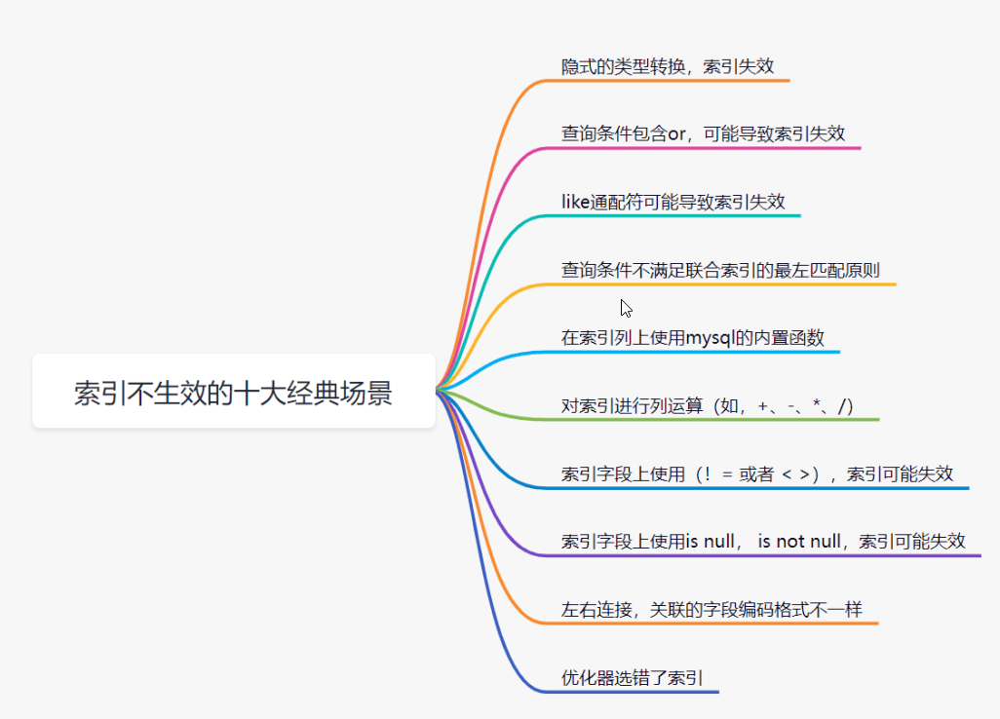

创建一个用户 user 表，`userId` 字段为**字串类型**，是 B + 树的普通索引

```mysql
CREATE TABLE user ( 
    id int(11) NOT NULL AUTO_INCREMENT, 
    userId varchar(32) NOT NULL, 
    age varchar(16) NOT NULL, 
    name varchar(255) NOT NULL, 
    PRIMARY KEY (id), 
    KEY idx_userid (userId) USING BTREE 
) ENGINE=InnoDB DEFAULT CHARSET=utf8;
```


#### 2.1 隐式的类型转换，索引失效

查询条件传一个数字过去，会导致索引失效，如果给数字加上''转为字符串则走索引

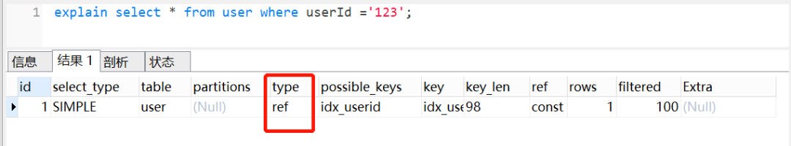


#### 2.2 查询条件包含 or，可能导致索引失效

对于 or+ 没有索引的 age 这种情况，假设它走了 userId 的索引，但是走到 age 查询条件时，它还得全表扫描，也就是需要三步过程：全表扫描 + 索引扫描 + 合并。如果它一开始就走全表扫描，直接一遍扫描就完事。Mysql 优化器出于效率与成本考虑，遇到 or 条件，让索引失效，看起来也合情合理。

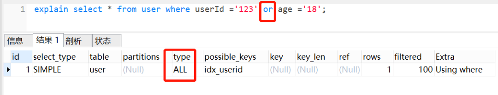


#### 2.3 like 通配符可能导致索引失效。

并不是用了 like 通配符，索引一定会失效，而是 like 查询是以 % 开头，才会导致索引失效。like 查询以 % 开头，索引失效，把 % 放后面，索引还是正常走的

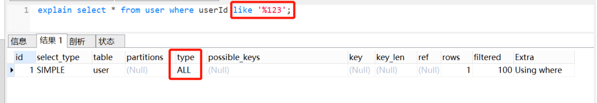

既然 `like` 查询以 `%` 开头，会导致索引失效。我们如何优化呢？

- 使用覆盖索引
- 把 `%` 放后面

> 如果一个索引包含(或覆盖)所有需要查询的字段的值，称为‘覆盖索引’。


#### 2.4 查询条件不满足联合索引的最左匹配原则
MySQl 建立联合索引时，会遵循最左前缀匹配的原则，即最左优先。如果你建立一个（a,b,c）的联合索引，相当于建立了 (a)、(a,b)、(a,b,c) 三个索引。

假设有以下表结构，有一个联合索引 idx_userid_name：

```mysql
CREATE TABLE user ( 
    id int(11) NOT NULL AUTO_INCREMENT, 
    user_id varchar(32) NOT NULL, 
    age varchar(16) NOT NULL, 
    name varchar(255) NOT NULL, 
    PRIMARY KEY (id), 
    KEY idx_userid_name (user_id,name) USING BTREE 
) ENGINE=InnoDB DEFAULT CHARSET=utf8;
```

我们执行这个 SQL，查询条件是 name，索引是无效，因为查询条件列 name 不是联合索引 idx_userid_name 中的第一个列，索引不生效

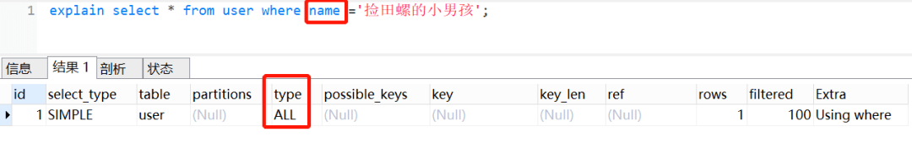在联合索引中，查询条件满足最左匹配原则时，索引才正常生效。

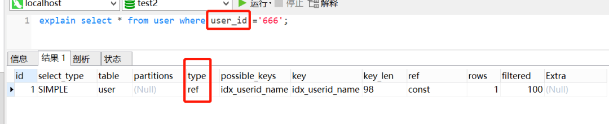


#### 2.5 在索引列上使用 mysql 的内置函数

```mysql
CREATE TABLE user(
    id int(11) NOT NULL AUTO_INCREMENT,
    userId varchar(32) NOT NULL,
    login_time datetime NOT NULL, 
    PRIMARY KEY (id), 
    KEY idx_userId(userId) USING BTREE, 
    KEY idx_login_time(login_Time) USING BTREE 
) ENGINE=InnoDB AUTO_INCREMENT=2 DEFAULT CHARSET=utf8;
```

虽然 login_time 加了索引，但是因为使用了 mysql 的内置函数 Date_ADD()，索引直接 GG，如图：

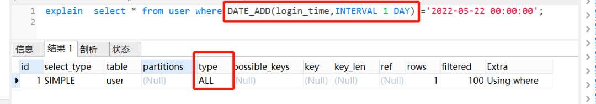

这种情况怎么优化呢？可以把内置函数的逻辑转移到右边，如下：

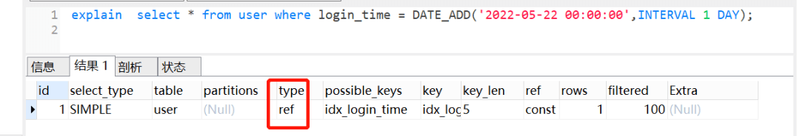


#### 2.6 对索引进行列运算（如，+、-、*、/）, 索引不生效

```mysql
CREATE TABLE user(
    id int(11) NOT NULL AUTO_INCREMENT,
    userId varchar(32) NOT NULL,
    age int(11) DEFAULT NULL, 
    PRIMARY KEY (id), 
    KEY idx_age(age) USING BTREE 
) ENGINE=InnoDB AUTO_INCREMENT=2 DEFAULT CHARSET=utf8;
```

虽然 age 加了索引，但是因为它进行运算，索引直接迷路了。。。所以不可以对索引列进行运算，可以在代码处理好，再传参进去。

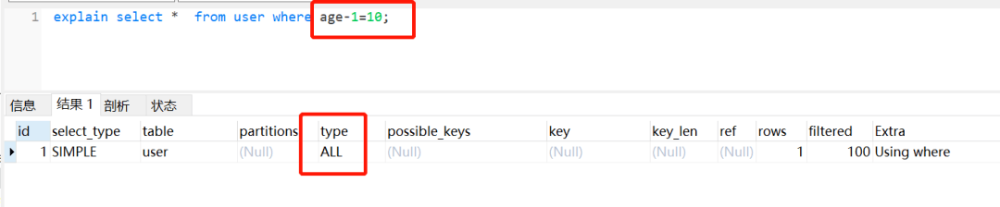


#### 2.7 索引字段上使用（！= 或者 < >），索引可能失效

```mysql
CREATE TABLE user(
    id int(11) NOT NULL AUTO_INCREMENT,
    userId int(11) NOT NULL,
    age int(11) DEFAULT NULL,
    name varchar(255) NOT NULL, 
    PRIMARY KEY (id), 
    KEY idx_age(age) USING BTREE 
) ENGINE=InnoDB AUTO_INCREMENT=2 DEFAULT CHARSET=utf8;
```

虽然 age 加了索引，但是使用了！= 或者 < >，not in 这些时，索引如同虚设。

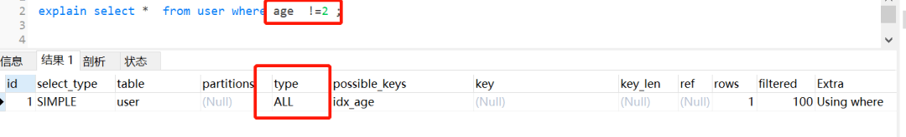

> 其实这个也是跟 mySQL优化器有关，如果优化器觉得即使走了索引，还是需要扫描很多很多行的哈，它觉得不划算，不如直接不走索引。平时我们用！= 或者 < >，not in 的时候，留点心眼哈。


#### 2.8 索引字段上使用 is null， is not null，索引可能失效

```mysql
CREATE TABLE user(
    idint(11) NOT NULL AUTO_INCREMENT,
    card varchar(255) DEFAULT NULL,
    name varchar(255) DEFAULT NULL, 
    PRIMARY KEY (id), 
    KEY idx_name(name) USING BTREE, 
    KEY idx_card(card) USING BTREE 
) ENGINE=InnoDB AUTO_INCREMENT=2 DEFAULT CHARSET=utf8;
```

单个 name或card 字段加上索引，并查询非空的语句，是会走索引的，但是它两用 or 连接起来，索引就失效了，如下：

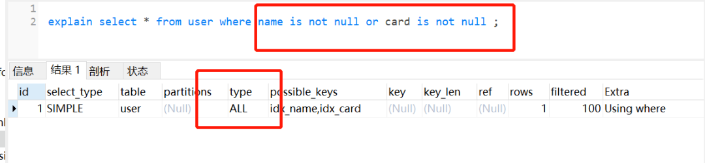

> 很多时候，也是因为数据量问题，导致了 MySQL 优化器放弃走索引。同时，平时我们用 explain 分析 SQL 的时候，如果 type=range, 要注意一下哈，因为这个可能因为数据量问题，导致索引无效。


#### 2.9 左右连接，关联的字段编码格式不一样
新建两个表，一个 user，一个 user_job，user 表的 name 字段编码是 utf8mb4，而 user_job 表的 name 字段编码为 utf8。

```mysql
CREATE TABLE user(
    id int(11) NOT NULL AUTO_INCREMENT,
    name varchar(255) CHARACTER SET utf8mb4 DEFAULT NULL,
    age int(11) NOT NULL, 
    PRIMARY KEY (id), 
    KEY idx_name(name) USING BTREE
) ENGINE=InnoDB AUTO_INCREMENT=2 DEFAULT CHARSET=utf8;

CREATE TABLE user_job (
    id int(11) NOT NULL,
    userId int(11) NOT NULL,
    job varchar(255) DEFAULT NULL,
    name varchar(255) DEFAULT NULL,
    PRIMARY KEY (id),
    KEY idx_name (name) USING BTREE
) ENGINE=InnoDB DEFAULT CHARSET=utf8;
```

执行左外连接查询，user_job 表还是走全表扫描：

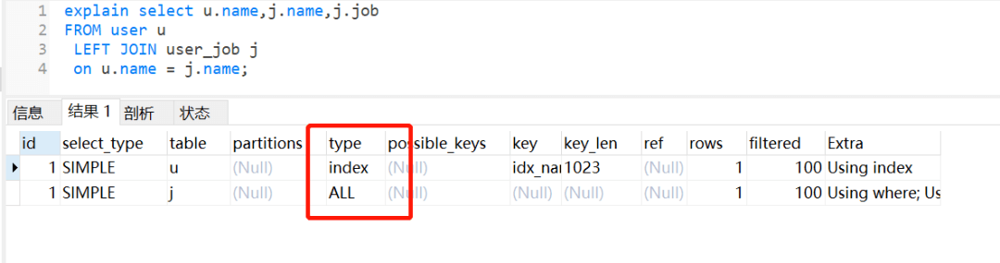

如果把它们的 name 字段改为编码一致，相同的 SQL，还是会走索引。


#### 2.10 优化器选错了索引
MySQL 中一张表是可以支持多个索引的。写 SQL 语句的时候如果没有主动指定使用哪个索引的话，则由 MySQL 来确定的。日常开发中，不断地删除历史数据和新增数据的场景有可能会导致 MySQL 选错索引。那么有哪些解决方案呢？

- 使用 force index 强行选择某个索引

- 修改SQl，引导它使用我们期望的索引

- 优化业务逻辑

- 优化索引，新建一个更合适的索引，或者删除误用的索引。


## 3. limit 深分页问题

你知道以下 SQL执行过程是怎样的嘛？

```mysql
select id,name,balance from account where create_time> '2020-09-19' limit 100000,10;
```

SQL 的执行流程：

1. 通过普通二级索引树 idx_create_time，过滤 create_time 条件，找到满足条件的主键 id。

2. 通过主键id，回到 id主键索引树，找到满足记录的行，然后取出需要展示的列（回表过程）

3. 扫描满足条件的 100010 行，然后扔掉前 100000 行，返回。


limit 深分页，导致 SQL 变慢原因有两个：

- limit 语句会先扫描 offset+n 行，然后再丢弃掉前 offset 行，返回后 n 行数据。也就是说 limit 100000,10，就会扫描 100010 行，而 limit 0,10，只扫描 10 行。

- limit 100000,10 扫描更多的行数，也意味着回表更多的次数。


### 3.1如何优化深分页问题

我们可以通过减少回表次数来优化。一般有**标签记录法和延迟关联法**。

**标签记录法**

> 就是标记一下上次查询到哪一条了，下次再来查的时候，从该条开始往下扫描。就好像看书一样，上次看到哪里了，你就折叠一下或者夹个书签，下次来看的时候，直接就翻到啦。

假设上一次记录到 100000，则 SQL 可以修改为：

```mysql
select id,name,balance FROM account where id > 100000 limit 10;
```

这样的话，后面无论翻多少页，性能都会不错的，因为命中了 id索引。

**延迟关联法**

延迟关联法，就是把条件转移到主键索引树，然后减少回表。如下：

```mysql
select acct1.id,acct1.name,acct1.balance FROM account acct1 INNER JOIN (SELECT a.id FROM account a WHERE a.create_time > '2020-09-19' limit 100000, 10) AS acct2 on acct1.id= acct2.id;
```

优化思路就是，先通过 idx_create_time 二级索引树查询到满足条件的主键ID，再与原表通过主键ID 内连接，这样后面直接走了主键索引了，同时也减少了回表。


## 4. 单表数据量太大
#### 4.1 单表数据量太大为什么会变慢？
一个表的数据量达到好几千万或者上亿时，加索引的效果没那么明显。性能之所以会变差，是因为维护索引的 B+ 树结构层级变得更高了，查询一条数据时，需要经历的磁盘 IO 变多，因此查询性能变慢。

#### 4.2 一棵 B + 树可以存多少数据量?

InnoDB 存储引擎最小储存单元是页，一页大小就是 16k。

B + 树叶子(最下层)存的是数据，内部节点存的是键值（id） + 指针。索引组织表通过非叶子节点的二分查找法以及指针确定数据在哪个页中，进而再去数据页中找到需要的数据；

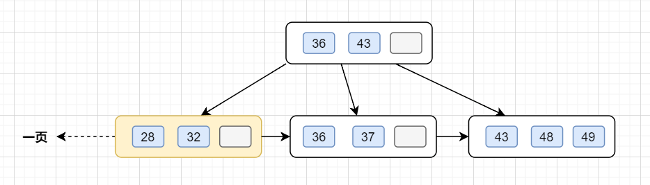

假设 B + 树的高度为 2 的话，即有一个根结点和若干个叶子结点。这棵 B + 树的存放总记录数为 = 根结点指针数 * 单个叶子节点记录行数。

- 如果一行记录的数据大小为 1k，那么单个叶子节点（InnoDB 存储引擎最小储存单元是页，一页大小就是 16k）可以存的记录数 =16k/1k =16.

- 非叶子节点内存放多少指针呢？假设主键 ID 为 bigint 类型，长度为 8 字节 (int 类型是 32 位，即4 字节)，指针在 InnoDB 源码中为 6 字节，所以就是 8+6=14 字节，16k/14B =16*1024B/14B = 1170个指针


因此，一棵高度为 2 的 B + 树，能存放 1170 * 16=18720 条这样的数据记录。同理一棵高度为 3 的 B + 树，能存放 1170 *1170 *16 =21902400，也就是说，可以存放两千万左右的记录。B + 树高度一般为 1-3 层，已经满足千万级别的数据存储。如果 B + 树想存储更多的数据，那树结构层级就会更高，查询一条数据时，需要经历的磁盘 IO 变多，因此查询性能变慢。


#### 4.3 如何解决单表数据量太大，查询变慢的问题
一般超过千万级别，我们可以考虑分库分表了。分库分表可能导致的问题：

- 事务问题

- 跨库问题

- 排序问题

- 分页问题

- 分布式 ID


因此，在评估是否分库分表前，先考虑下是否可以把部分历史数据归档先。如果真的要分库分表，综合考虑和评估方案。比如可以考虑垂直、水平分库分表。水平分库分表策略的话，range 范围、hash 取模、range+hash 取模混合等等。


## 5. join 或者子查询过多
一般来说，不建议使用子查询，可以把子查询改成 join 来优化。规范约定：尽量不要有超过 3 个以上的表连接。

> 一般情况下，如果业务需要的话关联 2~3 个表是可以接受的，但是关联的字段需要加索引。如果需要关联更多的表，建议从代码层面进行拆分，在业务层先查询一张表的数据，然后以关联字段作为条件查询关联表形成 map，然后在业务层进行数据的拼装。
>


## 6. in 元素过多

如果使用了 `in`，即使后面的条件加了索引，还是要注意 `in` 后面的元素不要过多。`in` 元素一般建议不要超过 `500` 个，如果超过了，建议分组，每次 `500` 一组进行。


## 7. order by 文件排序
#### 7.1 order by 的 Using filesort 文件排序
我们平时经常需要用到 order by ，主要就是用来给某些字段排序:

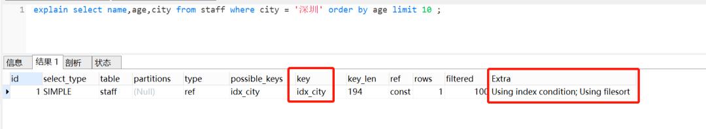

查看 `explain` 执行计划的时候，可以看到 `Extra` 这一列，有一个 `Using filesort`，它表示用到**文件排序**。


#### 7.2 如何优化 order by 的文件排序

> 因为数据是无序的，所以就需要排序。如果数据本身是有序的，那就不会再用到文件排序啦。而索引数据本身是有序的，我们通过建立索引来优化 `order by` 语句。


## 8、group by 使用临时表
```mysql
CREATE TABLE staff(
    id bigint(11) NOT NULL AUTO_INCREMENT COMMENT '主键id',
    id_card varchar(20) NOT NULL COMMENT '身份证号码',
    name varchar(64) NOT NULL COMMENT '姓名',
    age int(4) NOT NULL COMMENT '年龄',
    city varchar(64) NOT NULL COMMENT '城市', 
    PRIMARY KEY (id) 
) ENGINE=InnoDB AUTO_INCREMENT=15 DEFAULT CHARSET=utf8 COMMENT='员工表';
```

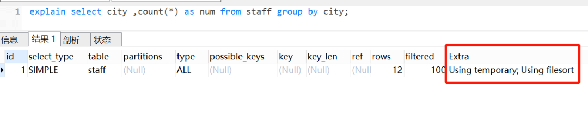

- Extra 这个字段的 `Using temporary` 表示在执行分组的时候使用了**临时表**
- Extra 这个字段的 `Using filesort` 表示使用了**文件排序**

我们来看下这个 SQL 的执行流程

1. 创建内存临时表，表里有两个字段 city和num；

2. 全表扫描 staff 的记录，依次取出 city = 'X' 的记录。


- 判断临时表中是否有为 `city='X'` 的行，没有就插入一个记录 `(X,1)`;
- 如果临时表中有 `city='X'` 的行，就将 X 这一行的 num 值加 1；

1. 遍历完成后，再根据字段 `city` 做排序，得到结果集返回给客户端。这个流程的执行图如下：

   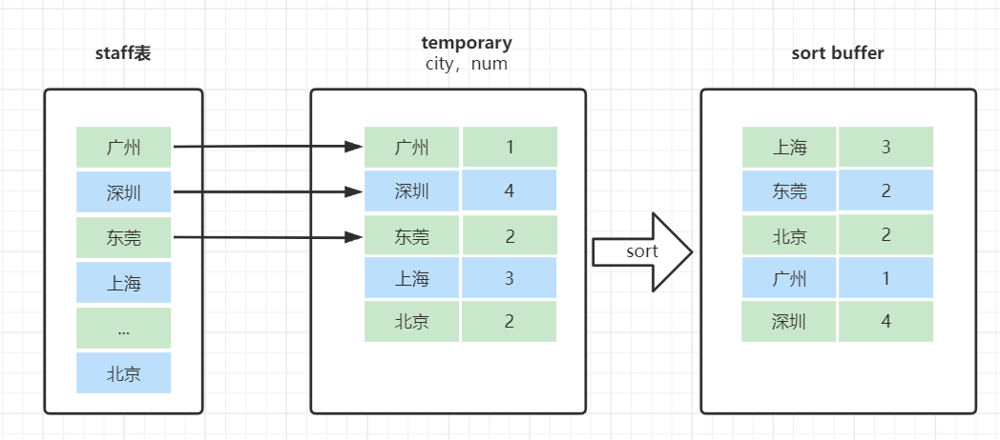

临时表的排序是怎样的呢？

就是把需要排序的字段，放到 sort buffer，排完就返回。在这里注意一点哈，排序分全字段排序和 rowid 排序

- 如果是全字段排序，需要查询返回的字段，都放入 sort buffer，根据排序字段排完，直接返回

- 如果是 rowid 排序，只是需要排序的字段放入 sort buffer，然后多一次回表操作，再返回。


优化方案：

- group by 后面的字段加索引
- order by null 不用排序
- 尽量只使用内存临时表
- 使用 SQL_BIG_RESULT


