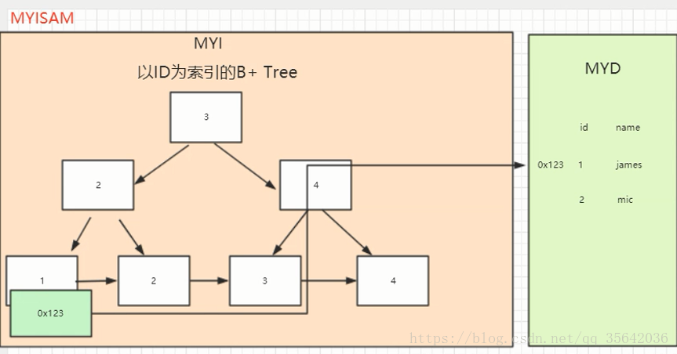
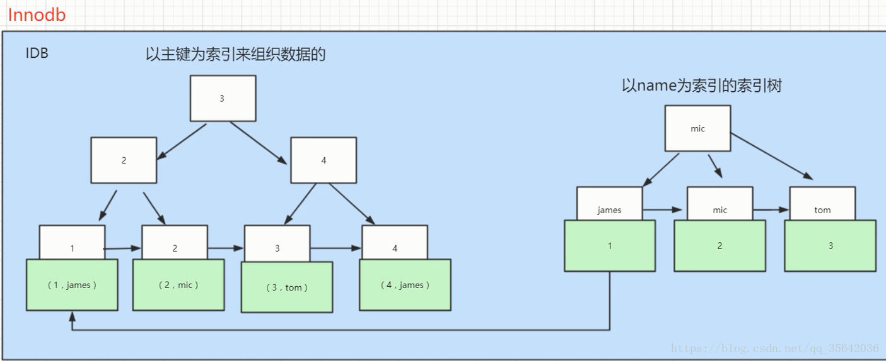
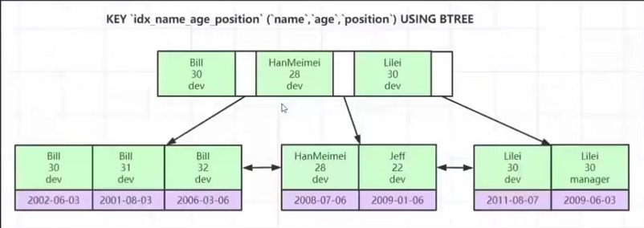

### 聚簇索引和非聚簇索引

Myisam数据文件：frm是表结构文件，myd是数据文件，myi是索引文件
Innodb数据文件： frm是表结构文件，ibd是数据文件
从数据文件就可以看出，myIsam的索引和数据是分开存储的，这种类型的是非聚簇索引(会产生回表)，而Innodb不区分索引和数据就是聚簇索引，但并不是说Innodb表就一定是聚簇索引，是不是聚簇索引在于叶子节点存储的是不是数据。

如何理解呢？Innodb分为主键索引（聚簇索引）和普通索引（非聚簇索引），如果Innodb表是以主键作为索引，则叶子节点上存储的是数据，索引和数据未分离就是聚簇索引；如果是以某个字段（比如name）为索引，则非叶子节点存储的就是name的分词，叶子节点上存储的是分词+主键ID，这就需要先根据分词查找到主键id后再根据主键ID去主键索引查询一遍，即非聚簇索引，也就是产生回表现象的原因。





**聚簇索引和非聚簇索引区别**


> 1. 聚簇索引的叶子节点存储的是数据记录，非聚集索引的叶子节点存储的是数据的磁盘地址。
> 2. 一个表只能有一个聚集索引，但可以有多个非聚集索引。
> 3. 聚集索引查询效率高，但插入，删除，更新等效率会比较低。

**Myisam和Innodb区别**

>  1. InnoDB支持事务，MyISAM不支持，对于InnoDB每一条SQL语言都默认封装成事务，自动提交，但这样会影响速度，所以最好把多条SQL语言放在begin和commit之间，组成一个事务。InnoDB支持表、行(默认)级锁，而MyISAM只支持表级锁；
>  2. InnoDB不保存表的总行数，执行select count(\*) from table时需要全表扫描。而MyISAM用一个变量保存了整个表的行数，执行上述语句时速度很快（注意不能加有任何WHERE条件）；
>  3. InnoDB表必须有唯一索引，如主键（用户没有指定的话mysql会自己找/生产一个隐藏列Row_id来充当默认主键），而Myisam可以没有
>

**存储引擎**指的是数据表而不是数据库


### 联合索引及最左原则

联合索引生效的前提是必须匹配最左原则，即查询必须使用联合索引的第一个字段，为什么从第二个字段开始查询联合索引就失效了？因为经过第一个字段生成索引以后节点的排序就已经固定下来了，那么显然第二个字段不是按照特定规律排序的，如果要从第二个字段开始查询就需要全部索引都匹配一遍(全表扫描)，所以索引失效。就比如要查询：

```mysql
select name from table where age=30 and position=dev
```



显然索引中的age字段不是按照顺序排序的，所以需要全部索引都过滤一遍，全表扫描

**联合索引 **示例：

```mysql
#where里面的条件顺序在查询之前会被mysql自动优化，所以使用了索引
select * from mytable where c=4 and b=6 and a=3;

#使用了范围查找索引就会在查询的字段之后失效，a用到了，b也用到了，c没有用到
select * from mytable where a=3 and b>7 and c=3;

#同上，a用到了 b和c都没有使用
select * from mytable where a>4 and b=7 and c=9;

#a用到了索引，b在结果排序中也用到了索引的效果，前面说了，a下面任意一段的b是排好序的
select * from mytable where a=3 order by b;

#a用到了索引，但是c没有发挥排序效果，因为中间断点了，使用 explain 可以看到 filesort
select * from mytable where a=3 order by c;

#b没有用到索引，排序中a也没有发挥索引效果
select * from mytable where b=3 order by a;
```


### 几种Mysql常见的数据结构

> **二叉树**，又叫非平衡二叉树，mysql早期数据结构，在极端情况下可能会退化为链表，增加了查找深度所以不推荐。
> **红黑二叉树**，又叫平衡二叉树，会自动调整节点分配，但如果数据量过大也会增加查找深度，例如500w数据分为20层，万一查询的数据在叶子节点上，则至少需要查询20次，也不推荐。
> **B树（多路查找）**，二叉树一个节点只能存放一个索引信息，为了增加节点的使用效率，可以把节点的存储空间设置的大一点，每个节点存多个索引，可以有效降低树的高度，但B树缺点是数据也会放到节点上，也不能很好地利用节点。
> **B+树**，非叶子节点只存储索引(冗余)信息，数据都存放到叶子节点上。节点默认大小为16kb，一个主键索引以bigint为例占用8b，则每个节点上可以存储1170个节点信息 1170 = 16 * 1024 / (8+6) ，6是链表指针占用的字节
> **B+树**比**B树**还有一种重要的区别就是多了个指针，**B+树**会在叶子节点单独开辟出一块空间存储下个节点的磁盘地址，用于区间快速查询

Myisam和Innodb都属于B+树的一种，区别主要在于Myisam叶子节点存储的是数据的磁盘地址，而Innodb存储的是列数据


**Innodb引擎的4大特性**
插入缓冲（insert buffer),二次写(double write),自适应哈希索引(ahi),预读(read ahead)