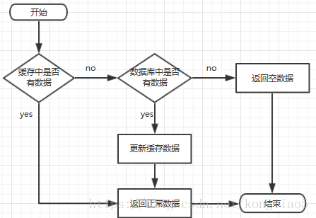

## Redis缓存雪崩、击穿、穿透

### 一、缓存处理流程

> 如图：前台请求，后台先从缓存中取数据，取到直接返回结果，取不到时从数据库中取，数据库取到更新缓存，并返回结果，数据库也没取到，那直接返回空结果。



### 二、缓存穿透

> 缓存穿透是指缓存和数据库中都没有的数据，而用户不断发起请求，如发起为id为“-1”的数据或id为特别大不存在的数据。这时的用户很可能是攻击者，攻击会导致数据库压力过大。

**解决方案：**

- 接口层增加校验，如用户鉴权校验，id做基础校验，id<=0的直接拦截；
- 从缓存取不到的数据，在数据库中也没有取到，这时也可以将key-value对写为key-null，缓存有效时间可以设置短点，如30秒（设置太长会导致正常情况也没法使用）。这样可以防止攻击用户反复用同一个id暴力攻击；
- 可以用布隆过滤器解决。这个也能很好的防止缓存穿透的发生，他的原理也很简单就是利用高效的数据结构和算法快速判断出你这个Key是否在数据库中存在，不存在你return就好了，存在你就去查了DB刷新KV再return。


### 三、缓存击穿

> 缓存击穿是指缓存中没有但数据库中有的数据（一般是缓存时间到期），这时由于并发用户特别多，同时读缓存没读到数据，又同时去数据库去取数据，引起数据库压力瞬间增大，造成过大压力

**解决方案：**

- 设置热点数据永远不过期。
- 加互斥锁。


**参考代码如下：**

```php
<?php
 
namespace App\Lib\Redis;
 
use Predis\ClientInterface;
 
/**
 * redis锁
 * 安全和可靠性保证
    在描述我们的设计之前，我们想先提出三个属性，这三个属性在我们看来，是实现高效分布式锁的基础。
    一致性：互斥，不管任何时候，只有一个客户端能持有同一个锁。
    分区可容忍性：不会死锁，最终一定会得到锁，就算一个持有锁的客户端宕掉或者发生网络分区。
    可用性：只要大多数Redis节点正常工作，客户端应该都能获取和释放锁。
 */
class RedisLock
{
    const LOCK_REDIS_KEY_PREFIX = "LOCK_KEY:";
    /**
     * @var ClientInterface
     */
    private $redis;
 
    /**
     * RedisLock constructor.
     * @param ClientInterface $redis
     */
    public function __construct(ClientInterface $redis)
    {
        $this->redis = $redis;
    }
 
    /**
     * 获得锁
     * @param $key
     * @param $timeout int 超时秒数默认10秒
     * @return bool|int  获得成功锁返回随机value
     */
    public function lock($key, $timeout = 10){
        $myRandomValue = mt_rand();
        $key = self::LOCK_REDIS_KEY_PREFIX.$key;
        if($this->redis->eval("return redis.call('SET', KEYS[1], KEYS[2], 'NX', 'PX', KEYS[3])", 3, $key, $myRandomValue, $timeout*1000)){
            return $myRandomValue;
        }
        return false;
    }
 
    /**
     * 解锁
     * !这里如果锁自动过期不存在了也返回 解锁成功true!
     * @param $key
     * @param $myRandomValue int 解锁随机值
     * @return bool
     */
    public function unLock($key, $myRandomValue){
        $key = self::LOCK_REDIS_KEY_PREFIX.$key;
        if($this->redis->eval("if redis.call('EXISTS',KEYS[1]) == 0 then return 1 else if redis.call('get',KEYS[1]) == ARGV[1] then return redis.call('del',KEYS[1]) else return 0 end end", 1, $key, $myRandomValue)){
            return true;
        }
        return false;
    }
}

	/**
     * 示例
     */
public function GetData($key){
        //从缓存中读取数据
        $result = Redis::get($key);
        if(empty($result)){
            //去获取锁，获取成功，去数据库取数据
            if(RedisLock::lock()){
                //从数据库取数据
                $result = Dd::find($key);
                //更新缓存
                if(!empty($result)){
                    Redis::set($key, $result);
                }
                //释放锁
                RedisLock::unlock();
            }
        }else{//获取锁失败
            //暂停100ms再重新去获取数据
            sleep(100);
            $result = $this->GetData();
        }
    }
```

**说明：**

1. 缓存中有数据，直接走上述代码68行后就返回结果了
2. 缓存中没有数据，第1个进入的线程，获取锁并从数据库去取数据，没释放锁之前，其他并行进入的线程会等待100ms，再重新去缓存取数据。这样就防止都去数据库重复取数据，重复往缓存中更新数据情况出现。
3. 当然这是简化处理，理论上如果能根据key值加锁就更好了，就是线程A从数据库取key1的数据并不妨碍线程B取key2的数据，上面代码明显做不到这点。


### 四、缓存雪崩

> 缓存雪崩是指缓存中数据大批量到过期时间，而查询数据量巨大，引起数据库压力过大甚至down机。和缓存击穿不同的是，缓存击穿指并发查同一条数据，缓存雪崩是不同数据都过期了，很多数据都查不到从而查数据库。

 **解决方案：**

- 缓存数据的过期时间设置随机，防止同一时间大量数据过期现象发生。

  ```php
  setRedis（Key，value，time + Math.random() * 10000）;
  ```

- 如果缓存数据库是分布式部署，将热点数据均匀分布在不同搞得缓存数据库中。

- 设置热点数据永远不过期。


## Redis基础问题

#### 为什么用Redis？

> 传统的关系型数据库如Mysql已经不能适用所有场景了，比如秒杀的库存扣减、APP首页的访问、流量高峰等等，很容易把数据库打崩，所以引入了缓存中间件，目前市面上比较常用的缓存中间件有Redis 和 Memcached， 不过综合考虑了他们的优缺点，最后选择了Redis。
>
> 查阅Redis 和 Memcached 的区别，比如两者的优缺点对比和各自的场景。


#### Redis有哪些数据结构？

> 字符串String、字典Hash、列表List、集合Set、有序集合SortedSet。可以适当提一下BloomFilter（布隆过滤器），这个使用场景多，而且用起来是真的香，原理也好理解。


#### 如果有大量的key需要设置同一时间过期，一般需要注意什么？

> 如果大量的key过期时间设置的过于集中，到过期的那个时间点，redis可能会出现短暂的卡顿现象。严重的话会出现缓存雪崩，我们一般需要在时间上加一个随机值，使得过期时间分散一些。
>
> 电商首页经常会使用定时任务刷新缓存，可能大量的数据失效时间都十分集中，如果失效时间一样，又刚好在失效的时间点大量用户涌入，就有可能造成缓存雪崩。


#### 那你使用过Redis分布式锁么，它是什么回事？

> 先拿setnx来争抢锁，抢到之后，再用expire给锁加一个过期时间防止锁忘记了释放。


#### 如果在setnx之后执行expire之前进程意外crash或者要重启维护了，那会怎么样？

> set指令有非常复杂的参数，这个应该是可以同时把setnx和expire合成一条指令来用的。


#### 假如Redis里面有1亿个key，其中有10w个key是以某个固定的已知的前缀开头的，如何将它们全部找出来？

> 使用keys指令可以扫出指定模式的key列表。


#### 如果这个redis正在给线上的业务提供服务，那使用keys指令会有什么问题？

> 要回答redis关键的一个特性：redis的单线程的。keys指令会导致线程阻塞一段时间，线上服务会停顿，直到指令执行完毕，服务才能恢复。这个时候可以使用scan指令，scan指令可以无阻塞的提取出指定模式的key列表，但是会有一定的重复概率，在客户端做一次去重就可以了，但是整体所花费的时间会比直接用keys指令长。

> 不过，增量式迭代命令也不是没有缺点的： 举个例子， 使用 SMEMBERS 命令可以返回集合键当前包含的所有元素， 但是对于 SCAN 这类增量式迭代命令来说， 因为在对键进行增量式迭代的过程中， 键可能会被修改， 所以增量式迭代命令只能对被返回的元素提供有限的保证 。


#### 使用过Redis做异步队列么，你是怎么用的？

> 一般使用list结构作为队列，rpush生产消息，lpop消费消息。当lpop没有消息的时候，要适当sleep一会再重试。


#### 如果对方追问可不可以不用sleep呢？

> list还有个指令叫blpop，在没有消息的时候，它会阻塞住直到消息到来。


#### 如果对方接着追问能不能生产一次消费多次呢？

> 使用pub/sub主题订阅者模式，可以实现 1:N 的消息队列。


#### 如果对方继续追问 pub/sub有什么缺点？

> 在消费者下线的情况下，生产的消息会丢失，得使用专业的消息队列如RocketMQ等。


#### Redis如何实现延时队列？

> 使用sortedset，拿时间戳作为score，消息内容作为key调用zadd来生产消息，消费者用zrangebyscore指令获取N秒之前的数据轮询进行处理。


#### Redis是怎么持久化的？服务主从数据怎么交互的？

> RDB做镜像全量持久化，AOF做增量持久化。因为RDB会耗费较长时间，不够实时，在停机的时候会导致大量丢失数据，所以需要AOF来配合使用。在redis实例重启时，会使用RDB持久化文件重新构建内存，再使用AOF重放近期的操作指令来实现完整恢复重启之前的状态。

> 这里很好理解，把RDB理解为一整个表全量的数据，AOF理解为每次操作的日志就好了，服务器重启的时候先把表的数据全部搞进去，但是他可能不完整，你再回放一下日志，数据不就完整了嘛。不过Redis本身的机制是 AOF持久化开启且存在AOF文件时，优先加载AOF文件；AOF关闭或者AOF文件不存在时，加载RDB文件；加载AOF/RDB文件城后，Redis启动成功； AOF/RDB文件存在错误时，Redis启动失败并打印错误信息


#### 如果突然机器掉电会怎样？

> 取决于AOF日志sync属性的配置，如果不要求性能，在每条写指令时都sync一下磁盘，就不会丢失数据。但是在高性能的要求下每次都sync是不现实的，一般都使用定时sync，比如1s1次，这个时候最多就会丢失1s的数据。


#### RDB的原理是什么？

> 你给出两个词汇就可以了，fork和cow。fork是指redis通过创建子进程来进行RDB操作，cow指的是copy on write，子进程创建后，父子进程共享数据段，父进程继续提供读写服务，写脏的页面数据会逐渐和子进程分离开来。


#### Pipeline有什么好处，为什么要用pipeline？

> 可以将多次IO往返的时间缩减为一次，前提是pipeline执行的指令之间没有因果相关性。使用redis-benchmark进行压测的时候可以发现影响redis的QPS峰值的一个重要因素是pipeline批次指令的数目。


#### Redis的同步机制了解么？

> Redis可以使用主从同步，从从同步。第一次同步时，主节点做一次bgsave，并同时将后续修改操作记录到内存buffer，待完成后将RDB文件全量同步到复制节点，复制节点接受完成后将RDB镜像加载到内存。加载完成后，再通知主节点将期间修改的操作记录同步到复制节点进行重放就完成了同步过程。后续的增量数据通过AOF日志同步即可，有点类似数据库的binlog。