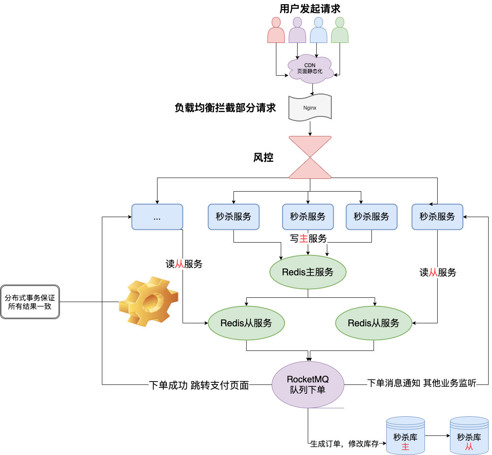

# 如何设计秒杀系统？

#### 基本概念

> **QPS**（每秒请求数）

#### 场景

> 假如要卖100件纸尿裤，根据以往的秒杀活动的数据经验来看，目测来抢这100件纸尿裤的人足足有10万人。

#### 可能会遇到的问题

> - 高并发，时间极短、 瞬间用户量大。缓存雪崩，缓存击穿**，**缓存穿透这些提到的点都是有可能发生的；
> - 超卖，库存变成负数；
> - 恶意请求，羊毛党刷单；
> - 商品链接暴露，伪造url；
> - 数据库一旦因为秒杀出现问题，会影响到其他服务；

#### 对症下药

##### 服务单一职责
> 设计个能抗住高并发的系统还得是单一职责。大家都知道现在设计都是微服务的设计思想，然后再用分布式的部署方式。
>
> 现在的互联网架构部署都是分库的，秒杀我们也给他建立自己的秒杀库。
>
> 单一职责的好处就是就算秒杀没抗住，秒杀库崩了，服务挂了，也不会影响到其他的服务。（强行高可用）

##### 秒杀链接加盐

> 商品链接如果提前暴露出去可能有人直接访问url就提前秒杀了，所以可以把URL动态化，比如生成短链接，通过MD5之类的加密算法加密随机的字符串去做url，然后通过前端代码获取url后台校验才能通过。

##### 资源静态化

> 使用cdn

##### 限流

> **前端限流**：秒杀前一般按钮都是置灰的，只有时间到了，才能点击。这是因为怕用户在时间快到的最后几秒秒疯狂请求服务器，然后还没到秒杀的时候基本上服务器就挂了。这个时候就需要前端的配合，定时去请求后端服务器，获取最新的时间，到时间点再给按钮可用状态。按钮可以点击之后也需要置灰几秒，不然用户一样会在开始之后一直点击。
>
> **后端限流**：秒杀的时候肯定是涉及到后续的订单生成和支付等操作，但是都只是成功的幸运儿才会走到那一步，那一旦100个产品卖光了，return了一个false，前端直接秒杀结束，然后后端也关闭后续无效的请求。
>
> 我们卖1000件商品，请求有10W，我们不需要把十万都放进来，可以放1W请求进来，然后再进行操作，因为秒杀对于用户本身就是黑盒的，所以怎么做的他们是没感知的，当然可能会丢掉一些户，这个就需要风控阶段进行处理。

##### Nginx负载均衡

> **高性能的web服务器**，并发百万不是梦。也能在这一步屏蔽**恶意请求**。

##### Redis集群

> **主从同步**、**读写分离**，再加上**哨兵**，开启**持久化**直接无敌高可用！

##### 风控(涉及到这个小公司肯定是没有的)

> 前面的所有措施还是拦不住很多羊毛党，因为他们是专业的团队，他们可以注册很多账号来薅羊毛，而且不用机器请求，就用群控，操作几乎跟真实用户一模一样。那怎么办，是不是无解了？这个时候就需要风控介入了，在请求到达后端之前，风控可以根据账号行为分析出这个账号机器人的概率大不大，有点扯了~

##### 库存预热

> **秒杀的本质，就是对库存的抢夺**，每个秒杀的用户都去数据库查询库存校验库存，然后扣减库存，数据库顶不住啊。可以在开始秒杀前通过定时任务或者运维提前把商品的库存加载到Redis中，让整个流程都在Redis里面去做，然后等秒杀结束了，再异步的去修改库存就好了。
>
> 但是用了Redis就有一个问题了，我们上面说了我们采用**主从**，就是我们会去读取库存然后再判断然后有库存才去减库存，正常情况没问题，但是高并发的情况问题就很大了。就比如现在库存只剩下1个了，4个服务器一起查询了发现都是还有1个，那大家都觉得是自己抢到了，就都去扣库存，那结果就变成了-3，是的只有一个是真的抢到了，别的都是超卖的。
>
> **Lua**脚本是类似Redis事务，有一定的原子性，不会被其他命令插队，可以完成一些Redis事务性的操作。写一个脚本把判断库存扣减库存的操作都写在一个脚本丢给Redis去做，到0了后面的都Return False即可。

##### 分布式事务
> 上面的任何一步都是可能出错的，而且我们是在不同的服务里面出错的，那就涉及分布式事务了，但是分布式事务大家想的是一定要成功什么的那就不对了，还是那句话，几个请求丢了就丢了，要保证时效和服务的可用可靠。

##### 削峰填谷（mq中间件）

> 把请求放入消息队列，然后消费改库存就好了，单个商品一次修改就够了，这里说的是**某个点多个商品**一起秒杀的场景。

#### 总之应对方法无非：限流&降级&熔断&隔离

