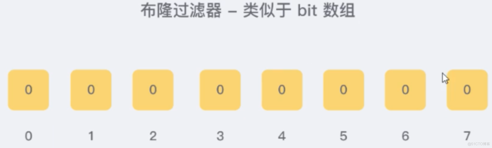
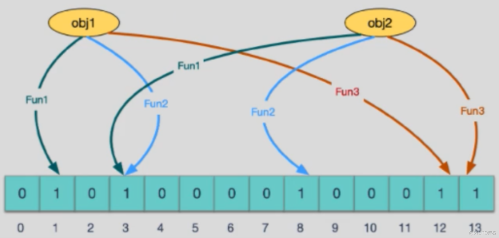
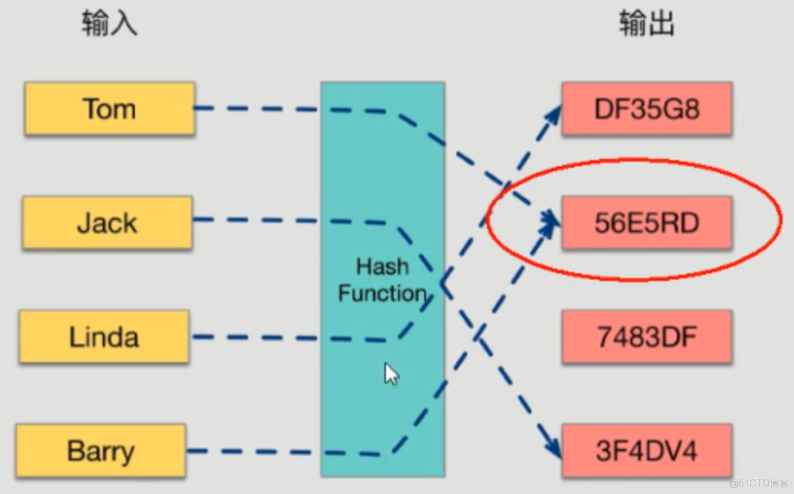
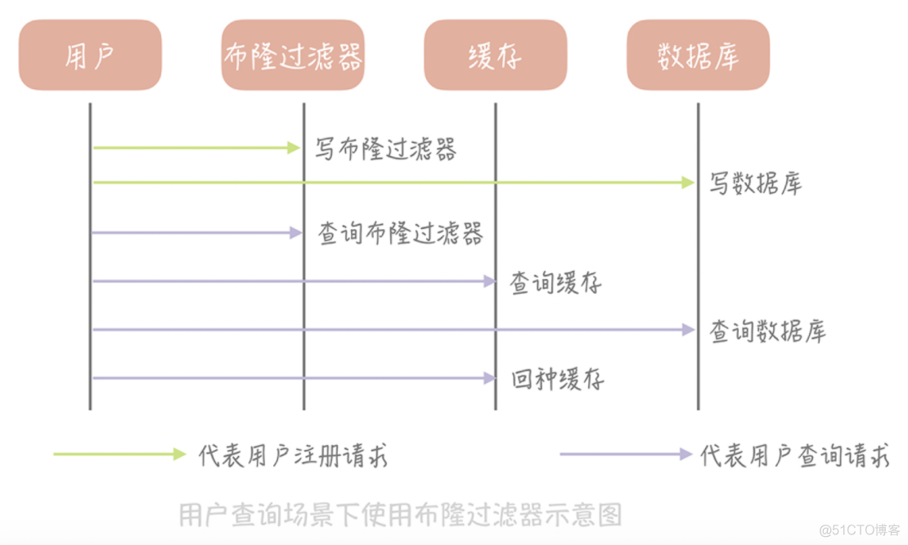

**布隆过滤器的**：用来判断一个元素是否在一个集合中。这种算法由一个二进制数组和一个Hash算法组成。

**特点**

- 高效的插入和查询，占空间少，返回的结果是不确定性的。
- 一个元素如果判断结果为存在的时候元素不一定存在，但是判断结果为不存在的时候则一定不存在。
- 布隆过滤器可以添加元素，但是不能删除元素。因为删掉元素会导致误判率增加。
- 误判只会发生在过滤器没有添加过的元素，对于添加过的元素不会发生误判。


**应用场景**

- 比如有50亿个电话号码，现有10万个电话号码，如何快读准确的判断这些电话号码是否存在于50亿个里？不管是把这个50亿电话号码存在与Mysql里还是内存里也好，它是非常占空间的！并且速度上Mysql也是软肋。

- 解决缓存穿透问题

- 黑名单校验

  

隆过滤器初始化的状态，每个坑位值都默认是0



将对象通过多个hash函数转化成为哈希值或者哈希编码（也叫做列值），然后把对应的坑位值做更改。



为什么说是多个哈希函数呢？如图Tom通过hash处理之后值为56E5RD，同样Barry也一样的值，这样就出现了哈希碰撞 ，如果数据量大了，这种可能性还是比较大的，所以布隆过滤器的处理思想就是使用多个函数处理。




**redis解决缓存穿透**

把已存在的数据key存在布隆过滤器里，相当于redis前面挡着一个布隆过滤器。

当有新的请求时，先到布隆过滤器中查询是否存在。如果布隆过滤器中不存在该条数据则直接返回；如果布隆过滤器中已存在，才会去查询缓存redis，如果redis里没查到则穿透到mysql数据库。这样能极大的避免大量穿透，有极少数的在所难免。




**php+Redis 实现的布隆过滤器**

由于 Redis 实现了 setbit 和 getbit 操作，天然适合实现布隆过滤器，redis 也有布隆过滤器插件。这里使用 php+redis 实现布隆过滤器

```php
class BloomFilterHash
{
    /**
    * 由Justin Sobel编写的按位散列函数
    */
  public function JSHash($string, $len = null)
    {
        $hash = 1315423911;
        $len || $len = strlen($string);
        for ($i = 0; $i < $len; $i++) {
            $hash ^= (($hash << 5) + ord($string[$i]) + ($hash >> 2));
        }
        return ($hash % 0xFFFFFFFF) & 0xFFFFFFFF;
    }

    /**
    * 该哈希算法基于AT＆T贝尔实验室的Peter J. Weinberger的工作。
    * Aho Sethi和Ulman编写的“编译器（原理，技术和工具）”一书建议使用采用此特定算法中的散列方法的散列函数。
    */
  public function PJWHash($string, $len = null)
    {
        $bitsInUnsignedInt = 4 * 8; //（unsigned int）（sizeof（unsigned int）* 8）;
          $threeQuarters = ($bitsInUnsignedInt * 3) / 4;
        $oneEighth = $bitsInUnsignedInt / 8;
        $highBits = 0xFFFFFFFF << (int)($bitsInUnsignedInt - $oneEighth);
        $hash = 0;
        $test = 0;
        $len || $len = strlen($string);
        for ($i = 0; $i < $len; $i++) {
            $hash = ($hash << (int)($oneEighth)) + ord($string[$i]);
        }
        $test = $hash & $highBits;
        if ($test != 0) {
            $hash = (($hash ^ ($test >> (int)($threeQuarters))) & (~$highBits));
        }
        return ($hash % 0xFFFFFFFF) & 0xFFFFFFFF;
    }

    /**
    * 类似于PJW Hash功能，但针对32位处理器进行了调整。它是基于UNIX的系统上的widley使用哈希函数。
    */
  public function ELFHash($string, $len = null)
    {
        $hash = 0;
        $len || $len = strlen($string);
        for ($i = 0; $i < $len; $i++) {
            $hash = ($hash << 4) + ord($string[$i]);
            $x = $hash & 0xF0000000;
            if ($x != 0) {
                $hash ^= ($x >> 24);
            }
            $hash &= ~$x;
        }
        return ($hash % 0xFFFFFFFF) & 0xFFFFFFFF;
    }

    /**
    * 这个哈希函数来自Brian Kernighan和Dennis Ritchie的书“The C Programming Language”。
    * 它是一个简单的哈希函数，使用一组奇怪的可能种子，它们都构成了31 .... 31 ... 31等模式，它似乎与DJB哈希函数非常相似。
    */
  public function BKDRHash($string, $len = null)
    {
        $seed = 131;  # 31 131 1313 13131 131313 etc..
  $hash = 0;
        $len || $len = strlen($string);
        for ($i = 0; $i < $len; $i++) {
            $hash = (int)(($hash * $seed) + ord($string[$i]));
        }
        return ($hash % 0xFFFFFFFF) & 0xFFFFFFFF;
    }

    /**
    * 这是在开源SDBM项目中使用的首选算法。
    * 哈希函数似乎对许多不同的数据集具有良好的总体分布。它似乎适用于数据集中元素的MSB存在高差异的情况。
    */
  public function SDBMHash($string, $len = null)
    {
        $hash = 0;
        $len || $len = strlen($string);
        for ($i = 0; $i < $len; $i++) {
            $hash = (int)(ord($string[$i]) + ($hash << 6) + ($hash << 16) - $hash);
        }
        return ($hash % 0xFFFFFFFF) & 0xFFFFFFFF;
    }

    /**
    * 由Daniel J. Bernstein教授制作的算法，首先在usenet新闻组comp.lang.c上向世界展示。
    * 它是有史以来发布的最有效的哈希函数之一
    */
  public function DJBHash($string, $len = null)
    {
        $hash = 5381;
        $len || $len = strlen($string);
        for ($i = 0; $i < $len; $i++) {
            $hash = (int)(($hash << 5) + $hash) + ord($string[$i]);
        }
        return ($hash % 0xFFFFFFFF) & 0xFFFFFFFF;
    }

    /**
     * Donald E. Knuth在“计算机编程艺术第3卷”中提出的算法，主题是排序和搜索第6.4章。
     */
  public function DEKHash($string, $len = null)
    {
        $len || $len = strlen($string);
        $hash = $len;
        for ($i = 0; $i < $len; $i++) {
            $hash = (($hash << 5) ^ ($hash >> 27)) ^ ord($string[$i]);
        }
        return ($hash % 0xFFFFFFFF) & 0xFFFFFFFF;
    }

    /**
    * 参考 http://www.isthe.com/chongo/tech/comp/fnv/
    */  public function FNVHash($string, $len = null)
    {
        $prime = 16777619; //32位的prime 2^24 + 2^8 + 0x93 = 16777619
  $hash = 2166136261; //32位的offset
  $len || $len = strlen($string);
        for ($i = 0; $i < $len; $i++) {
            $hash = (int)($hash * $prime) % 0xFFFFFFFF;
            $hash ^= ord($string[$i]);
        }
        return ($hash % 0xFFFFFFFF) & 0xFFFFFFFF;
    }
}
```


redis操作

```php
/**
 * 使用redis实现的布隆过滤器
 */
abstract class BloomFilterRedis
{
    /**
     * 需要使用一个方法来定义bucket的名字
     */
    protected $bucket;

    protected $hashFunction;

    public function __construct($config, $id)
    {
        if (!$this->bucket || !$this->hashFunction) {
            throw new Exception("需要定义bucket和hashFunction", 1);
        }
        $this->Hash = new BloomFilterHash;
        $this->Redis = new YourRedis; //假设这里你已经连接好了
    }

    /**
     * 添加到集合中
     */
    public function add($string)
    {
        $pipe = $this->Redis->multi();
        foreach ($this->hashFunction as $function) {
            $hash = $this->Hash->$function($string);
            $pipe->setBit($this->bucket, $hash, 1);
        }
        return $pipe->exec();
    }

    /**
     * 查询是否存在, 存在的一定会存在, 不存在有一定几率会误判
     */
    public function exists($string)
    {
        $pipe = $this->Redis->multi();
        $len = strlen($string);
        foreach ($this->hashFunction as $function) {
            $hash = $this->Hash->$function($string, $len);
            $pipe = $pipe->getBit($this->bucket, $hash);
        }
        $res = $pipe->exec();
        foreach ($res as $bit) {
            if ($bit == 0) {
                return false;
            }
        }
        return true;
    }
}
```

上面定义的是一个抽象类，如果要使用，可以根据具体的业务来使用。比如下面是一个过滤重复内容的过滤器。

```php
/**
 * 重复内容过滤器
 * 该布隆过滤器总位数为2^32位, 判断条数为2^30条. hash函数最优为3个.(能够容忍最多的hash函数个数)
 * 使用的三个hash函数为
 * BKDR, SDBM, JSHash
 *
 * 注意, 在存储的数据量到2^30条时候, 误判率会急剧增加, 因此需要定时判断过滤器中的位为1的的数量是否超过50%, 超过则需要清空.
 */
class FilteRepeatedComments extends BloomFilterRedis
{
    /**
     * 表示判断重复内容的过滤器
     * @var string
     */
    protected $bucket = 'rptc';

    protected $hashFunction = array('BKDRHash', 'SDBMHash', 'JSHash');
}
```


