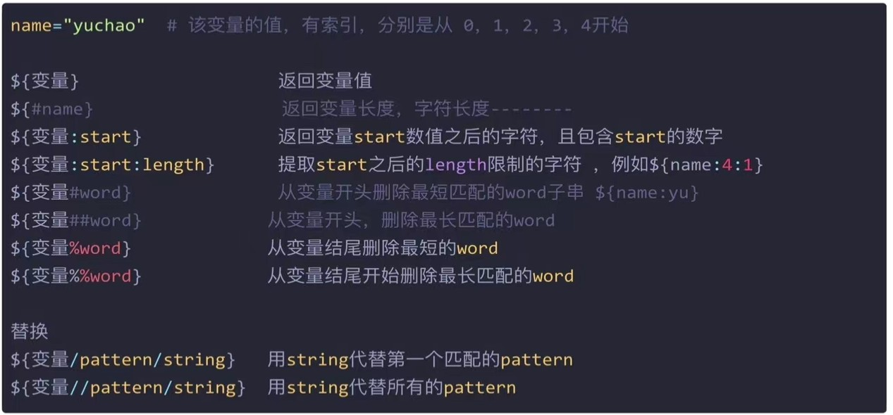

### 基本命令

```bash
#历史命令最多存储多少条
echo $HISTSIZE

#存放用户历史命令文件
echo $HISTFILE

#history命令
-c 清除历史
-r 恢复历史

#反引号中的命令执行结果会被保留下来
name=`ls`
echo name
```


### 脚本变量作用域

1.source和.都是在当前shell加载脚本，因此变量的作用域在当前shell

```bash
#3中运行方式
. my.sh
./my.sh
source my.sh
```

2.bash和sh开启一个子shell，因此不保留定义的变量

```bash
bash my.sh
sh my.sh
```


### 用户配置文件

用户配置文件：~/.bash_profile   远程登录用户配置文件：～/.bashrc

全局配置文件：/etc/profile、/etc/bashrc，自定义的全局配置建议写在/etc/profile.d/目录下，这样不影响其他用户

配置文件加载顺序：/etc/profile->/etc/profile.d/->~/.bash_profile->~/.bashrc->/etc/bashrc


### 变量函数

```bash
#输出当前shell的所有变量，包括全局变量和局部变量（sh脚本文件）
set

#只显示全局变量
env

#显示和设置环境变量
export
#MAC过滤出所有的环境变量
export |awk -F '[ :=]' '{print $1}'

#删除变量
unset

#只读变量
readonly name=''

#Linux运行多条命令用;隔开
```


### 特殊参数变量

```bash
$0 #shell文件名或脚本路径
$n #获取第n个参数，如$1,$2,$3……
$# #获取参数的总数
$* #获取所有参数
$@ #获取所有参数
$*和$@的区别就是，当他俩不被双引号包裹时没有区别，如果被包裹，则：
$*输出一个整体：
"yu chao 180 180 180"
$@输出各个分段：
"yu" 
"chao" 
"180" 
"180" 
"180"
```


### 特殊状态变量

``` bash
$? #上一次命令的返回值，0正确 非0失败
$$ #当前shell的进程号
$! #上一次后台进程的pid
$_ #上一次命令的最后一个参数
```


### 基础内置命令

```bash
echo #输出命令
-n #不换行输出
-e #解析字符串中的特殊符号
\n #换行
\r #回车
\t #制表符 四个空格
\b #退格

eval #执行多个命令
exec #不创建子进程执行后续命令，执行完毕后，自动exit 
export
read
shift 
```


### 字符串截取




### 查看shell父子层级

```bash
pstree

ps -ef --forest
```


### ()可以开启子进程运行命令
