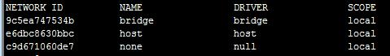

># Docker基础命令学习及redis集群搭建  

本堂课内容
```
1、了解docker、docker命令简单理解，快速利用docker创建一个redis服务容器
2、docker容器的导入导出
3、dockerfile指令学习
4、docker主从快速配置
```

> ## 一、Docker 入门  

>#### Docker是什么？

Docker 是一个开源的应用容器引擎，你可以将其理解为一个轻量级的虚拟机，开发者可以打包他们的应用以及依赖包到一个可移植的容器中，然后发布到任何流行的 Linux 机器上。

>####  <font face="微软雅黑"  color = #42A5F5 >为什么要使用 Docker？</font>

作为一种新兴的虚拟化方式，Docker 跟传统的虚拟化方式相比具有众多的优势。

>####  <font face="微软雅黑"  color = #42A5F5 > 更高效的利用系统资源</font>   

``` 
由于容器不需要进行硬件虚拟以及运行完整操作系统等额外开销，Docker 对系统资源的利用率更高。  

无论是应用执行速度、内存损耗或者文件存储速度，都要比传统虚拟机技术更高效。因此，相比虚拟机技术，一个相同配置的主机，往往可以运行更多数量的应用。
```
>####  <font face="微软雅黑"  color = #42A5F5 > 更快速的启动时间 </font>


传统的虚拟机技术启动应用服务往往需要数分钟，而 Docker 容器应用，由于直接运行于宿主内核，无需启动完整的操作系统，因此可以做到秒级、甚至毫秒级的启动时间。大大的节约了开发、测试、部署的时间。  

>####  <font face="微软雅黑"  color = #42A5F5 >一致的运行环境 </font>  

开发过程中一个常见的问题是环境一致性问题。由于开发环境、测试环境、生产环境不一致，导致有些 bug 并未在开发过程中被发现。而 ```Docker``` 的镜像提供了除内核外完整的运行时环境，确保了应用运行环境一致性，从而不会再出现 「这段代码在我机器上没问题啊」 这类问题。

>####  <font face="微软雅黑"  color = #42A5F5 > 持续交付和部署 </font>  

对开发和运维（DevOps）人员来说，最希望的就是一次创建或配置，可以在任意地方正常运行。

使用 Docker 可以通过定制应用镜像来实现持续集成、持续交付、部署。开发人员可以通过 ```Dockerfile``` 来进行镜像构建，并结合持续集成(Continuous Integration) 系统进行集成测试，而运维人员则可以直接在生产环境中快速部署该镜像，甚至结合 持续部署(Continuous Delivery/Deployment) 系统进行自动部署。

而且使用 ```Dockerfile``` 使镜像构建透明化，不仅仅开发团队可以理解应用运行环境，也方便运维团队理解应用运行所需条件，帮助更好的生产环境中部署该镜像。


>####  <font face="微软雅黑"  color = #42A5F5 > 更轻松的迁移 </font>   

由于 Docker 确保了执行环境的一致性，使得应用的迁移更加容易。Docker 可以在很多平台上运行，无论是物理机、虚拟机、公有云、私有云，甚至是笔记本，其运行结果是一致的。因此用户可以很轻易的将在一个平台上运行的应用，迁移到另一个平台上，而不用担心运行环境的变化导致应用无法正常运行的情况。

>####  <font face="微软雅黑"  color = #42A5F5 >  更轻松的维护和扩展 </font>  

Docker 使用的分层存储以及镜像的技术，使得应用重复部分的复用更为容易，也使得应用的维护更新更加简单，基于基础镜像进一步扩展镜像也变得非常简单。此外，Docker 团队同各个开源项目团队一起维护了一大批高质量的 官方镜像，既可以直接在生产环境使用，又可以作为基础进一步定制，大大的降低了应用服务的镜像制作成本。

>####  <font face="微软雅黑"  color = #42A5F5 >  对比传统虚拟机总结 </font>  


>#### Docker 的主要用途，目前有三大类。

```
（1）提供一次性的环境。比如，本地测试他人的软件、持续集成的时候提供单元测试和构建的环境。
（2）提供弹性的云服务。因为 Docker 容器可以随开随关，很适合动态扩容和缩容。
（3）组建微服务架构。通过多个容器，一台机器可以跑多个服务，因此在本机就可以模拟出微服务架构。
```
 
>####  <font face="微软雅黑"  color = #42A5F5 > 1.1 Centos 安装docker </font>
 
```
1、更新update到最新的版本  
	yum  update
2、卸载老版本docker
	yum  remove docker  docker-common docker-selinux  docker-engine
3、安装需要的软件包
	yum install -y yum-utils  device-mapper-persistent-data lvm2
4、设置yum源
	yum-config-manager --add-repo https://download.docker.com/linux/centos/docker-ce.repo
5、查看docker版本
	yum list docker-ce --showduplicates|sort -r  

6、安装docker
	yum  install  docker-ce-18.03.1.ce -y
7、启动docker
	systemctl start docker
8、加入开机自启
	systemctl enable docker

9、配置国内镜像

	vi /etc/docker/daemon.json 
	{
		"registry-mirrors": ["http://hub-mirror.c.163.com"]
	}
```

>####  <font face="微软雅黑"  color = #42A5F5 > 1.2 docker基本概念 </font>  

```
Docker 包括三个基本概念:
镜像（Image）
容器（Container）
仓库（Repository）
```
>#####  <font face="微软雅黑"  color = #42A5F5 > Docker 镜像就是一个只读的模板。</font>    

例如：一个镜像可以包含一个完整的 ubuntu 操作系统环境，里面仅安装了 Apache 或用户需要的其它应用程序。

镜像可以用来创建 Docker 容器。  

Docker 提供了一个很简单的机制来创建镜像或者更新现有的镜像，用户甚至可以直接从其他人那里下载一个已经做好的镜像来直接使用。

>#####  <font face="微软雅黑"  color = #42A5F5 >  Docker 容器</font>    
#####  
>Docker 利用容器来运行应用。  

容器是从镜像创建的运行实例。它可以被启动、开始、停止、删除。每个容器都是相互隔离的、保证安全的平台。  

可以把容器看做是一个简易版的 Linux 环境（包括root用户权限、进程空间、用户空间和网络空间等）和运行在其中的应用程序。

>Docker 仓库  

仓库是集中存放镜像文件的场所。有时候会把仓库和仓库注册服务器（Registry）混为一谈，并不严格区分。实际上，仓库注册服务器上往往存放着多个仓库，每个仓库中又包含了多个镜像，每个镜像有不同的标签（tag）。  

仓库分为公开仓库（Public）和私有仓库（Private）两种形式。  
 
最大的公开仓库是 Docker Hub，存放了数量庞大的镜像供用户下载。  

>####  <font face="微软雅黑"  color = #42A5F5 > 1.3 快速入门 </font> 

利用docker快速安装一个redis镜像，了解dockerFile指令

Dockerfile 是一个文本文件，其内包含了一条条的指令(Instruction)，每一条指令构建一层，因此每一条指令的内容，就是描述该层应当如何构建。
具体的我们查看给大家的pdf的书籍，命令都是简单的，我们会慢慢的去学习


>Docker常用指令   
 
```
1.启动
 docker start 容器名
2.删除
   docker rm 容器名
3.停止所容器
  docker stop  $(docker ps -a -q)
  docker rm  $(docker ps -a -q) 
 
4.docker build -t 名称 .
  Usage：docker build [OPTIONS] PATH | URL | -

  OPTIONS：
  -t ，--tag list  #构建后的镜像名称
  -f， --file string #指定Dockerfiile文件位置
	示例：
	 1，docker build . 
	 2，docker build -t redis:v1 .
	 3，docker build -t redis:v2 -f /path/Dockerfile /path

一般常用第2种方式构建，我们在构建时都会切换到Dockerfile文件的目录下进行构建，所以不需要指定-f参
5.进入容器
	
```

>Dockerfile快速入门指令   
 
```
  1.FROM 指定基础镜像
  
    所谓定制镜像，那一定是以一个镜像为基础，在其上进行定制。就像我们之前运行了一个redis镜像的容器，再进行修改一样，基础镜像是必须指定的。而 FROM 就是指定基础镜像，因此一个  Dockerfile  中  FROM  是必备的指令，并且必须是第一条指令。
	在 Docker Store 上有非常多的高质量的官方镜像，有可以直接拿来使用的服务类的镜像，如nginx  、 redis  、 mongo  、 mysql  、 httpd  、 php  、 tomcat  等；如果没有找到对应服务的镜像，官方镜像中还提供了一些更为基础的操作系统镜像，
    如ubuntu  、 debian  、 centos、 alpine 等这些操作系统的软件库
  
  2、RUN 执行命令
     
	RUN  指令是用来执行命令行命令的。
	格式：
	  RUN \<command\> (类似/bin/sh -cshell格式)
	  
	  RUN ["executable", "param1", "param2"] (exec格式)

	类似shell脚本风格的：
	    FROM alpine
        RUN sed -i 's/dl-cdn.alpinelinux.org/mirrors.aliyun.com/g' /etc/apk/repositories
		RUN apk add  gcc g++ libc-dev  wget vim  openssl-dev make  linux-headers 
		RUN mkdir -p /usr/src/redis
		RUN cd /usr/src/redis
		RUN wget -O redis-4.0.11.tar.gz  "http://download.redis.io/releases/redis-4.0.11.tar.gz"
		RUN tar -xzf redis-4.0.11.tar.gz -C /usr/src/redis
		RUN cd /usr/src/redis/redis-4.0.11 &&  make && make PREFIX=/usr/local/redis install
	之前说过，Dockerfile 中每一个指令都会建立一层， RUN  也不例外。每一个  RUN  的行为，就和刚才我们手工建立镜像的过程一样：新建立一层，在其上执行这些命令，执行结束后， commit这一层的修改，构成新的镜像。使用 Dockerfile 定制镜像
    而上面的这种写法，创建了很多层镜像。这是完全没有意义的，而且很多运行时不需要的东西，都被装进了镜像里，比如编译环境、更新的软件包等等。结果就是产生非常臃肿、非常多层的镜像，不仅仅增加了构建部署的时间，也很容易出错。 这是很多初学
	Docker 的人常犯的一个错误。Union FS是有最大层数限制的，比如 AUFS，曾经是最大不得超过 42 层，现在是不得超过 127 层。
	  
```


## 二、Docker容器的迁移处理

&ensp; &ensp; 在业务的开发过程当中我们会面临，多个不同的系统或平台的环境统一的问题，比如本地开发的环境需要迁移到服务器，docker的强大之处也在这里，可以做到很方便的处理
	
#### <font   color = #42A5F5 >2.1、导出镜像</font>
```	
    导出容器可以导出一个已经创建的容器到一个文件，不管容器处于什么状态，可以使用docker export 命令。
	
	命令格式为：docker export [-o|--output[=""]] CONTATINER
	
	其中可以通过-o来指定导出的tar文件名，也可以直接通过重定向来实现。
	
	
```
&ensp;&ensp;另一种格式为：docker export 容器id/name >文件名.tar

#### <font   color = #42A5F5 >2.2、导入容器</font>
```	
   导入的文件可以使用docker import 命令导入变成镜像，该命令的格式为：
   
   docker import [-c|--change[=[]]] [-m|--message[=MESSAGE]] file|URL|-[REPOSITORY[:YAG]]
   
   其中-c 选项可以在导入的同时执行对容器进行修改的Dockerfile指令（网络等修改）
  
```

另外 docker save&load 命令也可以导入一个镜像存储文件，但是跟docker import 命令是有区别的

####  <font   color = #42A5F5 > 2.用export&import 还是 save & load ？</font>
export&import 和 save & load 是docker中的两组命令，我们先主要看看他们的区别：

类型  |导出的对象|导出文件大小|是否可回滚到历史层
------------ | ------------- | ------------ | ------------|
export & import | 将容器导出  | 大 | 是 |
save & load     | 用来将一个或者多个image打包  |小 |否

```
  相对于文件大小来说，save方式导出的文件比export方式导出的文件大
  正是因为save方式保存了镜像的历史和层(layer)，使其可以层回滚，即回滚到之前的历史层，所以save方式导出的文件稍微大一些
  反观export方式，在导出过程中丢失所有的历史，导致其不可以层回滚，导出的文件会小一些
  可以通过 docker history 镜像名 看到层关系
```

#### 注意事项
	 如果容器运行就退出，并且无报错
	  1、docker容器必须有一个前台进程，如果没有，容器会被认为空闲，自动退出
	  2、top、tail、脚本挂起到前台
	  
## 三、Redis主从集群规划  

>####  <font face="微软雅黑"  color = #42A5F5 > 3.1 集群节点规划 </font>  
     

容器名称	 | 容器IP地址 | 映射端口号 | 宿主机IP地址	 |  服务运行模式  
------ | ------- | ------ | ------ | ------
Redis-master | 192.168.1.2 | 6380 -> 6379 | 172.16.188.78 | Master
Redis-slave | 192.168.1.3 | 6381 -> 6379 | 172.16.188.78 | Slave

>####  <font face="微软雅黑"  color = #42A5F5 > 3.2、容器网络 </font>  

Docker安装后，默认会创建下面三种网络类型 

```docker network ls```  查看默认的网络  



在启动容器时使用  ```--network bridge``` 指定网络类型

>bridge：桥接网络

默认情况下启动的Docker容器，都是使用 bridge，Docker安装时创建的桥接网络，每次Docker容器重启时，会按照顺序获取对应的IP地址，这个就导致重启下，Docker的IP地址就变了

none：无指定网络
使用 ```--network=none ，docker``` 容器就不会分配局域网的IP

host： 主机网络
使用 --network=host，此时，Docker 容器的网络会附属在主机上，两者是互通的。
例如，在容器中运行一个Web服务，监听8080端口，则主机的8080端口就会自动映射到容器中

>####  <font face="微软雅黑"  color = #42A5F5 >3.3、 指定自定义网络</font>  

因为默认的网络不能制定固定的地址，所以我们将创建自定义网络，并指定网段：192.168.1.0/24 并命名为mynetwork，指令

如下：  
```docker network create  --subnet=192.168.1.0/24  mynetwork```
  	
   
>####  <font face="微软雅黑"  color = #42A5F5 >3.4、创建dockerfile</font>  
 
 具体看发放给大家的文件  

>####  <font face="微软雅黑"  color = #42A5F5 > 3.5、 在dockerfile目录 执行下面代码，注意后面上下文点号</font>  

```docker build -t redis-test .```  
创建完成后可以docker image查看生成的镜像  

>####  <font face="微软雅黑"  color = #42A5F5 > 3.6、接下来使用此docker镜像 创建容器</font>  
  
代码如下：  

```
docker run -itd --name  redis-master  --net mynetwork  -p 6380:6379  --ip 192.168.1.2  redis 
```
>参数说明：
   具体可以参看一些文档  
http://www.runoob.com/docker/docker-run-command.html
http://www.dockerinfo.net/docker%E5%AE%B9%E5%99%A8-2  

```
-d:     后台运行容器，并返回容器ID；  
-i:     以交互模式运行容器，通常与 -t 同时使用；
-p:     端口映射，格式为：主机(宿主)端口:容器端口
-t:     为容器重新分配一个伪输入终端，通常与 -i 同时使用；
-V:     为容器挂载目录，比如 /usr/docker/data:/data 前者为数宿主机目录后者为容器内目录
--ip:   为容器制定一个固定的ip 
--net:  指定网络模式

这样，我们创建了2个容器，来一起查看下结果
   docker ps -a 
   
查看容器ip地址
docker network inspect mynetwork
  ```
>####  <font face="微软雅黑"  color = #42A5F5 > 3.7 、配置主从机器</font>  

```
通过docker命令分别运行redis容器

docker run -it  --name  redis-master  --net mynetwork  -p 6380:6379  --ip 192.168.1.2  redis 

docker run -it  --name  redis-slave  --net mynetwork  -p 6380:6379   --ip 192.168.1.2  redis 
``` 
>####  <font face="微软雅黑"  color = #42A5F5 > 3.8、进入容器 </font>
  
  docker exec  -it  redis-master     bash
