># redis主从复制   


>##  <font face="微软雅黑"  color = #42A5F5 > 一、主从复制说明 </font>  

>####  <font face="微软雅黑"  color = #42A5F5 > 1.1、面临问题 </font>  

在实际的场景当中单一节点的redis容易面临风险。

比如：  

- 机器故障。我们部署到一台 Redis 服务器，当发生机器故障时，需要迁移到另外一台服务器并且要保证数据是同步的。而数据是最重要的，如果你不在乎，基本上也就不会使用 Redis 了。  

- 容量瓶颈。当我们有需求需要扩容 Redis 内存时，从 16G 的内存升到 64G，单机肯定是满足不了。当然，你可以重新买个 128G 的新机器。  

要实现分布式数据库的更大的存储容量和承受高并发访问量，我们会将原来集中式数据库的数据分别存储到其他多个网络节点上。  
  
Redis 为了解决这个单一节点的问题，也会把数据复制多个副本部署到其他节点上进行复制，实现 Redis的高可用，实现对数据的冗余备份，从而保证数据和服务的高可用。

>####  <font face="微软雅黑"  color = #42A5F5 >1.2 什么是主从复制 </font>  

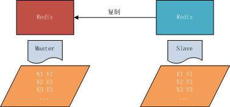

主从复制，是指将一台Redis服务器的数据，复制到其他的Redis服务器。前者称为主节点(master)，后者称为从节点(slave),数据的复制是单向的，只能由主节点到从节点。

默认情况下，每台Redis服务器都是主节点，且一个主节点可以有多个从节点(或没有从节点)，但一个从节点只能有一个主节点。

>##  <font face="微软雅黑"  color = #42A5F5 >二、主从复制的作用 </font>  

主从复制的作用主要包括：
```
1、数据冗余：主从复制实现了数据的热备份，是持久化之外的一种数据冗余方式。

2、故障恢复：当主节点出现问题时，可以由从节点提供服务，实现快速的故障恢复；实际上是一种服务的冗余。

3、负载均衡：在主从复制的基础上，配合读写分离，可以由主节点提供写服务，由从节点提供读服务（即写Redis数据时应用连接主节点，读Redis数据时应用连接从节点）
分担服务器负载；尤其是在写少读多的场景下，通过多个从节点分担读负载，可以大大提高Redis服务器的并发量。

4、读写分离：可以用于实现读写分离，主库写、从库读，读写分离不仅可以提高服务器的负载能力，同时可根据需求的变化，改变从库的数量；

5、高可用基石：除了上述作用以外，主从复制还是哨兵和集群能够实施的基础，因此说主从复制是Redis高可用的基础。
```

>##  <font face="微软雅黑"  color = #42A5F5 > 三、主从复制启用 </font>  

从节点开启主从复制，有3种方式：  
```
（1）配置文件
	在从服务器的配置文件中加入：slaveof <masterip> <masterport>
（2）启动命令
	redis-server启动命令后加入 --slaveof <masterip> <masterport>
（3）客户端命令
	Redis服务器启动后，直接通过客户端执行命令：slaveof <masterip> <masterport>，则该Redis实例成为从节点。
通过  info  replication 命令可以看到复制的一些参数信息
```  

修改配置，把redis保护模式关掉了  
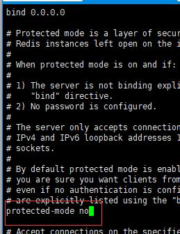

>#### <font face="微软雅黑"  color = #42A5F5 > 3.1、主从复制原理 </font> 

主从复制的原理以及过程必须要掌握，这样我们才知道为什么会出现这些问题

主从复制过程大体可以分为3个阶段：连接建立阶段（即准备阶段）、数据同步阶段、命令传播阶段。

在从节点执行 slaveof 命令后，复制过程便开始运作，下面图示大概可以看到，
从图中可以看出复制过程大致分为6个过程  
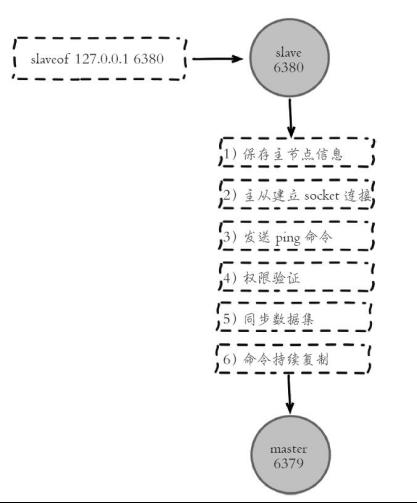


主从配置之后的日志记录也可以看出这个流程

1）保存主节点（master）信息。
执行 slaveof 后 Redis 会打印如下日志：  

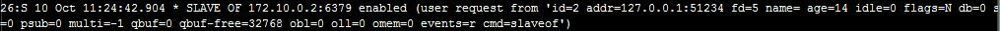
2）从节点（slave）内部通过每秒运行的定时任务维护复制相关逻辑，当定时任务发现存在新的主节点后，会尝试与该节点建立网络连接  

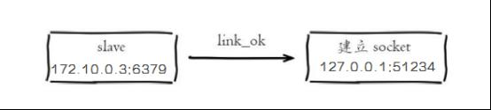

从节点与主节点建立网络连接

从节点会建立一个 socket 套接字，从节点建立了一个端口为```51234```的套接字，专门用于接受主节点发送的复制命令。从节点连接成功后打印如下日志： 
  
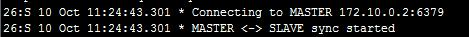

如果从节点无法建立连接，定时任务会无限重试直到连接成功或者执行 ```slaveof no one ```取消复制


关于连接失败，可以在从节点执行 ```info replication``` 查看 ```master_link_down_since_seconds ```指标，它会记录与主节点连接失败的系统时间。从节点连接主节点失败时也会每秒打印如下日志，方便发现问题： 

### Error condition on socket for SYNC: {socket_error_reason}

 3）发送 ping 命令。  
 
连接建立成功后从节点发送 ```ping``` 请求进行首次通信，```ping``` 请求主要目的如下：  
- 检测主从之间网络套接字是否可用。
- 检测主节点当前是否可接受处理命令。  
- 如果发送 ```ping``` 命令后，从节点没有收到主节点的 ```pong``` 回复或者超时，比如网络超时或者主节点正在阻塞无法响应命令，从节点会断开复制连接，下次定时任务会发起重连。  

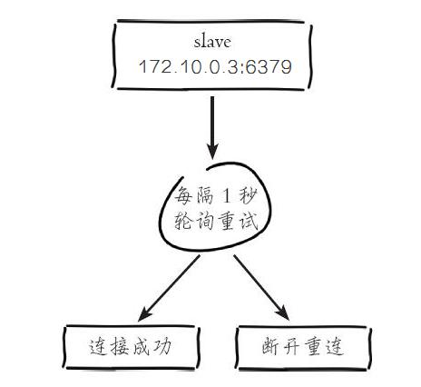   


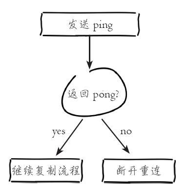  


从节点发送的 ping 命令成功返回，Redis 打印如下日志，并继续后续复制流程：  


4）权限验证。  

如果主节点设置了 ```requirepass``` 参数，则需要密码验证，从节点必须配置 ```masterauth``` 参数保证与主节点相同的密码才能通过验证；如果验证失败复制将终止，从节点重新发起复制流程。


5）同步数据集。  

主从复制连接正常通信后，对于首次建立复制的场景，主节点会把持有的数据全部发送给从节点，这部分操作是耗时最长的步骤。


6）命令持续复制。  

当主节点把当前的数据同步给从节点后，便完成了复制的建立流程。接下来主节点会持续地把写命令发送给从节点，保证主从数据一致性。

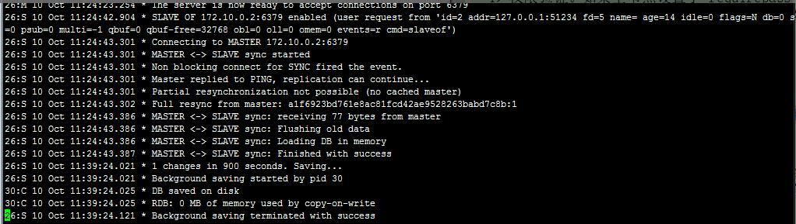  

https://gitbook.cn/gitchat/geekbook/5af939544b544674331bce2e/topic/5afa57ae15da5a21f3419db0

https://juejin.im/entry/5b39c05df265da596e4cf399

>## <font face="微软雅黑"  color = #42A5F5 >四、全量复制和部分复制 </font>  

>#### <font face="微软雅黑"  color = #42A5F5 >4.1相关概念</font>  

##### 全量复制  
用于初次复制或其它无法进行部分复制的情况，将主节点中的所有数据都发送给从节点，是一个非常重型的操作，当数据量较大时，会对主从节点和网络造成很大的开销  

##### 部分复制   
用于处理在主从复制中因网络闪断等原因造成的数据丢失场景，当从节点再次连上主节点后，如果（条件允许)，主节点会补发丢失数据给从节点。  
因为补发的数据远远小于全量数据，可以有效避免全量复制的过高开销，需要注意的是，如果网络中断时间过长，造成主节点没有能够完整地保存中断期间执行的写命令，则无法进行部分复制，仍使用全量复制

##### 复制偏移量  
  参与复制的主从节点都会维护自身复制偏移量。主节点（master）在处理完写入命令后，会把命令的字节长度做累加记录，统计信息在 ```info relication``` 中的 ```master_repl_offset``` 指标中：  
  
127.0.0.1:6379> info replication  


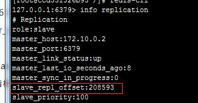

从节点（slave）每秒钟上报自身的复制偏移量给主节点，因此主节点也会保存从节点的复制偏移量，统计指标如下： 
 
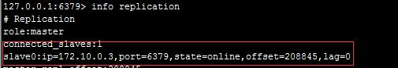
  
从节点在接收到主节点发送的命令后，也会累加记录自身的偏移量。统计信息在 ```info relication``` 中的 ```slave_repl_offset``` 中


#####  复制积压缓冲区  

复制积压缓冲区是保存在主节点上的一个固定长度的队列，默认大小为1MB，当主节点有连接的从节点（slave）时被创建，这时主节点（master）响应写命令时，不但会把命令发送给从节点，还会写入复制积压缓冲区。  

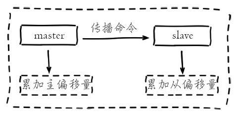


在命令传播阶段，主节点除了将写命令发送给从节点，还会发送一份给复制积压缓冲区，作为写命令的备份；除了存储写命令，复制积压缓冲区中还存储了其中的每个字节对应的复制偏移量(offset) 。由于复制积压缓冲区定长且先进先出，所以它保存的是主节点最近执行的写命令；时间较早的写命令会被挤出缓冲区()。

#####   Redis全量复制的过程如下：  
   
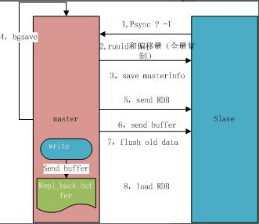  

```       
如图所示: 
1、Redis 内部会发出一个同步命令，刚开始是 Psync 命令，Psync ? -1表示要求 master 主机同步数据
2、主机会向从机发送 runid 和 offset，因为 slave 并没有对应的 offset，所以是全量复制
3、从机 slave 会保存 主机master 的基本信息 save masterInfo
4、主节点收到全量复制的命令后，执行bgsave（异步执行），在后台生成RDB文件（快照），并使用一个缓冲区（称为复制缓冲区）记录从现在开始执行的所有写命令
5、主机send RDB 发送 RDB 文件给从机
6、发送缓冲区数据
7、刷新旧的数据，从节点在载入主节点的数据之前要先将老数据清除
8、加载 RDB 文件将数据库状态更新至主节点执行bgsave时的数据库状态和缓冲区数据的加载。
```
### <font face="微软雅黑"  color = #D50000 > 注意： 从节点在载入主节点的数据之前要先将从节点老数据清除</font>

全量复制开销，主要有以下几项。  

- bgsave 时间
- RDB 文件网络传输时间
- 从节点清空数据的时间
- 从节点加载 RDB 的时间

#### 部分复制  

部分复制是 Redis 2.8 以后出现的，之所以要加入部分复制，是因为全量复制会产生很多问题，比如像上面的时间开销大、无法隔离等问题， Redis 希望能够在 master 出现抖动（相当于断开连接）的时候，可以有一些机制将复制的损失降低到最低  

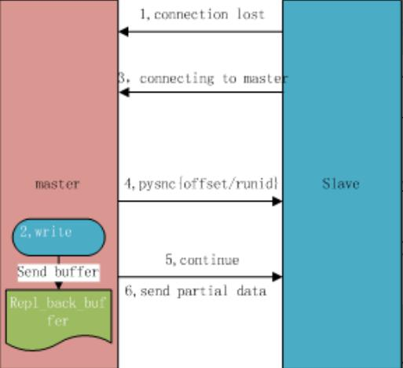  

   
``` 
1、如果网络抖动（连接断开 connection lost）
2、主机master 还是会写 replbackbuffer（复制缓冲区）
3、从机slave 会继续尝试连接主机
4、从机slave 会把自己当前 runid 和偏移量传输给主机 master，并且执行 pysnc 命令同步
5、如果 master 发现你的偏移量是在缓冲区的范围内，就会返回 continue 命令
6、同步了 offset 的部分数据，所以部分复制的基础就是偏移量 offset。
```
注意：
#### 正常情况下redis是如何决定是全量复制还是部分复制  

从节点将offset发送给主节点后，主节点根据offset和缓冲区大小决定能否执行部分复制:
 
- 如果offset偏移量之后的数据，仍然都在复制积压缓冲区里，则执行部分复制；  
- 如果offset偏移量之后的数据已不在复制积压缓冲区中（数据已被挤出），则执行全量复制。  

#### 缓冲区大小调节：  
 
由于缓冲区长度固定且有限，因此可以备份的写命令也有限，当主从节点offset的差距过大超过缓冲区长度时，将无法执行部分复制，只能执行全量复制。反过来说，为了提高网络中断时部分复制执行的概率，可以根据需要增大复制积压缓冲区的大小(通过配置repl-backlog-size)来设置；  
例如  如果网络中断的平均时间是60s，而主节点平均每秒产生的写命令(特定协议格式)所占的字节数为100KB，则复制积压缓冲区的平均需求为6MB，保险起见，可以设置为12MB，来保证绝大多数断线情况都可以使用部分复制。  

#### 服务器运行ID(runid)  

每个Redis节点(无论主从)，在启动时都会自动生成一个随机ID(每次启动都不一样)，由40个随机的十六进制字符组成；runid用来唯一识别一个Redis节点。 通过info server命令，可以查看节点的runid：   

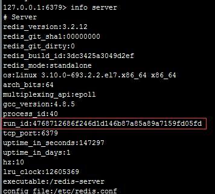

主从节点初次复制时，主节点将自己的runid发送给从节点，从节点将这个runid保存起来；当断线重连时，从节点会将这个runid发送给主节点；主节点根据runid判断能否进行部分复制：  

如果从节点保存的runid与主节点现在的runid相同，说明主从节点之前同步过，主节点会继续尝试使用部分复制(到底能不能部分复制还要看offset和复制积压缓冲区的情况)  

如果从节点保存的runid与主节点现在的runid不同，说明从节点在断线前同步的Redis节点并不是当前的主节点，只能进行全量复制。  

>## <font face="微软雅黑"  color = #42A5F5 >五、主从复制进阶常见问题解决 </font>
 
1、读写分离

2、主从配置不一致

3、规避全量复制

4、规避复制风暴


>#### <font face="微软雅黑"  color = #42A5F5 >4.1、读写分离 </font>  

读流量分摊到从节点。这是个非常好的特性，如果一个业务只需要读数据，那么我们只需要连一台 slave 从机读数据。  

  

>####  <font face="微软雅黑"  color = #D50000 > 虽然读写有优势，能够让读这部分分配给各个 slave 从机，如果不够，直接加 slave 机器就好了。但是也会出现以下问题。 </font>  


>#### <font face="微软雅黑"  color = #42A5F5 > 1.复制数据延迟。 </font>  

可能会出现 ```slave``` 延迟导致读写不一致等问题，当然你也可以使用监控偏移量  ```offset```，如果 offset 超出范围就切换到 ```master``` 上,逻辑切换，而具体延迟多少，可以通过 ```info replication ```的``` offset ```指标进行排查。

对于无法容忍大量延迟场景，可以编写外部监控程序监听主从节点的复制偏移量，当延迟较大时触发报警或者通知客户端避免读取延迟过高的从节点

同时从节点的``` slave-serve-stale-data ```参数也与此有关，它控制这种情况下从节点的表现：如果为``` yes ```（默认值），则从节点仍能够响应客户端的命令；如果为``` no ```，则从节点只能响应``` info、slaveof ```等少数命令。该参数的设置与应用对数据一致性的要求有关；如果对数据一致性要求很高，则应设置为 ```no```。


>#### <font face="微软雅黑"  color = #42A5F5 >  2.从节点故障问题 </font>  

对于从节点的故障问题，需要在客户端维护一个可用从节点可用列表，当从节
点故障时，立刻切换到其他从节点或主节点，之后讲解redis Cluster 时候可以解决这个问题


>#### <font face="微软雅黑"  color = #42A5F5 >   配置不一致 </font> 

主机和从机不同，经常导致主机和从机的配置不同，并带来问题。

- 数据丢失：
主机和从机有时候会发生配置不一致的情况，例如 ```maxmemory``` 不一致，如果主机配置 ```maxmemory``` 为8G，从机 slave 设置为4G，这个时候是可以用的，而且还不会报错。  
但是如果要做高可用，让从节点变成主节点的时候，就会发现数据已经丢失了，而且无法挽回。


>#### <font face="微软雅黑"  color = #42A5F5 >   规避全量复制 </font>   

全量复制指的是当 slave 从机断掉并重启后，runid 产生变化而导致需要在 master 主机里拷贝全部数据。这种拷贝全部数据的过程非常耗资源。

全量复制是不可避免的，例如第一次的全量复制是不可避免的，这时我们需要选择小主节点，且 ```maxmemory``` 值不要过大，这样就会比较快。同时选择在低峰值的时候做全量复制。

>#### <font face="微软雅黑"  color = #42A5F5 >   造成全量复制的原因 </font>   

1. 是主从机的运行``` runid ```不匹配。解释一下，主节点如果重启，``` runid ```将会发生变化。如果从节点监控到``` runid ```不是同一个，它就会认为你的节点不安全。当发生故障转移的时候，如果主节点发生故障，那么从机就会变成主节点。我们会在后面讲解哨兵和集群。  
 
2. 复制缓冲区空间不足，比如默认值1M，可以部分复制。但如果缓存区不够大的话，首先需要网络中断，部分复制就无法满足。其次需要增大复制缓冲区配置（relbacklogsize），对网络的缓冲增强。参考之前的说明。

>#### <font face="微软雅黑"  color = #42A5F5 >    怎么解决？   </font>   

在一些场景下，可能希望对主节点进行重启，例如主节点内存碎片率过高，或者希望调整一些只能在启动时调整的参数。如果使用普通的手段重启主节点，会使得runid发生变化，可能导致不必要的全量复制。

为了解决这个问题，Redis提供了debug reload的重启方式：重启后，主节点的runid和offset都不受影响，避免了全量复制。

3. 当一个主机下面挂了很多个``` slave ```从机的时候，主机``` master ```挂了，这时``` master ```主机重启后，因为 runid 发生了变化，所有的``` slave ```从机都要做一次全量复制。这将引起单节点和单机器的复制风暴，开销会非常大。

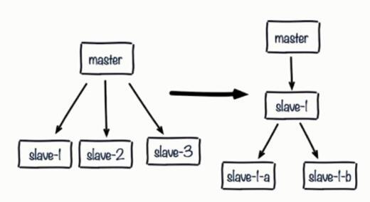

> 解决：  
- 可以采用树状结构降低多个从节点对主节点的消耗
- 从节点采用树状树非常有用，网络开销交给位于中间层的从节点，而不必消耗顶层的主节点。但是这种树状结构也带来了运维的复杂性，增加了手动和自动处理故障转移的难度


4.单机器的复制风暴  

由于``` Redis ```的单线程架构，通常单台机器会部署多个```Redis```  实例。当一台机器（machine）上同时部署多个主节点```（master）```时，如果每个``` master ```主机只有一台``` slave ```从机，那么当机器宕机以后，会产生大量全量复制。这种情况是非常危险的情况，带宽马上会被占用，会导致不可用。

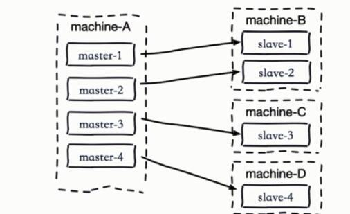


解决：

1、应该把主节点尽量分散在多台机器上，避免在单台机器上部署过多的主节点。  
2、当主节点所在机器故障后提供故障转移机制，避免机器恢复后进行密集的全量复制
