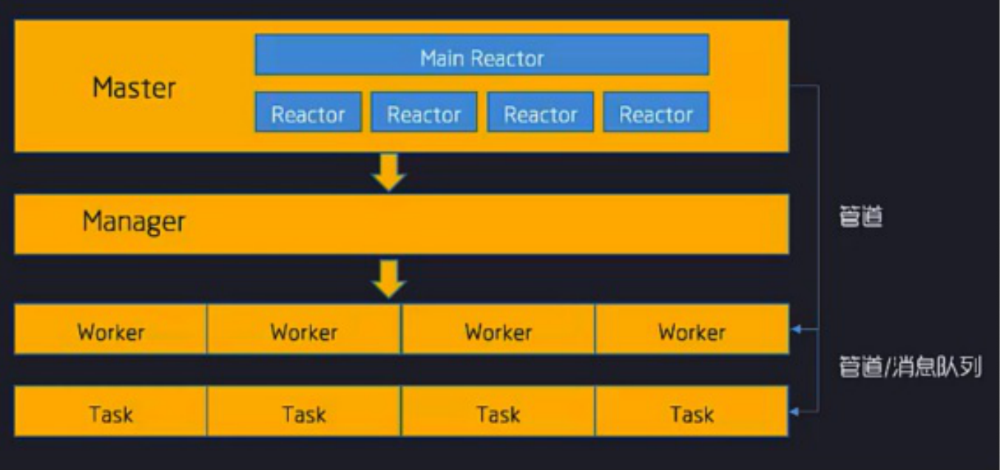
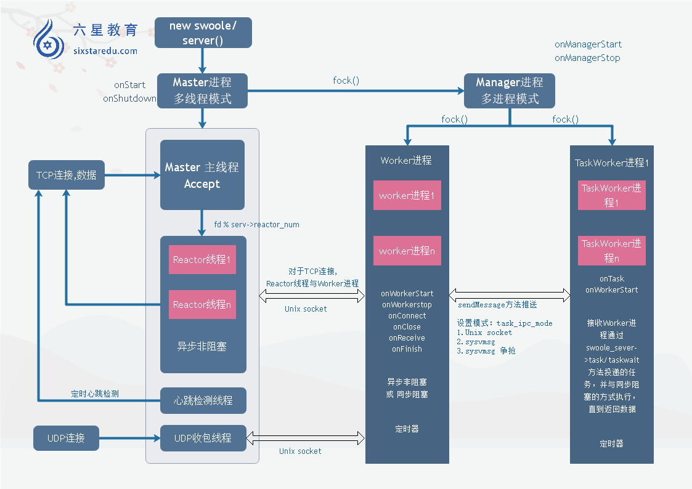

### 一、

查看VMware： 编辑-->虚拟网络编辑器的NAT网卡设置（一般都是VMnet8），查看 NAT设置的IP及子网

```bash
#编辑文件
vi /etc/sysconfig/network-scripts/ifcfg-eth0

IPADDR=192.168.153.127 # centos的ip地址 
NETMASK=255.255.255.0 # 子网掩码 
GATEWAY=192.168.153.2 # 网关
ONBOOT=yes 						#允许外部访问
ZONE=public

#设置好之后重启网卡
systemctl restart network 

#查看IP
ip addr

#外部访问测试
ping 192.168.153.127
```

##### 安装宝塔

```bash
yum install -y wget && wget -O install.sh http://download.bt.cn/install/install_6.0.sh && sh install.sh
```

#### 编译安装php

```bash
yum -y install libxml2
yum -y install libxml2-devel
yum -y install openssl
yum -y install openssl-devel
yum -y install curl
yum -y install curl-devel
yum -y install libjpeg
yum -y install libjpeg-devel
yum -y install libpng
yum -y install libpng-devel
yum -y install freetype
yum -y install freetype-devel
yum -y install pcre
yum -y install pcre-devel
yum -y install libxslt
yum -y install libxslt-devel
yum -y install bzip2
yum -y install bzip2-devel
yum install gcc-c++

cd php-7.3.12

./configure --prefix=/usr/local/php --with-curl --with-freetype-dir --with-gd --with-gettext --with-iconv-dir --with-kerberos --with-libdir=lib64 --with-libxml-dir --with-mysqli --with-openssl --with-pcre-regex --with-pdo-mysql --with-pdo-sqlite --with-pear -- with-png-dir --with-jpeg-dir --with-xmlrpc --with-xsl --with-zlib --with-bz2 --with-mhash --enable-fpm --enable-bcmath --enable-libxml --enable-inline-optimization --enable-mbregex --enable-mbstring --enable-opcache --enable-pcntl --enable-shmop --enable-soap --enable-sockets -- enable-sysvsem --enable-sysvshm --enable-xml --enable-zip

#1.如果报libzip错误，是因为libzip版本太低
yum remove libzip
# 上传libzip包并解压
tar -zxvf libzip-1.2.0.tar.gz 
cd libzip-1.2.0 
./configure 
make && make install

#2. error: off_t undefined; check your library configuration
vi /etc/ld.so.conf 
#添加如下几行 
/usr/local/lib64 
/usr/local/lib 
/usr/lib 
/usr/lib64
# 使之生效
ldconfig -v 

# 3./usr/local/include/zip.h:59:21: 致命错误：zipconf.h：没有那个文件或目录 
find / -name zipconf.h 
cp /usr/local/lib/libzip/include/zipconf.h /usr/local/include/zipconf.h 

# 4. libtool: link: `ext/zip/php_zip.lo' is not a valid libtool object 
make clear 
make install

cp php.ini-development /usr/local/php/lib/php.ini 
cp /usr/local/php/php-fpm.conf.default /usr/local/php/php-fpm.conf 
ln -s /usr/local/php/sbin/php-fpm /usr/local/bin 
groupadd www 
useradd -g www www 
cp /usr/local/php/php-fpm.d/www.conf.default /usr/local/php/php-fpm.d/www.conf 
vi /usr/local/php/php-fpm.d/www.conf 
#修改如下内容 
user=www
group=www

vi /usr/local/php/lib/php.ini 
#修改如下内容 
cgi.fix_pathinfo=0

#安装查看linux进程的工具
yum install net-tools
netstat -tln | grep 9000

#设置环境变量
vi /etc/profile
export PATH="$PATH:/usr/local/php/bin"

source /etc/profile
php -v
```

#### 编译安装nginx

```bash
yum install -y zlib zlib-devel
wget https://nginx.org/download/nginx-1.16.0.tar.gz 
./configure 
make && make install 
whereis nginx 
vi /etc/profile 
export PATH="$PATH:/usr/local/php/bin:/usr/local/nginx/sbin/" 
source /etc/profile

#nginx -s stop 此方式相当于先查出nginx进程id再使用kill命令强制杀掉进程 
#nginx -q quit 此方式是待nginx进程处理任务完毕进行停止 
#nginx -c /usr/local/nginx/conf/nginx.conf 
ps -aux | grep nginx
```

#### 防火墙

```bash
#查看防火墙状态 
systemctl status firewalld 
#开启防火墙 
systemctl start firewalld 
#关闭防火墙 
systemctl stop firewalld

#若遇到无法开启，先用：
systemctl unmask firewalld.service 
#然后：
systemctl start firewalld.service


#开放端口 
firewall-cmd --zone=public --add-port=80/tcp --permanent 
#查询端口号80是否开启: 
firewall-cmd --query-port=80/tcp 
#重启防火墙: 
firewall-cmd --reload 
#查询有哪些端口是开启的: 
firewall-cmd --list-port
```

>*cgi* 
>
>早期的webserver只处理html等静态文件，但是随着技术的发展，出现了像php等动态语言。webserver处理不了就交给php解释器来处理，但是，php解释器如何与webserver进行通信呢? 为了解决不同的的语言解释器**(**如**php**、**python**) 与**webserver**的通信，于是出现了**cgit**协议。只要你按照**cgi**协议去编写程序，就能实现语言解释器与**webwerver**的通信。如**php-cgi**程序
>
>*fast_cgi* 
>
>有了cgi协议，解决了php解释器与webserver通信的问题，webserver终 于可以处理动态语言了。但是，webserver每收到1个请求,都会去fork一个cgi进程, 请求结束再kill掉这个进程。这样有10000个求，就需要fork、 kill php-cgi进程10000次。 于是，出现了cgi的改良版本fast-cgi，fast-cgi每次处理完请求后，不会kill掉这个进程，而是保留这个进程，使这个进程可以一次处理多个请求。这样每次就不用重新fork一个进程了，大大提高了效率。 
>
>*php-fpm* 
>
>php-fpm即php-Fastcgi Process Manager，php-fpm是FastCGI的实现，并提供了进程管理的功能。进程包含master进程和worker进程两种进程。 master进程只有一个， 负责监听端口，接收来自Web Server的请求，而worker进程则-般有多个(具体数量根据实际需要配置)，每个进程内部都嵌入了一一个PHP解释器，是PHP代码真正执行的地方。


### [swoole安装](https://github.com/swoole/swoole-src/releases)

> 可以安装 composer require swoole-ide-helper，这是源码，可以帮助理解swoole

```bash
[root@localhost root]# tar -xvf swoole-src-4.4.12.tar.gz 
[root@localhost root]# cd swoole-src-4.4.12 
[root@localhost swoole-src-4.4.12]# phpize 
[root@localhost swoole-src-4.4.12]# ./configure 
[root@localhost swoole-src-4.4.12]# make 
[root@localhost swoole-src-4.4.12]# sudo make install

#1. configure: error: Cannot find PHP-config. Please use --with-php-config=PATH
#意思就是因为PHP的配置文件没有找到,需要额外的指定如下 
[root@localhost swoole-src-4.4.12]# find / -name php-config 
[root@localhost swoole-src-4.4.12]# ./configure --with-php-config=/usr/local/php/bin/php-config 
[root@localhost swoole-src-4.4.12]# make 
[root@localhost swoole-src-4.4.12]# sudo make install

[root@localhost swoole-src-4.4.12]# find / -name php.ini 
[root@localhost swoole-src-4.4.12]# vi /www/server/php/73/etc/php.ini 
# 添加
extension=swoole.so
#重启
[root@localhost swoole-src-4.4.12]# /etc/init.d/php-fpm-73 restart
```

####  mysql远程连接配置

```mysql
#注意要先设置root密码
mysql> grant all privileges on *.* to root@'%' identified by "password"; 
mysql> flush privileges;
```

#### composer安装

```bash
[root@localhost ~]# php -r "copy('https://getcomposer.org/installer', 'composer-setup.php');" 
[root@localhost ~]# php -r "if (hash_file('sha384', 'composer-setup.php') === 'a5c698ffe4b8e849a443b120cd5ba38043260d5c4023dbf93e1558871f1f07f58274fc6f4c93bcfd858c6bd0775cd8d1') { echo 'Installer verified'; } else { echo 'Installer corrupt'; unlink('composer-setup.php'); } echo PHP_EOL;" Installer verified 

#升级
[root@localhost ~]# php composer-setup.php
```

#### swoole 监听ip的设置

```php
#这里的ip只能是0.0.0.0或外网地址，不能是127.0.0.1
#为什么线上websocket是127.0.0.1，是因为用户访问的项目也在swoole服务器上
$serv = new Swoole\Server(0.0.0.0, 9501)
```

#### Nginx设置swoole反向代理

```bash
location / {
	proxy_pass http://192.168.22.35:9000
}
```

> swoole只是一个通讯工具，也叫套接字，通过tcp或udp协议通信
>
> tcp：三次握手，很负责，消息必传达
>
> udp：只管发送消息，成不成功无所谓，适用于消息通知、群发

>tcp分为短链接和长链接
>
>短链接：三次握手，四次挥手（1.断开吗？ 2.断开！3.切断联系。 4.收到切断消息。）
>
>长链接：三次握手之后一直监听
>
>

#### 粘包、拆包、组包、抓包

> 粘包产生的现象：应该分开发送的信息粘在一起了
>
> 产生原因：tcp长链接因为一直在通信消耗了大量的资源，所以为了节省通信资源，会把频繁的请求压缩到一起（数据缓冲），每1秒发一次，就像公交车，不是每上去一个人就发一次车，而是每次发车都等一会儿，到时间了不管人是多是少都开始发车

解决粘包：

1.增加分隔符（并不是最佳，性能不好）

```php
//客户端
$client->set([
	  'open_eof_split' => true,   //打开EOF_SPLIT检测
    'package_eof'    => "\r\n", //设置EOF
])

//服务端
$serv->set([
	  'open_eof_split' => true,   //打开EOF_SPLIT检测
    'package_eof'    => "\r\n", //设置EOF
])
```

2.使用PHP原生pack函数（常用：n, N，这种方式也不是很好，需要服务端foreach接收）

```php
//客户端
$test = 'sssssssss';
$len = pack("N", strlen($test)); //在数据流前面加上数据流的长度，这样才能方便识别，进行组包
for($i=0; $i<10; $i++){
  $sendData = $len . $test;
  $client->send($sendData)
}

$count = 1;

//服务端
$server->on('Receive', function() use ($count){
  //这个才是传输的数据，第二个参数为什么是4？
  // n是16位，所以是2个字节，N是32位，所以是4个字节
  $fooLen = unpack("n", substr($data, $count, 2))[1]; 
  var_dump($fooLen); 
  $foo = substr($data, $count + 2, $fooLen); 
  var_dump($foo); 
  $serv->send($fd, "Server: ");
});
```

3.使用swoole的pack方式

```php
//客户端
$client->set(array(
  'open_length_check'     => true,
  'package_max_length'    => 1024*1024*2,
  'package_length_type'   => 'N',
  //数据从0开始
  'package_length_offset' => 0,
  // N是32位，所以是4个字节
  'package_body_offset'   => 4,
));

$test = 'sssssssss';
$len = pack("N", strlen($test));
for($i=0; $i<10; $i++){
  $sendData = $len . $test;
  $client->send($sendData)
}


//服务端
$server->set(array(
  'open_length_check'     => true,
  'package_max_length'    => 1024*1024*2,
  'package_length_type'   => 'N',
  //数据从0开始
  'package_length_offset' => 0,
  // N是32位，所以是4个字节
  'package_body_offset'   => 4,
));

//直接接收即可
$server->on('Receive', function(){
  echo $data."\n";
});
```

#### 进程、线程、多进程、协程、子进程、父进程

>进程：一个在内存中运行的应用程序。每个进程都有自己独立的一块内存空间，一个进程可以有多个线程，比如在Windows系统中，一个运行的xx.exe就是一个进程。
>
>线程：进程中的一个执行任务（控制单元），负责当前进程中程序的执行。一个进程至少有一个线程，一个进程可以运行多个线程，多个线程可共享数据。多个线程共享进程的**堆**和**方法区**资源，但每个线程有自己的**程序计数器**、**虚拟机栈**和**本地方法栈**，所以系统在产生一个线程，或是在各个线程之间作切换工作时，负担要比进程小得多，也正因为如此，线程也被称为轻量级进程。
>
>协程：一种比线程更加轻量级的存在。正如一个进程可以有多个线程，一个线程可以有多个协程。协程的本质是单线程，需要线程配合才可以在多CPU上运行。
>
>多进程：操作系统中同时运行的多个exe程序
>
>父进程：指已创建一个或多个子进程的进程。
>
>子进程：指的是由另一进程（对应称之为父进程）所创建的进程。子进程继承了对应的父进程的大部分属性。

拿浏览器举个例子，如果把浏览器本身当成一个进程，则下载一个东西叫线程，下载的同时打开其他网页叫协程

### 五、

### [面向对象写法](https://github.com/qq1596329937/swooleQQ/blob/master/Chat.php)

```php
<?php

class Chat
{
    protected $server;//单例存放websocket_server对象
  
    public function __construct($ip, $port)
    {
        //实例化swoole_websocket_server并存储在我们Chat类中的属性上，达到单例的设计
        $this->server = new swoole_websocket_server($ip, $port);
        //监听连接事件
        $this->server->on('open', [$this, 'onOpen']);
        //监听接收消息事件
        $this->server->on('message', [$this, 'onMessage']);
        //监听关闭事件
        $this->server->on('close', [$this, 'onClose']);
        //设置允许访问静态文件
        $this->server->set([
            'enable_static_handler' => true//允许访问静态文件
        ]);
        //开启服务
        $this->server->start();
    }

    /**
     * 连接成功回调函数
     * @param $server
     * @param $request
     */
    public function onOpen($server, $request)
    {
        echo '用户'. $request->fd . '连接了' . PHP_EOL;
    }

    /**
     * 接收到信息的回调函数
     * @param $server
     * @param $frame
     */
    public function onMessage($server, $frame)
    {
        $data=json_decode($frame->data);
    }

    /**
     * 断开连接回调函数
     * @param $server
     * @param $fd
     */
    public function onClose($server, $fd)
    {
        
    }

    /**
     * @param $server
     * @param $type 消息类型
     * @param $fd  接收者
     * @param $data
     */
    public function pushData($server,$type,$fd,$data){
        $server->push($fd, json_encode(['type' => $type, 'data' => $data]));
    }
}

$obj = new Chat();
```

#### swoole结构



> 如上分为四层: 
>
> 1. master：主进程 
>
> 2. Manger：管理进程 
>
> 3. worker：工作进程 
>
> 4. task：异步任务工作进程 

```bash
#可以使用命令查看进程信息
pstree -ap|grep swoole
```

#### 运行机制



#### [IO模型](https://blog.csdn.net/qq_52173163/article/details/125932018?spm=1001.2014.3001.5502)

> 阻塞模型：等前面的程序处理完才能处理新的，
>
> **生活场景:某天，你跟你女朋友去奶茶店买奶茶，点完奶茶后后，由于你们不知道奶茶什么时候才能做好，所以你们就只能一直等着，其他什么事情也不能干。**
>
> 非阻塞模型：一边运行自己的程序，一边每隔一段时间询问一下
>
> **生活场景:你和你女朋友去奶茶店买奶茶,吸取了上一次的教训,点完奶茶后顺便去逛了逛商场。由于你们担心会错过取餐，所以你们就每隔一段时间就来问下服务员，你们的奶茶做好了没有，来来回回好多回，若干次后，终于问到奶茶已经准备好了，然后你们就开心的喝了起来。**
>
> 多路复用：使用多个内核
>
> **生活场景:如果每个人都过一会就来问一下奶茶好了没有,奶茶店的压力也太大了。于是奶茶店想到了一个办法,找一个中间人(select)挡在奶茶店前面,顾客(应用进程)询问那个中间人奶茶好了没有(对应多个进程的IO注册到一个复用器（select）上),如果没有好就让顾客等待(应用进程阻塞于 select 调用)。中间人持续查看顾客的奶茶是否准备好,如果有一个人的奶茶准备好了就会去通知那个人可以取了(而当任一IO在内核缓冲区中有数据，select调用就会返回可读条件，然后进程再进行recvform系统调用)。**
>
> 信号驱动：给内核发一个信号，内核处理完了通知应用程序何时去处理
>
> **举例：因为奶茶店例子的整个周期太短，无法数据复制阶段的阻塞。现在我们换个例子，你和你女朋友在海底捞点完餐后，把电话号码留下，别人做好了直接打电话给你，这时候你们过来，服务员在给你们上菜（数据复制阶段阻塞，你们要等服务员把菜拿到你们的桌子上）。菜没准备完的期间，你和你女朋友可以一直逛商场，时间就更多了。**
>
> 异步：内核通知应用程序何时去处理
>
> **举例：你们现在连上菜的时间也不想等，就想直接开吃。于是你和你女朋友在海底捞点完餐后，把电话号码留下，要求服务员菜准备完了直接拿到餐桌上，然后打电话给你，这时候你们过来就可以直接开吃了。**

#### ab测试工具

```bash
#安装
yum -y install httpd-tools

#网址后面记得加/
ab -n 1000 -c 1000 -k http://127.0.0.1/
-n #请求量
-c #客户端数量
-k #保持连接

#测试的时候可能会报错 ……too many open files……
#可以设置的更大一点
ulimit -n 202048

#测试的时候可能会报错 You MUST recompile PHP with a……
#看报错设置
```

#### 函数解释

```php
//创建socket（socket是什么？通道，应用利用TCP/UDP协议经过【通道】调用内核处理任务）
stream_socket_server  //创建服务端socket通道
stream_socket_client	//创建客户端socket通道
  
stream_socket_accept	//如果存在server与client建立的一个连接，这个时候它也会创建一个两者交互的资源流
stream_set_blocking		//设置写和读的非阻塞
stream_select					//获取可读的资源，监控到resource中有可以读取的信息则为可读
```

看到了第10集


