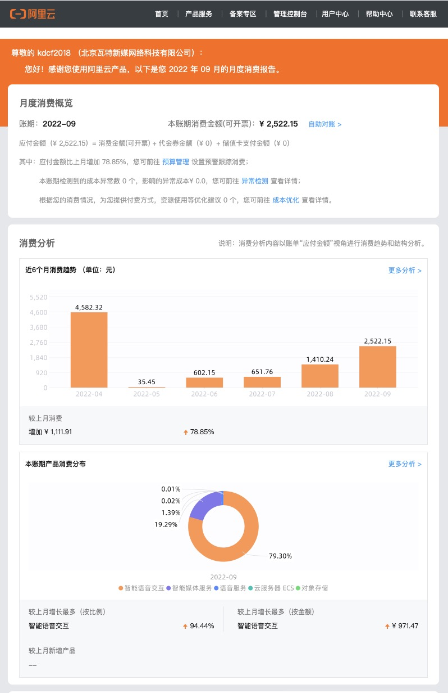

### 需求：借鉴其他平台更新迭代数据报表

`参照案例：`银行账单、阿里云月报

`技术难点：`因腾讯平台防火墙限制无法在邮箱内使用echarts.js动态绘制图表，需要研究统计图表自动生成图片，以图片链接的方式载入邮件，然后定时发送

`技术选型：`h5(echarts5.4.js绘图) + python(selenium虚拟浏览器) + linux（crontab定时任务）

`技术方案步骤：`

1. 对统计数据进行模块化分组，将订单、用户、文章、供应商品牌数据进行归类，采用合适的统计图样式实现（待分组……）
2. 使用测试数据构建H5统计页面雏形，研究饼图、折线图、柱状图、词云等接口的自动生成图片功能（已解决）
3. 增加图片上传接口，调用jsapi在图表图片生成之后自动上传云服务器（已解决）
4. 因H5图层合并需要借助浏览器解析js，需要在服务器端搭建python-selenium浏览器环境，在虚拟浏览器中进行解析（搭建中，与php-server环境有冲突待解决……）
5. 使用linux系统的crontab定时发送服务，按照（每日、每周、每月）规律运行python-selenium虚拟浏览器程序发送邮件

