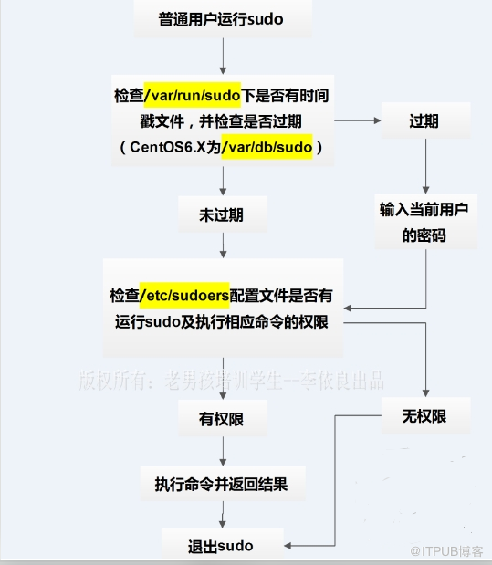
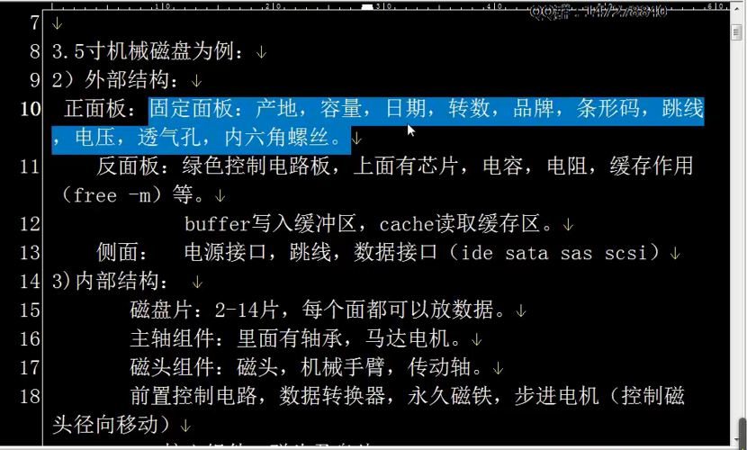

#  随笔

[TOC]


### 1.selinux

> 查看selinux的方法

```sh
[root@liufeng ~]# getenforce 
Enforcing  
# 临时关闭
[root@liufeng ~]# setenforce 
usage:  setenforce [ Enforcing | Permissive | 1 | 0 ]
[root@liufeng ~]# setenforce 0
# 永久关闭
[root@liufeng ~]# vim /etc/selinux/config
```


> 把SELINUX=enforcing修改为 SELINUX=disabled

### 2.查看防火墙

```sh
#查看防火墙状态
[root@liufeng ~]# systemctl status firewalld.service 
● firewalld.service - firewalld - dynamic firewall daemon
   Loaded: loaded (/usr/lib/systemd/system/firewalld.service; enabled; vendor preset: enabled)
   Active: active (running) since Thu 2019-07-18 10:28:35 CST; 10h ago
     Docs: man:firewalld(1)
 Main PID: 6409 (firewalld)
   CGroup: /system.slice/firewalld.service
           └─6409 /usr/bin/python -Es /usr/sbin/firewalld --nofork --nopid

Jul 18 10:28:32 liufeng systemd[1]: Starting firewalld - dynamic firewall daemon...
Jul 18 10:28:35 liufeng systemd[1]: Started firewalld - dynamic firewall daemon.
#开启防火墙
[root@liufeng ~]# systemctl start firewalld.service 
#关闭防火墙
[root@liufeng ~]# systemctl stop firewalld.service 
#禁止开机启动
[root@liufeng ~]# systemctl disable  firewalld.service 
```

### 3.du

> 显示文件或目录所占用的磁盘空间。
>
> - -h 输出文件系统分区使用的情况，例如：10KB，10MB，10GB等
>
> -  -s 显示文件或整个目录的大小，默认单位是KB

```sh
[root@liufeng oldboy]# du -sh /etc
31M	/etc
```

### 4. tr 替换

```sh
[root@oldboy64-lnb ~]# echo {a..z} a b c d e f g h i j k l m n o p q r s t u v w x y z [root@oldboy64-lnb ~]# echo {a..z} |tr 'a-z' 'A-Z' A B C D E F G H I J K L M N O P Q R S T U V W X Y Z [root@oldboy64-lnb ~]# echo abcabc|tr 'abc' '123' 123123 [root@oldboy64-lnb ~]# echo aabbcc|tr 'abc' '123' 112233

[root@oldboy64-lnb ~]# echo {a..z} a b c d e f g h i j k l m n o p q r s t u v w x y z

[root@oldboy64-lnb ~]# echo {a..z} |tr -d 'a-e' f g h i j k l m n o p q r s t u v w x y z 
[root@oldboy64-lnb ~]# echo {a..z} |tr -cd 'a-e' 
abcde[root@oldboy64-lnb ~]# #-d 删除 
#-d 删除 #-c 取反 
[root@oldboy64-lnb ~]# tr -cd 'a-zA-Z' /dev/urandom tr: extra operand ‘/dev/urandom’ Only one string may be given when deleting without squeezing repeats. Try 'tr --help' for more information. [root@oldboy64-lnb ~]# tr -cd 'a-zA-Z' < /dev/urandom [root@oldboy64-lnb ~]# tr -cd 'a-zA-Z' < /dev/urandom |head -c 10
FFlAmFwUVv[root@oldboy64-lnb ~]#
```


### 5. ll -d

> 查看本身的信息 不关联子集

```sh
[root@liufeng oldboy]# ll /etc -d
drwxr-xr-x. 73 root root 8192 Jul 20  2019 /etc

rm -f $(find ./ -name 'file-*')
find ./ -name 'file-*' -exec rm -f {}\;
find ./ -name 'file-*' -exec rm delete
```

###  6.find

> 排除目录

```sh
#查找/etc/下，除/etc/sane.d目录的其他所有.conf后缀的文件

[root@liufeng oldboy]# find /etc -path '/etc/sane.d' -a -prune -o -name "*.conf"

#查找/etc/下，除/etc/sane.d和/etc/fonts两个目录的其他所有.conf后缀的文件

[root@liufeng oldboy]# find /etc \( -path '/etc/sane.d' -o -path '/etc/fonts' \) -a -prune -o -name "*.conf"
```

### 7.grep

```sh
#取一行
[root@liufeng oldboy]# grep -n '.' /etc/passwd |grep '^20:'
20:liufeng:x:1000:1000::/home/liufeng:/bin/bash
```

### 8.sed

> 步进：以奇数行

```sh
[root@liufeng oldboy]# seq 10 | sed -n '1~2p'
1
3
5
7
9
```

> 以偶数行

```sh
[root@liufeng oldboy]# seq 10 | sed -n '2~2p'
2
4
6
8
10
```

> 取出从liu开始的行到 以z开始的行
>
> ※注意：从liu开头的行查找以z开头的行，例如下面，已经查完，但是sed原理是一行一行的查，如果后面仍然有以liu开头的行，sed会继续查找（贪婪模式），如果后面有，就终结，没有就查都结束

```sh
[root@liufeng oldboy]# cat passwd.txt
liu:x:0:0:liu:/liu:/bin/bash
sshd:x:74:74:Privilege-separatedSSH:/var/empty/sshd:/sbin/nologin
z
postfix:x:89:89::/var/spool/postfix:/sbin/nologin
ntp:x:38:38::/etc/ntp:/sbin/nologin
z
feng:x:1000:1000::/home/liufeng:/bin/bash
z
liu
test1:x:1001:1001::/home/test1:/bin/bash
test2:x:1002:1002::/home/test2:/bin/bash
```


```sh
[root@liufeng oldboy]#  sed -n '/^liu/,/^z/p' passwd.txt
liu:x:0:0:liu:/liu:/bin/bash
systemd-network:x:192:192:systemdNetworkManagement:/:/sbin/nologin
dbus:x:81:81:Systemmessagebus:/:/sbin/nologin
polkitd:x:999:998:Userforpolkitd:/:/sbin/nologin
sshd:x:74:74:Privilege-separatedSSH:/var/empty/sshd:/sbin/nologin
z
liu
test1:x:1001:1001::/home/test1:/bin/bash
test2:x:1002:1002::/home/test2:/bin/bash

```

>删除偶数行

```sh
[root@liufeng oldboy]# seq 10 | sed '2~2d'
1
3
5
7
9

```

>;分号可以连接两条命令

```sh
[root@liufeng oldboy]# cat /etc/fstab 

#
# /etc/fstab
# Created by anaconda on Sat Jul  6 19:51:51 2019
#
# Accessible filesystems, by reference, are maintained under '/dev/disk'
# See man pages fstab(5), findfs(8), mount(8) and/or blkid(8) for more info
#
UUID=71e68a88-c91f-4aad-9290-0f1199be2049 /                       xfs     defaults        0 0
UUID=44494f73-6a49-422c-a64c-a56434f99c21 /boot                   xfs     defaults        0 0
UUID=c654aaed-6157-4a49-a359-57dc9919b70e swap                    swap    defaults        0 0

[root@liufeng oldboy]# sed '/#/d' /etc/fstab 

UUID=71e68a88-c91f-4aad-9290-0f1199be2049 /                       xfs     defaults        0 0
UUID=44494f73-6a49-422c-a64c-a56434f99c21 /boot                   xfs     defaults        0 0
UUID=c654aaed-6157-4a49-a359-57dc9919b70e swap                    swap    defaults        0 0
[root@liufeng oldboy]# sed '1d;/#/d' /etc/fstab            ##先删除第一行空行，再执行删除#
UUID=71e68a88-c91f-4aad-9290-0f1199be2049 /                       xfs     defaults        0 0
UUID=44494f73-6a49-422c-a64c-a56434f99c21 /boot                   xfs     defaults        0 0
UUID=c654aaed-6157-4a49-a359-57dc9919b70e swap                    swap    defaults        0 0

```

>显示匹配字符串的行号以及内容

```sh
[root@liufeng oldboy]# sed -n  -e '/root/p' -e '/root/=' passwd.txt.bak 
root:x:0:0:root:/root:/bin/bash
1
operator:x:11:0:operator:/root:/sbin/nologin
10
```
> 打印1-5行，并显示行号
```sh
[root@liufeng oldboy]# sed -n -e '1,5p' -e '=' passwd.txt.bak 
root:x:0:0:root:/root:/bin/bash
1
bin:x:1:1:bin:/bin:/sbin/nologin
2
daemon:x:2:2:daemon:/sbin:/sbin/nologin
3
adm:x:3:4:adm:/var/adm:/sbin/nologin
4
lp:x:4:7:lp:/var/spool/lpd:/sbin/nologin
5
6
7
8
911.磁盘
```


### 9. awk

> 查看某个文件第100行的内容

```sh
awk 'NR==100' /boot/grub2/grub.cfg
```

### 10.getent 

> 查询某一个用户的信息

```sh
[root@oldboy64 ~]# getent passwd liufeng
liufeng:x:1000:1000::/home/liufeng:/bin/bash
```


### 11.权限整理

#### 添加一个用户到指定用户组的两种方式，修改一个用户到指定用户组的三种方式

> gpasswd –a 用户名 组名
>
>usermod –G 组名 用户名
>
>groupmems –a 用户名 -g 组名 

```sh
#第一种：gpasswd –a 用户名 组名

[root@localhost ~]# id user1

uid=501(user1) gid=501(user1) groups=501(user1)

[root@localhost ~]# gpasswd -a user1 user_group

Adding user user1 to group user_group

[root@localhost ~]# id user1             

uid=501(user1) gid=501(user1) groups=501(user1),500(user_group)

#第二种：usermod –G 组名 用户名

[root@localhost ~]# id user1

uid=501(user1) gid=501(user1) groups=501(user1)

[root@localhost ~]# usermod -G user_group user1

[root@localhost ~]# id user1            

uid=501(user1) gid=501(user1) groups=501(user1),500(user_group)

#第三种：groupmems –a 用户名 -g 组名 
[root@localhost ~]# id user1

uid=501(user1) gid=501(user1) groups=501(user1)

[root@localhost ~]# groupmems –a user1 -g user_group 

[root@localhost ~]# id user1            

uid=501(user1) gid=501(user1) groups=501(user1),500(user_group)
```

####  su

> 普通用户如果想看/etc/shadow下面的文件是没有权限的，用su 的-c选项可以查看，查看完毕直接回到当前用户

```sh
[liufeng@liufeng ~]# cat /etc/shadow
cat: /etc/shadow: Permission denied
[liufeng@liufeng ~]# su - root -c 'cat /etc/shadow'
```

#### useradd

> 添加新用户，可以用passwd来添加初始密码

```sh
[root@liufeng ~]# useradd test3
[root@liufeng ~]# passwd test3 
Changing password for user test3.
New password: 
BAD PASSWORD: The password is shorter than 7 characters
Retype new password: 
passwd: all authentication tokens updated successfully.

[root@liufeng ~]# echo 'test3'|passwd --stdin test3  #一步到位（另一种方法）
```

> -e   下次登录强制修改密码

```sh
[root@liufeng ~]# passwd -e test3              #chage -d 0 test3  下一次登录强制重置密码 
```

#### groupmems

> 查看组的成员

```sh
[root@liufeng ~]# groupmems -l -g liufeng(组的名称)
test1 
```

#### usermod 

> 添加附加组

```sh
#test1的主组是test1，附加组是liufeng
[root@liufeng ~]# id test1
uid=1001(test1) gid=1001(test1) groups=1001(test1),1000(liufeng)
#如果用G，root会覆盖原来的附加组，需要加-a参数才是添加(usermod -aG root test1)
[root@liufeng ~]# usermod -G root test1
#如果不想要附加组，可以给空或者把主组的名称放进去
[root@liufeng ~]# usermod -G '' test1
[root@liufeng ~]# usermod -G test1 test1
```

#### rwx读写执行权限

| **权限** | **文件**                                                     |
| :------- | :----------------------------------------------------------- |
| r        | r查看文件的内容                                              |
| w        | w表示是否能修改文件内容（如果文件只有w权限，那么文件不可查看，不可执行，vim编辑内容会覆盖之前的内容，echo ‘123’ >> 文件，是可以写入文件的）。 |
| x        | x是否能执行脚本（如果文件只有x权限，是无法执行的。只有文件有了rx权限的时候，文件才能执行。文件有wx权限的时候，文件也是不能被执行的）。 |

> 测试目录r权限

```sh
#root
[root@liufeng oldboy]# chmod o=r lidao/
[root@liufeng oldboy]# ll lidao/ -d
drwxr-xr--. 2 root root 96 May 19 12:24 lidao/
#liufeng
#只有r权限是只能看文件名
[liufeng@liufeng oldboy]# ll lidao/
ls: cannot access lidao/test01.txt: Permission denied
ls: cannot access lidao/test02.txt: Permission denied
ls: cannot access lidao/test03.txt: Permission denied
ls: cannot access lidao/test04.txt: Permission denied
ls: cannot access lidao/test05.txt: Permission denied
total 0
-????????? ? ? ? ?            ? test01.txt
-????????? ? ? ? ?            ? test02.txt
-????????? ? ? ? ?            ? test03.txt
-????????? ? ? ? ?            ? test04.txt
-????????? ? ? ? ?            ? test05.txt

#目录有了rx权限，是可以查看文件的属性的
[root@liufeng oldboy]# ll lidao/ -d
drwxr-xr-x. 2 root root 96 May 19 12:24 lidao/

[liufeng@liufeng oldboy]# ll lidao/
total 0
-rw-r--r--. 1 root root 0 May 19 12:24 test01.txt
-rw-r--r--. 1 root root 0 May 19 12:24 test02.txt
-rw-r--r--. 1 root root 0 May 19 12:24 test03.txt
-rw-r--r--. 1 root root 0 May 19 12:24 test04.txt
-rw-r--r--. 1 root root 0 May 19 12:24 test05.txt
```

> 测试目录w权限

```sh
#root（只有w权限）
[root@liufeng oldboy]# ll lidao/ -d
drwxr-x-w-. 2 root root 96 May 19 12:24 lidao/
#liufeng
[liufeng@liufeng oldboy]# cd lidao/                       #cd不进去目录
-bash: cd: lidao/: Permission denied

#查看不了目录里面的文件
[liufeng@liufeng oldboy]# cat lidao/test0                 
cat: lidao/test0: Permission denied

#写不了目录的文件内容（即使文件有写权限，目录有写权限，仍然写不了，只有目录有wx权限，才可以写进去）
[liufeng@liufeng oldboy]# echo '222' >> lidao/test01.txt  
-bash: lidao/test01.txt: Permission denied

#目录有了wx权限，不管文件有没有权限，文件都是可以删除的（也是可以cp，修改的）
[root@liufeng oldboy]# chmod o=wx lidao/
[root@liufeng oldboy]# ll lidao/ -d
drwxr-x-wx. 2 root root 96 May 19 12:39 lidao/

#liufeng
[liufeng@liufeng oldboy]# rm -f lidao/test01.txt
[liufeng@liufeng oldboy]#
```

> 测试目录x权限

```sh
#如果目录只有执行权限，文件是可以被执行的（前提是文件也有rx权限）
#如果目录只有执行权限，是可以cd进去的,如果没有执行权限，是无法cd进去的
#注意一点，如果目录有rw权限，没有x权限，cd不进去目录，只能查看文件名，无法看到文件属性，无法修改文件内容。无法移动，重命名。无法删除
[root@liufeng oldboy]# ll lidao/ -d
drwxr-x--x. 2 root root 93 May 19 13:20 lidao/

#liufeng
[liufeng@liufeng lidao]# sh test.sh
1: lo: <LOOPBACK,UP,LOWER_UP> mtu 65536 qdisc noqueue state UNKNOWN group default qlen 1000
    link/loopback 00:00:00:00:00:00 brd 00:00:00:00:00:00
    inet 127.0.0.1/8 scope host lo
       valid_lft forever preferred_lft forever
    inet6 ::1/128 scope host 
       valid_lft forever preferred_lft forever
2: eth0: <BROADCAST,MULTICAST,UP,LOWER_UP> mtu 1500 qdisc pfifo_fast state UP group default qlen 1000
    link/ether 00:0c:29:9b:d5:19 brd ff:ff:ff:ff:ff:ff
    inet 10.0.0.200/24 brd 10.0.0.255 scope global eth0
       valid_lft forever preferred_lft forever
    inet6 fe80::20c:29ff:fe9b:d519/64 scope link 
       valid_lft forever preferred_lft forever
```

>面试题：
>
>cp  /etc/fstab  /data/dir需要的最小权限是什么？
>
>简答：
>
>​		本题从以下几个方面思考
>
>```sh
>	1. cp作为外部命令，必须要有x权限
>	2. etc必须有x权限，fstab必须要有r权限
>	3. data 需要x权限,dir目录选用wx权限
>	--> 如果目标是要/data下复制的话，/data只给一个x权限是复制不过去的（必须得给wx才能复制）
>```
> 

#### sudo的工作原理




### 12.磁盘

####  磁盘的作用

- 外部结构

- 内部结构

  

> 安装完磁盘之后，不用重启，也可以刷新

```sh
#方法1
[root@liufeng oldboy]# echo '- - -' > /sys/class/scsi_host/host0/scan
[root@liufeng ~]# lsblk
#方法2
[root@liufeng oldboy]# partprobe /dev/sdb
```

```sh
[root@liufeng oldboy]# fdisk -l #查看磁盘的信息
```


> 磁盘分区一般有2种：
>
> - fdisk  mbr(分区表)   磁盘容量小于2T一般用fdisk 最多支持4个主分区
>
>   - 磁盘格式化 
>
>      [root@oldboy64-lnb ~]# mkfs.xfs /dev/sdb1 
>
> - parted gpt(分区表)  磁盘容量大于2T一般用parted  最多支持 70 80主分区

```sh
#磁盘挂载
[root@oldboy64-lnb ~]# mount /dev/sdb1 /mnt/ 
[root@oldboy64-lnb ~]# df -h
文件系统       容量 已用 可用 已用% 挂载点
/dev/sda3       19G  1.8G   18G   10% /
devtmpfs       980M     0 980M    0% /dev
tmpfs           991M     0 991M    0% /dev/shm
tmpfs           991M  9.6M 981M    1% /run
tmpfs           991M     0 991M    0% /sys/fs/cgroup
/dev/sda1       197M 105M   93M   54% /boot
tmpfs           199M     0 199M    0% /run/user/0
/dev/sdb1       200M   11M 190M    6% /mnt
#永久挂载
##方法1. /etc/rc.local
mount /dev/sdb1  /data
```

> mount -a  加载fstab进行挂载测试（挂载完之久需要测试）

####  umount

> 如果卸载的时候，提示 umount:/mnt: device is busy
>
> 需要退出挂载目录再进行挂载，或者是NFS Server宕机了，需要强制卸载 mount -lf /mnt


###  13.查看端口对应的服务名

```sh
#用服务名称查端口号
#第一种方法:
[root@backup backup]# netstat -lntp | grep rsync
tcp        0      0 0.0.0.0:873             0.0.0.0:*               LISTEN      11617/rsync         
tcp6       0      0 :::873                  :::*                    LISTEN      11617/rsync  
#第二种方法:
[root@backup backup]# ss -tlnp|grep rsync

#用端口号查服务名称
#第一种方法:
[root@backup backup]# netstat -lntp | grep 873
tcp        0      0 0.0.0.0:873             0.0.0.0:*               LISTEN      11617/rsync         
tcp6       0      0 :::873                  :::*                    LISTEN      11617/rsync 
#第二种方法:
[root@backup backup]# lsof -i:873
COMMAND   PID USER   FD   TYPE DEVICE SIZE/OFF NODE NAME
rsync   11617 root    3u  IPv4  51992      0t0  TCP *:rsync (LISTEN)
rsync   11617 root    5u  IPv6  51993      0t0  TCP *:rsync (LISTEN)
#第三种方法:
[root@backup ~]# ss -ntlp|grep 873
LISTEN     0      5            *:873                      *:*                   users:(("rsync",pid=6472,fd=3))
LISTEN     0      5           :::873                     :::*                   users:(("rsync",pid=6472,fd=5))

#查看主机监听的端口(ss命令比netstat效率更快)
[root@backup ~]# ss -lntp
State       Recv-Q Send-Q                     Local Address:Port                                    Peer Address:Port              
LISTEN      0      5                                      *:873                                                *:*                   users:(("rsync",pid=6472,fd=3))
LISTEN      0      128                                    *:22                                                 *:*                   users:(("sshd",pid=6794,fd=3))
LISTEN      0      100                            127.0.0.1:25                                                 *:*                   users:(("master",pid=7029,fd=13))
LISTEN      0      5                                     :::873                                               :::*                   users:(("rsync",pid=6472,fd=5))
LISTEN      0      128                                   :::80                                                :::*                   users:(("httpd",pid=14715,fd=4),("httpd",pid=14714,fd=4),("httpd",pid=14713,fd=4),("httpd",pid=14712,fd=4),("httpd",pid=14711,fd=4),("httpd",pid=14710,fd=4))
LISTEN      0      128                                   :::22                                                :::*                   users:(("sshd",pid=6794,fd=4))
LISTEN      0      100                                  ::1:25                                                :::*                   users:(("master",pid=7029,fd=14))
```


### 14.查看系统信息

| uname -a          | 查看Linux内核版本信息            |
| ----------------- | -------------------------------- |
| cat /proc/version | 查看内核版本                     |
| cat /etc/issue    | 查看系统版本                     |
| lsb_release -a    | 查看系统版本 需安装centos-relase |
| locale -a         | 列出所有语系                     |
| locale            | 当前环境变量中所有编码           |
| hwclock           | 查看时间                         |
| who               | 当前在线用户                     |
| w                 | 当前在线用户                     |
| whoami            | 查看当前用户名                   |
| logname           | 查看初始登录用户名               |
| uptime            | 查看服务器启动时间               |
| sar -n DEV 1 10   | 查看网卡网速流量                 |
| dmesg             | 显示开机信息                     |
| lsmod             | 查看内核模块                     |

```sh
[root@web02 ~]# lsb_release -a
LSB Version:	:core-4.1-amd64:core-4.1-noarch
Distributor ID:	CentOS
Description:	CentOS Linux release 7.6.1810 (Core) 
Release:	7.6.1810
Codename:	Core
```


### 15.使脚本在后台一直运行

```sh
nohup sh /server/scripts/inotify.sh &
```

### 16.查看暂停的服务

```sh
[root@nfs01 backup]# jobs 
[1]   Stopped                 sh /server/scripts/inotify.sh
[2]   Stopped                 sh /server/scripts/inotify.sh
[3]   Stopped                 inotifywait -qrm /backup/
[4]-  Stopped                 sh /server/scripts/inotify.sh
[5]+  Stopped                 sh /server/scripts/inotify.sh
```


### 17.yum无法安装

>yum clean all
>
>yum makecache

### 18.同步网络时间
>yum -y install ntpdate
>
>ntpdate -u ntp.api.bz (ntpdate -u ntp.aliyun.com)

### 19.lscpu

> 此命令用来显示cpu的相关信息 

```sh
[root@web01 nginx]# lscpu
Architecture:          x86_64
CPU op-mode(s):        32-bit, 64-bit
Byte Order:            Little Endian
CPU(s):                1
On-line CPU(s) list:   0
Thread(s) per core:    1
Core(s) per socket:    1
Socket(s):             1
NUMA node(s):          1
Vendor ID:             GenuineIntel
CPU family:            6
Model:                 61
Model name:            Intel(R) Core(TM) i5-5200U CPU @ 2.20GHz
Stepping:              4
CPU MHz:               2194.930
BogoMIPS:              4389.86
Hypervisor vendor:     VMware
Virtualization type:   full
L1d cache:             32K
L1i cache:             32K
L2 cache:              256K
L3 cache:              3072K
NUMA node0 CPU(s):     0
Flags:                 fpu vme de pse tsc msr pae mce cx8 apic sep mtrr pge mca cmov pat pse36 clflush mmx fxsr sse sse2 ss syscall nx pdpe1gb rdtscp lm constant_tsc arch_perfmon nopl xtopology tsc_reliable nonstop_tsc eagerfpu pni pclmulqdq ssse3 fma cx16 pcid sse4_1 sse4_2 x2apic movbe popcnt tsc_deadline_timer aes xsave avx f16c rdrand hypervisor lahf_lm abm 3dnowprefetch fsgsbase tsc_adjust bmi1 avx2 smep bmi2 invpcid rdseed adx smap xsaveopt arat
```

### 20.查看网站解析流程

```sh
[root@liufeng ~]#wget --debug baidu.com
DEBUG output created by Wget 1.14 on linux-gnu.

URI encoding = ‘UTF-8’
Converted file name 'index.html' (UTF-8) -> 'index.html' (UTF-8)
Converted file name 'index.html' (UTF-8) -> 'index.html' (UTF-8)
--2019-11-08 17:55:36--  http://baidu.com/
#DNS解析过程
Resolving baidu.com (baidu.com)... 220.181.38.148, 39.156.69.79
Caching baidu.com => 220.181.38.148 39.156.69.79
#Connecting 与网站建立连接
Connecting to baidu.com (baidu.com)|220.181.38.148|:80... connected.
Created socket 3.
Releasing 0x0000000002444980 (new refcount 1).
#http 请求豹纹 request
---request begin---    
GET / HTTP/1.1         #请求方法 $method   #http请求报文 起始行
User-Agent: Wget/1.14 (linux-gnu)   #用户浏览器
Accept: */*
Host: baidu.com     #访问的域名或ip
Connection: Keep-Alive
                         #空行   POST的时候 空行下面是POST的内容
---request end---
#http 请求已经发送 ,等待响应
HTTP request sent, awaiting response... 
#http响应豹纹开始 response
---response begin---
HTTP/1.1 200 OK
Date: Fri, 08 Nov 2019 09:55:36 GMT
Server: Apache
Last-Modified: Tue, 12 Jan 2010 13:48:00 GMT
ETag: "51-47cf7e6ee8400"
Accept-Ranges: bytes
Content-Length: 81
Cache-Control: max-age=86400
Expires: Sat, 09 Nov 2019 09:55:36 GMT
Connection: Keep-Alive
Content-Type: text/html

---response end---
200 OK
Registered socket 3 for persistent reuse. #http keepalive 长链接 keepalive_timeout 65;
Length: 81 [text/html]
Saving to: ‘index.html’

100%[===================================================================================================================================================>] 81          --.-K/s   in 0s      

2019-11-08 17:55:36 (8.08 MB/s) - ‘index.html’ saved [81/81]

```

### 21.sql压缩包导入mysql

```sh
[root@web01 /html/blog]# mysqldump  -uroot  -A   |gzip >/root/all.sql.gz
#查看zip压缩文件
[root@db01 ~]# zless all.sql.gz 
#导入
[root@db01 ~]# zcat   all.sql.gz |mysql
#另外的方法
[root@db01 ~]# gzip -d all.sql.gz    ##解压压缩包
[root@db01 ~]# mysql </root/all.sql


#分库分表
mysqldump -uroot -p123456 库名 表名

1、备份命令
格式：mysqldump -h主机名 -P端口 -u用户名 -p密码 --database 数据库名 > 文件名.sql
例如： mysqldump -h 192.168.1.100 -p 3306 -uroot -ppassword --database cmdb > /data/backup/cmdb.sql

2、备份同个库多个表
格式：mysqldump -h主机名 -P端口 -u用户名 -p密码 --database 数据库名 表1 表2 .... > 文件名.sql
例如 mysqldump -h192.168.1.100 -p3306 -uroot -ppassword cmdb t1 t2 > /data/backup/cmdb_t1_t2.sql
```

### 22.查看时间（过了多少天）

```sh
[root@iZ2ze7v707npzyo25hxptpZ ~]# date +%j
339
```

### 23.查看当前主机外网IP地址

```sh
[root@iZ2ze7v707npzyo25hxptpZ ~]# curl icanhazip.com
47.93.24.38
```

### 24.显示进程的关系

```sh
[root@liufeng ~]#pstree -p
systemd─┬─AliYunDun───20*[{AliYunDun}]
        ├─AliYunDunUpdate───3*[{AliYunDunUpdate}]
        ├─2*[agetty]
        ├─aliyun-service───5*[{aliyun-service}]
        ├─atd
        ├─auditd───{auditd}
        ├─crond
        ├─dbus-daemon
        ├─dhclient
        ├─java───18*[{java}]
        ├─mysqld───29*[{mysqld}]
        ├─nginx───nginx
        ├─ntpd
        ├─php-fpm───7*[php-fpm]
        ├─polkitd───5*[{polkitd}]
        ├─rsyslogd───2*[{rsyslogd}]
        ├─sshd───sshd───bash───bash───pstree
        ├─systemd-journal
        ├─systemd-logind
        ├─systemd-udevd
        └─tuned───4*[{tuned}]
```

### 24.查看主机是否存活
```sh
[root@liufeng ~]#ping -c1 -W1 baidu.com
PING baidu.com (39.156.69.79) 56(84) bytes of data.
64 bytes from 39.156.69.79 (39.156.69.79): icmp_seq=1 ttl=48 time=29.7 ms

--- baidu.com ping statistics ---
1 packets transmitted, 1 received, 0% packet loss, time 0ms
rtt min/avg/max/mdev = 29.785/29.785/29.785/0.000 ms
[root@liufeng ~]#echo $?
0
```

### 25.重启php-fpm

```sh
kill -USR2 42891
```

