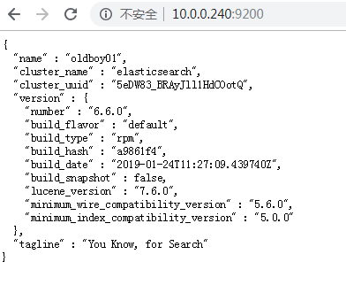
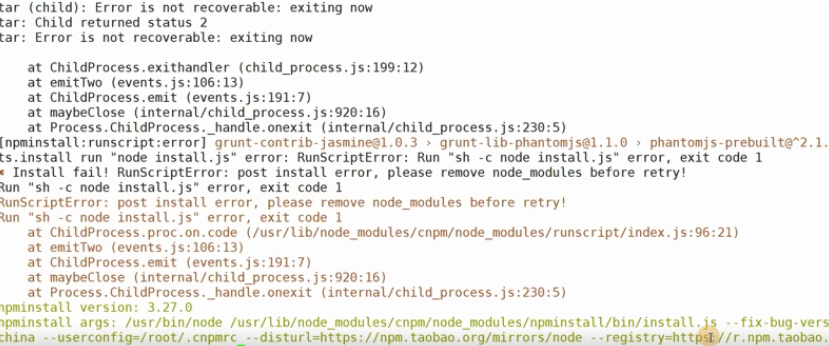

# ELK学习笔记

[TOC]

## 一、ELASTICSEARCH

### 1.什么叫搜索？

#### 2.为什么mysql不适合全文检索
缺点:通过全表扫描，用时间很比较长，查询的效率不高

### 3.什么是全文检索倒排索引打分

===========================
 1.中国 教育
 2.中国 教育 小学
 3.中国 教育 中学
 4.中国 教育 高中
 5.中国 教育 大学

关键词    ids
 中国     1，2，3，4，5
 教育     1，2，3，4，5
 小学     2，3
 初中     2
 高中     3
 大学     4

===========================


### 4.es的应用场景

- 电商搜索
- 站内搜索
- 代码高亮
- 日志收集

### 5.es特点

```css
数据的存储、数据的分析、数据的搜索
高性能：水平扩展方便，可以支持一主多从
高可用：把数据分片的方式，分布存储到集群中的每台节点上面（平均）
es功能丰富，配置简单
采用restful风格的接口，可以通过http发起请求
```

### 6.es安装部署

```css
es的部署方法
1、tar包的方式：安装后的文件比较集中，便于管理。手写启动脚本
2、rpm包的方式：安装比较简单，安装后的文件路径比较分散
3、docker的方式：下载镜像，通过run命令的方式来启动一个容器
```

##### 安装jdk流程

```css
#安装jdk环境
mkdir /opt/es-software
#安装jdk包
rpm -ivh jdk-8u102-linux-x64.rpm
#检查安装jdk信息
java -version
```

##### 安装elastic search

```sh
#进入安装目录（通过清华源下载安装包）
cd /opt/es-software
#安装
rpm -ivh elasticsearch-6.6.0.rpm
#介绍es相关的配置文件信息
/etc/elasticsearch/elasticsearch.yml#es的主要配置文件
/etc/elasticsearch/jvm.options#调整java虚拟机的配置文件
/etc/init.d/elasticsearch#启动的脚本文件
/etc/sysconfig/elasticsearch#配置关于es的相关环境变量
/usr/lib/sysctl.d/elasticsearch.conf#配置关于es的相关系统的变量
/usr/lib/systemd/system/elasticsearch.service
```

##### 修改es的主要配置文件

```sh
vim /etc/elasticsearch/elasticsearch.yml
[root@es01 es-software]# egrep -v '^$|#' /etc/elasticsearch/elasticsearch.yml 
node.name: oldboy01
path.data: /var/lib/elasticsearch
path.logs: /var/log/elasticsearch
bootstrap.memory_lock: true
network.host: 10.0.0.240
http.port: 9200
#修改关于java虚拟机的内存配置文件 /etc/elasticsearch/jvm.options
-Xms512m
-Xmx512m
#启动es服务
systemctl start elasticsearch

```

##### 处理报错问题

```sh
#tail -f /var/log/elasticsearch/elasticsearch.log 
[2020-03-23T13:23:39,222][ERROR][o.e.b.Bootstrap          ] [oldboy01] node validation exception
[1] bootstrap checks failed
[1]: memory locking requested for elasticsearch process but memory is not locked
#解决方法，可参考官方文档
https://www.elastic.co/guide/en/elasticsearch/reference/6.6/setting-system-settings.html#sysconfig
#添加一个配置文件
systemctl edit elasticsearch
[Service]
LimitMEMLOCK=infinity
#重新载入
systemctl deamon-reload
#重新启动es服务
systemctl restart elasticsearch
```

```undefined
netstat -lntup|grep 9200
curl 127.0.0.1:9200
```

##### 确认es服务正常启动

```sh
[root@lb01 ~]# curl http://10.0.0.240:9200
{
  "name" : "oldboy01",
  "cluster_name" : "elasticsearch",
  "cluster_uuid" : "5eDW83_BRAyJll1HdCOotQ",
  "version" : {
    "number" : "6.6.0",
    "build_flavor" : "default",
    "build_type" : "rpm",
    "build_hash" : "a9861f4",
    "build_date" : "2019-01-24T11:27:09.439740Z",
    "build_snapshot" : false,
    "lucene_version" : "7.6.0",
    "minimum_wire_compatibility_version" : "5.6.0",
    "minimum_index_compatibility_version" : "5.0.0"
  },
  "tagline" : "You Know, for Search"
}

```



##### 如何往es数据库写入数据

###### 1、熟悉几个概念

```css
1、索引：相当于MySQL的一个数据库
2、类型：相当于一个数据库中的一张表
3、docs：相当于表当中的每行的数据
```

###### 2、通过命令行的方式往es数据库中写入数据

```css
#创建一个索引
curl -XPUT http://10.0.0.240:9200/oldboy?pretty
#往索引里面写入一条数据
curl -XPUT '10.0.0.240:9200/oldboy/student/1?pretty' -H 'Content-Type: application/json' -d'
{
    "first_name" : "zhang",
    "last_name": "san",
    "age" : 28,
    "about" : "I love to go rock climbing", 
    "interests": [ "sports" ]
}'
#写入第二条数据
curl -XPUT  '10.0.0.240:9200/oldboy/student/2?pretty' -H 'Content-Type: application/json' -d' {
"first_name": "li",
"last_name" : "si",
"age" : 32,
"about" : "I like to collect rock albums", 
"interests": [ "music" ]
}'
#不指定id写入数据
curl -XPOST  '10.0.0.240:9200/oldboy/student/?pretty' -H 'Content-Type: application/json' -d' {
"first_name": "li", 
"last_name" : "mingming",
"age" : 45,
"about": "I like to swime", 
"interests": [ "reading" ]
}'
#使用命令查询数据
curl -XGET  '10.0.0.240:9200/oldboy/student/1?pretty'
#查询oldboy索引下面所有的数据
curl -XGET  '10.0.0.240:9200/oldboy/_search/?pretty'
#删除一条数据
curl -XDELETE  '10.0.0.240:9200/oldboy/student/1?pretty'
#
```

###### 3、使用head插件的方式来和es交互

```sh
#添加epel
wget -O /etc/yum.repos.d/epel.repo http://mirrors.aliyun.com/repo/epel-7.repo
#安装nodejs npm openssl screen 
yum install nodejs npm openssl screen -y#配置nodejs环境
node -v
npm -v
#把npm转为cnpm为了使用淘宝源
npm install -g cnpm --registry=https://registry.npm.taobao.org 
#克隆head插件的代码
[root@elk01 es-software]# git clone git://github.com/mobz/elasticsearch-head.git
[root@elk01 es-software]# ll
total 287276
-rw-r--r--. 1 root root 114059630 Feb 25  2019 elasticsearch-6.6.0.rpm
drwxr-xr-x. 9 root root      4096 Mar 27 13:54 elasticsearch-head
-rw-r--r--. 1 root root 166044032 Sep  2  2019 jdk-8u102-linux-x64.rpm
-rw-r--r--. 1 root root  14055156 Nov 14 10:14 node-v12.13.0-linux-x64.tar.xz

cd elasticsearch-head
cnpm install
```

> 如果执行到上一步出错，可能是nodejs版本不兼容到导致。
>
> 需移除nodejs，重新安装



```sh
[root@elk01 es-software]# yum remove -y nodejs
[root@elk01 es-software]# ll
total 287276
-rw-r--r--. 1 root root 114059630 Feb 25  2019 elasticsearch-6.6.0.rpm
drwxr-xr-x. 9 root root      4096 Mar 27 13:54 elasticsearch-head
-rw-r--r--. 1 root root 166044032 Sep  2  2019 jdk-8u102-linux-x64.rpm
-rw-r--r--. 1 root root  14055156 Nov 14 10:14 node-v12.13.0-linux-x64.tar.xz
[root@elk01 es-software]# tar xf node-v12.13.0-linux-x64.tar.xz -C /opt
[root@elk01 es-software]# ll
total 287276
-rw-r--r--. 1 root root 114059630 Feb 25  2019 elasticsearch-6.6.0.rpm
drwxr-xr-x. 9 root root      4096 Mar 27 13:54 elasticsearch-head
-rw-r--r--. 1 root root 166044032 Sep  2  2019 jdk-8u102-linux-x64.rpm
-rw-r--r--. 1 root root  14055156 Nov 14 10:14 node-v12.13.0-linux-x64.tar.xz
[root@elk01 es-software]# cd ..
[root@elk01 opt]# ll
total 0
drwxr-xr-x. 3 root  root  132 Mar 27 14:49 es-software
drwxr-xr-x. 6 test1 test1 108 Oct 21 15:41 node-v12.13.0-linux-x64
[root@elk01 opt]# ln -s /opt/node-v12.13.0-linux-x64/  /opt/node
[root@elk01 opt]# ll
total 0
drwxr-xr-x. 3 root  root  132 Mar 27 14:49 es-software
lrwxrwxrwx. 1 root  root   29 Mar 27 14:51 node -> /opt/node-v12.13.0-linux-x64/
drwxr-xr-x. 6 test1 test1 108 Oct 21 15:41 node-v12.13.0-linux-x64
[root@elk01 opt]# vim /etc/profile
export PATH=/opt/node/bin:$PATH
[root@elk01 opt]# node -v
v12.13.0
#安装完nodejs重新cnpm install
[root@elk01 opt]# cnpm install
npminstall WARN package.json not exists: /opt/package.json
✔ Installed 0 packages
✔ Linked 0 latest versions
✔ Run 0 scripts
✔ All packages installed (used 10ms(network 6ms), speed 0B/s, json 0(0B), tarball 0B)
#提示没有找到安装包，需要进入到git的下载目录执行
[root@elk01 opt]# cd es-software/elasticsearch-head/
[root@elk01 elasticsearch-head]# cnpm install
[root@elk01 elasticsearch-head]# cnpm install  #成功
✔ Installed 10 packages
✔ Linked 0 latest versions
✔ Run 0 scripts
✔ All packages installed (used 29ms(network 22ms), speed 0B/s, json 0(0B), tarball 0B)
```

```sh
[root@elk01 elasticsearch-head]# screen -S es-head
[root@elk01 elasticsearch-head]# cnpm run start

> elasticsearch-head@0.0.0 start /opt/es-software/elasticsearch-head
> grunt server

Running "connect:server" (connect) task
Waiting forever...
Started connect web server on http://localhost:9100
```

```sh
#使用nodejs的方式来部署head插件有个问题要解决
vim /etc/elasticsearch/elasticsearch.yml(在配置文件的最下方)
http.cors.enabled: true
http.cors.allow-origin: "*"
#重启es服务
systemctl restart elasticsearch
```

