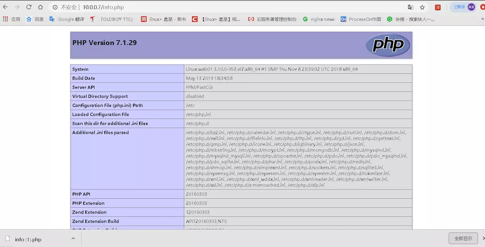
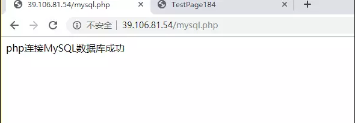

# LNMP环境部署

[TOC]

## 部署nginx环境

### 1.安装nginx

> 官方yum源安装软件

```sh
# 第一个历程: 更新yum源  
#官方网址  http://nginx.org/en/linux_packages.html
vim /etc/yum.repo.d/nginx.repo 
[nginx-stable]
name=nginx stable repo
baseurl=http://nginx.org/packages/centos/$releasever/$basearch/
gpgcheck=1
enabled=1
gpgkey=https://nginx.org/keys/nginx_signing.key
module_hotfixes=true
# 第二个历程: 安装软件
yum install -y nginx
[root@liufeng home]#nginx -v
nginx version: nginx/1.16.1
# 第三个历程: 启动nginx
[root@liufeng home]#systemctl start nginx
[root@liufeng home]#systemctl enable nginx
[root@liufeng home]#systemctl status nginx

?𹠠nginx.service - The nginx HTTP and reverse proxy server
   Loaded: loaded (/usr/lib/systemd/system/nginx.service; enabled; vendor preset: disabled)
   Active: active (running) since Mon 2019-11-04 13:58:07 CST; 25s ago
 Main PID: 16481 (nginx)
   CGroup: /system.slice/nginx.service
           ?𼰿𺲀16481 nginx: master process /usr/sbin/nginx
           ?𺰿𺲀16482 nginx: worker process

Nov 04 13:58:06 liufeng systemd[1]: Starting The nginx HTTP and reverse proxy server...
Nov 04 13:58:06 liufeng nginx[16475]: nginx: the configuration file /etc/nginx/nginx.conf syntax is ok
Nov 04 13:58:06 liufeng nginx[16475]: nginx: configuration file /etc/nginx/nginx.conf test is successful
Nov 04 13:58:07 liufeng systemd[1]: Failed to parse PID from file /run/nginx.pid: Invalid argument
Nov 04 13:58:07 liufeng systemd[1]: Started The nginx HTTP and reverse proxy server.

[root@liufeng home]#ps -ef |grep nginx
root     16481     1  0 13:58 ?        00:00:00 nginx: master process /usr/sbin/nginx
nginx    16482 16481  0 13:58 ?        00:00:00 nginx: worker process
root     16519 16334  0 14:00 pts/0    00:00:00 grep --color=auto nginx

#编写/etc/nginx/conf.d配置文件
server {
    listen            80;
    server_name xixiang_platform.com;
	access_log  /var/log/nginx/access_www.log  main;      
	set $index 'server.php';
    root   /home/www/xixiang_platform;
    index index.html $index;
	error_page   500 502 503 504  /50x.html;
	location = /50x.html {
	    root   html;
	}
	location / {
    	if (-e $request_filename) {   #判断是否目录或文件
        	break;
     	}
     	if (!-e $request_filename) {   #多层目录转成参数
         	rewrite ^/(.+)$ /$index?url=$1 last;
         	break;
     	}
    }
	location ~* \.(php|php5)$ { ##nginx只能处理静态页面，动态页面需要交给php处理，这里的就表示如果访问时php结尾的文件就交给php处理。
       fastcgi_pass   127.0.0.1:9000;
       fastcgi_index  $index;
       fastcgi_param  SCRIPT_FILENAME  $document_root$fastcgi_script_name;
       include        fastcgi_params;
    }
	location ~ /.ht {
                deny  all;
            }
}
```

## 部署php环境

> 解决yum安装软件冲突问题
>
> yum remove php-mysql php php-fpm php-common
>
> 准备yum安装软件扩展源信息
>
> rpm -Uvh `https://dl.fedoraproject.org/pub/epel/epel-release-latest-7.noarch.rpm`
> rpm -Uvh `https://mirror.webtatic.com/yum/el7/webtatic-release.rpm`
>
> 利用yum安装PHP相关软件信息
>
> yum install -y php71w php71w-cli php71w-common php71w-devel php71w-embedded  php71w-gd php71w-mcrypt php71w-mbstring php71w-pdo php71w-xml php71w-fpm php71w-mysqlnd php71w-opcache  php71w-pecl-memcached php71w-pecl-redis php71w-pecl-mongodb

```sh
[root@liufeng conf.d]#yum remove php-mysql php php-fpm php-common
Loaded plugins: fastestmirror
No Match for argument: php-mysql
No Match for argument: php
No Match for argument: php-fpm
No Match for argument: php-common
No Packages marked for removal
[root@liufeng conf.d]#rpm -Uvh https://dl.fedoraproject.org/pub/epel/epel-release-latest-7.noarch.rpm
Retrieving https://dl.fedoraproject.org/pub/epel/epel-release-latest-7.noarch.rpm
warning: /var/tmp/rpm-tmp.Mv2IJb: Header V3 RSA/SHA256 Signature, key ID 352c64e5: NOKEY
Preparing...                          ################################# [100%]
Updating / installing...
   1:epel-release-7-12                warning: /etc/yum.repos.d/epel.repo created as /etc/yum.repos.d/epel.repo.rpmnew
################################# [100%]
[root@liufeng conf.d]#rpm -Uvh https://mirror.webtatic.com/yum/el7/webtatic-release.rpm
Retrieving https://mirror.webtatic.com/yum/el7/webtatic-release.rpm
warning: /var/tmp/rpm-tmp.wshr01: Header V4 RSA/SHA1 Signature, key ID 62e74ca5: NOKEY
Preparing...                          ################################# [100%]
Updating / installing...
   1:webtatic-release-7-3             ################################# [100%]
```

> 检查nginx程序所使用的用户信息
>
> [root@oldboyedu ~]# ps -ef|grep nginx
> nginx      5384   5380  0 04:16 ?        00:00:00 nginx: worker process
>
> 修改php程序所使用的用户信息
>
> vim /etc/php-fpm.d/www.conf
> user = nginx
> group = nginx

```sh
# 启动PHP服务程序
systemctl start php-fpm.service 
systemctl enable php-fpm.service 
# 检查启动进程信息
ps -ef|grep php
# 检查启动端口信息
netstat -lntup|grep php
[root@liufeng conf.d]#systemctl restart php-fpm.service
[root@liufeng conf.d]#systemctl enable php-fpm
```

## 部署MySQL环境

```sh
# 下载安装数据库程序软件
yum install mariadb-server mariadb -y
# 启动数据库程序服务进程
systemctl start mariadb.service 
systemctl enable mariadb.service 

```

### 1.启动 mysql 并检查 端口和基础

```sh
[root@web conf.d]# systemctl start mariadb.service 
[root@web conf.d]# ss -lntup|grep mysql
tcp    LISTEN     0      50        *:3306                  *:*                   users:(("mysqld",pid=3926,fd=13))
[root@web conf.d]# ps -ef|grep mysql
mysql     3764     1  0 11:17 ?        00:00:00 /bin/sh /usr/bin/mysqld_safe --basedir=/usr
mysql     3926  3764  0 11:17 ?        00:00:00 /usr/libexec/mysqd --basedir=/usr --datadir=/var/lib/mysql --plugin-dir=/usr/lib64mysql/plugin --log-error=/var/log/mariadb/mariadb.log --pid-file=/var/run/mariadb/mariadb.pid --socket=/var/lib/mysql/mysql.sock
root      3976  3320  0 11:18 pts/0    00:00:00 grep --color=automysql
```

### 2.配置mysql

```sh
[root@web ~]# mysql                   ##命令行输入mysql即可进行数据库
Welcome to the MariaDB monitor.  Commands end with ; or \g.
Your MariaDB connection id is 2
Server version: 5.5.60-MariaDB MariaDB Server

Copyright (c) 2000, 2018, Oracle, MariaDB Corporation Ab and others.

Type 'help;' or '\h' for help. Type '\c' to clear the current input statement.

MariaDB [(none)]> 
```

### 3.查看所有数据库

```sh
MariaDB [(none)]> show databases;
+--------------------+
| Database           |
+--------------------+
| information_schema |
| mysql              |
| performance_schema |
| test               |
+--------------------+
5 rows in set (0.00 sec)
```

### 4.查看系统中所有的用户

```sh
MariaDB [(none)]> select user,host from mysql.user;
+------+-----------+
| user | host      |
+------+-----------+
| root | 127.0.0.1 |
| root | ::1       |
|      | localhost |
| root | localhost |
|      | web01     |
| root | web01     |
+------+-----------+
6 rows in set (0.00 sec)

MariaDB [(none)]> drop user ''@'localhost';
MariaDB [(none)]> drop user ''@'web01';
```

### 5.创建数据库

```sh
MariaDB [(none)]> create   database  wordpress;
Query OK, 1 row affected (0.00 sec)

MariaDB [(none)]> show databases;
+--------------------+
| Database           |
+--------------------+
| information_schema |
| mysql              |
| performance_schema |
| test               |
| wordpress          |
+--------------------+
5 rows in set (0.00 sec)
```

> 不创建数据库的话，可以直接给root一个密码，MariaDB [(none)]> grant all  on user.*       to 'root'@'localhost'  identified by '123456';

### 6.创建用户

```sh
grant all      on wordpress.*       to 'wordpress'@'172.16.1.%'  identified by '123456';
grant all      on wordpress.*       to 'wordpress'@'localhost'  identified by '123456';
#数据库中删除或修改用户信息 需要更新权限表
flush privileges
```

> 所有权限 wordpress数据库.所有表 '用户名'@'172.登录' 密码是 123456

### 7.检查输入密码是否能进入数据库

```sh
[root@web01 ~]# mysql -uwordpress -p
Enter password: 
Welcome to the MariaDB monitor.  Commands end with ; or \g.
Your MariaDB connection id is 5
Server version: 5.5.60-MariaDB MariaDB Server

Copyright (c) 2000, 2018, Oracle, MariaDB Corporation Ab and others.

Type 'help;' or '\h' for help. Type '\c' to clear the current input statement.

MariaDB [(none)]> Bye
```

### 8.检查与测试

>检查nginx与php 之间 是否有问题

```sh
[root@nginx /home/www/blog]# cat  info.php
<?php
        phpinfo();
?>
```



### 9.检查php与mysql 之间 是否有问题

```php
[root@nginx /home/www/blog]# cat  mysqli.php
<?php
$servername = "localhost";
$username = "wordpress";
$password = "123456";

// 创建连接
$conn = mysqli_connect($servername, $username, $password);

// 检测连接
if (!$conn) {
    die("Connection failed: " . mysqli_connect_error());
}
echo "php连接MySQL数据库成功";
?>
```

