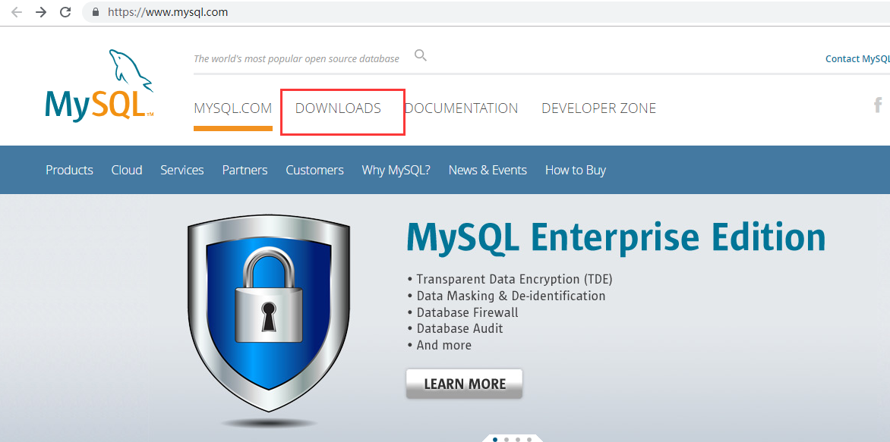
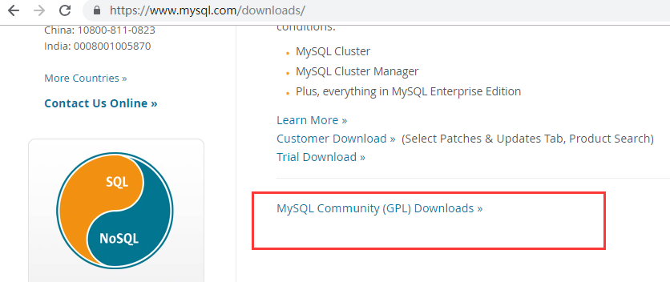
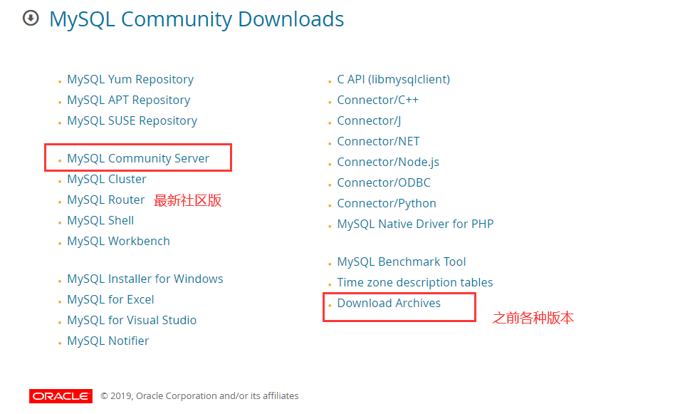
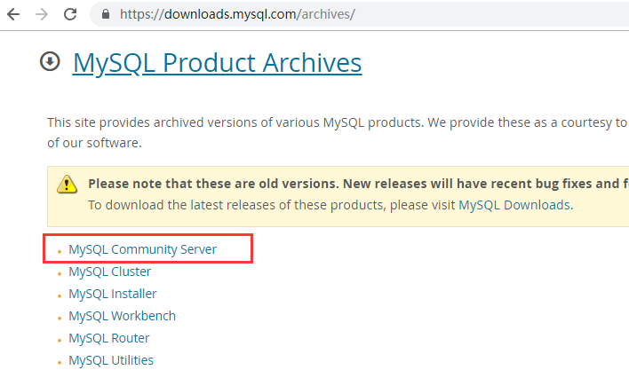
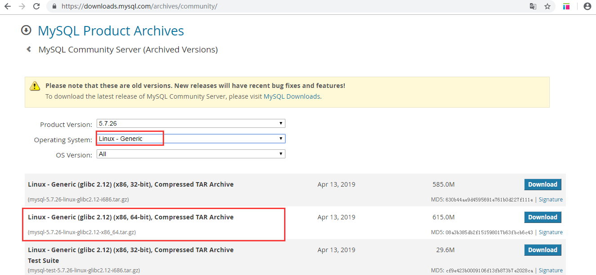

# mysql 安装

[TOC]

###  什么是数据库管理系统（DBMS）？

```css
RDBMS: 关系型数据库管理系统
比较适合于,安全级别要求高的数据以及关系较复杂的数据

NoSQL:非关系型数据库管理系统
适合于高性能存取数据,一般是配合RDBMS进行使用的
针对大数据处理分析,分布式架构更加擅长
```

### 数据库管理系统(DBMS)

- RDBMS :关系型
- NoSQL :非关系型
- NewSQL:分布式型

### 数据库管理系统种类

```csharp
RDBMS  ：
MySQL 、Oracle、MSSQL（SQL Server）、PG
 
NoSQL：Not Only SQL
键-值（key-value）：Redis, memcached
文档（document）：Mongodb
```

###  MySQL行业主流版本：

```css
5.6  
5.7    
8.0(现在开始研究新特性)
```

### 企业版本选择(MySQL分支版本),笔试题

```css
Oracle:
      MySQL官方版
红帽  :
      MariaDB
Percona:
      PerconaDB
```

### 版本选择建议要上新环境

```css
1.一般选择官方主流版本:5.6,5.7 
2.GA（稳定发布版）
3.6-12月的产品版本
```

### MySQL二进制安装

- 下载二进制包(https://downloads.mysql.com/archives/community/)











#### 安装

##### 上传解压

```sh
[root@db01 local]# tar xf mysql-5.7.26-linux-glibc2.12-x86_64.tar.gz 
```

##### 所需目录的创建

```sh
[root@db01 local]# mkdir -p /data/mysql/data
```

##### 创建用户和组

```sh
[root@db01 local]# useradd mysql
```

##### 授权 

```sh
chown -R mysql.mysql /data  /usr/local/mysql
```

##### 清理环境

```sh
[root@db01 local]# rpm -qa |grep mariadb
mariadb-libs-5.5.60-1.el7_5.x86_64
[root@db01 local]# yum remove -y mariadb-libs
```

##### 初始化数据

```sh
vim /etc/profile 
export PATH=/usr/local/mysql/bin:$PATH
source /etc/profile
```
> - Oracle MySQL 5.7之前以及MariaDB版本
> /usr/local/mysql/scripts/mysql_install_db --user=mysql --basedir=/usr/local/mysql --datadir=/data/mysql/data
>
> - Oracle MySQL 5.7之后
> [root@db01 local]# mysqld --initialize-insecure --user=mysql --basedir=/usr/local/mysql --datadir=/data/mysql/data
>
>   - 方法一：
>   
>     > **新特性重要说明:**
>     > **5.7开始,MySQL加入了全新的 密码的安全机制:**
>     > **1.初始化完成后,会生成临时密码(显示到屏幕上,并且会往日志中记一份)**
>     > **2.密码复杂度:长度:超过12位? 复杂度:字符混乱组合**
>     > **3.密码过期时间180天**
>   
>     ```sh
>     初始化数据，初始化管理员的临时密码
>     mysqld --initialize  --user=mysql --basedir=/app/mysql --datadir=/data/mysql
>     
>     2019-04-18T03:21:53.381108Z 0 [Warning] TIMESTAMP with implicit DEFAULT value is deprecated. Please use --explicit_defaults_for_timestamp server option (see documentation for more details).
>     2019-04-18T03:21:54.583415Z 0 [Warning] InnoDB: New log files created, LSN=45790
>     2019-04-18T03:21:54.697859Z 0 [Warning] InnoDB: Creating foreign key constraint system tables.
>     2019-04-18T03:21:54.760821Z 0 [Warning] No existing UUID has been found, so we assume that this is the first time that this server has been started. Generating a new UUID: 1daa0c57-6189-11e9-bc80-000c294234c8.
>     2019-04-18T03:21:54.770856Z 0 [Warning] Gtid table is not ready to be used. Table 'mysql.gtid_executed' cannot be opened.
>     ```
>   
>     
>   
>   - 方法二：
>   
>     > 在mysqld --initialize后面加一个参数，insecure，可以减除安全模式
>   
>     ```sh
>     方法二 :
>     初始化数据，初始化管理员的密码为空
>     
>     \rm -rf  /data/mysql/*
>     [root@db01 ~]# mysqld --initialize-insecure  --user=mysql --basedir=/app/mysql --datadir=/data/mysql
>     
>     2019-04-18T03:37:43.146018Z 0 [Warning] TIMESTAMP with implicit DEFAULT value is deprecated. Please use --explicit_defaults_for_timestamp server option (see documentation for more details).
>     2019-04-18T03:37:43.892132Z 0 [Warning] InnoDB: New log files created, LSN=45790
>     2019-04-18T03:37:43.970412Z 0 [Warning] InnoDB: Creating foreign key constraint system tables.
>     2019-04-18T03:37:44.029490Z 0 [Warning] No existing UUID has been found, so we assume that this is the first time that this server has been started. Generating a new UUID: 5378f3b3-618b-11e9-9164-000c294234c8.
>     2019-04-18T03:37:44.041469Z 0 [Warning] Gtid table is not ready to be used. Table 'mysql.gtid_executed' cannot be opened.
>     2019-04-18T03:37:44.042348Z 1 [Warning] root@localhost is created with an empty password ! Please consider switching off the --initialize-insecure option.
>     [root@db01 ~]# 
>     
>     [root@db01 ~]# cd /data/mysql/
>     [root@db01 mysql]# ll
>     total 110628
>     -rw-r----- 1 mysql mysql       56 Apr 18 11:37 auto.cnf
>     -rw-r----- 1 mysql mysql      419 Apr 18 11:37 ib_buffer_pool
>     -rw-r----- 1 mysql mysql 12582912 Apr 18 11:37 ibdata1
>     -rw-r----- 1 mysql mysql 50331648 Apr 18 11:37 ib_logfile0
>     -rw-r----- 1 mysql mysql 50331648 Apr 18 11:37 ib_logfile1
>     drwxr-x--- 2 mysql mysql     4096 Apr 18 11:37 mysql
>     drwxr-x--- 2 mysql mysql     8192 Apr 18 11:37 performance_schema
>     drwxr-x--- 2 mysql mysql     8192 Apr 18 11:37 sys
>     [root@db01 mysql]# 
>     ```
>   
>     
>

#####  MySQL安装报错整理

```sh
1.mysqld: error while loading shared libraries: libaio.so.1: cannot open shared object file: No such file or directory

#报错原因：缺少libao-devel包
#解决方法：yum install -y libaio-devel

2.[root@mysql /data/mysql/data]# mysqld --initialize --user=mysql --basedir=/application/mysql --datadir=/data/mysql/data
2019-07-25T13:17:21.338642Z 0 [Warning] TIMESTAMP with implicit DEFAULT value is deprecated. Please use --explicit_defaults_for_timestamp server option (see documentation for more details).
2019-07-25T13:17:21.341533Z 0 [ERROR] --initialize specified but the data directory has files in it. Aborting.
2019-07-25T13:17:21.341574Z 0 [ERROR] Aborting

#报错原因：/data/mysql/data下目录下有文件(mysql的保护措施)
#解决办法：清空/data/mysql/data !!!只在全新环境情况

3.[root@mysql /application/mysql/support-files]# ./mysql.server start
Starting MySQL.sed: -e expression #1, char 19: unknown option to `s'
Logging to '/data/mysql/data/mysql.err'.
.... ERROR! The server quit without updating PID file (/data/mysql/data/mysql.pid).

#解决方法：查看错误日志/data/mysql/data/mysql.err
#/etc/my.cnf配置文件编写错误（参数改错了）

4.MySQL数据库无法启动的原因
without updating PID 类似错误
查看日志:data/mysql/data/主机名.err 找[ERROR] 中括号是ERROR的

#可能原因：
#/etc/my.cnf 路径不对等
#/tmp/mysql.sock 文件修改过 或 删除过
#数据目录权限不是mysql
#参数改错了
```

##### 配置文件准备

```sh
[root@db01 ~]# vim /etc/my.cnf
[mysqld]
user=mysql
basedir=/usr/local/mysql
datadir=/data/mysql/data
socket=/tmp/mysql.sock
port=3306
[mysql]
socket=/tmp/mysql.sock
```

##### 启动MySQL

```sh
[root@db01 ~]# cd /usr/local/mysql/support-files/
#原始方法 
[root@db01 ~]#./usr/local/mysql/support-files/mysql.server

[root@db01 support-files]# cp mysql.server /etc/init.d/mysqld
#centos7 centos6通用
[root@db01 support-files]# service mysqld start
#centos7
[root@db01 ~]# /etc/init.d/mysqld start   
Starting MySQL.Logging to '/data/3306/data/db01.err'.
SUCCESS! 
#systemctl方法
[root@db01 support-files]# chkconfig --add mysqld
[root@db01 support-files]# systemctl start/stop/restart mysqld
```

##### 使用systemd管理mysql(另外一种方法)

```sh
cat > /etc/systemd/system/mysqld.service <<EOF
[Unit]
Description=MySQL Server
Documentation=man:mysqld(8)
Documentation=http://dev.mysql.com/doc/refman/en/using-systemd.html
After=network.target
After=syslog.target
[Install]
WantedBy=multi-user.target
[Service]
User=mysql
Group=mysql
ExecStart=/application/mysql/bin/mysqld --defaults-file=/etc/my.cnf
LimitNOFILE = 5000
EOF
```

> 注意：将原来模式启动mysqld先关闭，然后再用systemd管理。

##### 本地管理员用户设置密码

```sh
[root@db01 ~]# mysqladmin -uroot -p password 123
```

##### 连接管理

(1) socket: 本地登录

>  前提: 一定创建localhost的用户,并授权

```sh
mysql> grant all on *.* to oldguo@'localhost' identified by '123';

[root@db01 ~]# mysql -uoldguo -p123 -S /tmp/mysql.sock
```

(2) tcpip : 远程登录

> 前提: 一定创建带有远程地址段的用户,并授权

```sh
mysql> grant all on *.* to oldguo@'10.0.0.%' identified by '123';
[root@db01 ~]# mysql -uoldguo -p123 -h 10.0.0.51 -P 3306
```


##### 忘记root本地管理员密码丢失,处理方法?

(1) 关闭数据库

```sh
mysqladmin -uroot -p shutdown
```

(2) 将数据库启动到无验证模式

```sh
[root@db01 ~]# mysqld_safe --skip-grant-tables --skip-networking &
```

(3) 修改密码

```sh
mysql>flush privileges;
mysql>alter user root@'localhost' identified by '123456';
```

(4)重启数据库为正常模式

```sh
[root@db01 ~]# /etc/init.d/mysqld restart
```

(5)测试新密码

```sh
[root@db01 ~]# mysql -uroot -p123456
```

