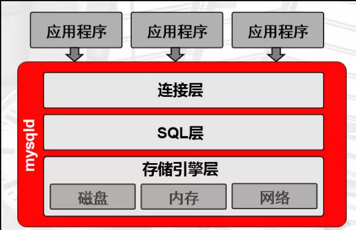
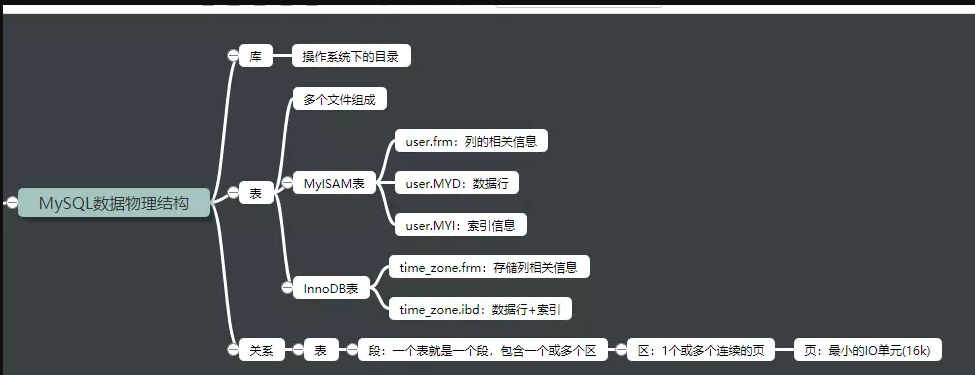
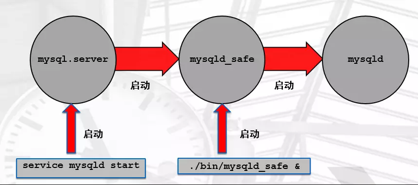
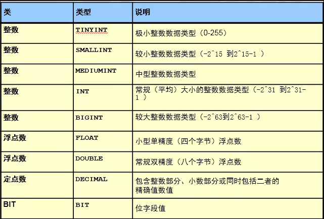
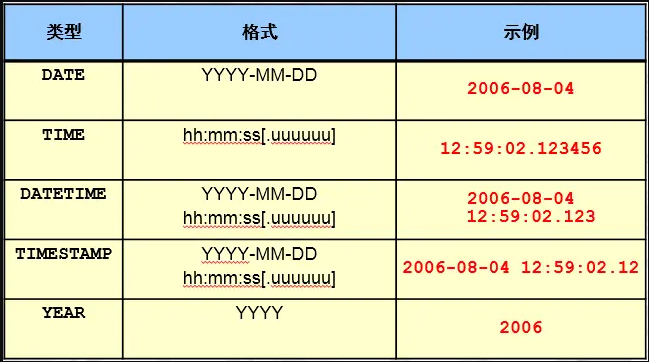
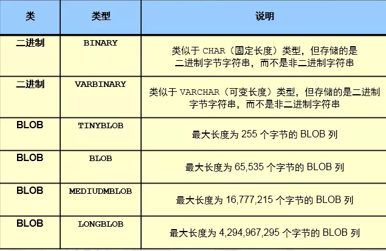

# Mysql随笔

[TOC]

## 概念

### mysqld程序运行原理



### 一条SQL语句的执行过程

```ruby
连接层
（1）提供连接协议：TCP/IP 、SOCKET
（2）提供验证：用户、密码，IP，SOCKET
（3）提供专用连接线程：接收用户SQL，返回结果
通过以下语句可以查看到连接线程基本情况
mysql> show processlist;
```

### SQL层 （重点）

```SH
（1）接收上层传送的SQL语句
（2）语法验证模块：验证语句语法,是否满足SQL_MODE
（3）语义检查：判断SQL语句的类型
    DDL ：数据定义语言
    DCL ：数据控制语言
    DML ：数据操作语言
    DQL： 数据查询语言
    ...
（4）权限检查：用户对库表有没有权限
（5）解析器：对语句执行前,进行预处理，生成解析树(执行计划),说白了就是生成多种执行方案.
（6）优化器：根据解析器得出的多种执行计划，进行判断，选择最优的执行计划
    代价模型：资源（CPU IO MEM）的耗损评估性能好坏
（7）执行器：根据最优执行计划，执行SQL语句，产生执行结果
	执行结果：在磁盘的xxxx位置上
（8）提供查询缓存（默认是没开启的），会使用redis tair替代查询缓存功能
（9）提供日志记录（日志管理章节）：binlog，默认是没开启的。
```

### 存储引擎层（类似于Linux中的文件系统）

```sh
负责根据SQL层执行的结果，从磁盘上拿数据。
将16进制的磁盘数据，交由SQL结构化化成表，
连接层的专用线程返回给用户。
```

### 逻辑结构


### 物理存储结构



### 库的物理存储结构

```undefined
用文件系统的目录来存储
```

### 表的物理存储结构

```css
MyISAM（一种引擎）的表：
-rw-r----- 1 mysql mysql   10816 Apr 18 11:37 user.frm
-rw-r----- 1 mysql mysql     396 Apr 18 12:20  user.MYD
-rw-r----- 1 mysql mysql    4096 Apr 18 14:48 user.MYI

InnoDB(默认的存储引擎)的表：
-rw-r----- 1 mysql mysql    8636 Apr 18 11:37 time_zone.frm
-rw-r----- 1 mysql mysql   98304 Apr 18 11:37 time_zone.ibd
time_zone.frm：存储列相关信息
time_zone.ibd：数据行+索引
```

### 表的段、区、页（16k）

```undefined
页：最小的存储单元，默认16k
区：64个连续的页，共1M
段：一个表就是一个段，包含一个或多个区
```

## 基础管理

### 管理操作：

```css
增：
mysql> create user oldboy@'10.0.0.%' identified by '123';
查：
mysql> desc mysql.user;    ---->  authentication_string
mysql> select user ,host ,authentication_string from mysql.user
改:
mysql> alter user oldboy@'10.0.0.%' identified by '456';
删：
mysql> drop user oldboy@'10.0.0.%';
```

### 权限

##### 权限管理操作：

```css
mysql> grant all on wordpress.* to wordpress@'10.0.0.%' identified  by '123';
```

##### 常用权限介绍:

```css
ALL:
SELECT,INSERT, UPDATE, DELETE, CREATE, DROP, RELOAD, SHUTDOWN, PROCESS, FILE, REFERENCES, INDEX, ALTER, SHOW DATABASES, SUPER, CREATE TEMPORARY TABLES, LOCK TABLES, EXECUTE, REPLICATION SLAVE, REPLICATION CLIENT, CREATE VIEW, SHOW VIEW, CREATE ROUTINE, ALTER ROUTINE, CREATE USER, EVENT, TRIGGER, CREATE TABLESPACE
ALL : 以上所有权限，一般是普通管理员拥有的
with grant option：超级管理员才具备的，给别的用户授权的功能
```

##### 权限作用范围:

```css
*.*                  ---->管理员用户
wordpress.*          ---->开发和应用用户
wordpress.t1
```

##### 需求

(1) windows机器的navicat登录到linux中的MySQL，管理员用户。

```css
mysql> grant all on *.* to root@'10.0.0.%' identified by '123';
```

(2) 创建一个应用用户app用户，能从windows上登录mysql，并能操作app库

```css
mysql> grant select ,update,insert,delete on app.* to app@'10.0.0.%' identified by '123';
```

> ### 提示：8.0在grant命令添加新特性
>
> ```undefined
> 建用户和授权分开了
> grant 不再支持自动创建用户了，不支持改密码
> 授权之前，必须要提前创建用户。
> ```

##### 查看授权

```css
mysql> show grants for app@'10.0.0.%';
```

##### 回收权限

```css
revoke  delete on app.*  from app@'10.0.0.%'；
```

##### 本地管理员用户密码忘记

```css
[root@db01 ~]# mysqld_safe --skip-grant-tables --skip-networking &
mysql> flush privileges;
mysql>  alter user root@'localhost' identified by '123456';
[root@db01 ~]# pkill mysqld
[root@db01 ~]# systemctl start  mysqld
```

### 自带客户端命令

##### mysql 常用参数：

```sh
-u                   用户
-p                   密码
-h                   IP
-P                   端口
-S                   socket文件
-e                   免交互执行命令
<                    导入SQL脚本

[root@db01 ~]# mysql -uroot -p -h 10.0.0.51 -P3306
Enter password:
mysql> select @@socket;
+-----------------+
| @@socket        |
+-----------------+
| /tmp/mysql.sock |
[root@db01 ~]# mysql -uroot -p -S /tmp/mysql.sock
Enter password:
[root@db01 ~]# mysql -uroot -p -e "select user,host from mysql.user;"
Enter password:
+---------------+-----------+
| user          | host      |
+---------------+-----------+
| abc          | 10.0.0.%  |
| app          | 10.0.0.%  |
| root          | 10.0.0.%  |
| mysql.session | localhost |
| mysql.sys    | localhost |
| root          | localhost |
+---------------+-----------+
[root@db01 ~]#
[root@db01 ~]# mysql -uroot -p <world.sql
Enter password:
[root@db01 ~]#
```



##### 提示：

```css
以上多种方式，都可以单独启动MySQL服务
mysqld_safe和mysqld一般是在临时维护时使用。
另外，从Centos 7系统开始，支持systemd直接调用mysqld的方式进行启动数据库
```

### 初始化配置

##### 作用

```undefined
控制MySQL的启动
影响到客户端的连接
```

##### 初始化配置的方法

```undefined
预编译
**配置文件(所有启动方式)**
命令行参数 (仅限于 mysqld_safe mysqld)
```

##### 初始配置文件 

###### 初始化配置文件的默认读取路径:

```bash
[root@db01 ~]# mysqld --help --verbose |grep my.cnf
/etc/my.cnf /etc/mysql/my.cnf /usr/local/mysql/etc/my.cnf ~/.my.cnf
注:
默认情况下，MySQL启动时，会依次读取以上配置文件，如果有重复选项，会以最后一个文件设置的为准。
但是，如果启动时加入了--defaults-file=xxxx时，以上的所有文件都不会读取.
```

###### 配置文件的书写方式:

```css
[标签]
配置项=xxxx

标签类型：服务端、客户端
服务器端标签：
[mysqld]
[mysqld_safe]
[server]

客户端标签：
[mysql]
[mysqldump]
[client]

配置文件的示例展示：
[root@db01 ~]# cat /etc/my.cnf
[mysqld]
user=mysql
basedir=/app/mysql
datadir=/data/mysql
socket=/tmp/mysql.sock
server_id=6
port=3306
log_error=/data/mysql/mysql.log
[mysql]
socket=/tmp/mysql.sock
prompt=Master [\\d]>
```

### 多实例的应用

#####  准备多个目录

```kotlin
mkdir -p /data/330{7,8,9}/data
```

##### 准备配置文件

```css
cat > /data/3307/my.cnf <<EOF
[mysqld]
basedir=/app/mysql
datadir=/data/3307/data
socket=/data/3307/mysql.sock
log_error=/data/3307/mysql.log
port=3307
server_id=7
log_bin=/data/3307/mysql-bin
EOF

cat > /data/3308/my.cnf <<EOF
[mysqld]
basedir=/app/mysql
datadir=/data/3308/data
socket=/data/3308/mysql.sock
log_error=/data/3308/mysql.log
port=3308
server_id=8
log_bin=/data/3308/mysql-bin
EOF

cat > /data/3309/my.cnf <<EOF
[mysqld]
basedir=/app/mysql
datadir=/data/3309/data
socket=/data/3309/mysql.sock
log_error=/data/3309/mysql.log
port=3309
server_id=9
log_bin=/data/3309/mysql-bin
EOF
```
##### 授权

```css
chown -R mysql.mysql /data/*
```

##### 初始化三套数据

```css
mv /etc/my.cnf /etc/my.cnf.bak
mysqld --initialize-insecure  --user=mysql --datadir=/data/3307/data --basedir=/app/mysql
mysqld --initialize-insecure  --user=mysql --datadir=/data/3308/data --basedir=/app/mysql
mysqld --initialize-insecure  --user=mysql --datadir=/data/3309/data --basedir=/app/mysql
```

##### systemd管理多实例(二选一)

```css
cd /etc/systemd/system
cp mysqld.service mysqld3307.service
cp mysqld.service mysqld3308.service
cp mysqld.service mysqld3309.service

vim mysqld3307.service
ExecStart=/app/mysql/bin/mysqld  --defaults-file=/data/3307/my.cnf
vim mysqld3308.service
ExecStart=/app/mysql/bin/mysqld  --defaults-file=/data/3308/my.cnf
vim mysqld3309.service
ExecStart=/app/mysql/bin/mysqld  --defaults-file=/data/3309/my.cnf
```
##### 启动

```css
systemctl start mysqld3307.service
systemctl start mysqld3308.service
systemctl start mysqld3309.service
```
##### 启动实例(二选一)

```css
mysqld_safe --defaults-file=/data/3307/my.cnf &
mysqld_safe --defaults-file=/data/3308/my.cnf &
mysqld_safe --defaults-file=/data/3309/my.cnf &
```
##### 验证多实例

```css
netstat -lnp|grep 330
mysql -S /data/3307/mysql.sock -e "select @@server_id"
mysql -S /data/3308/mysql.sock -e "select @@server_id"
mysql -S /data/3309/mysql.sock -e "select @@server_id"
```

### SQL基础应用

```sh
#SQL介绍
结构化查询语言
5.7 以后符合SQL92严格模式
通过sql_mode参数来控制
```

##### 种类

###### **1.数值类型**



```sh
tinyint  ： -128~127
int       ：-2^31~2^31-1
说明：手机号是无法存储到int的。一般是使用char类型来存储收集号
```

###### **2.字符类型**


```sh
char(11) ：
定长 的字符串类型,在存储字符串时，最大字符长度11个，立即分配11个字符长度的存储空间，如果存不满，空格填充。
varchar(11):
变长的字符串类型看，最大字符长度11个。在存储字符串时，自动判断字符长度，按需分配存储空间。
enum('bj','tj','sh')：
枚举类型，比较适合于将来此列的值是固定范围内的特点，可以使用enum,可以很大程度的优化我们的索引结构。
```

###### **3.时间类型**



列值不能为空，也是表设计的规范，尽可能将所有的列设置为非空。可以设置默认值为0
**unique key**

**unsigned**

其他属性:
 **key** :索引
 可以在某列上建立索引，来优化查询

```css
DATETIME 
范围为从 1000-01-01 00:00:00.000000 至 9999-12-31 23:59:59.999999。
TIMESTAMP 
1970-01-01 00:00:00.000000 至 2038-01-19 03:14:07.999999。
timestamp会受到时区的影响
```

###### **4.二进制类型**



##### 表属性

###### 列属性

```cpp
约束(一般建表时添加):
**primary key** ：主键约束
设置为主键的列，此列的值必须非空且唯一，主键在一个表中只能有一个，但是可以有多个列一起构成。
**not null**      ：非空约束
列值不能为空，也是表设计的规范，尽可能将所有的列设置为非空。可以设置默认值为0
**unique key** ：唯一键
列值不能重复
**unsigned** ：无符号
针对数字列，非负数。

其他属性:
**key** :索引
可以在某列上建立索引，来优化查询,一般是根据需要后添加
**default**           :默认值
列中，没有录入值时，会自动使用default的值填充
**auto_increment**:自增长
针对数字列，顺序的自动填充数据（默认是从1开始，将来可以设定起始点和偏移量）
**comment ** : 注释
```

###### 表的属性

```sh
存储引擎:
InnoDB（默认的）
字符集和排序规则:
utf8       
utf8mb4
```

##### DDL应用

###### 创建数据库

```dart
create database school;
create schema sch;
show charset;
show collation;
CREATE DATABASE test CHARSET utf8;
create database xyz charset utf8mb4 collate utf8mb4_bin;

建库规范：
1.库名不能有大写字母   
2.建库要加字符集         
3.库名不能有数字开头
4. 库名要和业务相关
```

###### 建库标准语句

```dart
mysql> create database db charset utf8mb4;
mysql> show create database xuexiao;
```

###### 删除

```rust
mysql> drop database oldboy;
```

###### 修改

```undefined
SHOW CREATE DATABASE school;
ALTER DATABASE school  CHARSET utf8;
注意：修改字符集，修改后的字符集一定是原字符集的严格超集
```

###### 查询库相关信息（DQL）

```dart
show databases；
show create database oldboy；
```

##### 表定义

###### 创建

```undefined
create table stu(
列1  属性（数据类型、约束、其他属性） ，
列2  属性，
列3  属性
)
```

###### 建表

```php
USE school;
CREATE TABLE stu(
id      INT NOT NULL PRIMARY KEY AUTO_INCREMENT COMMENT '学号',
sname   VARCHAR(255) NOT NULL COMMENT '姓名',
sage    TINYINT UNSIGNED NOT NULL DEFAULT 0 COMMENT '年龄',
sgender ENUM('m','f','n') NOT NULL DEFAULT 'n' COMMENT '性别' ,
sfz     CHAR(18) NOT NULL UNIQUE  COMMENT '身份证',
intime  TIMESTAMP NOT NULL DEFAULT NOW() COMMENT '入学时间'
) ENGINE=INNODB CHARSET=utf8 COMMENT '学生表';
#建表规范：
#1. 表名小写
#2. 不能是数字开头
#3. 注意字符集和存储引擎
#4. 表名和业务有关
#5. 选择合适的数据类型
#6. 每个列都要有注释
#7. 每个列设置为非空，无法保证非空，用0来填充。
```

###### 删除

```rust
drop table t1;
```

###### 修改

```php
#在stu表中添加qq列
DESC stu;
ALTER TABLE stu ADD qq VARCHAR(20) NOT NULL UNIQUE COMMENT 'qq号';
```

```php
#在sname后加微信列
ALTER TABLE stu ADD wechat VARCHAR(64) NOT NULL UNIQUE  COMMENT '微信号' AFTER sname ;
```

```sh
#在id列前加一个新列num
ALTER TABLE stu ADD num INT NOT NULL COMMENT '数字' FIRST;
DESC stu;
```

```sh
#把刚才添加的列都删掉
ALTER TABLE stu DROP num;
ALTER TABLE stu DROP qq;
ALTER TABLE stu DROP wechat;
```

```sh
#修改sname数据类型的属性
ALTER TABLE stu MODIFY sname VARCHAR(128)  NOT NULL ;
```

```php
#将sgender 改为 sg 数据类型改为 CHAR 类型
ALTER TABLE stu CHANGE sgender sg CHAR(1) NOT NULL DEFAULT 'n' ;
DESC stu;
```

##### DCL应用 

```sh
grant 
revoke
```

##### DML应用

> 对表中的数据行进行增、删、改

###### insert

```sh
#基本语法
insert into 表名 (字段列表) values (值列表);
#例子
INSERT INTO table_name ( field1, field2 ) VALUES ( value1, value2 );

--- 省事的写法
INSERT INTO stu 
VALUES
(2,'ls',18,'m','1234567',NOW());
--- 针对性的录入数据
INSERT INTO stu(sname,sfz)
VALUES ('w5','34445788');
--- 同时录入多行数据
INSERT INTO stu(sname,sfz)
VALUES 
('w55','3444578d8'),
('m6','1212313'),
('aa','123213123123');
SELECT * FROM stu;

```

###### 蠕虫复制

```sql
-- 从已有的数据中取获取数据，然后将数据又进行新增操作实现数据成倍的增加(1-2-4-8-16......增长。)
-- 1.从已有表创建新表(复制表结构)
-- create table 表名 like 数据库.表名
-- 例子：test1
create table test1(
id int not null primary key auto_increment,
name varchar(20),
gender int(1) default 0,
age int(2) not null);
 
-- test2(test2复制了test1里的表结构)
create table test2 like test1;

-- 2.查出数据，然后将查出的数据新增一遍
-- insert into 表名(字段列表) select  字段列表/* from 数据表名

#从test1 获取原始数据复制到表test2
insert into test2 select * from test1;
#复制自身，数据可成倍的提高。(经常用于测试数据)
insert into test2 select * from test2;
#复制自身，如果有主键可能会报错(原因就是主键冲突，解决办法，不复制主键：)
insert into test2(name,gender,age) select name,gender,age from test2;
```

###### update

```sh
#基本语法(更新)
update 表名 set 字段 = 值 [where条件] 
#高级语法
update 表名 set 字段 = 值 [where条件] [limit 更新数量]

DESC stu;
SELECT * FROM stu;
UPDATE stu SET sname='zhao4' WHERE id=2;
注意：update语句必须要加where。
```

###### delete

```sh
DELETE FROM stu  WHERE id=3;
```

###### 全表删除

```sh
DELETE FROM stu
truncate table stu;
区别:
delete: DML操作, 是逻辑性质删除,逐行进行删除,速度慢.如果表中存在主键自增长，那么当删除之后，自增长不会还原
truncate: DDL操作,对与表段中的数据页进行清空,速度快.truncate 表名,重置自动增长
```

##### DQL应用

###### 单独使用

```css
-- select @@xxx 查看系统参数
SELECT @@port;
SELECT @@basedir;
SELECT @@datadir;
SELECT @@socket;
SELECT @@server_id;
```

###### select 函数();

```csharp
SELECT NOW();
SELECT DATABASE();
SELECT USER();
SELECT CONCAT("hello world");
SELECT CONCAT(USER,"@",HOST) FROM mysql.user;
SELECT GROUP_CONCAT(USER,"@",HOST) FROM mysql.user;
https://dev.mysql.com/doc/refman/5.7/en/func-op-summary-ref.html?tdsourcetag=s_pcqq_aiomsg
```

###### where配合模糊查询

```sh
#查询省的名字前面带guang开头的
SELECT * FROM city WHERE district LIKE 'guang%';    
注意:%不能放在前面,因为不走索引.
```

###### where配合in语句

```sh
SELECT * FROM city WHERE countrycode IN ('CHN' ,'USA');
```

###### where配合between and

```sh
#查询世界上人口数量大于100w小于200w的城市信息
SELECT * FROM city  WHERE population >1000000 AND population <2000000;
SELECT * FROM city  WHERE population BETWEEN 1000000 AND 2000000;
```

###### group by + 常用聚合函数

```sh
**max()**      ：最大值
**min()**      ：最小值
**avg()**      ：平均值
**sum()**      ：总和
**count()**    ：个数
group_concat() : 列转行
```

```sh
#统计世界上每个国家的总人口数.
USE world
SELECT countrycode ,SUM(population)    FROM  city  GROUP BY countrycode;

#统计中国各个省的总人口数量
SELECT district,SUM(Population) FROM city  WHERE countrycode='chn' GROUP BY district;

#统计世界上每个国家的城市数量
SELECT countrycode,COUNT(id)  FROM city GROUP BY countrycode;

```

###### having

```csharp
where|group|having
```

```sh
#统计中国每个省的总人口数，只打印总人口数小于100
SELECT district,SUM(Population)
FROM city
WHERE countrycode='chn'
GROUP BY district
HAVING SUM(Population) < 1000000 ;
```

###### order by + limit

```php
#统计中国各个省的总人口数量，按照总人口从大到小排序
SELECT district AS 省 ,SUM(Population) AS 总人口
FROM city
WHERE countrycode='chn'
GROUP BY district
ORDER BY 总人口 DESC ;

#统计中国,每个省的总人口,找出总人口大于500w的,并按总人口从大到小排序,只显示前三名
SELECT  district, SUM(population)  FROM  city 
WHERE countrycode='CHN'
GROUP BY district 
HAVING SUM(population)>5000000
ORDER BY SUM(population) DESC
LIMIT 3 ;

LIMIT N ,M --->跳过N,显示一共M行
LIMIT 5,5

SELECT  district, SUM(population)  FROM  city 
WHERE countrycode='CHN'
GROUP BY district 
HAVING SUM(population)>5000000
ORDER BY SUM(population) DESC
LIMIT 5,5;
```

###### distinct：去重复

```sh
SELECT countrycode FROM city ;
SELECT DISTINCT(countrycode) FROM city  ;
```

###### 联合查询- union all

```sh
-- 中国或美国城市信息

SELECT * FROM city 
WHERE countrycode IN ('CHN' ,'USA');

SELECT * FROM city WHERE countrycode='CHN'
UNION ALL
SELECT * FROM city WHERE countrycode='USA'

说明:一般情况下,我们会将 IN 或者 OR 语句 改写成 UNION ALL,来提高性能
UNION     去重复
UNION ALL 不去重复
```

##### 视图

```sh
DESC information_schema.TABLES
TABLE_SCHEMA    ---->库名
TABLE_NAME      ---->表名
ENGINE          ---->引擎
TABLE_ROWS      ---->表的行数
AVG_ROW_LENGTH  ---->表中行的平均行（字节）
INDEX_LENGTH    ---->索引的占用空间大小（字节）
```
###### - 查询整个数据库中所有库和所对应的表信息

```sh
SELECT table_schema,GROUP_CONCAT(table_name)
FROM  information_schema.tables
GROUP BY table_schema;
```
###### - 统计所有库下的表个数

```sh
SELECT table_schema,COUNT(table_name)
FROM information_schema.TABLES
GROUP BY table_schema
```
###### - 查询所有innodb引擎的表及所在的库

```sh
SELECT table_schema,table_name,ENGINE FROM information_schema.`TABLES`
WHERE ENGINE='innodb';
```
###### - 统计world数据库下每张表的磁盘空间占用

```sh
SELECT table_name,CONCAT((TABLE_ROWS*AVG_ROW_LENGTH+INDEX_LENGTH)/1024," KB")  AS size_KB
FROM information_schema.tables WHERE TABLE_SCHEMA='world';
```
###### - 统计所有数据库的总的磁盘空间占用

```sh
SELECT
TABLE_SCHEMA,
CONCAT(SUM(TABLE_ROWS*AVG_ROW_LENGTH+INDEX_LENGTH)/1024," KB") AS Total_KB
FROM information_schema.tables
GROUP BY table_schema;
mysql -uroot -p123 -e "SELECT TABLE_SCHEMA,CONCAT(SUM(TABLE_ROWS*AVG_ROW_LENGTH+INDEX_LENGTH)/1024,' KB') AS Total_KB FROM information_schema.tables GROUP BY table_schema;"
```
###### 生成整个数据库下的所有表的单独备份语句

```jsx
模板语句：
mysqldump -uroot -p123 world city >/tmp/world_city.sql
SELECT CONCAT("mysqldump -uroot -p123 ",table_schema," ",table_name," >/tmp/",table_schema,"_",table_name,".sql" )
FROM information_schema.tables
WHERE table_schema NOT IN('information_schema','performance_schema','sys')
INTO OUTFILE '/tmp/bak.sh' ;

CONCAT("mysqldump -uroot -p123 ",table_schema," ",table_name," >/tmp/",table_schema,"_",table_name,".sql" )
```

```sh
#107张表，都需要执行以下2条语句
ALTER TABLE world.city DISCARD TABLESPACE;
ALTER TABLE world.city IMPORT TABLESPACE;
SELECT CONCAT("alter table ",table_schema,".",table_name," discard tablespace")
FROM information_schema.tables
WHERE table_schema='world'
INTO OUTFILE '/tmp/dis.sql';
```

##### show 命令

```sh
show  databases;                          #查看所有数据库
show tables;                              #查看当前库的所有表
SHOW TABLES FROM                          #查看某个指定库下的表
show create database world                #查看建库语句
show create table world.city              #查看建表语句
show  grants for  root@'localhost'        #查看用户的权限信息
show  charset；                           #查看字符集
show collation                            #查看校对规则
show processlist;                         #查看数据库连接情况
show index from                           #表的索引情况
show status                               #数据库状态查看
SHOW STATUS LIKE '%lock%';                #模糊查询数据库某些状态
SHOW VARIABLES                            #查看所有配置信息
SHOW variables LIKE '%lock%';             #查看部分配置信息
show engines                              #查看支持的所有的存储引擎
show engine innodb status\G               #查看InnoDB引擎相关的状态信息
show binary logs                          #列举所有的二进制日志
show master status                        #查看数据库的日志位置信息
show binlog evnets in                     #查看二进制日志事件
show slave status \G                      #查看从库状态
SHOW RELAYLOG EVENTS                      #查看从库relaylog事件信息
desc  (show colums from city)             #查看表的列定义信息
http://dev.mysql.com/doc/refman/5.7/en/show.html
```

