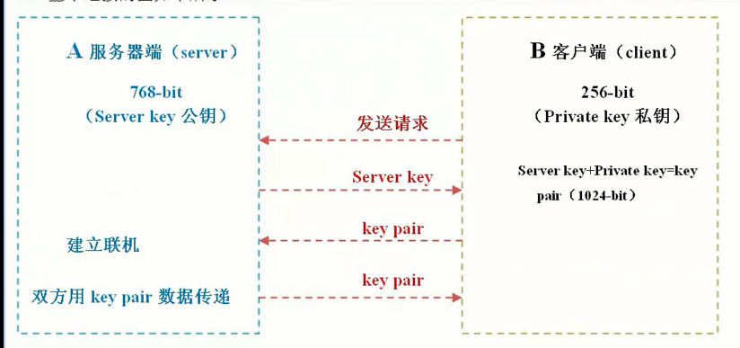

# SSH服务

[TOC]
### ssh加密原理




### 客户端相关命令

```sh
ssh
        ssh客户端 远程连接 远程执行命令
        -P
            指定端口号
        ssh -p22 oldboy@10.0.0.41 whoami
        没加密telnet软件
    scp
        远程传输数据
        rpc remote cp未加密
        -p(大写)
            指定端口号
        -r
            复制目录的时候
        scp -P22  -r  /etc 172.16.1.41:/tmp
    sftp
        lrzsz rz 和sz
        上传或下载
        -P
        xsell ---ssh
        xftp ----sftp
```

### 创建秘钥认证

#### 安装软件

```sh
[root@m01 ~] yum install -y sshpass pssh
```

#### 创建秘钥对

> ######  SSH 密钥类型的的选择（rsa， dsa or other）
>
> 在用 ssh-keygen 生成密钥对时，通常会面临是使用RSA还是DSA的选择：RSA or DSA, this is a question! 今天在这里分析一下：
>
> **原理与安全性**
>
> ​    RSA 与 DSA 都是非对称加密算法。其中RSA的安全性是基于极其困难的大整数的分解（两个素数的乘积）；DSA 的安全性是基于整数有限域离散对数难题。基本上可以认为相同密钥长度的 RSA 算法与 DSA 算法安全性相当。
>
> ​    有点要注意，RSA 的安全性依赖于大数分解，但是否等同于大数分解一直未能得到理论上的证明，因为没有证明破解 RSA 就一定需要作大数分解。不过也不必太过担心，RSA 从诞生以来，经历了各种攻击，至今未被完全攻破（依靠暴力破解，小于1024位密钥长度的 RSA 有被攻破的记录，但未从算法上被攻破）。
>
> **用途：**
>
> ​    DSA 只能用于数字签名，而无法用于加密（某些扩展可以支持加密）；RSA 即可作为数字签名，也可以作为加密算法。不过作为加密使用的 RSA 有着随密钥长度增加，性能急剧下降的问题。
>
> **性能：**
>
> ​    相同密钥长度下，DSA 做签名时速度更快，但做签名验证时速度较慢，一般情况验证签名的次数多于签名的次数。
>
> ​    相同密钥长度下，DSA （在扩展支持下）解密密文更快，而加密更慢；RSA 正好反过来，一般来说解密次数多于加密次数。不过由于非对称加密算法的先天性能问题，两者都不是加密的好选择。
>
> **业界支持：**
>
> ​    在业界支持方面，RSA 显然是赢家。RSA 具有更为广泛的部署与支持。
>
> **使用 ssh-keygen 时的选择：**
>
> ​    上面说了那么多，可以看到RSA 与 DSA 各有优缺点。回到开头的问题，在使用 ssh-keygen 时，RSA 与 DSA到底选哪个？ 比较有意思的是，这个问题最终答案与上面那些优缺点无关。虽然理论上可以生成更长长度的 DSA 密钥 （NIST FIPS 186-3），但ssh-keygen在生成 DSA 密钥时，其长度只能为1024位（基于NIST FIPS 186-2）；而 ssh-keygen 在 RSA 的密钥长度上没有限制。
>
> ​     由于小于1024位密钥长度的 RSA 已经有被攻破的记录，所以说现在：**RSA 2048 位密钥是更好的选择。**


```sh
[root@m01 ~]# ssh-keygen -t dsa 
Generating public/private dsa key pair.
Enter file in which to save the key (/root/.ssh/id_dsa):     ##输入存放秘钥的文件
Enter passphrase (empty for no passphrase):            ##输入密码，空为无密码
Enter same passphrase again:                                   ##再次输入一次
Your identification has been saved in /root/.ssh/id_dsa. 
Your public key has been saved in /root/.ssh/id_dsa.pub.
The key fingerprint is:
SHA256:VW1UamyTZ0YDIHQxi00U7DrtJAX/BN0k5cbuhNRRA58 root@m01
The key's randomart image is:
+---[DSA 1024]----+
|        .ooO**BB=|
|         .*+ooO==|
|         .=o.oBE+|
|         . +.++= |
|        S + o. o |
|         + o .o  |
|          =    . |
|           .     |
|                 |
+----[SHA256]-----+
```

> 如果想免交互创建秘钥的话，需要写脚

	#!/bin/bash 
	if [ ! -f /root/.ssh/id_dsa ]
	then 
	   ssh-keygen -t dsa -f /root/.ssh/id_dsa  -P ""
	   echo "密钥创建成功"
	else 
	   echo "密钥已经创建"
	fi 
#### 检查 秘钥

```sh
[root@m01 ~]# ll ~/.ssh/
total 12
-rw------- 1 root root 668 May 27 12:13 id_dsa
-rw-r--r-- 1 root root 598 May 27 12:13 id_dsa.pub
```

#### 发送公钥 到backup端

```sh
[root@m01 ~]# ssh-copy-id -i ~/.ssh/id_dsa.pub  172.16.1.41 
/usr/bin/ssh-copy-id: INFO: Source of key(s) to be installed: "/root/.ssh/id_dsa.pub"
/usr/bin/ssh-copy-id: INFO: attempting to log in with the new key(s), to filter out any that are already installed
/usr/bin/ssh-copy-id: INFO: 1 key(s) remain to be installed -- if you are prompted now it is to install the new keys
root@172.16.1.41's password: 

Number of key(s) added: 1

Now try logging into the machine, with:   "ssh '172.16.1.41'"
and check to make sure that only the key(s) you wanted were added.
```

> 发送成功以后，m01服务器~/.ssh/下会生成known_hosts文件， backup服务器~/.ssh/会生成authorized_keys文件

#### 进行测试

```sh
[root@m01 ~]# ssh 10.0.0.8
Last login: Sat Oct 12 14:16:54 2019 from 10.0.0.61
[root@web02 ~]# 
```

#### 批量分发公钥脚本

```sh
[root@m01 /server/scripts]# cat fenfa_pub_check.sh
#!/bin/bash
for ip in 31 41 8
do
    sshpass -proot ssh-copy-id -i /root/.ssh/id_dsa.pub root@10.0.0.$ip -o StrictHostKeyChecking=no &>/dev/null
    if [ $? -eq 0 ]
    #$?判断一个命令的返回值，0为成功
    then
        echo "10.0.0.$ip 秘钥分发成功"
    else
        echo "10.0.0.$ip 秘钥分发失败"
    fi
done


[root@m01 ~]# sh /server/scripts/fenfa_pub_key.sh 
10.0.0.31 秘钥分发失败  // 服务器未开启，所以失败
10.0.0.41 秘钥分发失败  // 服务器未开启，所以失败
10.0.0.8 秘钥分发成功   //正常

```

#### 检查确认脚本

```sh
[root@m01 /server/scripts]# cat fenfa_pub_check.sh
#!/bin/bash
for ip in 31 41 7
do
	ssh 172.16.1.$ip hostname &>/dev/null
    if [ $? -eq 0 ]
    then
    	echo "172.16.1.$ip 密钥检查成功"
    	echo ""
    else
    	echo "172.16.1.$ip 密钥检查失败"
    	echo ""
    fi
done


[root@m01 ~]# sh /server/scripts/fenfa_pub_check.sh 
10.0.0.31 秘钥检查失败
10.0.0.41 秘钥检查失败
10.0.0.8 秘钥检查成功
```

#### 例子：

>  给三台不同ip，不同密码，不同端口的主机分发密钥.
>
> 172.16.1.31   nfs01     root    123456   端口 52113
> 172.16.1.41   backup   root   654321   端口 52114
> 172.16.1.7     web01    root   123123   端口 52115

```sh
[root@m01 /server/scripts]# cat test.txt 
172.16.1.31   123456  52113
172.16.1.41   654321  52114
172.16.1.7    123123  52115
```

```sh
[root@m01 /server/scripts]# cat while_read_line.sh 
   	#!/bin/bash
    
    while read line
    do
      IP_info=$(echo $line|awk '{print $1}')
      password_info=$(echo $line|awk '{print $2}')
      port_info=$(echo $line|awk '{print $3}')
    
      sshpass -p$password_info ssh-copy-id -i /root/.ssh/id_dsa.pub  root@$IP_info -o StrictHostKeyChecking=no -p$port_info &>/dev/null
      if [ $? -eq 0 ]
      then
          echo "主机:$IP_info, 密码:$password_info, 端口:$port_info    分发公钥成功."
          echo ""
      else
          echo "主机:$IP_info   分发公钥失败"
          echo ""
      fi
    done </server/scripts/test.txt
```


