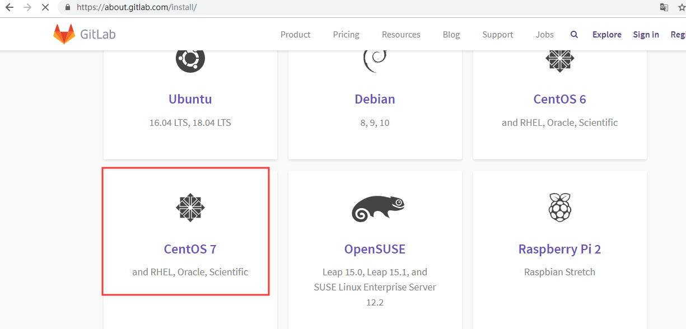
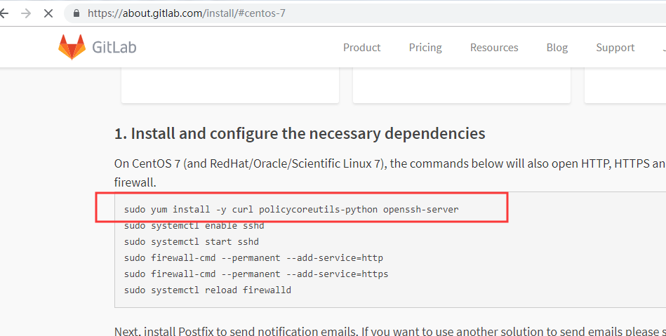
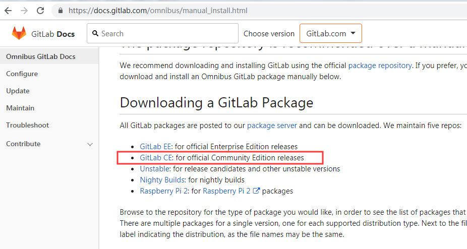
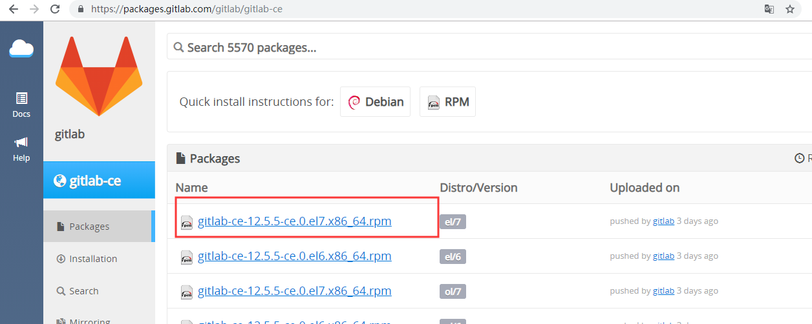
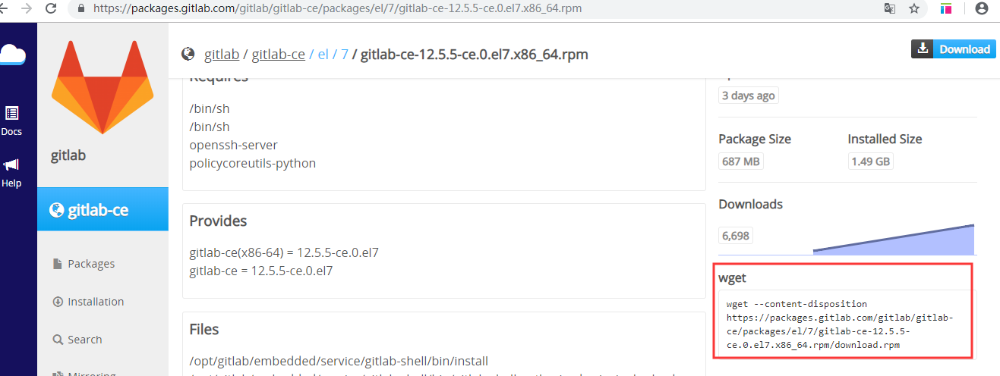

# gitlab安装

[TOC]

> 输入网址https://about.gitlab.com/






> 安装包之前，必须安装这些依赖。

> 下载包




> CE为社区版，EE为企业版






```sh
[root@gitlab tools]# rpm -ivh gitlab-ce-10.0.2-ce.0.el7.x86_64.rpm 
warning: gitlab-ce-10.0.2-ce.0.el7.x86_64.rpm: Header V4 RSA/SHA1 Signature, key ID f27eab47: NOKEY
Preparing...                          ################################# [100%]
Updating / installing...
   1:gitlab-ce-10.0.2-ce.0.el7        ################################# [100%]
It looks like GitLab has not been configured yet; skipping the upgrade script.

       *.                  *.
      ***                 ***
     *****               *****
    .******             *******
    ********            ********
   ,,,,,,,,,***********,,,,,,,,,
  ,,,,,,,,,,,*********,,,,,,,,,,,
  .,,,,,,,,,,,*******,,,,,,,,,,,,
      ,,,,,,,,,*****,,,,,,,,,.
         ,,,,,,,****,,,,,,
            .,,,***,,,,
                ,*,.
  


     _______ __  __          __
    / ____(_) /_/ /   ____ _/ /_
   / / __/ / __/ /   / __ \`/ __ \
  / /_/ / / /_/ /___/ /_/ / /_/ /
  \____/_/\__/_____/\__,_/_.___/
  

Thank you for installing GitLab!
GitLab was unable to detect a valid hostname for your instance.
Please configure a URL for your GitLab instance by setting `external_url`
configuration in /etc/gitlab/gitlab.rb file.
Then, you can start your GitLab instance by running the following command:
  sudo gitlab-ctl reconfigure

For a comprehensive list of configuration options please see the Omnibus GitLab readme
https://gitlab.com/gitlab-org/omnibus-gitlab/blob/master/README.md

```

> 安装完成，如上图
>
> 之后，修改 vim /etc/gitlab/gitlab.rb 配置文件
>
> 最后
>
> ```sh
> [root@gitlab ~]# gitlab-ctl reconfigure
> ```
>
> ```sh
> [root@gitlab ~]# gitlab-ctl stop  #停止gitlab
> [root@gitlab ~]# gitlab-ctl start  #开启gitlab
> [root@gitlab ~]# gitlab-ctl status  #查看状态
> [root@gitlab ~]# rpm -e gitlab-ce #卸载gitlab
> [root@gitlab ~]# find / -name gitlab | xargs rm -rf #清理残余文件
> ```

最后登录配置的网址


### gitlab迁移

##### 1.备份git服务器数据

```sh
gitlab-rake gitlab:backup:create RAILS_ENV=production 
```

>  注：默认备份后文件一般位于/var/opt/gitlab/backups/,文件名字：

```bash
1545205203_2018_12_19_11.3.0_gitlab_backup.tar
```

##### 2.新服务器上安装与原服务器一样版本的gitlab。

```sh
#查看版本信息
[root@gitlab tools]# cat /opt/gitlab/embedded/service/gitlab-rails/VERSION 
10.0.2
```

##### 3.将生成的tar文件拷贝到新服务器对应的backups目录下

```bash
scp /var/opt/gitlab/backups/1545205203_2018_12_19_11.3.0_gitlab_backup.tar username@ip:/var/opt/gitlab/backups/
```

##### 4.新GitLab服务数据恢复

```sh
gitlab-rake gitlab:backup:restore RAILS_ENV=production   BACKUP=1545205203_2018_12_19_11.3.0
```

