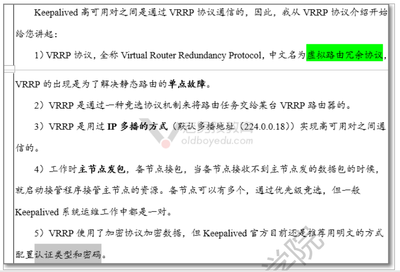

# keepalived

[TOC]

**keepalived高可用安装**
 1）环境准备

| 主机名 | 角色              | 外网ip        |
| ------ | ----------------- | ------------- |
| lb01   | keepalived-master | eth0:10.0.0.5 |
| lb01   | keepalived-slave  | eth0:10.0.0.6 |

2）在lb01和lb02上分别安装keepalived

```sh
[root@lb01 ~]# yum install -y keepalived
[root@lb02 ~]# yum install -y keepalived
```

3）keepalived**工作原理**

- vrrp 虚拟路由**冗余**协议 诞生是为公司网站网络设备做高可用 3层路由 

  

4）keepalived文件详解


**配置keepalived**

>  #手动测试添加ip地址
>  #ip addr add 10.0.0.3/24 dev eth0:1
>  #ip addr del 10.0.0.3/24 dev eth0:1

**lb01（主）配置如下**

```sh
[root@lb01 ~]# vim /etc/keepalived/keepalived.conf
! Configuration File for keepalived
global_defs {
    router_id lb01  #主备不能一样
}
vrrp_instance VI_1 {
    state MASTER
    interface eth0
    virtual_router_id 51
    priority 150
    advert_int 1
    authentication {
        auth_type PASS
        auth_pass 1111
    }
    virtual_ipaddress {
     10.0.0.3/24 dev eth0 label eth0:1
     #10.0.0.3/24   直接写ip，需要手动添加10.0.0.3（vip）
    }
}
```

**lb02(备)配置如下**

```sh
[root@lb02 ~]# vim /etc/keepalived/keepalived.conf
! Configuration File for keepalived
global_defs {
    router_id lb02   #主备不能一样
}
vrrp_instance VI_1 {
    state BACKUP
    interface eth0
    virtual_router_id 51
    priority 100
    advert_int 1
    authentication {
        auth_type PASS
        auth_pass 1111
    }
    virtual_ipaddress {
     10.0.0.3/24 dev eth0 label eth0:1
    }
}
```

**测试**
**lb01 lb02操作如下**
1）重启keepalived

```sh
systemctl restart keepalived
```

1. lb01检查是否有vip

```sh
[root@lb01 ~]# ip a|grep 0.3                                                           inet 10.0.0.3/24 scope global secondary eth0:1
```

3）lb02检查是否有vip

```sh
[root@lb02 ~]# ip a|grep 0.3                                                                                        
[root@lb02 ~]# 
```

4）关闭lb01的keepalived

```sh
systemctl stop keepalived
```

5 ) lb01检查是否有vip

```sh
[root@lb01 ~]# ip a|grep 0.3                                                                                        
[root@lb01 ~]# 
```

6）lb02检查是否有vip

```sh
[root@lb02 ~]# ip a|grep 0.3                                                                                        
    inet 10.0.0.3/24 scope global secondary eth0:1
```

### 总结

> 当keepalived出故障和断网的时候自动切换到备用负载均衡。keepalived基于服务器，nginx挂了 不会自动切换。下面我们需要解决这件事

# keepalived随着nginx关闭而关闭

**1.解决什么问题？**
 1）keepalived基于服务器，nginx挂了 不会自动切换
 **lb01 lb02操作如下**
 **2.写脚本--lb01 lb02都要写--监视nginx,当nginx被关闭后自动关闭keepalived**

```sh
[root@lb01 ~]# vim /server/scripts/chk.sh
#!/bin/bash
##脚本:检查nginx是否运行 如果不运行 关闭keepalived
#检查进程数量
count=`ps -ef |grep -c '[n]ginx'`  
#检查端口数量
#count=ss -lntup |grep nginx
#count=ps -ef |grep nginx|grep -v grep
#count=ss -lntup |grep -c  nginx 
#检查端口
#count=lsof -i:80
if [ $count -eq 0 ];then
   systemctl stop keepalived
fi
```

**3.配置keepalived配置文件**
 **lb01操作如下**

```sh
! Configuration File for keepalived

global_defs {
    router_id lb01
}
vrrp_script chk_lb {
script "/server/scripts/chk.sh"
interval 2
weight 1 
}

vrrp_instance VI_1 {
    state MASTER
    interface eth0
    virtual_router_id 51
    priority 150
    advert_int 1
    authentication {
        auth_type PASS
        auth_pass 1111
    }
    virtual_ipaddress {
     10.0.0.3/24 dev eth0 label eth0:1
    }
    track_script {
     chk_lb
     }
}
```

**lb02配置如下**

```sh
[root@lb02 ~]# vim /etc/keepalived/keepalived.conf
! Configuration File for keepalived

global_defs {
    router_id lb01
}
vrrp_script chk_lb {
script "/server/scripts/chk.sh"
interval 2
weight 1
}

vrrp_instance VI_1 {
    state BACKUP
    interface eth0
    virtual_router_id 51
    priority 100
    advert_int 1
    authentication {
        auth_type PASS
        auth_pass 1111
    }
    virtual_ipaddress {
     10.0.0.3/24 dev eth0 label eth0:1
    }
    track_script {
    chk_lb
    }
```

**启动高可用和负载均衡服务**
1）启动nginx keepalived

```sh
systemctl restart nginx  keepalived
```

2）检查进程---是否启动

```sh
[root@lb01 ~]# ps -ef|grep nginx
root       7979      1  0 15:31 ?        00:00:00 nginx: master process /usr/sbin/nginx -c /etc/nginx/nginx.conf
nginx      7980   7979  0 15:31 ?        00:00:00 nginx: worker process
root       8011   7219  0 15:32 pts/0    00:00:00 grep --color=auto nginx
[root@lb01 ~]# ps -ef|grep keepalived
root       7982      1  0 15:31 ?        00:00:00 /usr/sbin/keepalived -D
root       7983   7982  0 15:31 ?        00:00:00 /usr/sbin/keepalived -D
root       7984   7982  0 15:31 ?        00:00:00 /usr/sbin/keepalived -D
root       8033   7219  0 15:32 pts/0    00:00:00 grep --color=auto keepalived
```

3)检查是否有vip

```sh
[root@lb01 ~]# ip a|grep 0.3
    inet 10.0.0.3/24 scope global secondary eth0:1  ##ip现在是在lb01上的
[root@lb02 ~]# ip a|grep 0.3
[root@lb02 ~]# 
```

**测试**
 1）关闭lb01上的nginx,并检查进程

```sh
[root@lb01 ~]# systemctl stop nginx
[root@lb01 ~]# ps -ef|grep nginx
root       8931   7219  0 15:38 pts/0    00:00:00 grep --color=auto nginx
[root@lb01 ~]# ps -ef|grep keepalived
root       8933   7219  0 15:38 pts/0    00:00:00 grep --color=auto keepalived
[root@lb01 ~]# ip a|grep 0.3
[root@lb01 ~]# 
```

2）lb02检查

```sh
[root@lb02 ~]# ip a|grep 0.3
    inet 10.0.0.3/24 scope global secondary eth0:1
```

### 总结

> 写个监控nginx服务的脚本，然后在keepalived中使用。这样就可以当nginx出现故障的时候，就关闭keepalived.实现高可用。

# keepalived双主模式

**解决了什么问题**
1）一台主一台备用，只有主故障了以后才会访问备的。这就导致主，压力太大。备压力太小。所有我们需要让他们互为主备。
**修改配置文件**
**lb01配置如下**

```sh
! Configuration File for keepalived
global_defs {
    router_id lb01
}
vrrp_instance VI_1 {
    state BACKUP
    interface eth0
    virtual_router_id 51
    priority 100
    advert_int 1
    authentication {
        auth_type PASS
        auth_pass 1111
    }
    virtual_ipaddress {
     10.0.0.3/24 dev eth0 label eth0:1
    }
}
vrrp_instance VI_2 {
    state MASTER
    interface eth0
    virtual_router_id 52
    priority 150
    advert_int 1
    authentication {
        auth_type PASS
        auth_pass 1111
    }
    virtual_ipaddress {
     10.0.0.4/24 dev eth0 label eth0:2 
    }
}
```

**lb02配置如下**

```sh
! Configuration File for keepalived

global_defs {
    router_id lb01
}
vrrp_instance VI_1 {
    state MASTER
    interface eth0
    virtual_router_id 51
    priority 150
    advert_int 1
    authentication {
        auth_type PASS
        auth_pass 1111
    }
    virtual_ipaddress {
     10.0.0.3/24 dev eth0 label eth0:1
    }
}
vrrp_instance VI_2 {
    state BACKUP
    interface eth0
    virtual_router_id 52
    priority 100
    advert_int 1
    authentication {
        auth_type PASS
        auth_pass 1111
    }
    virtual_ipaddress {
     10.0.0.4/24 dev eth0 label eth0:2 
    }
}
```

**测试双主模式**

```sh
systemctl restart keepalived       ##重启keepalived
[root@lb01 ~]# ip a|egrep '0.3|0.4'   ##检查lb01 vip
    inet 10.0.0.3/24 scope global secondary eth0:1
[root@lb02 ~]# ip a|egrep '0.3|0.4'   ##检查lb02 vip
    inet 10.0.0.4/24 scope global secondary eth0:2
[root@lb02 ~]# systemctl stop keepalived   ##关闭lb02的高可用后
[root@lb02 ~]# ip a|egrep '0.3|0.4'        ##lb02的vip 已经不存在了
[root@lb02 ~]# 
[root@lb01 ~]# ip a|egrep '0.3|0.4'         ##全都跑到了lb01上来了
    inet 10.0.0.3/24 scope global secondary eth0:1
    inet 10.0.0.4/24 scope global secondary eth0:2
```

**每个域名绑定对应ip**
**修改配置文件**
**lb01 lb02都一样**

```php
   upstream web_pools {
##  server 10.0.0.7:80 weight=1 max_fails=3 fail_timeout=10s;
##  server 10.0.0.8:80 weight=1 max_fails=3 fail_timeout=10s;
# ip_hash;#加上他用户第一次访问哪台服务器以后就会一直访问那台
    server 10.0.0.7:80 weight=1 max_fails=3 fail_timeout=10s;
    server 10.0.0.8:80 weight=1 max_fails=3 fail_timeout=10s;
    }
   server {
     listen      10.0.0.3:80;
     server_name  www.oldboy.com;
     location / {
        proxy_pass http://web_pools;
       proxy_set_header Host $host;
       proxy_set_header X-Forwarded-For $remote_addr;
  }
  }

    server {
    listen       10.0.0.4:80;
    server_name  blog.oldboy.com;
    location / {
        proxy_pass http://web_pools;
       proxy_set_header Host $http_host;
       proxy_set_header X-Forwarded-For $remote_addr;
    }
   }
```

**检查语法却报错**

```sh
##nginx: [emerg] bind() to 10.0.0.4:80 failed (99: Cannot assign requested address)
                 把这个10.0.0.4的ip绑定到这台机器 失败了
nginx无法把本地不存在的ip地址进行绑定
```

**修改内核信息**

```sh
/etc/sysctl.conf  
net.ipv4.ip_nonlocal_bind = 1

#生效
sysctl -p
等于修改这个文件
[root@lb01 ~]# cat /proc/sys/net/ipv4/ip_nonlocal_bind 
1
```

**然后就可以重启成功了，关于ip的变动需要使用restart 重启**