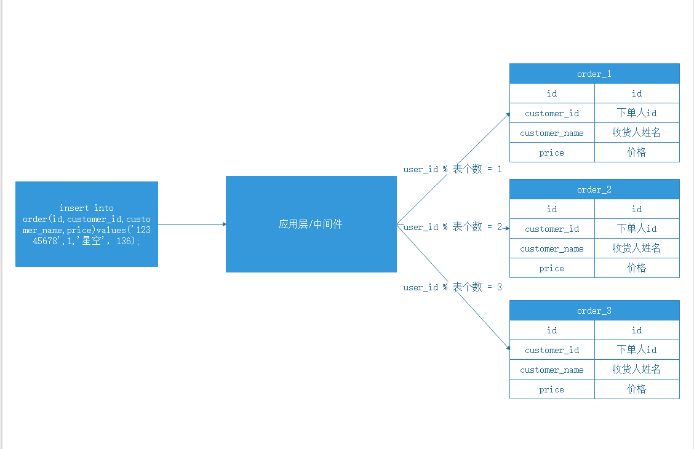
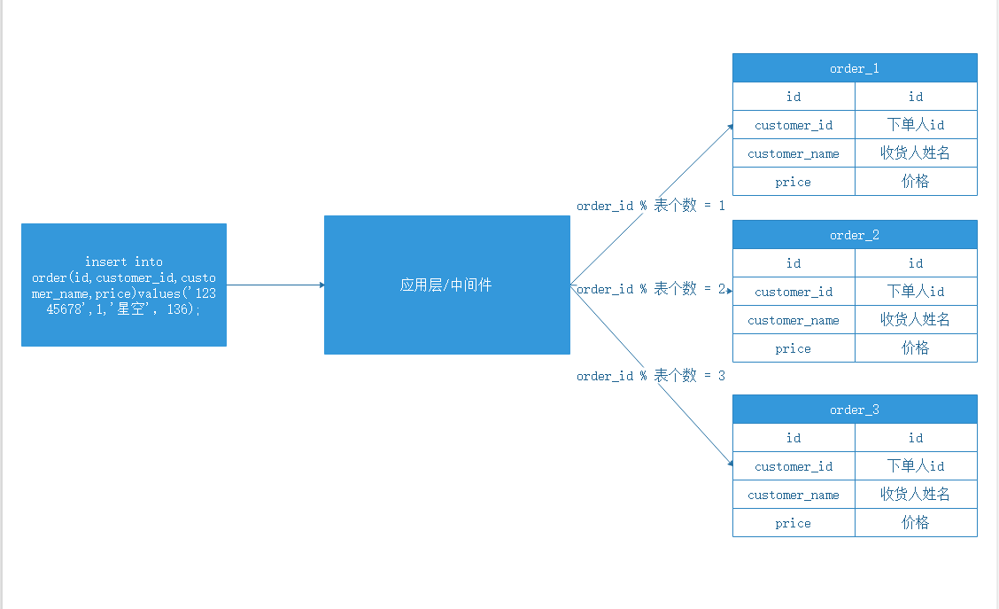
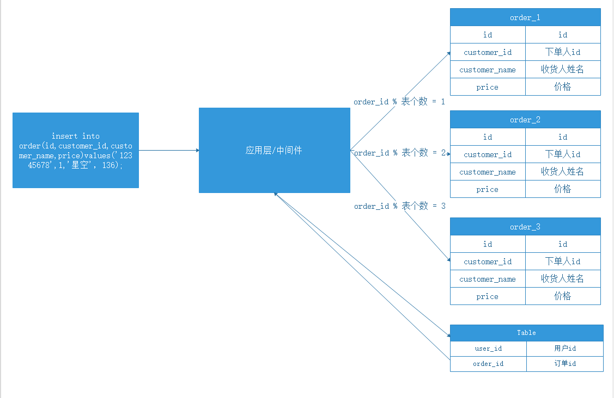

# mysql分库分表

[TOC]

## 课程内容

1. mysql分区
2. 水平切分
3. 垂直切分

## 1. mysql分区

### 1.1 什么是分区？

mysql数据库中的数据是以文件的形势存在磁盘上的，默认放在/mysql/data下面（可以通过my.cnf中的datadir来查看），一张表主要对应着三个文件（8.0对应两个，往期版本三个）一个是frm存放表结构的，一个是myd存放表数据的，一个是myi存表索引的（innodb同理）。

如果一张表的数据量太大的话，那么myd,myi就会变的很大，查找数据就会变的很慢，这个时候我们可以利用mysql的分区功能，在物理上将这一张表对应的三个文件，分割成许多个小块，这样呢，我们查找一条数据时，就不用全部查找了，只要知道这条数据在哪一块，然后在那一块找就行了。如果表的数据太大，可能一个磁盘放不下，这个时候，我们可以把数据分配到不同的磁盘里面去。

表分区，是指根据一定规则，将数据库中的一张表分解成多个更小的，容易管理的部分。从逻辑上看，只有一张表，但是底层却是由多个物理分区组成。

> 表分区的优点 

```
（1）、与单个磁盘或文件系统分区相比，可以存储更多的数据。

（2）、对于那些已经失去保存意义的数据，通常可以通过删除与那些数据有关的分区，很容易地删除那些数据。相反地，在某些情况下，添加新数据的过程又可以通过为那些新数据专门增加一个新的分区，来很方便地实现。

（3）、一些查询可以得到极大的优化，这主要是借助于满足一个给定WHERE语句的数据可以只保存在一个或多个分区内，这样在查找时就不用查找其他剩余的分区。因为分区可以在创建了分区表后进行修改，所以在第一次配置分区方案时还不曾这么做时，可以重新组织数据，来提高那些常用查询的效率。

（4）、涉及到例如SUM()和COUNT()这样聚合函数的查询，可以很容易地进行并行处理。这种查询的一个简单例子如 “SELECT salesperson_id, COUNT (orders) as order_total FROM sales GROUP BY salesperson_id；”。通过“并行”，这意味着该查询可以在每个分区上同时进行，最终结果只需通过总计所有分区得到的结果。

（5）、通过跨多个磁盘来分散数据查询，来获得更大的查询吞吐量。
```

>  表分区的限制 

```
（1）、一个表最多只能有1024个分区。

（2）、 MySQL5.1中，分区表达式必须是整数，或者返回整数的表达式。在MySQL5.5中提供了非整数表达式分区的支持。

（3）、如果分区字段中有主键或者唯一索引的列，那么多有主键列和唯一索引列都必须包含进来。即：分区字段要么不包含主键或者索引列，要么包含全部主键和索引列。

（4）、分区表中无法使用外键约束。

（5）、MySQL的分区适用于一个表的所有数据和索引，不能只对表数据分区而不对索引分区，也不能只对索引分区而不对表分区，也不能只对表的一部分数据分区。
```

### 1.2 分区类型

（1）、RANGE分区：基于属于一个给定连续区间的列值，把多行分配给分区。

（2）、LIST分区：类似于按RANGE分区，区别在于LIST分区是基于列值匹配一个离散值集合中的某个值来进行选择。

（3）、HASH分区：基于用户定义的表达式的返回值来进行选择的分区，该表达式使用将要插入到表中的这些行的列值进行计算。这个函数可以包含MySQL 中有效的、产生非负整数值的任何表达式。

（4）、KEY分区：类似于按HASH分区，区别在于KEY分区只支持计算一列或多列，且MySQL服务器提供其自身的哈希函数。必须有一列或多列包含整数值。

说明：在MySQL5.1版本中，RANGE,LIST,HASH分区要求分区键必须是INT类型，或者通过表达式返回INT类型。但KEY分区的时候，可以使用其他类型的列(BLOB，TEXT类型除外)作为分区键。

>  可以通过以下命令来查看当前数据库是否启用了分区功能： 

```sql
SHOW GLOBAL VARIABLES LIKE '%partition%';
```

```sh
#有时候可能会有这么一种误区，只要启用了分区，数据库就会运行的更快。这个结论结论是存在很多问题的，就经验来看，分区可能会给某些SQL语句性能带来提高，但是分区主要用于数据库高可用性的管理。在OLTP应用中，对于分区的使用应该非常小心，总之，如果只是一味地使用分区，而不理解分区是如何工作的，也不清楚你的应用如何使用分区，那么分区极有可能会对性能产生负面的影响。
```

### 1.3 range类型分区

range分区使用values less than 操作符来进行定义， 把连续且不相互重叠的字段分配给分区，命令如下。

```sql
create table emp(
  `no` varchar(20) not null,
  `name` varchar(20),
  deptno int,
  birthdate date,
  salary int
)
partition by range(salary) (
  partition p1 values less than(1000),
  partition p2 values less than(5000),
  partition p3 values less than(10000)
);

insert into emp values('001', 'shineyork', 10, '2019-10-10', 5000);
insert into emp values('002', 'keke', 20, '2019-10-10', 1500);
insert into emp values('003', 'a', 10, '2019-10-10', 10500);
insert into emp values('004', 'n', 20, '2019-10-10', 1000);
insert into emp values('004', 'c', 20, '2019-10-10', 6000);
```

如上的方式就是把数据根据salary的value进行划分，区分到不同的表区中；而这其中partition by range的语法类似于“switch..case”的语法，如果salary小余5000就会在p1中。。。

而如上就是分区之后的数据表的结构，其中emp#P#p2.ibd是分区之后的数据，而emp.frm就是表的结构

```
mysql> insert into emp values('003', 'a', 10, '2019-10-10', 10500);
ERROR 1526 (HY000): Table has no partition for value 10500
```

而上面的insert中因为10500不在这个范围类所以会产生问题,解决这个问题的办法就是在其后加入“partition p4 values less than maxvalue” 语法

```sql
create table emp(
  `no` varchar(20) not null,
  `name` varchar(20),
  deptno int,
  birthdate date,
  salary int
)
partition by range(salary) (
  partition p1 values less than(1000),
  partition p2 values less than(5000),
  partition p3 values less than(10000),
  partition p4 values less than maxvalue
)
```

 ==如果我们要工资在5000-10000的数据 的时候需要注意（假设工资的最小单位是元）==

```sql
delete from emp where salary>=’1000′ and salary<= ‘4999’;
-- 不建议写成以下方式，因为优化器会选择搜索两个分区（p1,p2），这是我们不希望看到的，因此对于启用分区，应该根据分区的特性来编写最优的SQL
delete from emp where salary>=’1000′ and salary<= ‘5000’;
```

查询分区之后某一个区中的数据 

```sql
select * from emp partition (p3);
```

在range中也可以使用MySQL的系统函数，比如根据年龄进行区分

```sql
create table emp(
  `no` varchar(20) not null,
  `name` varchar(20),
  deptno int,
  birthdate date,
  salary int
)
partition by range(year(birthdate)) (
  partition p1 values less than(1990),
  partition p2 values less than(2000),
  partition p3 values less than(2010),
  partition p4 values less than maxvalue
)
```

如果我们要删除1990年出生的数据 , 只需要删除1990年所在的分区即可。 

```sql
delete from emp where birthdate=’1990′
```

在进行分区时，如果出现“This partition function is not allowed”的错误提示，则你可能使用了非支持函数。MySQL 5.6支持的partition函数：http://dev.mysql.com/doc/refman/5.6/en/partitioning-limitations-functions.html

另外，需要注意一点的时，对于RANGE分区的查询，优化器只能对YEAR()，TO_YEAR()，TO_SECONDS()，UNIX_TIMESTAMP()这类函数进行优化选择，如果你使用了其他的函数或方法编写了符合分区特性的SQL语句，就不一定能够使用查询优化，所以再编写SQL语句时尽量测试。

### 1.4 list类型

LIST分区和RANGE分区类似，区别在于LIST分区是基于列值匹配一个离散值集合中的某个值来进行选择，而非连续的。

LIST分区通过使用`partition by list(expr)`来实现，其中“expr” 是某列值或一个基于某个列值、并返回一个整数值的表达式，然后通过`values in(value_list)`的方式来定义每个分区，其中`value_list`是一个通过逗号分隔的整数列表。

```sql
create table emp(
  `no` varchar(20) not null,
  `name` varchar(20),
  deptno int,
  birthdate date,
  salary int
)
partition by list(deptno) (
  partition p1 values in (10,20,30),
  partition p2 values in (1,2,3),
  partition p4 values in (4,40)
);

insert into emp values('001', 'shineyork', 1, '2019-10-10', 5000);
insert into emp values('002', 'keke', 20, '2019-10-10', 1500);
insert into emp values('003', 'a', 10, '2019-10-10', 10500);
insert into emp values('004', 'n', 40, '2019-10-10', 1000);
insert into emp values('005', 'c', 6, '2019-10-10', 6000);

mysql> insert into emp values('005', 'c', 6, '2019-10-10', 6000);
ERROR 1526 (HY000): Table has no partition for value 6
```

这是因为`deptno`列值6不能在用于定义分区p1, p2, p4的值列表中找到。要重点注意的是，LIST分区没有类似如`values less than maxvalue`这样的包含其他值在内的定义。将要匹配的任何值都必须在值列表中找到。

LIST分区除了能和RANGE分区结合起来生成一个复合的子分区，与HASH和KEY分区结合起来生成复合的子分区也是可能的。

### 1.5 hash类型

 HASH分区是基于用户定义的表达式的返回值来进行选择的分区，该表达式使用将要插入到表中的这些行的列值进行计算。这个函数可以包含MySQL中有效的、产生非负整数值的任何表达式。 HASH分区主要用来确保数据在预先确定数目的分区中平均分布。 在RANGE和LIST分区中，必须明确指定一个给定的列值或列值集合应该保存在哪个分区中；而在HASH分区中，MySOL自动完成这些工作，用户所要做的只是基于将要被哈希的列值指定一个列值或表达式，以及指定被分区的表将要被分割成的分区数量。

 要使用HASH分区来分割一个表，要在CREATE TABLE 语句上添加一个`partition by hash(expr)`子句，其中`expr`是一个返回一个整数的表达式。它可以仅仅是字段类型为MySQL 整型的一列的名字。此外，你很可能需要在后面再添加一个`partitions num`子句，其中num是一个非负的整数，它表示表将要被分割成分区的数量，如果没有包括一个`partitions `子句，那么分区的数量将默认为1。  

```sql
create table emp(
  `no` varchar(20) not null,
  `name` varchar(20),
  deptno int,
  birthdate date,
  salary int
)
partition by hash(year(birthdate)) partitions 4;
```

### 1.6  linear hash类型

MySQL还支持线性哈希功能，它与常规哈希的区别在于，线性哈希功能使用的一个线性的2的幂（powers-of-two）运算法则，而常规哈希使用的是求哈希函数值的模数。

线性哈希分区和常规哈希分区在语法上的唯一区别在于，在`partition by` 子句中添加`linear`关键字。

```sql
create table emp(
  `no` varchar(20) not null,
  `name` varchar(20),
  deptno int,
  birthdate date,
  salary int
)
partition by linear hash(year(birthdate)) partitions 4;
```

按照线性哈希分区的优点在于增加、删除、合并和拆分分区将变得更加快捷，有利于处理含有极其大量（1000G）数据的表。它的缺点在于使用，与常规HASH分区得到的数据分布相比，各个分区间数据的分布不大可能均衡。

### 1.7 key类型

 KEY分区和HASH分区相似，不同之处在于HASH分区使用用户定义的函数进行分区，支持字符串HASH分区，KEY分区使用MySQL数据库提供的函数进行分区，这些函数基于与PASSWORD()一样的运算法则。 

```sql
create table emp(
  `no` varchar(20) not null,
  `name` varchar(20),
  deptno int,
  birthdate date,
  salary int
)
partition by key(year(birthdate)) partitions 4;
```

 在KEY分区中使用关键字LINEAR和在HASH分区中使用具有同样的作用，分区的编号是通过2的幂（powers-of-two）算法得到，而不是通过模数算法。 

###  1.8 columns类型 

在前面说了RANGE、LIST、HASH和KEY这四种分区中，分区的条件是：数据必须为整形（interger），如果不是整形，那应该需要通过函数将其转化为整形，如YEAR()，TO_DAYS()，MONTH()等函数。MySQL5.5版本开始支持COLUMNS分区，可视为RANGE分区和LIST分区的一种进化。COLUMNS分区可以直接使用非整形的数据进行分区，分区根据类型直接比较而得，不需要转化为整形。此外，RANGE COLUMNS分区可以对多个列的值进行分区。

COLUMNS分区支持以下的数据类型：

- 所有的整形类型，如INT、SMALLINT、TINYINT和BIGINT。而FLOAT和DECIMAL则不予支持。
- 日期类型，如DATE和DATETIME。其余的日期类型不予支持。
- 字符串类型，如CHAR、VARCHAR、BINARY和VARBINARY。而BLOB和TEXT类型不予支持。

对于日期类型的分区，我们不再需要YEAR()和TO_DATS()函数了，而直接可以使用COLUMNS，如：

```sql
create table emp(
	`key` VARCHAR (50),
	`value` VARCHAR (50),
	`create_time` datetime
) 
partition by range columns (create_time)(
	partition p0 values less than ('2017-01-01 00:00:00'),
	partition p1 values less than ('2017-03-01 00:00:00')
);
```

 同样可以使用字符串分区

```sql
create table emp(
	`key` VARCHAR (15),
	` value` VARCHAR (50),
	`create_time` datetime,
	`city` VARCHAR (15)
) 
partition by list columns (city)(
	partition p0 values IN (
			'shanghai',
			'beijing',
			'shenzhen'
		),
	partition p1 values IN ('hubei', 'henan', 'hunan')
);
```

 对比range分区和list分区，columns分区的亮点除了支持数据类型增加之外，另外一大亮点是columns分区还支持多列分区。如： 

```sql
create table emp(
	` key` VARCHAR (15),
	`value` VARCHAR (50),
	`create_time` datetime,
	`test` VARCHAR (1)
) 
partition by range columns (create_time, test)(
	partition p0 values less than  (
			'2017-01-01 00:00:00',
			'yes'
		),
	partition p1 values less than  ('2017-03-01 00:00:00', 'no'),
	partition p2 values less than (maxvalue, maxvalue)
);
```

 MySQL 5.5开始支持COLUMNS分区，对于之前的RANGE和LIST分区，用户可以用RANGE COLUMNS和LIST COLUMNS分区进行很好的代替了。 

### 1.9 mysql子分区

 子分区（subparttitioning）是在分区的基础上再进行分区，有时也称这种分区为复合分区。MySQL数据库允许在RANGE和LIST的分区上再进行HASH或KEY的子分区，如： 

```sql
create table emp (a INT, b date) ENGINE = INNODB partition by range (YEAR(b)) subpartition BY HASH (to_days(b)) subpartitions 2 (
	partition p0 values less than (1990),
	partition p1 values less than (2000),
	partition p2 values less than maxvalue
);
```

```sql
mysql > system ls - ln / DATA / mysql / 3306 / DATA / db total 592 - rw - r --
--
- 1 27 27 67 Feb 27 12 : 03 db.opt - rw - r --
--
- 1 27 27 8578 Feb 27 15 : 54 emp.frm - rw - r --
--
- 1 27 27 98304 Feb 27 15 : 54 emp #P#p0#SP#p0sp0.ibd
- rw - r --
--
- 1 27 27 98304 Feb 27 15 : 54 emp #P#p0#SP#p0sp1.ibd
- rw - r --
--
- 1 27 27 98304 Feb 27 15 : 54 emp #P#p1#SP#p1sp0.ibd
- rw - r --
--
- 1 27 27 98304 Feb 27 15 : 54 emp #P#p1#SP#p1sp1.ibd
- rw - r --
--
- 1 27 27 98304 Feb 27 15 : 54 emp #P#p2#SP#p2sp0.ibd
- rw - r --
--
- 1 27 27 98304 Feb 27 15 : 54 emp #P#p2#SP#p2sp1.ibd
```

 表emp先根据b列进行了RANGE分区，然后又进行了一次HASH分区，所以分区的数量应该为（3×2=）6个，这通过查看物理磁盘上的文件也可以得到证实。我们也可以通过使用subpartition语法来显示地指出各个子分区的名字，例如对上述的ts表同样可以这样： 

```sql
CREATE TABLE emp (a INT, b date) ENGINE = INNODB PARTITION BY RANGE (YEAR(b)) subpartition BY HASH (to_days(b))(
	partition p0 values less than (1990)(
			subpartition s0,
			subpartition s1
		),
	partition p1 values less than (2000)(
			subpartition s2,
			subpartition s3
		),
	partition p2 values less than maxvalue (
			subpartition s4,
			subpartition s5
		)
);
```

子分区的建立需要注意以下几个问题：

1、每个子分区的数量必须相同。

2、要在一个分区表的任何分区上使用subpartition来明确定义任何子分区，就必须定义所有的子分区。

3、每个subpartition子句必须包括子分区的一个名字。

4、子分区的名字必须是唯一的。

子分区可以用于特别大的表，在多个磁盘分别分配数据和索引，用到不错，语句这里就不介绍了，可以MySQL技术内幕-Innodb存储引擎书籍。

### 2.0 分区中的NULL值

MySQL数据库允许对NULL值做分区，但是处理的方法与其他数据库可能完全不同。MySQL数据库的分区总是视NULL值小于任何的一个非NULL值，这和MySQL数据库中处理NULL值的ORDER BY操作是一样的。因此对于不同的分区类型，MySQL数据库对于NULL值的处理也是各不相同。

1）对于RANGE分区，如果向分区列插入了NULL值，则MySQL数据库会将该值放入最左边的分区(p0)。

```sql
CREATE TABLE t_range (a INT, b INT) ENGINE = INNODB 
partition BY RANGE (b)(
	partition p0 values less than (10),
	partition p1 values less than (20),
	partition p2 values less than maxvalue
);
```

另外需要注意的是，如果删除p0这个分区，删除的将是小于10的记录，并且还有NULL值的记录，这点非常重要。 

 2）对于LIST分区，如果向分区列插入了NULL值，则必须显示地指出哪个分区放入NULL值，否则会报错。

```sql
CREATE TABLE t_list (a INT, b INT) ENGINE = INNODB PARTITION BY list (b)(
	partition p0 values in (1, 3, 5, 7, 9, NULL),
	partition p1 values in (2, 4, 6, 8, 10)
);
```

 3）对于HASH和KEY分区，对于NULL值的处理方法和RANGE分区、LIST分区不一样。任何分区函数都会将含有NULL值的记录返回为0。 

```sql
CREATE TABLE t_hash (a INT, b INT) ENGINE = INNODB PARTITION BY HASH (b) PARTITIONS 2;
```

## 2.分区和性能

分区真的会加快数据库的查询吗？实际上可能根本感觉不到查询速度的提升，甚至会发现查询速度急剧下降，因此在合理使用分区之前，必须了解分区的使用环境。

数据库的应用分为两类：一类是OLTP（在线事务处理），如Blog、电子商务、网络游戏等；另一类是OLAP（在线分析处理），如数据仓库、数据集市。对于OLAP的应用，分区的确是可以很好地提高查询的性能，因为OLAP应用大多数查询需要频繁地扫描一张很大的表。假设有一张1亿行的表，其中有一个时间戳属性列。用户的查询需要从这张表中获取一年的数据。如果按时间戳进行分区，则只需要扫描相应的分区即可。这就是前面介绍的分区修剪技术。

对于OLTP的应用，分区应该非常小心。在这种应用下，通常不可能会获取一张大表10%的数据，大部分都是通过索引返回几条记录即可。而根据B+树索引的原理可知，对于一张大表，一般的B+树需要2~3次的磁盘IO。因此B+树可以很好地完成操作，不需要分区的帮助，并且设计不好的分区会带来严重的性能问题。

如很多开发团队会认为含有1000w行的表是一张非常巨大的表，所以他们往往会选择采用分区，如对主键做10个HASH的分区，这样每个分区就只有100w的数据了，因此查询应该变得更快了。如select * from table where pk=@pk。但是有没有考虑过这样一种情况：100w和1000w行的数据本身构成的B+树的层次都是一样的，可能都是2~3层。那么上述走主键分区的索引并不会带来性能的提高。好的，如果1000w的B+树高度是3,100w的B+树高度是2，那么上述按主键分区的索引可以避免1次IO，从而提高查询的效率。这没问题，但是这张表只有主键索引，没有任何其他的列需要查询的。如果还有类似如下的SQL：select * from table where key=@key，这时对于key的查询需要扫描所有的10个分区，即使每个分区的查询开销为2次IO，则一共需要20次IO。而对于原来单表的设计，对于KEY的查询只需要2~3次IO。

由以上结论可以看出，对于在OLTP场景中使用分区一定要特别小心了。

### 2.1 分区表在线DDL的支持（官网手册）

==☆☆☆分区表在线DDL的支持☆☆☆==：https://dev.mysql.com/doc/refman/5.7/en/online-ddl-partitioning.html 

## 3. 分库分表

作为一个数据库，作为数据库中的一张表，随着用户的增多随着时间的推移，总有一天，数据量会大到一个难以处理的地步。这时仅仅一张表的数据就已经超过了千万，无论是查询还是修改，对于它的操作都会很耗时，这时就需要进行数据库切分的操作了。对于一个大型的互联网应用，海量数据的存储和访问成为了系统设计的瓶颈问题，对于系统的稳定性和扩展性造成了极大的问题。通过数据切分来提高网站性能，横向扩展数据层已经成为架构研发人员首选的方式。

- 水平切分数据库：可以降低单台机器的负载，同时最大限度的降低了宕机造成的损失；
- 负载均衡策略：可以降低单台机器的访问负载，降低宕机的可能性；
- 集群方案：解决了数据库宕机带来的单点数据库不能访问的问题；
- 读写分离策略：最大限度的提高了应用中读取数据的速度和并发量；

### 3.1 mysql数据库容量查询

```sql

-- 1、统计每张表的数据量
SELECT
	*
FROM
	(
		SELECT
			TABLE_NAME,
			concat(
				round(
					sum(DATA_LENGTH / 1024 / 1024),
					7
				)
			) AS size
		FROM
			information_schema. TABLES
		WHERE
			table_schema = 'baobaot'
		GROUP BY
			table_name
	) t;
-- 2、统计每张表的数据容量（数据量+索引）
select
table_name,
(
sum(DATA_LENGTH) + sum(INDEX_LENGTH)
) / 1024 / 1024 as size
from
information_schema. tables
where
table_schema = 'baobaot'
GROUP BY
table_name;

-- 3、查看数据库数据量
SELECT concat(round(sum(DATA_LENGTH / 1024 / 1024 / 1024), 2), 'G')
FROM information_schema. tables
WHERE table_schema= 'baobaot' ;
```

>  问题描述 

```
1、单个表数据量越大，读写锁，插入操作重新建立索引效率越低。
2、单个库数据量太大（一个数据库数据量到1T-2T就是极限）
3、单个数据库服务器压力过大
4、读写速度遇到瓶颈（并发量几百）
```

>  何为切分？ 

简单来说，就是指通过某种特定的条件，将我们存放在同一个数据库中的数据分散存放到多个数据库（主机）上面，以达到分散单台设备负载的效果。 数据的切分（Sharding）根据其切分规则的类型，可以分为两种切分模式。一种是按照不同的表（或者Schema）来切分到不同的数据库（主机）之上，这种切可以称之为数 据的垂直（纵向）切分；另外一种则是根据表中的数据的逻辑关系，将同一个表中的数据按照某种条件拆分到多台数据库（主机）上面，这种切分称之为数据的水平（横向）切分。

垂直切分的最大特点就是规则简单，实施也更为方便，尤其适合各业务之间的耦合度非常低，相互影响很小，业务逻辑非常清晰的系统。在这种系统中，可以很容易做到将不同业务模块所使用的表分拆到不同的数据库中。根据不同的表来进行拆分，对应用程序的影响也更小，拆分规则也会比较简单清晰。

水平切分于垂直切分相比，相对来说稍微复杂一些。因为要将同一个表中的不同数据拆分到不同的数据库中，对于应用程序来说，拆分规则本身就较根据表名来拆分更为复杂，后期的数据维护也会更为复杂一些。

### 3.2 水平切分

相对于垂直拆分，水平拆分不是将表做分类，而是按照某个字段的某种规则来分散到多个库之中，每个表中包含一部分数据。简单来说，我们可以将数据的水平切分理解为是按照数据行的切分，就是将表中的某些行切分到一个数据库，而另外的某些行又切分到其他的数据库中。

拆分数据就需要定义分片规则。关系型数据库是行列的二维模型，拆分的第一原则是找到拆分维度。比如：从会员的角度来分析，商户订单交易类系统中查询会员某天某月某个订单，那么就需要按照会员结合日期来拆分，不同的数据按照会员 ID 做分组，这样所有的数据查询 join 都会在单库内解决；如果从商户的角度来讲，要查询某个商家某天所有的订单数，就需要按照商户 ID 做拆分；但是如果系统既想按会员拆分，又想按商家数据，则会有一定的困难。如何找到合适的分片规则需要综合考虑衡量。

几种典型的分片规则包括：

- 按照用户 ID 求模，将数据分散到不同的数据库，具有相同数据用户的数据都被分散到一个库中；
- 按照日期，将不同月甚至日的数据分散到不同的库中；
- 按照某个特定的字段求摸，或者根据特定范围段分散到不同的库中。

既然数据做了拆分有优点也就优缺点。

优点：

- 拆分规则抽象好，join 操作基本可以数据库做；
- 不存在单库大数据，高并发的性能瓶颈；
- 应用端改造较少； 提高了系统的稳定性跟负载能力。

缺点：

- 拆分规则难以抽象；
- 分片事务一致性难以解决；
- 数据多次扩展难度跟维护量极大；
- 跨库 join 性能较差。

### 3.3 垂直切分

一个数据库由很多表的构成，每个表对应着不同的业务，垂直切分是指按照业务将表进行分类，分布到不同的数据库上面，这样也就将数据或者说压力分担到不同的库上面。

系统被切分成了，用户，订单交易，支付几个模块。 一个架构设计较好的应用系统，其总体功能肯定是由很多个功能模块所组成的，而每一个功能模块所需要的数据对应到数据库中就是一个或者多个表。而在架构设计中，各个功能模块相互之间的交互点越统一越少，系统的耦合度就越低，系统各个模块的维护性以及扩展 性也就越好。这样的系统，实现数据的垂直切分也就越容易。但是往往系统之有些表难以做到完全的独立，存在这扩库 join 的情况，对于这类的表，就需要去做平衡，是数据库让步业务，共用一个数据源，还是分成多个库，业务之间通过接口来做调用。在系统初期，数据量比较少，或者资源有限的情况下，会选择共用数 据源，但是当数据发展到了一定的规模，负载很大的情况，就需要必须去做分割。

一般来讲业务存在着复杂 join 的场景是难以切分的，往往业务独立的易于切分。如何切分，切分到何种程度是考验技术架构的一个难题。

优点：

- 拆分后业务清晰，拆分规则明确；
- 系统之间整合或扩展容易；
- 数据维护简单。

缺点：

- 部分业务表无法 join，只能通过接口方式解决，提高了系统复杂度；
- 受每种业务不同的限制存在单库性能瓶颈，不易数据扩展跟性能提高；
- 事务处理复杂。

由于垂直切分是按照业务的分类将表分散到不同的库，所以有些业务表会过于庞大，存在单库读写与存储瓶颈，所以就需要水平拆分来做解决。

## 4.分库分表的策略

### 4.1 水平切分

> 概念：以字段为依据，按照一定策略（hash、range等），将一个表中的数据拆分到多个表中。 规则：hash，range，取模，list 

结果：

```sh
每个表的结构都一样；
每个表的数据都不一样，没有交集；
所有表的并集是全量数据；

场景：系统绝对并发量并没有上来，只是单表的数据量太多，影响了SQL效率，加重了CPU负担，以至于成为瓶颈。推荐：一次SQL查询优化原理分析

分析：表的数据量少了，单次SQL执行效率高，自然减轻了CPU的负担。
```
##### 4.1.1 根据时间日期进行拆分（范围）

概念：根据年，月进行切分，订单表可以根据项目的业务，一月一表或者是一年一表。用户与商家查询订单时也可以先查询最近一月的订单

  

 问题：数据的分布不均匀，如果当月用户订单特别多，那么那张表的性能就很低，反之，有一月的订单数据很低。 

##### 4.1.2 根据用户id进行拆分

根据用户id的话一般以取模的方式分表

1. 订单id的设计为（时间戳 + 用户标识 + 随机数）
2. 首先需要注意的是适当的进行垂直分库；分为订单基础库和订单流程库 同时为了解决商家和用户的查询问题会建立以用户和商家作为维度切分的订单表-》对于商家来说只存订单主表就好了
3. 在创建订单之后就会根据user_id的后几位指定数值作为标识计算确定指定的库和表 比如指定 user_id的后5为作为用户标识 关于分库与分表的计算方式为

```
库 = (用户标识 % ( 分表数 * 分库数))
表 = ((用户标识 % ( 分表数 * 分库数)) / 分表数)(取整)
```

简单点：

```
库 = (用户标识 % 分库数)
表 = (用户标识 / 分表数)(取整) % 分库数
```

比如通过 / 得到的值为 25.6 那么对应的表就是25

  

##### 4.1.3 根据订单id进行拆分

 根据订单ID进行取模查询：但是查询的时候如果用户要查询所有的订单肯定是有问题的，再比如商家查询....肯定少不了全表的扫描； 

  

 这对于这个问题可以采用异构索引表的方式来解决； 

  

 所谓的异构索引表实际就是一张实体表，而其次关于商家我们也可以进行这样的思路建立一个索引表处理 

### 4.2 垂直切分

>概念：以字段为依据，按照字段的活跃性，将表中字段拆到不同的表（主表和扩展表）中。

结果：

```sh
每个表的结构都不一样；
每个表的数据也不一样，一般来说，每个表的字段至少有一列交集，一般是主键，用于关联数据；
所有表的并集是全量数据；

场景：系统绝对并发量并没有上来，表的记录并不多，但是字段多，并且热点数据和非热点数据在一起，单行数据所需的存储空间较大。以至于数据库缓存的数据行减少，查询时会去读磁盘数据产生大量的随机 读IO，产生IO瓶颈。

分析：可以用列表页和详情页来帮助理解。垂直分表的拆分原则是将热点数据（可能会冗余经常一起查询的数据）放在一起作为主表，非热点数据放在一起作为扩展表。这样更多的热点数据就能被缓存下来，进而减少 了随机读IO。拆了之后，要想获得全部数据就需要关联两个表来取数据。
```

 **但记住，千万别用join，因为join不仅会增加CPU负担并且会讲两个表耦合在一起（必须在一个数据库实例上）。关联数据，应该在业务Service层做文章，分别获取主表和扩展表数据然后用关联字段关联得到全部数据** 

##### 4.2.1 垂直切分-商品表

用户在浏览商品列表时，只有对某商品感兴趣时才会查看该商品的详细描述。因此，商品信息中商品描述字段访问频次较低，且该字段存储占用空间较大，访问单个数据IO时间较长；商品信息中商品名称、商品图片、商品价格等其他字段数据访问频次较高。由于这两种数据的特性不一样，因此他考虑将商品信息表拆分如下：将访问频次低的商品描述信息单独存放在一张表中，访问频次较高的商品基本信息单独放在一张表中。 

> 商品表 (products) 

| 字段              | 类型          | 描述           |
| ----------------- | ------------- | -------------- |
| id                | int           | 主键id         |
| product_core      | char(16)      | 商品编码       |
| title             | varchar(30)   | 商品名称       |
| bar_code          | varchar(50)   | 国条码         |
| one_category_id   | int           | 第一父类分类id |
| two_category_id   | int           | 第二父类分类id |
| three_category_id | int           | 第三父类分类id |
| status            | tinyint       | 是否上下架     |
| audit_status      | tinyint       | 审核状态       |
| shop_id           | int           | 店铺id         |
| rating            | double(8,2)   | 商品平均分     |
| sold_count        | int           | 销量           |
| revirew_count     | int           | 评价数量       |
| price             | decimal(10,2) | sku最低价格    |
| image             | varchar(200)  | 商品主图路径   |
| created_at        | datetime      | 上架时间       |
| updated_at        | datetime      | 修改时间       |
| deleted_at        | datetime      | 下架时间       |

>  商品属性表 (products_sku) 

| 字段       | 类型          | 描述            |
| ---------- | ------------- | --------------- |
| id         | int           | 主键id          |
| title      | varchar(30)   | 商品sku名称     |
| price      | decimal(10,2) | sku属性商品价格 |
| stock      | int           | 库存            |
| product_id | int           | 商品id          |
| status     | tinyint       | 状态            |
| parameter  | json          | 参数            |
| color_type | ENUM          | 颜色类型        |
| created_at | datetime      | 创建时间        |
| updated_at | datetime      | 修改时间        |
| deleted_at | datetime      | 删除时间        |

>  商品详情 (products_description) 与 商品属性详情表 (products_sku_description) 

| 字段        | 类型 | 描述     |
| ----------- | ---- | -------- |
| id          | int  | 主键id   |
| product_id  | int  | 商品id   |
| description | text | 商品详情 |

| 字段           | 类型 | 描述     |
| -------------- | ---- | -------- |
| id             | int  | 主键id   |
| product_sku_id | int  | 商品id   |
| description    | text | 商品详情 |

##### 4.2.2 水平切分-订单表

思考：订单表的查询方式有哪些？

1. 根据用户id查询 -> 涉及分页，查询全部订单
2. 根据商家 -> 根据日期排序查询

下面是订单的结构：

>  订单主表 (orders) 

| 字段               | 类型          | 描述                                          |
| ------------------ | ------------- | --------------------------------------------- |
| id                 | int           | 订单ID                                        |
| customer_id        | int           | 下单人ID                                      |
| shipping_user      | varchar(10)   | 收货人姓名                                    |
| address            | json          | 收货地址                                      |
| payment_method     | tinyint       | 支付方式：1现金，2余额，3网银，4支付宝，5微信 |
| order_money        | decimal(10,2) | 订单金额                                      |
| district_money     | decimal(10,2) | 优惠金额                                      |
| shipping_money     | decimal(10,2) | 运费金额                                      |
| payment_money      | decimal(10,2) | 支付金额                                      |
| shipping_comp_name | varchar(10)   | 快递公司名称                                  |
| shipping_sn        | varchar(50)   | 快递单号                                      |
| create_time        | datetime      | 下单时间                                      |
| shipping_time      | datetime      | 发货时间                                      |
| pay_time           | datetime      | 支付时间                                      |
| order_status       | tinyint       | 订单状态                                      |
| order_point        | int           | 订单积分                                      |
| invoice_time       | varchar(100)  | 发票抬头                                      |
| modified_time      | datetime      | 最后修改时间                                  |
| receive_time       | datetime      | 收货时间                                      |

>   订单详情表 (order_item) 

| 字段          | 类型          | 描述         |
| ------------- | ------------- | ------------ |
| id            | int           | 订单详情表ID |
| order_id      | varchar       | 订单表ID     |
| product_id    | int           | 订单商品ID   |
| product_name  | varchar(50)   | 商品名称     |
| product_cnt   | int           | 购买商品数量 |
| product_price | decimal(10,2) | 购买商品单价 |
| average_cost  | decimal(10,2) | 平均成本价格 |
| weight        | float         | 商品重量     |
| fee_money     | decimal(10,2) | 优惠分摊金额 |
| w_id          | int           | 仓库ID       |
| modified_time | datetime      | 最后修改时间 |

 首先关于订单表如何选择拆分？ 

1. 根据订单id分，

```sh
#如果是按照订单ID取模的方式，比如按64取模，则可以保证主订单数据以及相关的子订单、订单详情数据平均落人到后端的64个数据库中，原则上很好地满足了数据尽可能平均拆分的原则。
```

1. 根据user_id分

```sh
#通过采用买家用户ID哈希取模的方式，比如是按64取模，技术上则也能保证订单数据拆分到后端的64个数据库中，但这里就会出现一个业务场景中带来的一个问题，就是如果有些卖家是交易量非常大的(这样 的群体不在少数)，那这些卖家产生的订单数据量(特别是订单详情表的数据量)会比其他卖家要多出不少，也就是会出现数据不平均的现象，最终导致这些卖家的订单数据所在的数据库会相对其他数据库提早进人到数据归档(为了避免在线交易数据库的数据的增大带来数据库性能问题，淘宝将3个月内的订单数据保存进在线交易数据库中，超过3个月的订单会归档到后端专门的归档数据库)。
```

### 4.3 根据业务进行分库

### 4.1 垂直分库

概念：以表为依据，按照业务归属不同，将不同的表拆分到不同的库中。

```
结果：
每个库的结构都不一样；
每个库的数据也不一样，没有交集；
所有库的并集是全量数据；

场景：系统绝对并发量上来了，并且可以抽象出单独的业务模块。
分析：到这一步，基本上就可以服务化了。例如，随着业务的发展一些公用的配置表、字典表等越来越多，这时可以将这些表拆到单独的库中，甚至可以服务化。再有，随着业务的发展孵化出了一套业务模式，这时可 以将相关的表拆到单独的库中，甚至可以服务化。
```

### 4.2 水平分库

概念：以字段为依据，按照一定策略（hash、range等），将一个库中的数据拆分到多个库中。

```
结果：
每个库的结构都一样；
每个库的数据都不一样，没有交集；
所有库的并集是全量数据；

场景：系统绝对并发量上来了，分表难以根本上解决问题，并且还没有明显的业务归属来垂直分库。
分析：库多了，io和cpu的压力自然可以成倍缓解。
```

### 4.4 分表的原则：

1. 数据尽可能平均拆分
2. 尽可能的减少事务边界所谓的事务边界指单个SQL语句在后端数据库上同时执行的数量。因为事务边界越大，系统的锁冲突概率就越高，系统越难以扩展，整体性能越低。（边界是指一次性需要查询的数据库有最大值）
3. 异构索引表尽量降低全表扫描频率 这个是针对假如数据是按订单id进行分拆，当用户想查看自己的订单时，针对这种场景，常采用异构索引表来解决，即采用异步机制将原表内的每一次创建或更新，都换另一个维度保存一份完整的数据表或索引表。本质上这是互联网公司很多时候采用的一个解决思路：拿空间换时间。
