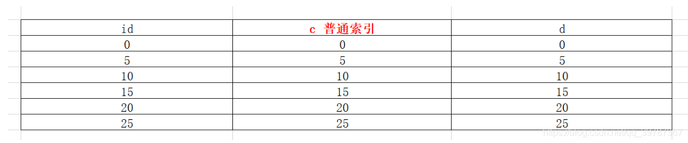
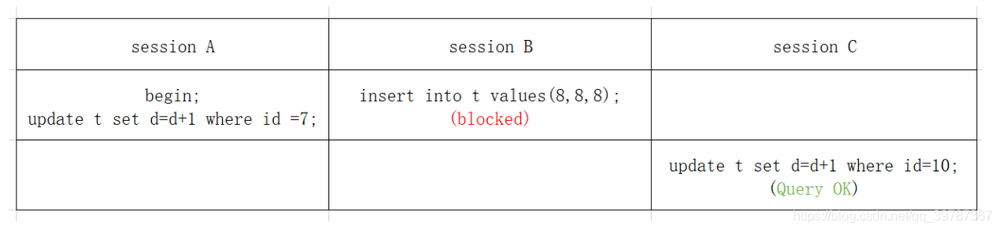
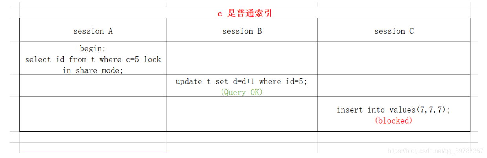
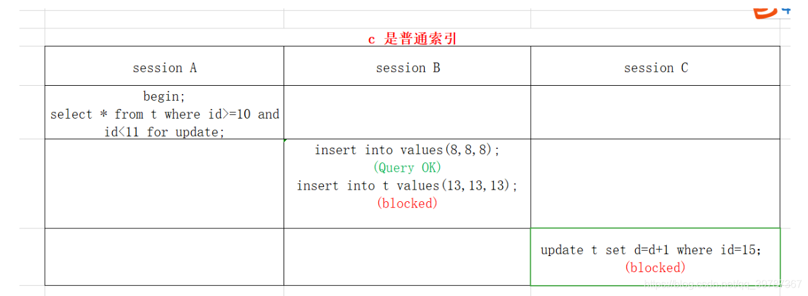

# 锁-隔离级别的一些补充

[TOC]

### 1.锁

```sh
“锁”顾名思义就是锁定的意思。
“锁”的作用是什么？
在事务ACID过程中，“锁”和“隔离级别”一起来实现“I”隔离性和"C" 一致性 (redo也有参与).
悲观锁:行级锁定(行锁)
谁先操作某个数据行,就会持有<这行>的(X)锁.
乐观锁: 没有锁
```

##### 表锁（myisam手动增加）

```sh
lock table 表名 read(write), 表名称2 read(write), 其他;
#例子:给user表加读锁，goods表加写锁
lock table user read, goods write;

#减锁
unlock tables;

#例子1--加读锁(共享锁)
如果session1给goods表加读锁，session2是可以读取goods表和其他表的数据的，但是不可以修改数据，必须得session1减锁才能执行，不然处于阻塞状态，session1不可以插入或者更新锁定的表，也不可以查看其他表，会报错。

#例子2--加写锁(排它锁)
lock table goods write;
 
session1 给goods加写锁，自己可以查看goods表，也可以更新goods表，但是不可以看其他的表。
session2 可以看其他的表 ，但是查goods显示阻塞,更新删除都显示阻塞。


#结论：
结合上面的例子，对myisam表进行操作，会有以下情况：
1.对myisam表的读操作(加读锁)，不会阻塞其他进程对同一表的读请求，但会阻塞对同一表的写请求。只有当读锁释放后，才会执行其他进程的写请求。
2.对myisam表的写操作(加写锁)，会阻塞其他进程对同一表的读和写请求，只有当写锁释放后，才会执行其他进程的读写请求。
```

**总而言之，就是读锁会阻塞写，但是不会阻塞读。而写锁会把读和写都堵塞。**

> 查看表上加过的锁

```sh
show open tables;
```

> 如何分析表锁定

```sh
show status like 'table%'
#通过检查Table_locks_immediate和Table_locks_waited状态变量来分析系统上的表锁定。
#这里有两个状态变量记录MYSQL内部表级锁定的情况，两个变量说明如下:
#Table_locks_immediate：产生表级锁定的次数，表示可以立即获取锁的查询次数，每立即获取锁值加1；
#Table_locks_waited：出现表级锁定争用而发生等待的次数(不能立即获取锁的次数,每等待一次锁值加1)，此值高则说明存在着较严重的表级锁争用情况。
```

##### 行锁（InnoDB）

###### 按照资源分:

- 内存锁
- 对象锁
  - MDL（元数据锁）
  - 表锁
  - 行锁（record lock）
  - GAP（间隙锁）
  - Next-Key lock（下一键锁）

###### 按照功能分：

- IS:意向共享锁，表级别

- S:共享锁，读锁，行级别
  - 共享锁(又称读锁)：我可以读 写 加锁(一个事务对数据加了共享锁以后，其它事务还能再对该事务加共享锁查询，但是不能加排它锁。) , 别人可以 读 加锁。

- IX:意向排它锁，表级别

- X:排它锁，写锁，行级别
  - 排他锁(又称写锁)：只有我 才 可以 读 写 加锁 , 也就是说，必须要等我提交事务，其他的才可以操作(当对数据上了排它锁之后，就不能再被其它事务加任何锁，包括共享锁和排它锁，获取排它锁的事务可以读取和修改数据)---------**普通查询除外**。

**当我们执行 update / insert / delete 语句时，mysql 会自动为该语句加上排它锁。**

加排它锁: `select ...for update` 语句(使用排他锁解决超卖)
加共享锁可以使用  `select ... lock in share mode `语句


使用InnoDB引擎，如果筛选条件里面没有索引字段，就会锁住整张表，否则的话，锁住相应的行(因为innodb的行锁是针对索引建立的，没有索引升级为表锁)。

sharedLock 与 lockForUpdate 相同的地方是，都能避免同一行数据被其他 transaction 进行 update
不同的地方是：sharedLock 不会阻止其他 transaction 读取同一行
lockForUpdate 会阻止其他 transaction 读取同一行 （==需要特别注意的是，普通的非锁定读取读取依然可以读取到该行，只有 sharedLock 和 lockForUpdate 的读取会被阻止==。）

###### 按照粒度分：

- 表锁

- 行锁（Record Lock）:锁直接加在索引记录上面，锁住的是key（索引）。
- 间隙锁（Gap Lock）:锁定索引记录间隙，确保索引记录的间隙不变。间隙锁是针对事务隔离级别为可重复读或以上级别而已的。
- Next-Key Lock （下一键锁）：行锁和间隙锁组合起来就叫Next-Key Lock。 锁定一个范围，并且锁定记录本身 前开后闭区间  

**InnoDB使用间隙锁的目的有2个：**

- 为了防止幻读(上面也说了，Repeatable read隔离级别下再通过GAP锁即可避免了幻读)
- 满足恢复和复制的需要：MySQL的恢复机制要求在一个事务未提交前，其他并发事务不能插入满足其锁定条件的任何记录，也就是不允许出现幻读


> 默认情况下，InnoDB工作在可重复读隔离级别下，并且会以Next-Key Lock的方式对数据行进行加锁，这样可以有效防止幻读的发生。Next-Key Lock是行锁和间隙锁的组合，当InnoDB扫描索引记录的时候，会首先对索引记录加上行锁（Record Lock），再对索引记录两边的间隙加上间隙锁（Gap Lock）。加上间隙锁之后，其他事务就不能在这个间隙修改或者插入记录。

   **Gap Lock在InnoDB的唯一作用就是防止其他事务的插入操作，以此防止幻读的发生。**


###### 什么是幻读？

幻读： 新插入的行，隔离级别是可重复读隔离级别，**幻读在当前读才可出现**

1. 在可重读隔离级别下，普通的查询是快照读，是不会看到别的事务插入的数据的。因为，幻读在“当前读”下才会出现。
2. 幻读指的是**新插入的行不是修改的行**


###### ☆☆☆锁的几个原则 和优化（https://blog.csdn.net/qq_39787367/article/details/103871547）

>  原则1：加锁的基本单位是next -key lock，next-key lock是前开后闭区间
>
> 原则2：查找过程中访问到的对象才会加锁

>  **范围查询的时候没有优化原则** 
>
>  优化1：索引上的等值查询，给唯一索引加锁的时候，next-key lock退化为行锁
>
>  优化2：索引上的等值查询，向右遍历时且最后一个值不满足等值条件的时候，next-key lock退化为间隙锁

>  一个bug：唯一索引上的范围查询会访问到不满足条件的第一个值为止 

>  **范围查找**，唯一和非唯一索引都要往后找不满足条件的记录加上next-key lock 

>  **lock in share mode 只锁覆盖索引** 

###### 查看当前锁的信息

```sql
select * from information_schema.innodb_locks;
```

 ```sql
-- 准备数据 

CREATE TABLE `t` (
  `id` int(11) NOT NULL,
  `c` int(11) DEFAULT NULL,
  `d` int(11) DEFAULT NULL,
  PRIMARY KEY (`id`),
  KEY `c` (`c`)
) ENGINE=InnoDB;

insert into t values(0,0,0),(5,5,5),
(10,10,10),(15,15,15),(20,20,20),(25,25,25);
 ```


###### ☆等值查询间隙锁

- 加锁单位是next-key lock
- 等值查询，向右遍历到最后一个不满足的索引的时候会退化为间隙锁

  **表中数据**  

 **执行步骤** 

 

由于表中没有id=7的记录：

- 原则1，加锁单位是next-key lock，sessionA加锁范围就是（5,10]；
- 同时根据优化2，这是一个等值查询（id=7），而id=10不满足查询条件，next-key lock退化成间隙锁，因此加锁范围是（5,10）

###### ☆非唯一索引等值查询

> 索引覆盖
>
>  C是普通索引 

 **表内数据** 


 **执行流程** 

 

- 原则1，加锁单位是next-key lock，因此会给（0,5]加上next-key lock。
- 要注意c是普通索引，因此仅访问c=5这一条记录是不能马上停下来的，需要向右遍历，查到c=10才放弃，根据原则2，访问到的都要加锁，因此要给（5,10]加next-key lock
- 同时这个符合优化2：等值查询，向右遍历，最后一个不满足c=5这个等值条件，因此退化成间隙锁（5,10）
- 根据原则2，访问到的对象才会加锁，这个查询使用索引覆盖，并不需要访问主键，所以主键上没有加任何锁，这就是为什么sessionB的update语句可以执行成功

==☆☆☆需要注意☆☆☆==

在这个例子中，lock in share mode 只锁覆盖索引，但是如果是 for update 就不一样了。 执行 for update 时，系统会认为你接下来要更新数据，因此会顺便给主键索引上满足条件的行加上行锁，那么sessionB也会锁等待。

这个例子说明，锁是加在索引上的；同时，它给我们的指导是，如果你要用 lock in share mode 来给行加读锁避免数据被更新的话，就必须得绕过覆盖索引的优化，在查询字段中加入索引中不存在的字段。比如，将 session A 的查询语句改成 select d from t where c=5 lock in share mode。你可以自己验证一下效果。

###### ☆主键索引范围查询

```sql
mysql> select * from t where id=10 for update;
mysql> select * from t where id>=10 and id<11 for update;
```

 **表内数据** 


 **加锁过程** 

 

开始执行的时候，要找到第一个id=10的这行，因此next-key lock 是（5,10]。根据优化1，主键id上的等值条件，退化成行锁，只加了id=10这一行的行锁，所以如果where=10，那么就锁10这一行。
范围查找就往后继续找，找到id=15的这行停下来，因此需要加next-key lock（10,15]（**等值查询才会退化成间隙锁**）
所以sessionA这时候锁的范围就是行锁id=10,和next-key lock（10,15] ,这样再看sessionB和session C

这里注意一点，sessionA定位查找id=10的行进行的时候，是当做等值查询来判断的，向后扫描代15的时候，用的是范围判断。

>  如何分析表锁定

`show status like 'innodb_row_lock%'`

| Variable_name                 |                                                          | Value |
| ----------------------------- | -------------------------------------------------------- | ----- |
| Innodb_row_lock_current_waits | 当前正在等待锁定的数量                                   | 0     |
| Innodb_row_lock_time          | 从系统启动到现在锁定总时间长度           (重要)          | 13431 |
| Innodb_row_lock_time_avg      | 每次等待所花平均时间                              (重要) | 111   |
| Innodb_row_lock_time_max      | 从系统启动到现在等待最长的一次所花的时间                 | 6531  |
| Innodb_row_lock_waits         | 系统启动后到现在总共等待的次数           (重要)          | 120   |

**尤其是当等待次数很高，而且每次等待时长也不小的时候，我们就需要分析系统中为什么会有如此多的等待，然后根据结果着手指定优化方案**。

### 2.隔离级别

```sh
1）read uncommitted(RU)读未提交 : 读取尚未提交的数据 ：就是脏读
#脏读：在事务还没有提交前，修改的数据可以被其他事物所看到

2）read committed(RC)读已提交：读取已经提交的数据 ：可以解决脏读
#不可重复读：在一个事物中使用相同的条件查询一条数据，前后两次查询所得到的数据不同，这是因为同时其他事物对这条数据进行了修改(已提交事物)，第二次查询返回了其他事物修改的数据

#不可重复读：是同一条记录（一条数据）的内容被其他事物修改了，关注的是update、delete操作一条数据的操作.

3）repeatable read(RR)可重复读：可以解决脏读 和 不可重复读 ---mysql默认的隔离级别
#幻读：在一个事物A中使用相同的条件查询了多条数据，同时其他事物添加或删除了符合事物A中查询条件的数据，这时候当事物A再次查询时候会发现数据多了或者少了，与前一次查询的结果不相同。

#幻读：是查询某个范围（多条数据）的数据行变多或变少了，在于insert、delete的操作

4）serializable：可串行化：可以解决 脏读 不可重复读 和 虚读---相当于锁表

#查看当前事物级别：SELECT @@tx_isolation;  或者show VARIABLES like 'tx_isolation'
```

### 3.重复读取

```sh
-- 例子：RR级别下
#有一个商品，商品id=1，name='帽子'， color='红色'；
 1.在终端A开启事务A，查询一下商品id=1。
 
 2.在终端B开启事务B，进行同样的查询，可见结果和事务A中的结果是一样的。
 
 3. 在事务A中，更新一下，将id=1的红色更新为黄色，查询一下，发现更新成功，然后提交事务A；
 
 4. 此时，事务A更新了数据，并进行了提交，返回来再看事务B,在事务B中进行查询，发现查询到的还是事务A更新之前的数据(也就是颜色仍然是红色)。这就是可重复读. 
```


