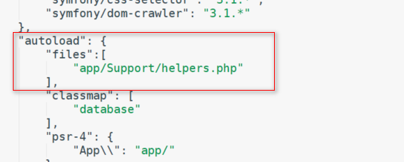

# 在Laravel中添加帮助类helpers.php

[toc]

## 方式1：

在composer.json中添加帮助类，自动的加载到容器中。

- 创建帮助类，位置：`app/Support/helpers.php`

```php
<?php
if(! function_exists('user')){

    /**
     * @param null $driver
     * @return mixed
     */
    function user($driver = null){
        if($driver){
            return app('auth')->guard($driver)->user();
        }
        return app('auth')->user();
    }
}
```

- 在`composer.json`中添加自动的注入  



- 在执行下面命令

```
composer dump-autoload
```


## 方式2：

 加载在`bootstrap`文件夹中 

>  bootstrap:目录包含了少许文件，用于框架的启动和自动载入配置，还有一个 cache 文件夹，里面包含了框架为提升性能所生成的文件，如路由和服务缓存文件； 

-  创建帮助文件`helpers.php`，位置：`bootstrap/helpers.php` 

```php
<?php

function route_class()
{
    return str_replace('.', '-', Route::currentRouteName());
}
```

-  在`bootstrap/app.php`文件中加载需要加载的文件 

```php
<?php
require __DIR__ . '/helpers.php';

```

