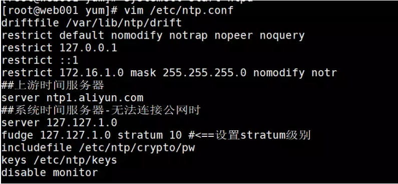

# 搭建时间服务器

[TOC]

### 确认ntp软件的安装

1）请确认是否已经安装ntp

```bash
[root@web002 yum.repos.d]# rpm -qa |grep ntp
ntpdate-4.2.6p5-28.el7.centos.x86_64
ntp-4.2.6p5-28.el7.centos.x86_64
```

2）若只有ntpdate而未见ntp，则需删除原有ntpdate。如：

```bash
ntpdate-4.2.6p5-22.el7_0.x86_64
fontpackages-filesystem-1.44-8.el7.noarch
python-ntplib-0.3.2-1.el7.noarch
```

3）删除已安装ntp

```bash
yum –y remove ntpdate-4.2.6p5-22.el7.x86_64
```

4）重新安装ntp

```bash
yum -y install ntp
```

### 配置ntp服务

1）修改主节点的/etc/ntp.conf
 【命令】vim /etc/ntp.conf
 【内容】

```bash
driftfile /var/lib/ntp/drift
restrict default nomodify notrap nopeer noquery   ##当前节点ip
restrict 127.0.0.1 
restrict ::1
restrict 172.16.1.0 mask 255.255.255.0 nomodify notr   ##集群所在网段的网关（Gateway），子网掩码
##上游时间服务器
server ntp1.aliyun.com
##系统时间服务器-无法连接公网时
server 127.127.1.0  
fudge 127.127.1.0 stratum 10 #<==设置stratum级别
includefile /etc/ntp/crypto/pw
keys /etc/ntp/keys
disable monitor
```

修改后如下(主节点)



5）主节点启动ntp服务

```bash
systemctl start ntpd
systemctl enable ntpd
```

6）客户端运行同步时间

```bash
ntpdate master1 ##master为时间服务器的ip
```

>服务端启动ntpd服务端才能同步。
>客户端关闭ntpd才能同步时间。