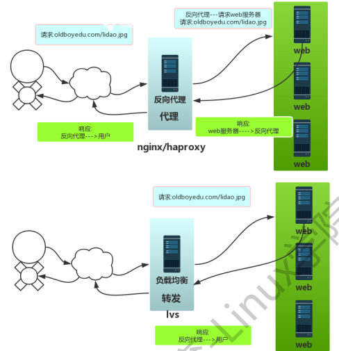

# 负载均衡

[TOC]

### 负载均衡的作用？

- 让后端服务器 保持每台服务器工作（负载）平均。

### 什么软件可以实现负载均衡功能

1）硬件设备：F5,A10,Redware
 2）开源软件：Nginx,Haproxy,Lvs

### 开源软件负载均衡的区别：

**命名**
 1）负载均衡 （lvs）对用户的请求进行转发
 2）反向代理 （nginx,haproxy）代替用户去找 再发给用户
 **功能**
 1）lvs  4层负载均衡，传输层tcp/udp 端口号，最多进行端口转发
 2） nginx haproxy  4层和7层负载均衡，应用层，进行http协议 uri转发。

### 负载均衡与反向代理区

|      | **负载均衡**                                                 | **反向代理**                                                 |
| ---- | ------------------------------------------------------------ | ------------------------------------------------------------ |
| 共同 | 用户请求 负载均衡 请求发给后端web服务器处理 处理完成最后返回给用户 | 用户请求 负载均衡 请求发给后端web服务器处理 处理完成最后返回给用户 |
| 区别 | 处理用户请求的时候 **转发** 处理                             | 用户请求到达反向代理 反向代 理代替用户进行请求 **代理**      |




### 负载均衡主机规划

| 主机名 | 应用环境      | 外网地址 |
| ------ | ------------- | -------- |
| web01  | nginx网站     | 10.0.0.7 |
| web02  | nginx网站     | 10.0.0.8 |
| lb01   | nginx负载均衡 | 10.0.0.5 |

### 负载均衡环境准备

**web01 web02操作如下**
 1）添加01.[www.conf](https://links.jianshu.com/go?to=http%3A%2F%2Fwww.conf)的配置文件

```cpp
[root@web01 /etc/nginx/conf.d]# cat  01-www.conf
server   {
    listen      80;
    server_name  www.oldboy.com;
    access_log  /var/log/nginx/access_www.log  main  ;
    root   /app/www;
    location / {
    index  index.html index.htm;
    }
}
```

2）添加02.blog.conf 的配置文件

```cpp
[root@web01 /etc/nginx/conf.d]# cat  02-blog.conf 
server   {
    listen       80;
    server_name  blog.oldboy.com;
    access_log  /var/log/nginx/access_blog.log  main;
    root   /app/blog;
    location / {
    index index.php index.html index.htm;
    }
```

3）创建对应的站点目录，并创建首页文件

```ruby
[root@web01 /etc/nginx/conf.d]# mkdir -p /app/{www,blog}
for n  in  www blog  ; do echo  `hostname` $n.oldboy.com >/app/$n/index.html ;done 
[root@web01 /etc/nginx/conf.d]# tree /app/
/app/
├── blog
│   └── index.html
└── www
    └── index.html
```

4）检查语法后重启nginx

```csharp
[root@web01 /etc/nginx/conf.d]# nginx -t 
[root@web01 /etc/nginx/conf.d]# systemctl reload nginx 
```

**lb01检查**
 **显示结果如下说明环境准备成功**

```css
[root@lb01 /etc/nginx]# curl -H Host:www.oldboy.com 10.0.0.[7-8]

[1/2]: 10.0.0.7 --> <stdout>
--_curl_--10.0.0.7
web01 www.oldboy.com

[2/2]: 10.0.0.8 --> <stdout>
--_curl_--10.0.0.8
web02 www.oldboy.com
[root@lb01 /etc/nginx]# curl -H Host:blog.oldboy.com 10.0.0.[7-8]

[1/2]: 10.0.0.7 --> <stdout>
--_curl_--10.0.0.7
web01 blog.oldboy.com

[2/2]: 10.0.0.8 --> <stdout>
--_curl_--10.0.0.8
web02 blog.oldboy.com
```

### 配置7层负载均衡

**upstream模块参数**

- server —— RS配置，可以是ip或域名
- weight ——权重
- max_fails ——失败次数
- fail_timeout =10s ——多久后在检查一遍
- backup ——如果加上backup 会在池塘中其他机器都挂掉 才会启动
- down 让服务器不可用

**lb01配置基础负载均衡**
 1）修改配置文件

```csharp
[root@lb01 ~]# cat /etc/nginx/nginx.conf
...............省略若干
http {
..............省略若干
    upstream   web_pools {   ##相当与创建一个池塘，把web服务器放在一起
    server 10.0.0.7:80 ;
    server 10.0.0.8:80 ;
    }
    server  {
    listen 80;
    server_name www.oldboy.com;
    location  / {                 ###默认匹配规则
       proxy_pass http://web_pools;   ###收到用户访问请求后将请求扔到池塘里
       }
    }    
}
```

2）curl命令测试,是否均匀分配

```css
[root@lb01 /etc/nginx]# curl 10.0.0.5
web02 www.oldboy.com
[root@lb01 /etc/nginx]# curl 10.0.0.5
web01 www.oldboy.com
[root@lb01 /etc/nginx]# curl 10.0.0.5
web02 www.oldboy.com
[root@lb01 /etc/nginx]# curl 10.0.0.5
web01 www.oldboy.com
```

**权重参数测试**
 1）修改配置文件

```csharp
[root@lb01 ~]# cat /etc/nginx/nginx.conf
...............省略若干
http {
..............省略若干
    upstream   web_pools {   ##相当与创建一个池塘，把web服务器放在一起
    server 10.0.0.7:80 weight=2;
    server 10.0.0.8:80 weight=1;
    }
    server  {
    listen 80;
    server_name www.oldboy.com;
    location  / {                 ###默认匹配规则
       proxy_pass http://web_pools;   ###收到用户访问请求后将请求扔到池塘里
       }
    }    
}
[root@lb01 /etc/nginx]# nginx -t
[root@lb01 /etc/nginx]# systemctl reload nginx
```

2）curl命令测试

```css
[root@lb01 /etc/nginx]# curl 10.0.0.5
web01 www.oldboy.com
[root@lb01 /etc/nginx]# curl 10.0.0.5
web01 www.oldboy.com
[root@lb01 /etc/nginx]# curl 10.0.0.5
web02 www.oldboy.com
[root@lb01 /etc/nginx]# curl 10.0.0.5
web01 www.oldboy.com
[root@lb01 /etc/nginx]# curl 10.0.0.5
web01 www.oldboy.com
```

**weight参数总结**

- 对性能稍微高一点的服务器多分配一点任务。
   **max_fails和 fail_timeou参数测试**
   1）修改配置文件

- ```csharp
  [root@lb01 ~]# cat /etc/nginx/nginx.conf
  ...............省略若干
  http {
  ..............省略若干
      upstream   web_pools {   ##相当与创建一个池塘，把web服务器放在一起
   server 10.0.0.7:80 weight=2 max_fails=3 fail_timeout=1;
   server 10.0.0.8:80 weight=1 max_fails=3 fail_timeout=1;
      }
      server  {
      listen 80;
      server_name www.oldboy.com;
      location  / {                 ###默认匹配规则
         proxy_pass http://web_pools;   ###收到用户访问请求后将请求扔到池塘里
         }
      }    
  }
  ```

  2） curl 命令测试

  ```dart
  [root@lb01 /etc/nginx]# for n in {1..100};do curl 10.0.0.5; sleep 1; done
  （web服务器全部开启的时）
  web01 www.oldboy.com
  web01 www.oldboy.com
  web02 www.oldboy.com
  web01 www.oldboy.com
  web01 www.oldboy.com
  （web02被关闭后）
  web01 www.oldboy.com
  web01 www.oldboy.com
  web01 www.oldboy.com
  （开启web02后）
  web02 www.oldboy.com
  web01 www.oldboy.com
  web01 www.oldboy.com
  web02 www.oldboy.com
  web01 www.oldboy.com
  web01 www.oldboy.com
  web02 www.oldboy.com
  ```

  **负载均衡处理多个虚拟主机**
   1）修改配置文件

  ```csharp
  [root@lb01 /etc/nginx]# vim nginx.conf 
  ...............省略若干
      upstream   web_pools {
      server 10.0.0.7:80 weight=1 max_fails=3 fail_timeout=10s;
      server 10.0.0.8:80 weight=1 max_fails=3 fail_timeout=10s;
      }
  #   include /etc/nginx/conf.d/*.conf;
      server  {
      listen 80;
      server_name www.oldboy.com;
      location  / {
         proxy_pass http://web_pools;
         }
      }    
  
      server  {
      listen 80;
      server_name blog.oldboy.com;
      location  / {
         proxy_pass http://web_pools;
         proxy_set_header Host $host;   ###修改负载均衡向web发送的请求头
         }
      } 
  } 
  ```

  2）curl命令测试

  ```css
  [root@lb01 /etc/nginx]# curl blog.oldboy.com
  web01 blog.oldboy.com
  [root@lb01 /etc/nginx]# curl blog.oldboy.com
  web02 blog.oldboy.com
  [root@lb01 /etc/nginx]# curl blog.oldboy.com
  web01 blog.oldboy.com
  [root@lb01 /etc/nginx]# curl blog.oldboy.com
  web02 blog.oldboy.com
  [root@lb01 /etc/nginx]# curl www.oldboy.com
  web01 www.oldboy.com
  [root@lb01 /etc/nginx]# curl www.oldboy.com
  web02 www.oldboy.com
  [root@lb01 /etc/nginx]# curl www.oldboy.com
  web01 www.oldboy.com
  [root@lb01 /etc/nginx]# curl www.oldboy.com
  web02 www.oldboy.com
  ```

3）windown抓包测试


**添加访问控制**

```php
server {
listen 80;
server_name www.oldboy.com;
location / {
   if ($remote_addr ~ "^192.168.22.") {   \\指定禁止访问的网段
   return 403 "别捣乱";  \\定义的是指定网段中，客户访问后返回的内容
   }
   proxy_pass http://web_pools;
   proxy_set_header Host $host;
   proxy_set_header X-Forwarded-For $remote_addr;
}
```

### 4层负载均衡

- 用户访问nginx 81端口 则被转发到后端 web01 8888 web02 9999 端口

 

- 用户访问nginx 81 lb01 

  -  web01 8888 : nc -kl 8888 
  - web02 9999 : nc -kl 9999 

  ```sh
  #7层负载均衡
  http {
      upstream web_pools {
          server 10.0.0.7:80;
          server 10.0.0.8:80;
      }
     server {
     listen 80;
     server_name www.oldboy.com;
         location / {
         proxy_pass http://
         }
      }
  }
  
  #4层负载均衡 
  stream{
   upstreamtcp_pools{
   server10.0.0.7:8888; server10.0.0.8:9999; }
   server{
   listen81;
   proxy_passtcp_pools; }
  }
  ```

  