# redis 基本操作

[TOC]

> **Redis是单线程的，基于内存操作的，CPU不是Redis的性能瓶颈，机器的内存和网络带宽才是。**
>
> 数据结构类型：字符串(STRING)，列表(LIST)，集合(SET)，散列(HASH)，有序集合(ZSET)。 
>
> 特殊数据结构类型： 地理位置(geospatial)，HyperLogLog，	位图（Bitmap）

**Redis有16个数据库，默认是第0个数据库，可以使用select  n切换到第n个数据库**

```sh
#当前数据库的 key 的数量。
127.0.0.1:6379> dbsize
(integer) 1
#切换数据库
127.0.0.1:6379> SELECT 1
OK
127.0.0.1:6379[1]> SELECT 0
OK
127.0.0.1:6379> 

#清空当前库的数据
flushdb
#清空全部数据库的内容
flushall

#判断指定key是否存在
dp(Redis::exists('str'));

#移动key到指定数据库
move key  1

#设置key的过期时间10秒
expire key 10

#查看key的过期时间
ttl key

#判断key的数据类型 
type key
```

### 1. 字符串(STRING)

> 可以是字符串、整数或者浮点数。
>
> 对整个字符串或者字符串的其中一部分执行操作，对整数或者浮点数执行自增或者自减操作。
>
> 应用场景:缓存功能，计数器，id生成器

```php
#设置一个值
Redis::set("key","value");
#返回一个值
Redis::get("key");

#原子操作
#larael5.4不可用
dp(Redis::set('k1', 'v1','EX','10','NX'));
dp(Redis::get('k1'));
dp(Redis::ttl('k1'));
dp(Redis::set('k1', 'v2','EX','10','NX'));
dd(Redis::get('k1'));
#原生调用命令行
dp(Redis::rawCommand('set', 'k1', 'v1','EX','10','NX'));
dp(Redis::rawCommand('get','k1'));
dp(Redis::ttl('k1'));
dp(Redis::rawCommand('set','k1', 'v2','EX','10','NX'));
dd(Redis::rawCommand('get','k1'));


#setex(set with expire)设置过期时间（10秒）
127.0.0.1:6379> setnx key1 10 'value1'
    
#setnx(set if not exist)不存在就设置，存在不可以设置（返回0）
127.0.0.1:6379> setnx key1 mysql
(integer) 1
127.0.0.1:6379> setnx key1 mongodb
(integer) 0
127.0.0.1:6379> get key1
"mysql"

#先查询在插入
127.0.0.1:6379> getset key2 redis
(nil)
127.0.0.1:6379> get key2
    
#返回key对应的value字符串长度
Redis::strlen("key");

dp(Redis::set('str', 'hell0 '));
#追加字符串
dp(Redis::append('str', 'world!'));
dp(Redis::get('str'));
#11是返回字符串的长度
[root@iZ2ze7v707npzyo25hxptpZ dev.c.baobaot.com]# ./artisan test:test
11
"hell0 world!"
#对字符串执行范围操作，索引是从0开始
dp(Redis::substr('str', 3,7));
[root@iZ2ze7v707npzyo25hxptpZ dev.c.baobaot.com]# ./artisan test:test
"lo he"
    
#返回 key 中字符串值的子字符（截取字符串）
getrange key 0 3
getrange key 0 -1
    
#设置0号索引的值变为H (替换)
dp(Redis::setrange('str', 0, 'H'));
dp(Redis::setrange('str', 6, 'W'));
[root@iZ2ze7v707npzyo25hxptpZ dev.c.baobaot.com]# ./artisan test:test
"Hello World!"
#替换索引11之后的值
dp(Redis::setrange('str', 11, ', how are you?'));
[root@iZ2ze7v707npzyo25hxptpZ dev.c.baobaot.com]# ./artisan test:test
"Hello World, how are you?"

#key加1 自增
incr  key
incr  key 5   #加5
#key减1
decr key
decr key 5  #减5
```

### 2.列表(LIST)

> List类型是一个链表结构的集合,其主要功能有push,pop,获取元素等.更详细的说,List类型是一个**双端链表**的结构,我们可以通过相关操作进行集合的头部或者尾部添加删除元素,list的设计非常简单精巧,即可以作为栈,又可以作为队列.满足绝大多数需求.**值可以重复**
>
> 应用场景：一个List很典型的应用场景：社区应用
> 社区应用是一个很广泛的概念，我们平时用的微博，朋友圈，博客，论坛都算是社区应用，社区应用无非就是一些帖子或状态，然后可以给这些帖子或状态回贴或评论，还有就是可以点赞

```php

#在左（头部）添加数据到list中  不存在时创建  返回值为添加元素后list的长度
Redis::lpush('test:list:1', 'item1');
#也可以同时添加多个
Redis::lpush('test:list:1', 'item2', 'item3');
#在左（头部）添加数据到list中  不存在时不创建  返回0
Redis::lpushx('test:list:1', 'item1');
#例子
#栈 -> 先进后出(如果一直从左边开始弹出)
Redis::lpush("list1",'one');
Redis::lpush("list1",'two');
Redis::lpush("list1",'three');
dump(Redis::lrange('list1',0,-1));#查看所有的list
#队列 ->先进先出(如果一直从左边开始弹出)
Redis::rpush('rlist','one');
Redis::rpush('rlist','two');
Redis::rpush('rlist','three');
dump(Redis::lrange("rlist",0,-1))#查看所有的list
            

#在右（尾部）添加数据到list中  不存在时创建  返回值为添加元素后list的长度
Redis::rpush('test:list:1', 'item2');
#在右（尾部）添加数据到list中  不存在时不创建  返回0
Redis::rpushx('test:list:1', 'item2');

#从左（头部）弹出list中数据 返回值为弹出的数据,(元素不在列表里) 若不存在当前key的话，返回null
Redis::lpop('test:list:1');
#使用lindex可以从列表里取出单个元素，元素仍然在列表里
Redis::lindex('test:list:1', 1);

#获取该key中所有数据 是个数组
Redis::lrange('test:list:1', 0, -1);


#ltrim key start stop：裁剪指定list，剩下的内容从start到stop。
#这里相当于对list进行剪裁，剪裁范围以外的元素丢弃
Redis::ltrim('test:list:1', 0, 1);


#blpop
移出并获取列表的第一个元素， 如果列表没有元素会阻塞列表直到等待超时或发现可弹出元素为止
    
#brpop 
移出并获取列表的最后一个元素， 如果列表没有元素会阻塞列表直到等待超时或发现可弹出元素为止。
 
#Rpoplpush list_1  list_2
从list_1列表中弹出位于最右端的元素，然后将这个元素推入list_2列表的最左端，并像用户返回这个元素。

#Brpoplpush list_1  list_2 timeout
从list_1列表中弹出位于最右端的元素，然后将这个元素推入list_2列表的最左端，并像用户返回这个元素。如果list_1为空，那么在timeout秒之内阻塞并等待可弹出的元素出现
#例子
Redis::rpush('list_1', 'item1');
Redis::rpush('list_1', 'item2');
Redis::rpush('list_2', 'item3');
dp(Redis::lrange("list_1",0,-1));
dp(Redis::lrange("list_2",0,-1));
Redis::brpoplpush('list_1', 'list_2', 1);
dp(Redis::lrange("list_1",0,-1));
dp(Redis::lrange("list_2",0,-1));
[root@iZ2ze7v707npzyo25hxptpZ dev.c.baobaot.com]# ./artisan test:test
array:2 [
  0 => "item1"
  1 => "item2"
]
array:1 [
  0 => "item3"
]
"item2"
array:1 [
  0 => "item1"
]
array:2 [
  0 => "item2"
  1 => "item3"
]

```

### 3.集合(SET)

> 数据没有顺序，并且每一个值不能重复；
>
> 是string类型的无序集合。集合是通过hashtable实现的，概念和数学中个的集合基本类似，可以交集，并集，差集等等，set中的元素是没有顺序的。所以添加，删除，查找的复杂度都是O(1)
>
> 应用场景：去重，抽奖
>
> Redis set对外提供的功能与list类似是一个列表的功能，特殊之处在于set是可以自动排重的，当你需要存储一个列表数据，又不希望出现重复数据时，set是一个很好的选择，并且set提供了判断某个成员是否在一个set集合内的重要接口，这个也是list所不能提供的。

```sh
#将一个元素添加到集合，命令返回1表示元素被成功添加到集合里，返回0表示集合中已存在该元素
Redis::sadd('set-key', 'item1');
Redis::sadd('set-key', 'item2');
Redis::sadd('set-key', 'item3');
Redis::sadd('set-key', 'item4');
Redis::smembers('set-key')
#实例
[root@iZ2ze7v707npzyo25hxptpZ dev.c.baobaot.com]# ./artisan test:test
array:4 [
0 => "item1"
1 => "item3"
2 => "item4"
3 => "item2"
]
#添加多个
Redis::sAdd('set-key',['item1','item2','item3']);

#检查一个元素是否存在于集合中，会返回一个布尔值表示检查结果
dump(Redis::sismember('set-key', 'item1'));
[root@iZ2ze7v707npzyo25hxptpZ dev.c.baobaot.com]# ./artisan test:test
true

#移除集合中的元素,会返回移除元素的数量
dump(Redis::srem('set-key', 'item1'));
dump(Redis::smembers('set-key'));
[root@iZ2ze7v707npzyo25hxptpZ dev.c.baobaot.com]# ./artisan test:test
1
array:3 [
0 => "item3"
1 => "item4"
2 => "item2"
]

#返回set的元素个数
Redis::scard ('set-key')
[root@iZ2ze7v707npzyo25hxptpZ dev.c.baobaot.com]# ./artisan test:test
3

#返回指定set中随机的n个元素,当返回数为整数时，命令返回的随机元素不会重复，如果为负数时，比如-1，命令返回的随机数可能会重复(例如返回数量是2，那么为负数的时候，返回的这两个数可能会是相同的)
Redis::srandmember('set-key',1)
[root@iZ2ze7v707npzyo25hxptpZ dev.c.baobaot.com]# ./artisan test:test
array:1 [
0 => "item3"
]
[root@iZ2ze7v707npzyo25hxptpZ dev.c.baobaot.com]# ./artisan test:test
array:1 [
0 => "item3"
]
[root@iZ2ze7v707npzyo25hxptpZ dev.c.baobaot.com]# ./artisan test:test
array:1 [
0 => "item2"
]

# key1 key2做并集，结果返回一个list;
Redis::sunion('key1','key2') 

#获取多个key对应的set之间的并集，并保存为新的key值；目标值也是一个set；
Redis::sunionstore('key', 'key1','key2')

# 用key1和key2…做差集，结果返回一个list;(切记，key1与key2的差集和key2与key1的差集是不同的)
#也就是返回那些存在于第一个集合，但不存在于其他集合中的元素
Redis::sdiff('key1','key2')

#将那些存在于第一个集合但并不存在于其他中的元素存储到dest-key集合中
Redis::sdiffstore('dest-key','key-name')
Redis::sdiffstore('dest-key','set-key1','set-key2');

# 用key1和key2…做交集，结果返回一个list;
Redis::sinter('key1','key2')
#将那些同时存在于所有集合中的元素存储到dest-key集合中(交集)
Redis::sintestorer('dest-key', 'key1','key2')

#spop 随机的移除集合中的一个元素，并返回被移除的元素(可用于抽奖)
Redis::spop("set-key")
[root@iZ2ze7v707npzyo25hxptpZ dev.c.baobaot.com]# php artisan test:test
array:5 [    #原有的集合中元素
0 => "1"
1 => "item1"
2 => "item3"
3 => "item2"
4 => "item4"
]
"item2"      #随机弹出的元素
array:4 [    #现在集合中的元素
0 => "1"
1 => "item3"
2 => "item4"
3 => "item1"
]

#smove 移动当前set集合的指定元素到另一个set集合
Redis::smove('set1', 'set2', 'ab'); // 移动'set1'中的'ab'到'set2', 如果ab被成功移除，返回true 否则返回 false
```


### 4.散列(HASH)

> 假如要存储的对象有很多属性，那么为了表示该对象，必然有很多Key来描述该对象，但是接下来的问题就变成了，假如我修改某个值，我是不是还需要把这个对象取出来，再加，是不是很麻烦？所以就有了Hash
>
> 应用场景: 替代string，以更合理的方式保存对象；

```php
#给一个hashes添加一个key1和value1；
Redis::hset('hash-name', 'key1', 'value1');
Redis::hset('hash-name', 'key2', 'value2');
Redis::hset('hash-name', 'key3', 'value3');
Redis::hset('hash-name', 'key4', 'value4');

Redis::hget('hash-name', 'key1');
#例子
[root@iZ2ze7v707npzyo25hxptpZ dev.c.baobaot.com]# ./artisan test:test
"value1"

#一次性取出一个hashes中所有的field和value，使用list输出(获取所有键值对)
Redis::hgetall('hash-key')
[root@iZ2ze7v707npzyo25hxptpZ dev.c.baobaot.com]# ./artisan test:test
array:4 [
  "key1" => "value1"
  "key2" => "value2"
  "key3" => "value3"
  "key4" => "value4"
]

#一次性的设置多个值(hashes)
Redis::hmset('hash-key2', ['key1'=>'value1', 'key2'=>'value2'])
[root@iZ2ze7v707npzyo25hxptpZ dev.c.baobaot.com]# ./artisan test:test
array:2 [
  "key1" => "value1"
  "key2" => "value2"
]

#一次性的得到多个值(hashes)
Redis::hmget('hash-key2', ['key1','key2'])

#得到一个散列的所有的键
Redis::hkeys('hash-key2')
[root@iZ2ze7v707npzyo25hxptpZ dev.c.baobaot.com]# ./artisan test:test
array:2 [
  0 => "key1"
  1 => "key2"
]

#得到一个散列的所有的值
Redis::hvals('hash-key2')
[root@iZ2ze7v707npzyo25hxptpZ dev.c.baobaot.com]# ./artisan test:test
array:2 [
  0 => "value1"
  1 => "value2"
]

#删除哈希
Redis::del('hash-key2')
#只删除哈希里面的指定键
Redis::del('hash-key2', 'key1')

#返回散列包含的键值对数量
Redis::hlen('hash-key2')

#hexists 返回hash表中的指定key是否存在
Redis::hexists('hash-key', 'key1') ; //true or false

#hsetnx 增加一个元素,但不能重复
Redis::hsetnx('hash1', 'key1', 'v2') ;  // false
Redis::hsetnx('hash1', 'key2', 'v2') ;  // true

#hincrby 对指定key进行累加
Redis::hincrby('hash1', 'key5', 3); 
Redis::hincrby('hash1', 'key5', 10); 

#hincrbyfloat 对指定key进行浮点数累加
Redis::hincrbyfloat('hash1', 'key5', 3.1); 
Redis::hincrbyfloat('hash1', 'key5', 10.1); 
```

### 5.有序集合(ZSET)

> 有序列表的键被称为成员，每个成员(member)都是各不相同的，有序集合的值被称为分值(score)，分值必须为**浮点数**。有序集合是redis里唯一一个既可以根据成员访问元素，又可以根据分值以及分值的排列顺序来访问元素的结构。

```php
#添加一个带分数的元素
 dump(Redis::zadd('zset-key', 728, 'member0'));
 dump(Redis::zadd('zset-key', 800, 'member1'));
 dump(Redis::zadd('zset-key', 982, 'member2'));

#返回有序集合，指定区间内的成员,其中成员的位置按分数值递增(从小到大)来排序。具有相同分数值的成员按字典序(lexicographical order )来排列。
dump(Redis::zrange('zset-key', 0, -1));
#例子
[root@iZ2ze7v707npzyo25hxptpZ dev.c.baobaot.com]# ./artisan test:test
array:3 [
  0 => "member0"
  1 => "member1"
  2 => "member2"
]

#返回有序集合,多个元素会按照分值大小进行排序。以成员和分值的键值对形式展示
#如果不上withscores，那么命令只会将成员返回
dump(Redis::zrange('zset-key', 0, -1, 'withscores'));
#例子
[root@iZ2ze7v707npzyo25hxptpZ dev.c.baobaot.com]# ./artisan test:test
array:2 [
  "member0" => 728.0
  "member1" => 800.0
  "member2" => 982.0
]


#命令返回有序集合，指定区间内的成员。其中成员的位置按分数值递减(从大到小)来排列。具有相同分数值的成员按字典序的逆序(reverse lexicographical order)排列。

dump(Redis::zrevrange("zset-key",0,-1));
#例子
array:3 [
  0 => "member2"
  1 => "member1"
  2 => "member0"
]

#zcount key min max ：给定范围分数的元素个数：
dump(Redis::zcount ("zset-key",700,800));
[root@iZ2ze7v707npzyo25hxptpZ dev.c.baobaot.com]# ./artisan test:test
2

#返回有序集中指定成员的排名。其中有序集成员按分数值递增(从小到大)顺序排列（从0开始）
dump(Redis::zrank("zset-key",'member1'));
[root@iZ2ze7v707npzyo25hxptpZ dev.c.baobaot.com]# ./artisan test:test
1

#返回成员member的分值
dump(Redis::zscore("zset-key", "member0"));

#通过分值返回有序集合指定区间内的成员
dump(Redis::zrangebyscore('zset-key', '0', '800'));
#例子
[root@iZ2ze7v707npzyo25hxptpZ dev.c.baobaot.com]# ./artisan test:test
#当前所有的成员
array:2 [
  "member0" => 728.0
  "member2" => 982.0
]
array:1 [
  0 => "member0"
]

#移除指定的元素
dump(Redis::zrem("zset-key",'member1'));
[root@iZ2ze7v707npzyo25hxptpZ dev.c.baobaot.com]# ./artisan test:test
1
array:2 [
  0 => "member0"
  1 => "member2"
]

#返回有序集合包含的成员数量
dump(Redis::zcard("zset-key"));

#将member成员的分值加上2
dump(Redis::zincrby("zset-key", "2", "member0"));

#返回有序集合里成员member0的排名，成员按照分值从大到小排列(第一个是0)
Redis::zrevrank('zset-key', 'member3')
    
[root@iZ2ze7v707npzyo25hxptpZ dev.m.baobaot.com]# ./artisan test:test
0

#删除表中指定位置区间的元素
dump(Redis::zremrangebyrank('zset-key', 2, 3));//删除位置为2-3的元素,返回删除的元素个数2

#删除一个索引区间的元素
dump(Redis::zremrangebyscore('zset-key', 2, 3));//删除索引在2-3之间的元素('ab','cd'), 返回删除元素个数2

#将多个表的交集存入另一个集合中
#zset-key1
array:3 [
  "member0" => 728.0
  "member1" => 800.0
  "member2" => 800.0
]
#zset-key2
array:2 [
  "member0" => 728.0
  "member1" => 1000.0
]    
Redis::zinterstore('zset-key', ['zset-key1', 'zset-key2']);  
#zset-key(zinterstore默认使用的聚合函数sum，这个函数会把各个有序集合的成员的分值都加起来)
array:2 [
  "member0" => 1456.0
  "member1" => 1800.0
]
#用户可以在执行并集运算和交集运算的时候传入不同的聚合函数，共有sum，min(取最小值),max(取最大值)三个聚合函数可选    
dump(Redis::zinterstore ('zset-key', ['zset-key1', 'zset-key2'], ['aggregate'=>'max'])); 


#将多个表的并集存入另一个集合中
dump(Redis::zunionstore ('zset-key', ['zset-key1', 'zset-key2']));    
#weights参数表示权重
dump(Redis::zunionstore('zset-key', ['zset-key1', 'zset-key2'], ['weights' => [2, 1]]));

#用户可以在执行并集运算和交集运算的时候传入不同的聚合函数，共有sum，min(取最小值),max(取最大值)三个聚合函数可选    
dump(Redis::zunionstore ('zset-key', ['zset-key1', 'zset-key2'], ['aggregate'=>'max'])); 
```

### 6.特殊数据类型

##### 1.地理位置(geospatial)

 1.geoadd：将指定的地理空间位置（经度、纬度、名称）添加到指定的key中。 

>  geoadd用来增加地理位置的坐标，可以批量添加地理位置，命令格式为： 

```sql
 GEOADD key longitude latitude member [longitude latitude member ...] 
```

 key标识一个地理位置的集合。`longitude latitude member`标识了一个地理位置的坐标。longitude是地理位置的**经度**，latitude是地理位置的**纬度**。member是该地理位置的名称。GEOADD可以批量给集合添加一批地理位置。 

- 有效的经度从-180度到180度。
- 有效的纬度从-85.05112878度到85.05112878度。

**当坐标位置超出上述指定范围时，该命令将会返回一个错误**。

```sh
#实例
geoadd china:user 116.40387397  39.91488908 beijing   #单个
geoadd china:user 121.486801 31.24257 shanghai 117.209523 39.093668 tianjin #多个
```

2. geopos：获取某个地理位置的坐标（经度和纬度）。 

>  geopos可以获取地理位置的坐标，可以批量获取多个地理位置的坐标，命令格式为： 

```sql
GEOPOS key member [member ...]
```

```sh
#实例
geopos china:user shanghai
1) "121.48680299520492554"
2) "31.24257125670815327"
```

3. geodist：获取两个给定位置之间的距离。 

>  geodist用来获取两个地理位置的距离，命令格式为： 

```sql
GEODIST key member1 member2 [m|km|ft|mi]
单位可以指定为以下四种类型：

m：米，距离单位默认为米，不传递该参数则单位为米。
km：公里。
mi：英里。
ft：英尺。
```

```sh
#实例
geodist china:user shanghai tianjin
"955613.6986"
geodist china:user shanghai tianjin km  #上海到天津的直线距离955.6千米
"955.6137"                       
```

4. georadius：以给定的经纬度为中心， 找出某一半径内的元素。（**附近的人**） 

>  georadius可以根据给定地理位置坐标获取指定范围内的地理位置集合。命令格式为： 

```sh
GEORADIUS key longitude latitude radius [m|km|ft|mi] [WITHCOORD] [WITHDIST] [ASC|DESC] [WITHHASH] [COUNT count]

# longitude latitude标识了地理位置的坐标，radius表示范围距离，距离单位可以为m|km|ft|mi，还有一些可选参数：
# WITHCOORD：传入WITHCOORD参数，则返回结果会带上匹配位置的经纬度。
# WITHDIST：传入WITHDIST参数，则返回结果会带上匹配位置与给定地理位置的距离。
# ASC|DESC：默认结果是未排序的，传入ASC为从近到远排序，传入DESC为从远到近排序。
# WITHHASH：传入WITHHASH参数，则返回结果会带上匹配位置的hash值。
# COUNT count：传入COUNT参数，可以返回指定数量的结果。
```

```sh
#实例
GEORADIUS china:user 121.486801 31.24257 1000 km
1) "shanghai"

GEORADIUS china:user 121.486801 31.24257 955.9 km WITHCOORD
1) 1) "shanghai"
   2) 1) "121.48680299520492554"
      2) "31.24257125670815327"
2) 1) "tianjin"
   2) 1) "117.2095218300819397"
      2) "39.09366727006780451"
      
#加了参数count，可以限定返回的数量
GEORADIUS china:user 121.486801 31.24257 955.9 km WITHCOORD count 1
1) 1) "shanghai"
   2) 1) "121.48680299520492554"
      2) "31.24257125670815327"

```

5. georadiusbymember：找出位于指定范围内的元素，中心点是由给定的位置元素决定。 

>  georadiusbymember可以根据给定地理位置获取指定范围内的地理位置集合。georadius命令传递的是坐标，georadiusbymember传递的是地理位置。georadius更为灵活，可以获取任何坐标点范围内的地理位置。但是大多数时候，只是想获取某个地理位置附近的其他地理位置，使用georadiusbymember则更为方便。georadiusbymember命令格式为（命令可选参数与georadius含义一样）： 

```sh
GEORADIUSBYMEMBER key member radius [m|km|ft|mi] [WITHCOORD] [WITHDIST] [ASC|DESC] [WITHHASH] [COUNT count]
```

```sh
#实例
georadiusbymember china:user tianjin 1000 km
1) "tianjin"
2) "shanghai"
```

6. geohash：获取一个或多个地理位置的geohash值。  **该命令将返回11个字符的Geohash字符串** 

>  geohash可以获取某个地理位置的geohash值。geohash是将二维的经纬度转换成字符串hash值的算法，后面会具体介绍geohash原理。可以批量获取多个地理位置的geohash值。命令格式为： 

```sh
GEOHASH key member [member ...]
```

> geohash的思想是将二维的经纬度转换成一维的字符串，geohash有以下三个特点：
>
> - 1、字符串越长，表示的范围越精确。
> - 2、字符串相似的表示距离相近，利用字符串的前缀匹配，可以查询附近的地理位置。这样就实现了快速查询某个坐标附近的地理位置。
> - 3、geohash计算的字符串，可以反向解码出原来的经纬度。
>
> 这三个特性让geohash特别适合表示二维hash值

```sh
#实例
GEOHASH china:user tianjin
1) "wwgq7hv35g0"
```

7. zrem

>  GEO没有提供删除成员的命令，但是因为GEO的底层实现是zset，所以可以借用zrem命令实现对地理位置信息的删除 

```sh
zrem china:city beijing
```

##### 2.HyperLogLog

>  Redis HyperLogLog 是用来做基数统计的算法，HyperLogLog 的优点是，在输入元素的数量或者体积非常非常大时，计算基数所需的空间总是固定 的、并且是很小的。 
>
> 在 Redis 里面，每个 HyperLogLog 键只需要花费 12 KB 内存，就可以计算接近 2^64 个不同元素的基 数。这和计算基数时，元素越多耗费内存就越多的集合形成鲜明对比。
>
> 但是，因为 HyperLogLog 只会根据输入元素来计算基数，而不会储存输入元素本身，所以 HyperLogLog 不能像集合那样，返回输入的各个元素。

> ## 什么是基数?
>
> 比如数据集 {1, 3, 5, 7, 5, 7, 8}， 那么这个数据集的基数集为 {1, 3, 5 ,7, 8}, 基数(不重复元素的个数)为5。 基数估计就是在误差可接受的范围内，快速计算基数。

```sh
#例子
#假如我要统计网页的UV（浏览用户数量，一天内同一个用户多次访问只能算一次），传统的解决方案是使用Set来保存用户id，然后统计Set中的元素数量来获取页面UV。但这种方案只能承载少量用户，一旦用户数量大起来就需要消耗大量的空间来存储用户id。我的目的是统计用户数量而不是保存用户，这简直是个吃力不讨好的方案！而使用Redis的HyperLogLog最多需要12k就可以统计大量的用户数，尽管它大概有0.81%的错误率，但对于统计UV这种不需要很精确的数据是可以忽略不计的。
```


```sh
#添加指定元素到 HyperLogLog 中。
127.0.0.1:6379> pfadd myset 'redis' 'mongodb' 'mysql'
(integer) 1
#返回给定 HyperLogLog 的基数估算值(统计)。
127.0.0.1:6379> PFCOUNT myset
(integer) 3
127.0.0.1:6379> pfadd myset2 'redis' 'php' 'java' 'mysql'
(integer) 1
127.0.0.1:6379> pfcount myset2
(integer) 4
#将多个 HyperLogLog 合并为一个 HyperLogLog
127.0.0.1:6379> pfmerge myset3 myset1 myset2

127.0.0.1:6379> pfcount myset3
5

# 统计 7 天之内总共有多少人上线了
PFMERGE "7_days_both_online_users" "day_1_online_users" "day_2_online_users" ... "day_7_online_users"
PFCOUNT "7_days_both_online_users"


```

##### 3.位图（Bitmap）

> ## 什么是位图 ？
>
> **位图（bitmap)** 是二进制的 **byte 数组**（只有0和1进行存储），也可以简单理解成是一个普通字符串。它将二进制数据存储在 byte 数组中以达到存储数据的作用。
>
> 例如，统计用户的活跃情况，公司的打卡情况，都可以用0和1来表示活跃或者不活跃


###### 基本存取

**setbit | getbit**

```sh
#我们模拟存储一下员工一周的打卡情况
127.0.0.1:6379> setbit userid 0 1           #0-6表示周一到周日，最后的0和1表示未打卡和打卡
(integer) 0
127.0.0.1:6379> setbit userid 1 0
(integer) 0
127.0.0.1:6379> setbit userid 2 0
(integer) 0
127.0.0.1:6379> setbit userid 3 1
(integer) 0
127.0.0.1:6379> setbit userid 4 1
(integer) 0
127.0.0.1:6379> setbit userid 5 1
(integer) 0
127.0.0.1:6379> setbit userid 6 1
(integer) 0

#查看某一天是否打卡
127.0.0.1:6379> getbit userid 6     #周日打卡
(integer) 1
127.0.0.1:6379> getbit userid 1     #周二未打卡
(integer) 0

#统计打卡的天数
127.0.0.1:6379> bitcount userid    #本周打卡了5天
(integer) 5

```

**BITOP operation destkey key [key ...]**

对一个或多个保存二进制位的字符串 `key` 进行位元操作，并将结果保存到 `destkey` 上。

`operation` 可以是 `AND` 、 `OR` 、 `NOT` 、 `XOR` 这四种操作中的任意一种：

- `BITOP AND destkey key [key ...]` ，对一个或多个 `key` 求逻辑并，并将结果保存到 `destkey` 。
- `BITOP OR destkey key [key ...]` ，对一个或多个 `key` 求逻辑或，并将结果保存到 `destkey` 。
- `BITOP XOR destkey key [key ...]` ，对一个或多个 `key` 求逻辑异或，并将结果保存到 `destkey` 。
- `BITOP NOT destkey key` ，对给定 `key` 求逻辑非，并将结果保存到 `destkey` 。

除了 `NOT` 操作之外，其他操作都可以接受一个或多个 `key` 作为输入。

```sh
# 计算出 7 天都在线的用户
BITOP "AND" "7_days_both_online_users" "day_1_online_users" "day_2_online_users" ... "day_7_online_users"

# 计算出 7 在的在线用户总人数
BITOP "OR" "7_days_total_online_users" "day_1_online_users" "day_2_online_users" ... "day_7_online_users"

# 计算出两天当中只有其中一天在线的用户
BITOP "XOR" "only_one_day_online" "day_1_online_users" "day_2_online_users"
```


# 事务

> Redis 事务可以一次执行多个命令， 并且带有以下三个重要的保证：
>
> - 批量操作在发送 EXEC 命令前被放入队列缓存。
> - 收到 EXEC 命令后进入事务执行，事务中任意命令执行失败，其余的命令依然被执行。
> - 在事务执行过程，其他客户端提交的命令请求不会插入到事务执行命令序列中。
>
> 一个事务从开始到执行会经历以下三个阶段：
>
> - 开始事务。(MULTI)
> - 命令入队。
> - 执行事务。(EXEC)

单个 Redis 命令的执行是原子性的，但 Redis 没有在事务上增加任何维持原子性的机制，所以 Redis 事务的执行并不是原子性的。

事务可以理解为一个打包的批量执行脚本，但批量指令并非原子化的操作，中间某条指令的失败不会导致前面已做指令的回滚，也不会造成后续的指令不做。

```sh
127.0.0.1:6379> MULTI
OK

127.0.0.1:6379> set book-name "jinhualun"
QUEUED

127.0.0.1:6379> get book-name
QUEUED

127.0.0.1:6379> SADD type "php" "redis" "mysql"
QUEUED

127.0.0.1:6379> SMEMBERS tag
QUEUED

127.0.0.1:6379> EXEC
1) OK
2) "jinhualun"
3) (integer) 3
4) 1) "php"
   2) "redis"
   3) "mysql"
```

### DISCARD（放弃事务）

> 清除所有先前在一个事务中放入队列的命令，然后恢复正常的连接状态。
>
> 如果使用了WATCH命令，那么DISCARD命令就会将当前连接监控的所有键取消监控。
>
>  这个命令的返回值是一个简单的字符串，总是OK。 

1. **如果命令有错，事务中所有的命令都不会被执行**

2. **运行时错误，也就是如果事务队列中存在语法性错误，那么执行命令的时候，其他命令可以执行。错误命令抛出异常**

### WATCH（监控）

> 当某个事务需要按条件执行时，就要使用这个命令将给定的键设置为受监控的。
>
> 这个命令的运行格式如下所示：
>
> ```
> WATCH key [key ...]
> ```
>
> 这个命令的返回值是一个简单的字符串，总是OK。
>
> 对于每个键来说，时间复杂度总是O(1)。

### UNWATCH（取消监控）

> 清除所有先前为一个事务监控的键。
>
> 如果你调用了EXEC或DISCARD命令，那么就不需要手动调用UNWATCH命令。
>
> 这个命令的运行格式如下所示：
>
> ```
> UNWATCH
> ```
>
> 这个命令的返回值是一个简单的字符串，总是OK。
>
> 时间复杂度总是O(1)。


# 配置文件（当前redis版本是6.2.1）

> units单位大小写不敏感

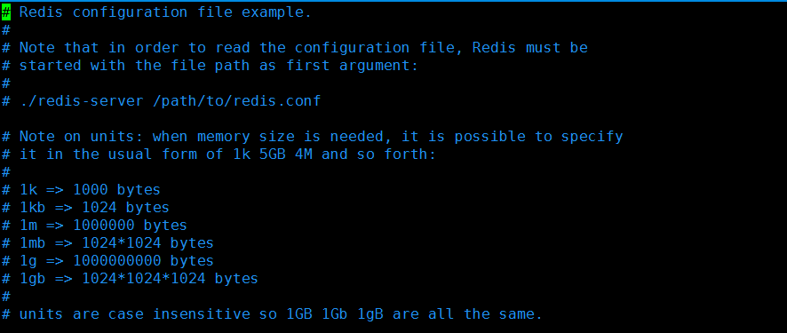


> 可以引入多个文件

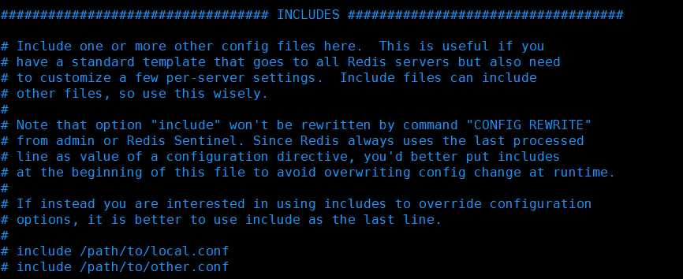


> 网络配置

```sh
bind 127.0.0.1  #绑定的ip
protected-mode yes #保护模式
port 6379   #端口
```


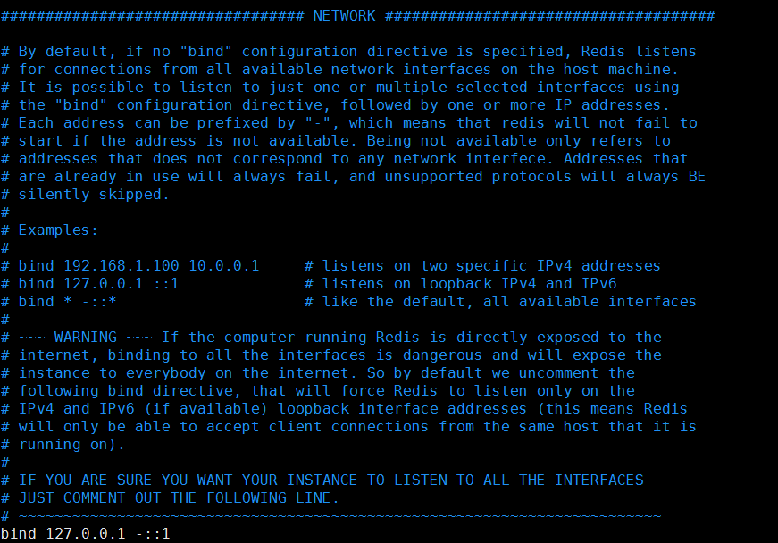

> GENERAL通用配置

```sh
#以守护进程（后台）的方式运行，默认是no，开启为yes
daemonize yes

#如果以后台的方式运行，我们就需要指定一个pid文件
pidfile /var/run/redis_6379.pid

#日志级别
# Specify the server verbosity level.
# This can be one of:
# debug (a lot of information, useful for development/testing)
# verbose (many rarely useful info, but not a mess like the debug level)
# notice (moderately verbose, what you want in production probably)
# warning (only very important / critical messages are logged)
loglevel notice

logfile ""  #日志生成的文件路径

databases 16   #默认有16个数据库
```

> SNAPSHOTTING 快照

```sh
#redis默认是rdb模式

# save 3600 1    如果3600秒(一小时)有一个key进行了修改，那么就持久化一次
# save 300 100   每300秒(5分钟)修改了100个key，那么就持久化一次
# save 60 10000  每60秒修改了10000个key，那么就持久化一次


#如果持久化出错了，是否还需要继续工作，默认是yes
stop-writes-on-bgsave-error yes

#是否压缩rdb文件，需要消耗一些cpu资源
rdbcompression yes

#报错rdb文件的时候，进行错误的检查校验
rdbchecksum yes

#rdb文件保存的目录
dir ./

```

> REPLICATION 主从复制

> SECURITY安全

```sh
#redis默认是没有密码的
config get requirepass     #命令行查看密码
config set requirepass '123456'    #命令行设置密码
auth 123456  #命令行登录
```

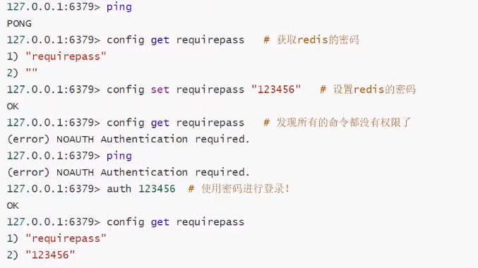

配置文件设置密码

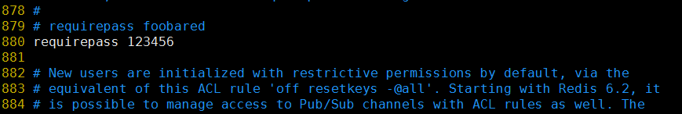


> CLIENTS限制

```sh
maxclients 10000 #设置能连接上redis的最大客户端的数量

# maxmemory <bytes> #配置最大的内存容量，默认是字节

# maxmemory-policy noeviction   #内存到达上限之后的处理策略


1、volatile-lru -> 只对设置了过期时间的key进行LRU（默认值）.
2、allkeys-lru -> 删除lru算法的key.
3、volatile-random -> 随机删除即将过期key.
4、allkeys-random -> 随机删除.
5、volatile-ttl -> 删除即将过期的
6、noeviction -> 永不过期，返回错误.

```


> APPEND ONLY MODE模式 aof配置

```sh
appendonly no  #默认不开启
#持久化的策略
# appendfsync always   #每次修改都会sync
appendfsync everysec   #每秒执行一次 sync，可能会丢失这1秒的数据-----redis默认是这个
# appendfsync no       #不同步，这个时候操作系统自己同步数据，速度是最快的
```


# 持久化

#### **RDB**（Redis DataBase）

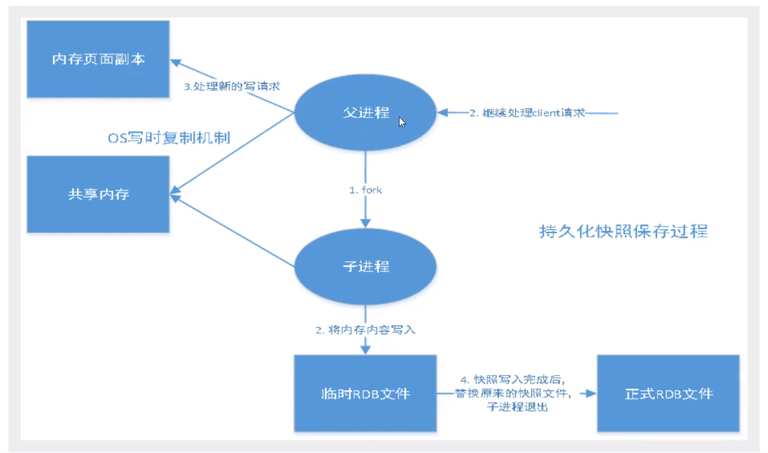

> 在指定的时间间隔内将内存中的数据集快照写入磁盘，也就是行话讲的snapshot快照，它恢复时是讲快照文件直接读到内存里。
>
> Redis会单独创建(fork)一个子进程来进行持久化，会先将数据写入到一个临时文件中，待持久化过程都结束了，再用这个临时文件替换上次持久化好的文件。整个过程中，主进程是不进行任何IO操作的，这就确保了极高的性能。如果需要进行大规模数据的恢复，且对于数据恢复的完整性不是非常敏感，那RDB方式要比AOF方式更加有效。RDB的缺点是最后一次持久化后的数据可能丢失。我们默认的就是RDB，一般情况下不需要修改这个配置。
>
> rdb保存的是dump.rdb文件

触发规则：

1、save的规则满足的情况下，会自动触发rdb规则

2、执行flushall命令也会触发rdb规则

3、退出redis，也会产生rdb规则

恢复：只需要讲rdb文件放在我们redis启动目录下就可以，redis启动的时候会自动检查dump文件，恢复其中的数据

```sh
127.0.0.1:6379> config get dir    #查看自己的启动目录
1) "dir"
2) "/opt/myredis"     #dump.rdb文件，启动就会自动恢复其中的数据
```

优点：

​		1、适合大规模的数据恢复

​		2、对数据的完整性要求不高

缺点：

​		1、需要一定的时间间隔进行操作，如果redis意外宕机了，这个最后一次的修改数据就没有了

​		2、fork进程的时候，会占用一定的内存空间

#### **AOF**(Append Only File)

> 以日志的形式来记录每个写操作，讲redis执行过的所有指令记录下来(读操作不记录)，只许追加文件但不可以写文件，redis启动之初会读取该文件重新构建数据，换而言之，redis重启的话就根据日志文件的内容将写指令从前到后执行一次已完成数据的恢复工作
>
> aof保存的是appendonly.aof文件

默认是不开启的，我们需要手动开启

如果appendonly.aof文件损坏，reids是连接不上，需要用`redis-check-aof --fix`修复

优点：

​		1、每一次修改都同步，文件完整性会更好。

​		2、每秒同步一次，可能会丢失一秒的数据

​		3、从不同步，效率最高

缺点：

​		1、相对于数据文件来说，aof远远大于rdb，修复的速度也比rdb慢.

​		2、aof运行效率比rdb慢，所以redis默认的持久化是rdb.


> 扩展

1. rdb持久化方式能够在指定的时间间隔内对你的数据进行快照存储
2. AOF持久化方式记录每次对服务器写的操作，当服务器重启的时候会重新执行这些命令来恢复原始的数据，AOF命令以Redis协议追加保存每次写的操作到文件末尾，Redis还能对AOF文件进行后台重写，使得AOF文件的体积不至于过大。
3. **只做缓存，如果你只希望你的数据在服务器运行的时候存在，你也可以不使用任何持久化**
4. 同事开启两种持久化方式
   -  在这种情况下，当Redis重启的时候会优先载入AOF文件来恢复原始的数据，因为在通常情况下AOF文件保存的数据集要比RDB文件保存的数据集要完整
   -  RDB的数据不实时，同时使用两者时服务器也只会找AOF文件，那要不要使用AOF呢？建议是不要，因为RDB更适合用于备份数据库（AOF在不断变化不好备份），快速重启，而且不会有AOF可能潜在的bug，留着作为以防万一的手段。
5. 性能建议
   -  因为RDB文件只用作后备用途，建议只在slave上持久化RDB文件，而且只要15分钟备份一次就够了，只保留save900 1 这条规则。
   -  如果Enable AOF，好处是在最恶劣情况下也只会丢失不超过两秒的数据，启动脚本较简单只load自己的AOF文件就可以了，代价一是带来了持续的IO，二是AOF rewrite的最后将 rewrite 过程中产生的新数据写到文件造成的阻塞几乎是不可避免的。只要硬盘许可，应该尽量减少AOF rewrite 的频率，AOF 重写的基础大小默认值64M太小了，可以设置到5G以上，默认超过原大小100%大小重写可以改到适当的数值。
   -  如果不Enable AOF，仅靠Master-Slave Repllcation 实现高可用也可以，能省掉一大笔IO，也减少了rewrite 时带来的系统波动。代价是如果 Master-Slave 同时倒掉（断电），会丢失十几分钟的数据，启动脚本也要比较两个 Master-Slave 中的RDB文件（也可以比较文件容量大小，大的较新），载入较新的那个。

# 发布订阅模式

#### 一、Redis的 Pub/Sub 模式

Redis 发布订阅(pub/sub)是一种消息通信模式：
发送者(pub)发送消息，订阅者(sub)接收消息。
`Redis 客户端可以订阅任意数量的频道。`

#### 二、发布订阅模式的基本命令

- subscribe channel 开启订阅
- publish channel message 发布信息
   `所有订阅该频道的用户都会受到信息` 
- pubsub subcommand [argument [argument ...]]  查看订阅与发布系统状态。
   `pubsub channels 可以用于查看当前活跃的频道`

```bash
#客户端1
127.0.0.1:6379> subscribe gongzhonghao    #订阅一个公众号
Reading messages... (press Ctrl-C to quit)
1) "subscribe"
2) "gongzhonghao"
3) (integer) 1
#等待读取推送的信息
1) "message"       #消息
2) "gongzhonghao"  #哪个频道的消息
3) "hello,nihao"   #消息的具体内容


#客户端2
127.0.0.1:6379> PUBLISH gongzhonghao "hello,nihao"  #发送一个消息到频道
(integer) 1
```

#### 三、发布订阅模式的实现原理

Redis通过PUBLISH、SUBSCRIBE和PSUBSCRIBE等命令实现了发布和订阅功能。

- 通过SUBSCRIBE命令订阅某个频道后，redis-server里面维护了一个字典，字典的键就是一个个channel，而字典的值则是一个链表，链表中保存了所有订阅这个channel的客户端。SUBSCRIBE命令的关键，就是将客户端添加到指定channel的订阅链表中。
- 通过PUBLISH命令向订阅者发送信息，redis-server会使用给定的频道作为键，在他所维护的channel字典中查找记录订阅该频道的所有客户端的链表，通过遍历这个链表，来将信息发布给所有的订阅者


# Redis主从复制

### 一、简单概述：

 在Redis集群中，让若干个Redis服务器去复制另一个Redis服务器，我们定义被复制的服务器为主服务器（master），而对主服务器进行复制的服务器则被称为从服务器（slave），这种模式叫做主从复制模式。

> 复制原理

1. Slave启动成功连接到 master 后会发送一个sync同步命令
2. Master接到命令启动后台的存盘进程，同时收集所有接收到的用于修改数据集命令，在后台进程执行完毕之后，master将传送整个数据文件到slave,以完成一次完全同步；
3. 全量复制：而slave服务在接收到数据库文件数据后，将其存盘并加载到内存中；
4. 增量复制：Master继续将新的所有收集到的修改命令依次传给slave,完成同步；
5. 但是只要是重新连接master,一次完全同步（全量复制) 将被自动执行；

###  二、实现操作：

##### 1.实现效果：即1个主服务器、2个从服务器

##### 2.复制并起不同的redis.conf名： 

> （因是实验，尽量不要去改动原配置）
>
> 准备环境
>
> 开启三个不同端口的redis服务
>
> 79  80  81

##### 3.配置redis.conf

>  即刚复制的redis6379  、redis6380、redis6381.conf，以下图片以redis6380.conf为例，其他修改类似：

- 修改端口号（redis6380.conf的端口即修改为6380，以往类推）:

   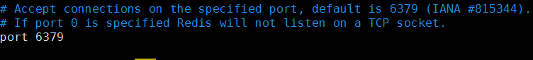

-  设置成后台进程： 

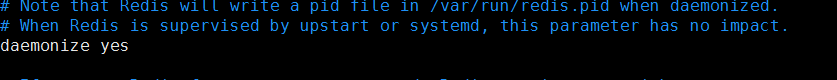

-  配置不同的pidfile： 

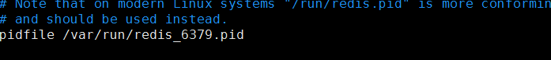

-  配置不同的logfile： 


-  配置不同的dbfilename: 


#####  4.启动redis-server服务： 

```sh
[root@contos7-3 config]# ps aux |grep redis
root      3587  0.3  0.5 162400  9812 ?        Ssl  15:59   0:02 redis-server 127.0.0.1:6379
root      3730  0.2  0.5 162396  9604 ?        Ssl  16:07   0:00 redis-server 127.0.0.1:6380
root      3736  0.3  0.5 162396  9596 ?        Ssl  16:07   0:00 redis-server 127.0.0.1:6381
root      3772  0.0  0.4  25056  7768 pts/1    S+   16:08   0:00 redis-cli -p 6379
root      3774  0.0  0.4  25056  7760 pts/0    S+   16:08   0:00 redis-cli -p 6380
root      3776  0.0  0.4  25056  7820 pts/2    S+   16:08   0:00 redis-cli -p 6381

```

#####  5.启动redis-cli： 

- 进入各个端口号的redis-cli：

```sh
#6379
redis-cli -p 6379

#6380
redis-cli -p 6380

#6381
redis-cli -p 6381
```

##### 6.主从方式有两种： 

- 命令行slaveof host port（host表示主机、port即表示端口号）
  优点：无需重启；缺点：不便于管理
- 配置方式
  优点：统一配置；缺点：需要重启

```bash

slaveof ip port
#只允许从节点进行读操作
slave-read-only yes
```

如果写到配置文件

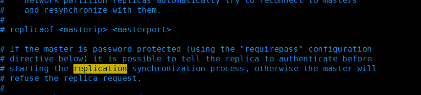

```sh
#配置文件中配置
#replicaof <masterip> <masterport>
replicaof  127.0.0.1 6379
#如果主机有密码，可以配置主机的密码
#masterauth <master-password>
masterauth  123456
```

##### 7.以命令行方式设置主从复制

（将6379设置成主服务、6380和6381为从服务；即在6380和6381输入命令行）： 

```sh
#80的reids
127.0.0.1:6380> SLAVEOF 127.0.0.1 6379    #认79的端口做主机
OK
127.0.0.1:6380> info replication
# Replication
role:slave
master_host:127.0.0.1
master_port:6379
master_link_status:up
master_last_io_seconds_ago:5
master_sync_in_progress:0
slave_repl_offset:14
slave_priority:100
slave_read_only:1
connected_slaves:0
master_failover_state:no-failover
master_replid:705361ee857e0c3a48f1a5ca09cf2030f5f8da93
master_replid2:0000000000000000000000000000000000000000
master_repl_offset:14
second_repl_offset:-1
repl_backlog_active:1
repl_backlog_size:1048576
repl_backlog_first_byte_offset:1
repl_backlog_histlen:14
127.0.0.1:6380>


#81的reids
127.0.0.1:6381> SLAVEOF 127.0.0.1 6379  #认79的端口做主机
OK
127.0.0.1:6381> info replication
# Replication
role:slave
master_host:127.0.0.1
master_port:6379
master_link_status:up
master_last_io_seconds_ago:0
master_sync_in_progress:0
slave_repl_offset:140
slave_priority:100
slave_read_only:1
connected_slaves:0
master_failover_state:no-failover
master_replid:705361ee857e0c3a48f1a5ca09cf2030f5f8da93
master_replid2:0000000000000000000000000000000000000000
master_repl_offset:140
second_repl_offset:-1
repl_backlog_active:1
repl_backlog_size:1048576
repl_backlog_first_byte_offset:127
repl_backlog_histlen:14


#查看主机的信息
127.0.0.1:6379> info replication
# Replication
role:master
connected_slaves:2                             #表示从服务数
slave0:ip=127.0.0.1,port=6380,state=online,offset=196,lag=1
slave1:ip=127.0.0.1,port=6381,state=online,offset=196,lag=1
master_failover_state:no-failover
master_replid:705361ee857e0c3a48f1a5ca09cf2030f5f8da93
master_replid2:0000000000000000000000000000000000000000
master_repl_offset:196
second_repl_offset:-1
repl_backlog_active:1
repl_backlog_size:1048576
repl_backlog_first_byte_offset:1
repl_backlog_histlen:196

```

##### 8.测试复制效果： 

 ```sh
#在主服务6379设置k： 
127.0.0.1:6379> set k2 v2
OK
127.0.0.1:6379> set k3 v3
OK
127.0.0.1:6379>
#从服务6380进行查看：
127.0.0.1:6380> get k2
"v2"
127.0.0.1:6380> get k3
"v3"

#从服务6381进行查看：
127.0.0.1:6381> get k2
"v2"
127.0.0.1:6381> get k3
"v3"

 ```

>  出现以上效果，说明主从复制已完成 

- 复制延时问题：
  由于所有的写操作都是先在Master上，再同步更新到Slave上，所以从Master同步到Slave机器有一定的延迟，当系统很繁忙的时候，延迟问题会更加严重，Slave机器数量的增加也会使这个问题更加严重。

##### ☆☆☆==数据同步阶段master说明==☆☆☆

- 如果master数据量巨大，数据同步阶段应避开流量高峰，避免造成master阻塞，影响业务的正常运行

- 复制积压缓冲区大小设定不合理，会导致数据溢出。如果进行全量复制周期太长，进行部分复制时，发现数据已经存在丢失的情况，必须进行第二次全量复制，致使slave陷入死循环状态。（设置缓冲区repl_backlog_size，默认是1MB）

  - 复制积压缓冲区的最小大小可以根据公式second*write_size_per_second来估算：

    ​	a、其中second为从服务器断线后重新连接上主服务器所需的平均时间（以秒计算）；

    ​    b、而write_size_per_second则是主服务器平均每秒产生的写命令数据量（协议格式的写命令的长度总和）；

    ​	例如，如果主服务器平均每秒产生1 MB的写数据，而从服务器断线之后平均要5秒才能重新连接上主服务器，那么复制积压缓冲区的大小就不能低于5MB。

  - 为了安全起见，可以将复制积压缓冲区的大小设为2 * second * write_size_per_second，这样可以保证绝大部分断线情况都能用部分重同步来处理。

- master单机内存占用主机内存的比例不应过大，建议使用50%-70%的内存，留下30%-50%的内存用于执行bgsave命令和创建复制缓冲区

##### ☆☆☆==数据同步阶段slave说明==☆☆☆

- 为避免slave进行全量复制、部分复制时服务器响应阻塞或数据不同步，建议关闭此期间的对外服务（设置reidis不容许写的对外服务 slave-serve-stale-data（新版本是replica-serve-stale-data）  默认是yes）
- 数据同步阶段，master发送给slave信息可以理解master是slave的一个客户端，主动向slave发送命令
- 多个slave同时对master请求数据同步，master发送的RDB文件增多，会对带宽造成巨大冲击，如果master带宽不足，因此数据同步需要根据业务需求，适量错峰

##### ☆☆☆==主从同步流程==☆☆☆

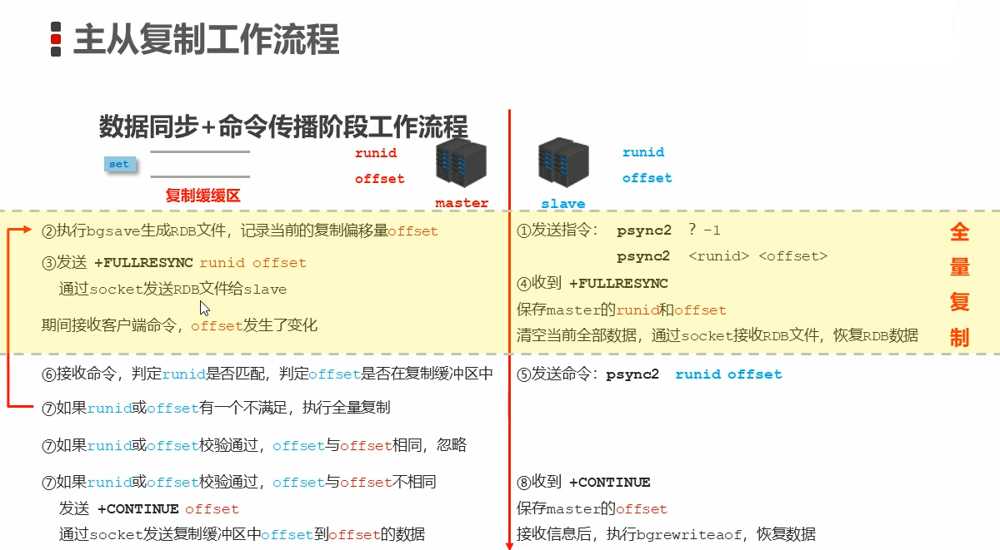

##### ☆☆☆==心跳机制==☆☆☆

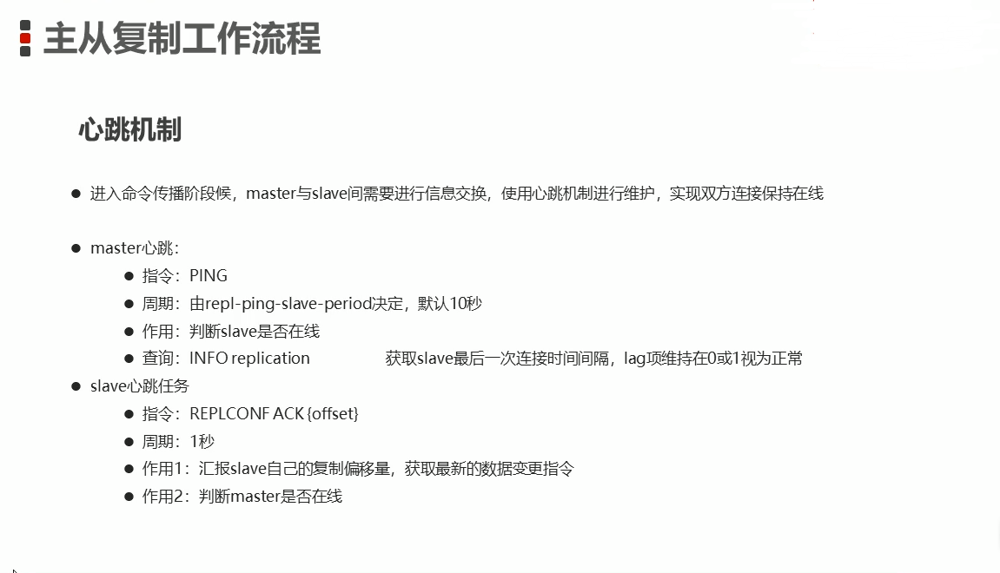

##### ☆☆☆==心跳阶段注意事项==☆☆☆

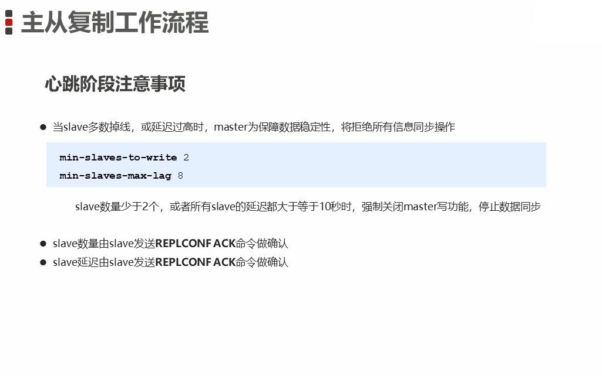

##### ☆☆☆==主从复制常见的问题==☆☆☆

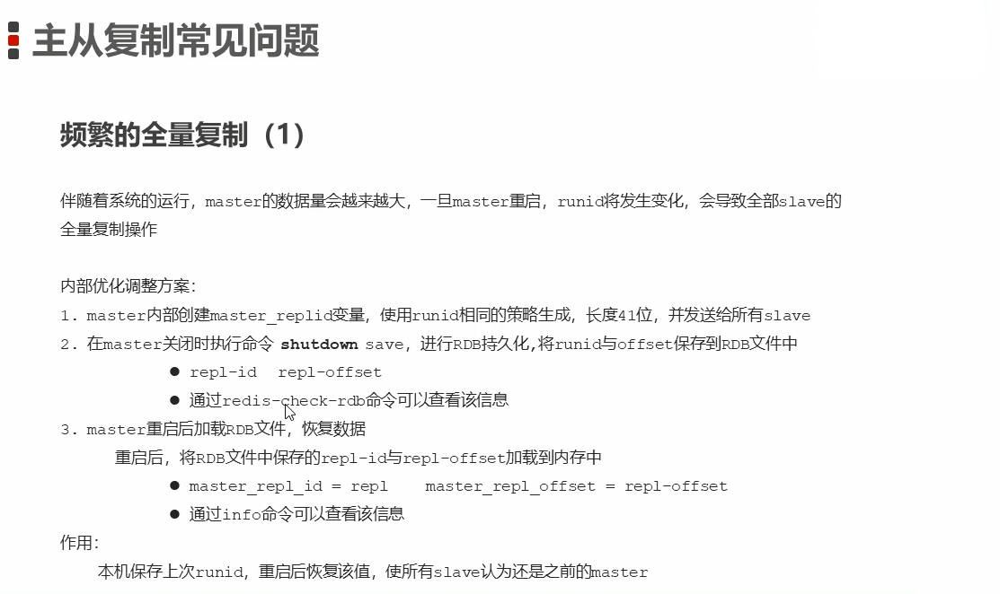

> 以上是在redis内部自动优化的。
>
> 查看RDB文件的命令是 redis-check-rdb dump.rdb

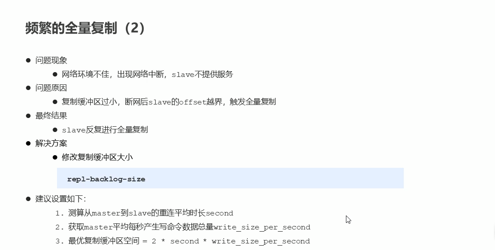

##### ☆☆☆==频繁的网络终端问题==☆☆☆

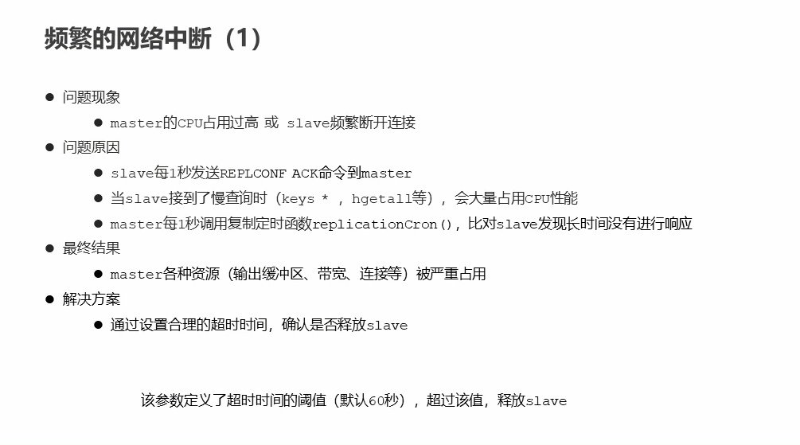

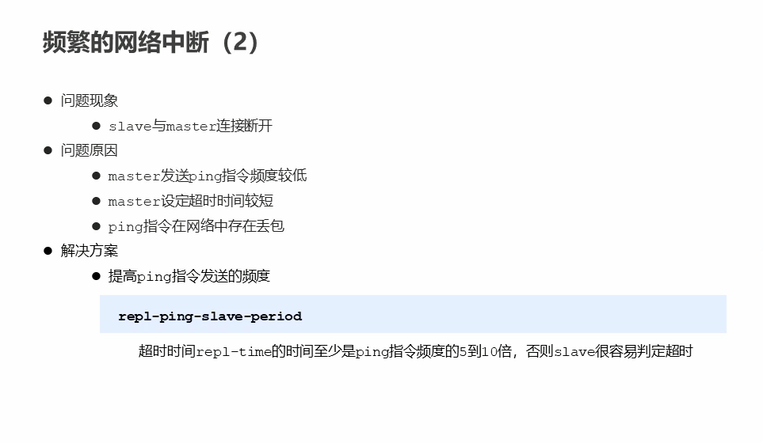

☆☆☆==数据不一致的问题==☆☆☆

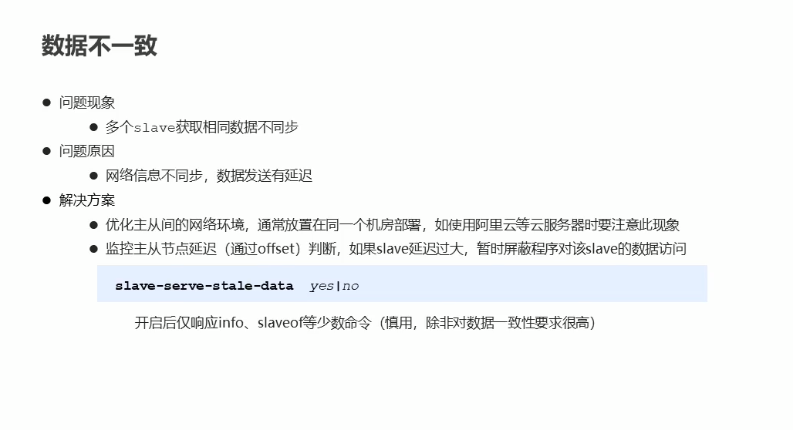

##### 9.测试从服务是否可以设置key

（说明为了保证数据的完整性，从服务是不能写数据的，只能读）： 

```sh
127.0.0.1:6380> set k4 v4
(error) READONLY You can't write against a read only replica.
```

##### 10.取消从服务

（在从服务中使用`slaveof no one`)

```sh
127.0.0.1:6380> slaveof no one
OK
```

#####  11.在主服务查看取消结果

（从服务数量变成1，只剩6381从服务，6380已取消）： 

```sh
127.0.0.1:6379> info replication
# Replication
role:master
connected_slaves:1
slave0:ip=127.0.0.1,port=6381,state=online,offset=1033,lag=0
master_failover_state:no-failover
master_replid:705361ee857e0c3a48f1a5ca09cf2030f5f8da93
master_replid2:0000000000000000000000000000000000000000
master_repl_offset:1033
second_repl_offset:-1
repl_backlog_active:1
repl_backlog_size:1048576
repl_backlog_first_byte_offset:1
repl_backlog_histlen:1033
```


### 三、主从集群中的缓冲区

> 概念：==复制缓冲区==，又名==复制积压缓冲区==，是一个先进先出的队列，用于存储服务器执行过的命令，每次传播命令，master都会将传播的命令记录下来，并存储在复制缓冲区。
>
> 复制缓冲区默认数据存储空间大小是1M，由于存储空间大小是固定的，当入队元素的数量大于队列长度时，最先入队的元素会被弹出，而新元素会被放入队列。
>
> 由来：每台服务器启动时，如果开启有AOF或被连接成为master节点，即创建复制缓冲区。
>
> 作用：用于保存master收到的所有命令（仅影响数据变更的指令，例如set，select）

主从集群间的数据复制包括全量复制和增量复制。无论哪种复制，都会用到缓冲区。

#### 复制缓冲区的溢出问题

全量复制时，从节点接收和加载RDB慢，同时主节点接收到大量的写命令，复制缓冲区越积越多，最后导致溢出。一旦发生溢出，主节点会关闭从节点的连接，导致全量复制失败。

#### 如何避免复制缓冲区发生溢出

首先，**控制主节点保存的数据量大小，通常控制在2~4GB**。

其次，**通过client-output-buffer-limit配置项来设置合理的复制缓冲区大小**：

```
config set client-output-buffer-limit slave 512mb 128mb 60
```

在实际应用中设置复制缓冲区的大小时，可以根据写命令数据的大小和应用的实际负载情况来估计缓冲区中累积的写命令数据量。然后再和所设置的复制缓冲区大小进行比较，判断设置的缓冲区大小是否足够支撑累积的写命令数据量。

关于复制缓冲区的问题，因为复制缓冲区是在主节点上的，如果集群中的从节点非常多，主节点的内存开销就会非常大。所以，**必须得控制和主节点连接的从节点个数**。


#  哨兵模式(sentinel) 

>  **主从切换技术的方法是：当主服务器宕机后，需要手动把一台从服务器切换为主服务器，这就需要人工干预，费事费力，还会造成一段时间内服务不可用。**这不是一种推荐的方式，更多时候，我们优先考虑**哨兵模式**。 

自动将自己作为主库：能够后台监控主机是否故障，如果故障了根据投票数自动将从库转换为主库；

##### 哨兵的作用

- 监控
  - 不断的检查master和slave是否正常运行
  - master存活检测、master与slave运行情况检测
- 通知（提醒）
  - 当被监控的服务器出现问题时，向其他（哨兵间，客户端）发送通知
- 自动故障转移
  - 断开master与slave连接，选取一个slave作为master，将其他slave连接到新的master，并告知客户端新的服务器地址
  - 服务器列表中挑选备选master原则
    - 在线的
    - 去掉响应慢的
    - 去掉与原master断开时间久的 （断开时间久说明连接速度慢，例如一个连接服务器一个是8s，一个是6s,显然8秒的就被pass掉了）
    - 优先原则
      - 优先级
      - offset（偏移量一样的）
      - runid（较小的比较好）

配置过程：
在/myredis/下创建sentinel.conf文件；
配置哨兵： sentinel monitor host6379 127.0.0.1 6379 1（host6379为哨兵名，可任意；1表示大于这个票数且票数最多的可以当Master）
启动哨兵：在/usr/local/bin下执行Redis-sentinel /myredis/sentinel.conf
当master挂了之后，投票选举：

**哨兵模式概述**

>  哨兵模式是一种特殊的模式，首先Redis提供了哨兵的命令，哨兵是一个独立的进程，作为进程，它会独立运行。其原理是**哨兵通过发送命令，等待Redis服务器响应，从而监控运行的多个Redis实例。** 

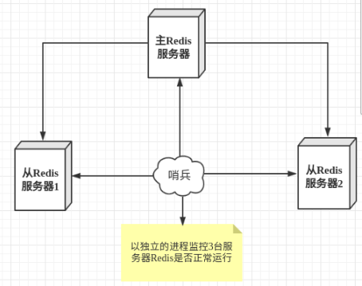

这里的哨兵有两个作用

- 通过发送命令，让Redis服务器返回监控其运行状态，包括主服务器和从服务器。
- 当哨兵监测到master宕机，会自动将slave切换成master，然后通过**发布订阅模式**通知其他的从服务器，修改配置文件，让它们切换主机。

然而一个哨兵进程对Redis服务器进行监控，可能会出现问题，为此，我们可以使用多个哨兵进行监控。各个哨兵之间还会进行监控，这样就形成了多哨兵模式。

用文字描述一下**故障切换（failover）**的过程。假设主服务器宕机，哨兵1先检测到这个结果，系统并不会马上进行failover过程，仅仅是哨兵1主观的认为主服务器不可用，这个现象成为**主观下线**（ **sdown** ）。当后面的哨兵也检测到主服务器不可用，并且数量达到一定值时，那么哨兵之间就会进行一次投票，投票的结果由一个哨兵发起，进行failover操作。切换成功后，就会通过发布订阅模式，让各个哨兵把自己监控的从服务器实现切换主机，这个过程称为**客观下线（ odown ）**。这样对于客户端而言，一切都是透明的。

### 一、Redis配置哨兵（单哨兵）模式

> 配置1个哨兵和1主2从的Redis服务器来演示这个过程。 

| **服务类型** | **是否是主服务器** | **IP地址** | **端口** |
| ------------ | ------------------ | ---------- | -------- |
| Redis        | 是                 | 127.0.0.1  | 6379     |
| Redis        | 否                 | 127.0.0.1  | 6380     |
| Redis        | 否                 | 127.0.0.1  | 6381     |
| Sentinel     | -                  | 127.0.0.1  | 26379    |

 在Redis安装目录下有一个sentinel.conf文件，copy一份进行修改

```sh
# 禁止保护模式(关闭了保护模式，便于测试。)
protected-mode no
# 配置监听的主服务器，这里sentinel monitor代表监控，mymaster代表服务器的名称，可以自定义，127.0.0.1代表监控的主服务器，6379代表端口，1代表只有一个或一个以上的哨兵认为主服务器不可用的时候，才会进行failover操作。
sentinel monitor mymaster 127.0.0.1 6379 1
# sentinel author-pass定义服务的密码，mymaster是服务名称，123456是Redis服务器密码
# sentinel auth-pass <master-name> <password>
sentinel auth-pass mymaster 123456

#通知脚本（shell脚本里可以写邮件，发送到邮箱）
# sentinel notification-script mymaster /var/redis/notify.sh
```

```sh
#启动哨兵进程
redis-sentinel sentinel.conf
```

> 如果Master节点断开，这个时候就会从从机中随机选择一个服务器(这里有一个头偏算法)
>
> 如果主机修复，只能归到新的主机下，当做从机。

优点：

1. 哨兵集群，基于主从复制模式，所有的主从配置优点，它全有
2. 主从可以切换，故障可以转移，系统的可用性就会更好
3. 哨兵模式就是主从模式的升级，手动到自动，更加完善。

缺点：

1. redis不好在线扩容，集群容量一旦到达上限，在线扩容就十分麻烦。
2. 实现哨兵模式的配置比较麻烦。

### 二、Redis配置哨兵（多哨兵）模式

>  配置3个哨兵和1主2从的Redis服务器来演示这个过程。 


| **服务类型** | **是否是主服务器** | **IP地址** | **端口** |
| ------------ | ------------------ | ---------- | -------- |
| Redis        | 是                 | 127.0.0.1  | 6379     |
| Redis        | 否                 | 127.0.0.1  | 6380     |
| Redis        | 否                 | 127.0.0.1  | 6381     |
| Sentinel     | -                  | 127.0.0.1  | 26379    |
| Sentinel     | -                  | 127.0.0.1  | 26380    |
| Sentinel     | -                  | 127.0.0.1  | 26381    |

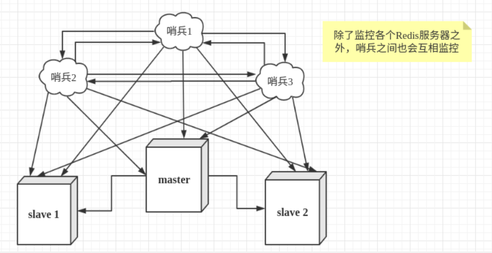


 **首先配置**Redis的主从服务器，修改redis.conf文件如下 

```bash
# 使得Redis服务器可以跨网络访问
bind 0.0.0.0
# 设置密码
requirepass "123456"
# 指定主服务器，注意：有关slaveof的配置只是配置从服务器，主服务器不需要配置
slaveof 127.0.0.1 6379
# 主服务器密码，注意：有关slaveof的配置只是配置从服务器，主服务器不需要配置
masterauth 123456
```

上述内容主要是配置Redis服务器，从服务器比主服务器多一个slaveof的配置和密码。

配置3个哨兵，每个哨兵的配置都是一样的。在Redis安装目录下有一个sentinel.conf文件，copy一份进行修改

```sh
# 禁止保护模式
protected-mode no
# 配置监听的主服务器，这里sentinel monitor代表监控，mymaster代表服务器的名称，可以自定义，127.0.0.1 代表监控的主服务器，6379代表端口，2代表只有两个或两个以上的哨兵认为主服务器不可用的时候，才会进行failover操作。
sentinel monitor mymaster 127.0.0.1 6379 2  #这个2指的是有几个哨兵认为主机断开了，一般是哨兵的一半加1，这也是哨兵一般为单数的原因
# sentinel author-pass定义服务的密码，mymaster是服务名称，123456是Redis服务器密码
# sentinel auth-pass <master-name> <password>
sentinel auth-pass mymaster 123456
```

上述关闭了保护模式，便于测试。

有了上述的修改，通过下面的命令启动服务器和哨兵

```bash
# 启动Redis服务器进程
./redis-server ../redis_6379.conf
# 启动哨兵进程
./redis-sentinel ../sentinel_6379.conf
```

 注意启动的顺序。**首先是主机的Redis服务进程，然后启动从机的服务进程，最后启动3个哨兵的服务进程。** 

**哨兵模式的其他配置项**

| **配置项**                       | **参数类型**                 | **作用**                                                     |
| -------------------------------- | ---------------------------- | ------------------------------------------------------------ |
| port                             | 整数                         | 启动哨兵进程端口                                             |
| dir                              | 文件夹目录                   | 哨兵进程服务临时文件夹，默认为/tmp，要保证有可写入的权限     |
| sentinel down-after-milliseconds | <服务名称><毫秒数（整数）>   | 指定哨兵在监控Redis服务时，当Redis服务在一个默认毫秒数内都无法回答时，单个哨兵认为的主观下线时间，默认为30000（30秒） |
| sentinel parallel-syncs          | <服务名称><服务器数（整数）> | 指定可以有多少个Redis服务同步新的主机，一般而言，这个数字越小同步时间越长，而越大，则对网络资源要求越高 |
| sentinel failover-timeout        | <服务名称><毫秒数（整数）>   | 指定故障切换允许的毫秒数，超过这个时间，就认为故障切换失败，默认为3分钟 |
| sentinel notification-script     | <服务名称><脚本路径>         | 指定sentinel检测到该监控的redis实例指向的实例异常时，调用的报警脚本。该配置项可选，比较常用 |

sentinel down-after-milliseconds配置项只是一个哨兵在超过规定时间依旧没有得到响应后，会自己认为主机不可用。对于其他哨兵而言，并不是这样认为。哨兵会记录这个消息，当拥有认为主观下线的哨兵达到sentinel monitor所配置的数量时，就会发起一次投票，进行failover，此时哨兵会重写Redis的哨兵配置文件，以适应新场景的需要。


#  集群

###  集群作用

- 分散单台服务器的访问压力，实现负载均衡
- 分散单台服务器的存储压力，实现可扩展性
- 降低单台服务器宕机带来的业务灾难

### 一、Redis Cluster集群简介

> Redis的sentinel哨兵模式虽然可以一定程度实现Redis的高可用，但是还存在单节点写入压力过大的问题，因为==客户端写入数据只能在Master节点==，当写入量特别大的时候主节点压力就会很大。Redis 3.x开始提供了Cluster集群模式，可以实现对数据分布式写入。由于分布式集群的性能会相对较低，flush、mget、keys等命令也不能跨节点使用，客户端的维护也更复杂，所以业务能在哨兵下满足需求尽量用哨兵模式。 

###  **二、Redis Cluster工作条件与原理** 

> 1、==Redis Cluster至少需要三个主节点才能工作==
>
> 2、Redis Cluster采用了数据分片机制，使用**16384**个（0-16383）Slot虚拟槽来平均存储数据。 每个key通过**CRC16**校验后对16384取模来决定放置哪个槽.集群的每个节点负责一部分hash槽 。也可以根据每个节点的内存情况手动分配，手动分配时需要把16384个分配完，否则集群无法正常工作
>
> 3、Redis Cluster每一个节点都可以作为客户端的连接入口并写入数据。Redis cluster的分片机制让每个节点都存放了一部分数据，比如1W个key分布在5个节点，每个节点可能只存储了2000个key，但是每一个节点都有一个类似index索引记录了所有key的分布情况
>
> 5、每一个节点还应该有一个Slave节点作为备份节点（比如用3台机器部署成Redis cluster，还应该为这三台Redis做主从部署，所以一共要6台机器），当master节点故障时slave节点会选举提升为master节点
>
> 6、Redis Cluster集群默认监听在16379端口。集群中所有Master都参与选举，当半数以上的master节点与故障节点通信超时将触发故障转移。任意master挂掉且该master没有slave节点，集群将进入fail状态，这也是为什么还要为他们准备Slave节点的原因。如果master有slave节点，但是有半数以上master挂掉，集群也将进入fail状态。当集群fail时，所有对集群的操作都不可用，会出现clusterdown the cluster is down的错误

###  **三、Redis Cluster配置文件** 

 redis-cluster的配置信息包含在了redis.conf中，要修改的主要有6个选项（==每一个节点都需要做这些配置==）： 

```sh
#开启集群
cluster-enabled yes 

#集群配置信息文件，由Redis自行更新，不用手动配置。每个节点都有一个集群配置文件用于持久化保存集群信息，需确保与运行中实例的配置文件名不冲突。
cluster-config-file nodes-6379.conf 

#节点互连超时时间，毫秒为单位
cluster-node-timeout 15000 

#在进行故障转移的时候全部slave都会请求申请为master，但是有些slave可能与master断开连接一段时间了导致数据过于陈旧，不应该被提升为master。该参数就是用来判断slave节点与master断线的时间是否过长。判断方法是：比较slave断开连接的时间和(node-timeout * slave-validity-factor)+ repl-ping-slave-period如果节点超时时间为三十秒, 并且slave-validity-factor为10，假设默认的repl-ping-slave-period是10秒，即如果超过310秒slave将不会尝试进行故障转移
cluster-slave-validity-factor 10 

#master的slave数量大于该值，slave才能迁移到其他孤立master上，如这个参数被设为2，那么只有当一个主节点拥有2个可工作的从节点时，它的一个从节点才会尝试迁移。
cluster-migration-barrier 1  

#集群所有节点状态为ok才提供服务。建议设置为no，可以在slot没有全部分配的时候提供服务。
cluster-require-full-coverage yes  
```

###  四、启动redis cluster服务

> 集群至少需要三个主节点，考虑主从的话还需要额外准备三个从节点

修改配置文件

```sh
#cat /opt/redis/cluster/redis-7001.conf
port 7001
daemonize no
dir /opt/redis/log
dbfilename dump-7001.rdb
rdbchecksum yes
rdbcompression yes
save 10 2
appendonly yes
appendfsync always
appendfilename appendonly-7001.aof
bind 127.0.0.1
databases 16
cluster-enabled yes
cluster-config-file nodes-7001.conf
cluster-node-timeout 10000

#其他的几个文件也是一样的修改方法
#cat redis-7002.conf
#cat redis-7003.conf
#cat redis-7004.conf
#cat redis-7005.conf
#cat redis-7006.conf
```

 依次启动redis实例 

```sh
redis-server /opt/redis/cluster/7001/redis.conf
redis-server /opt/redis/cluster/7002/redis.conf
redis-server /opt/redis/cluster/7003/redis.conf
redis-server /opt/redis/cluster/7004/redis.conf
redis-server /opt/redis/cluster/7005/redis.conf
redis-server /opt/redis/cluster/7006/redis.conf
```

### 五、创建集群

>  根据网上说的使用`Ruby`创建集群时 会给你提示，让你使用`redis-cli`创建集群，并会提示给你使用的语句使其和`redis-trib.rb`达到一致的效果（可以不用再单独的安装Ruby） 

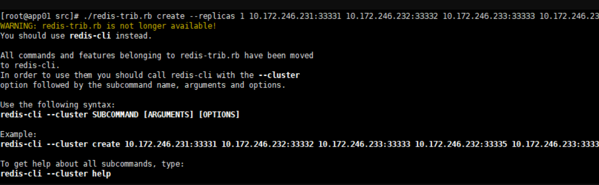

 原本使用`redis-trib.rb`的语句 

```sh
#在src目录下运行
[root@contos7-3 ~]#./redis-trib.rb create --replicas 1 127.0.0.1:7001 \
127.0.0.1:7002 \
127.0.0.1:7003 \
127.0.0.1:7004 \
127.0.0.1:7005 \
127.0.0.1:7006
```

 提示使用的`redis-cli`语句 ，接下来我们使用redis-cli

```sh
#集群的创建，将redis实例联系起来，创建一个集群
redis-cli --cluster create 127.0.0.1:7001 127.0.0.1:7002 127.0.0.1:7003 127.0.0.1:7004 127.0.0.1:7005 127.0.0.1:7006 --cluster-replicas 1 
#当然写--cluster-replicas 放在前面也可以
redis-cli --cluster create --cluster-replicas 1 127.0.0.1:7001 127.0.0.1:7002 127.0.0.1:7003 127.0.0.1:7004 127.0.0.1:7005 127.0.0.1:7006 
#它会罗列出集群的对应关系来让你确定。输入 yes完成集群创建。
```

> 可以看出两个语句都差不多，而且语句意思也差不多
>  `--cluster-replicas` 表示主备的比例关系 1 表示一个主节点对应一个备节点，如果是2表示一个主节点连接两个备节点
>  前三个 ip:port 默认表示主节点，后面的依次为前三个主节点的备份节点
>
> 如果是一主两从，那么前三个是主，后面6个是从

##### ☆☆☆==注意==☆☆☆

> 如果是在线上，并且是多台服务器的话，那么主备节点最好不在一台服务器。比如：三主三从三台服务器的配置，ip分别为1，2，3，那么可以把1的从机放在2的机器上，2的从机放在3上，3的从机放在1上。为了保证高可用（在任意一台服务器挂了的情况下都不影响redis集群的使用）
>
> 所以主备节点不可以在同一台服务器上（如果主备节点在同一台服务器上则备节点也没有太大的意义了）。所以要错开对应。

### 六、测试

```sh
#集群的关闭
#逐个关闭redis实例进程即可
#查找redis实例进程号
ps -ef | grep redis
#关闭redis进程,使用kill -9 ${进程号}，如果需要关闭多个进程，进程号之间空格隔开即可
kill -9 10252 10257 10262 10267 10272 10294
#也可执行以下命令来关闭redis进程
pkill -9 redis


#操作集群
#赋值必须加-c参数，如果用之前的redis-cli -p 6379的方式设置值会提示不在这个槽中
redis-cli -c -p 7001

```

