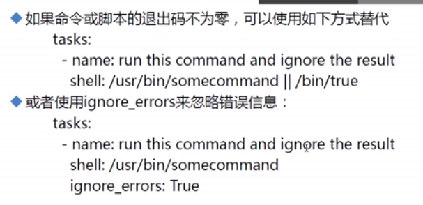
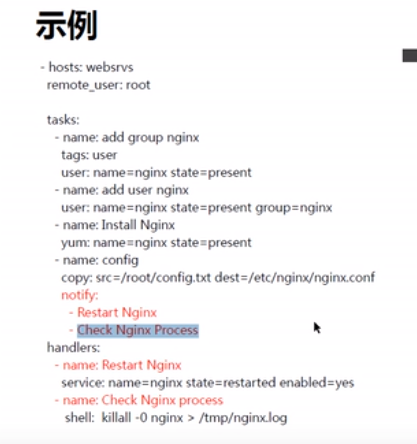
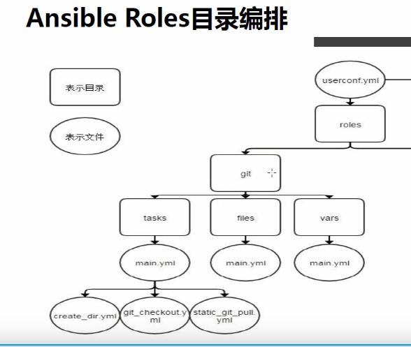

# ☆※ ansible 批量管理 ※☆

[TOC]

### ※ansible帮助信息查看方法

	ansible-doc  -l         --- 列出模块信息
	ansible-doc  -s 模块名  --- 列出模块参数信息
	ansible-doc  模块名     --- 列出模块详细信息
	绿色:   查询操作|操作没有执行
	黄色:   操作被执行了
	紫色:   警告建议信息
	红色:   报错
	蓝色:   显示执行过程
### 1.ansible批量管理服务概述

01. 是基于python语言开发的自动化软件工具
2. 是基于SSH远程管理服务实现远程主机批量管理
### 2.ansible批量管理服务意义
01. 提高工作的效率
02. 提高工作准确度
03. 减少维护的成本
04. 减少重复性工作
### 3. ansible批量管理服务功能
01. 可以实现批量系统操作配置
02. 可以实现批量软件服务部署
03. 可以实现批量文件数据分发
04. 可以实现批量系统信息收集
### 4.ansible批量管理服务特点
01. 管理端不需要启动服务程序（no server）
02. 管理端不需要编写配置文件（/etc/ansible/ansible.cfg）
03. 受控端不需要安装软件程序（libselinux-python）
04. 受控端不需要启动服务程序（no agent）
05. 服务程序管理操作模块众多（module） 
06. 利用剧本编写来实现自动化（playbook）

### 5.安装ansible

```sh
yum install -y ansible
```

### 6.查看ansible下配置文件

```sh
[11:53 root@m01 ~]# rpm -ql ansible|grep -v /usr/
/etc/ansible
/etc/ansible/ansible.cfg  ##配置文件
/etc/ansible/hosts   ##主机清单
/etc/ansible/roles
```

```sh
[11:53 root@m01 ~] /etc/ansible/ansible.cfg
host_key_checking = False  (ansible第一次连接被管理机是否需要验证host_key)

[11:53 root@m01 ~] ansible  webserver(清单里的主机分组)  --list    查看主机分组列表
```

### ※定义变量的优先级次序

> 首先是命令行
>
> ansible-playbook -e "http_port=99" text.yml  最高
>
> 其次就是剧本里（playbook）
>
> 最后才是主机清单定义的变量

### 7.配置主机清单(基本)

```sh
#配置方式一: 直接编写主机IP地址
[root@m01 ~]# cat /etc/ansible/hosts
172.16.1.7
172.16.1.41
#配置方式二: 进行分组配置
[root@m01 ~]# tail -n4 /etc/ansible/hosts
[webserver]
172.16.1.7
172.16.1.41
[dbserver]                                    
172.16.1.31
#配置方式三: 进行变量配置(剧本)
#变量设置方法一: 指定主机调用变量信息
172.16.1.41  ansible_user=root  ansible_password=654321  ansible_port=22
#变量设置方法二: 将组中所有主机统一设置变量信息
[rsync-server]
172.16.1.41
[rsync-server:vars]
ansible_user=root
ansible_password=654321
ansible_port=22
#配置方式四: 将多个组进行整合
[rsync:children]
rsync-server
rsync-client
[rsync-server]
172.16.1.41
[rsync-client]
172.16.1.31
172.16.1.7
#配置方式五: 将多个连续的主机进行符号匹配 
[oldboy]
172.16.1.[1:4]
```

### 8.ansible 的Host-pattern

```sh
1.匹配主机的列表

All:   表示所有清单（inventory）中的所有主机

ansible  all  -m ping

2.通配符:

ansible   ”*“   -m ping

ansible   ”10.0.0.*“   -m ping

ansible   ”web*“   -m ping

3.或关系:

ansible  'webserver:dbserver' -m ping

ansible  '10.0.0.31:10.0.0.41' -m ping

4.逻辑与：

ansible  'webserver:&dbserver' -m ping

在web组并且在db组中的主机

5.逻辑非：

ansible  'webserver:!dbserver' -m ping

在webserver组，但不在dbserver组中的主机(只能用单引号)

6.综合逻辑：

ansible  “ webserver:dbserver:&appserver:!ftpserver ” -m ping

7.正则表达式：

ansible  “ webserver:&dbserver ” -m ping

ansible  “ ~(web|db).*\.baidu\.com ” -m ping
```

### 例子

```sh
[root@m01 ~]# ansible all -m ping
172.16.1.41 | SUCCESS => {
    "ansible_facts": {
        "discovered_interpreter_python": "/usr/bin/python"
    }, 
    "changed": false, 
    "ping": "pong"  #通畅
}
172.16.1.7 | SUCCESS => {
    "ansible_facts": {
        "discovered_interpreter_python": "/usr/bin/python"
    }, 
    "changed": false, 
    "ping": "pong"  ##通畅
}
```

### 9.模块

#### 1. command

> 默认的命令模块。只支持简单命令不支持特殊符号

```sh
[root@m01 ~]# ansible all -m command -a 'hostname'  (-m command可以不写，默认就是)
172.16.1.7 | CHANGED | rc=0 >>
web01
172.16.1.41 | CHANGED | rc=0 >>
backup

[root@m01 ~]# ansible all -m command -a 'echo {1..5}'
172.16.1.41 | CHANGED | rc=0 >>
{1..5}
172.16.1.7 | CHANGED | rc=0 >>
{1..5}
```

> command --- 远程批量执行命令模块 (默认模块)
> 基本功能:
> ansible all -m command -a "ip a s eth0"
> 模块参数:
> chdir     --- 在执行命令前切换目录
> ansible all -m command -a "chdir=/tmp  touch oldboy.txt"
> creates   --- 指定目录如果存在,   跳过后续操作过程
> removes   --- 指定目录如果不存在, 跳过后续操作过程

#### 2. shell

> 支持特殊符号 ,执行脚本

```sh
#双引号返回的是当前管理机的服务器名称（失败）
[root@m01 ~]# ansible 10.0.0.* -m shell -a "echo $HESTNAME"
10.0.0.7 | CHANGED | rc=0 >>
m01
10.0.0.41 | CHANGED | rc=0 >>
m01
#单引号返回的是目标被管理机的服务器名称（正确）
[root@m01 ~]# ansible 10.0.0.* -m shell -a 'echo $HESTNAME'
10.0.0.7 | CHANGED | rc=0 >>
web01
10.0.0.41 | CHANGED | rc=0 >>
nfs
```

#### 3. script

> 先把脚本传输到远端然后再执行

```sh
[root@m01 ~]# #ansible all  -m script  -a "/server/scripts/yum.sh"
[root@m01 ~]# ansible all -a 'rpm -qa ipvsadm'
 [WARNING]: Consider using the yum, dnf or zypper module rather than running 'rpm'.  If you need to use command because
yum, dnf or zypper is insufficient you can add 'warn: false' to this command task or set 'command_warnings=False' in
ansible.cfg to get rid of this message.

172.16.1.41 | CHANGED | rc=0 >>
ipvsadm-1.27-7.el7.x86_64

172.16.1.7 | CHANGED | rc=0 >>
ipvsadm-1.27-7.el7.x86_64
```

#### 4. copy

> 推送文件，修改权限，所有者，所属组

```sh
[root@m01 ~] ansible all -m copy -a "src=/oldboy/oldbaby.txt dest=/tmp mode=666 owner=oldboy group=oldboy"

#批量备份源文件:
[root@m01 ~] ansible all -m copy -a "src=/oldboy/oldbaby.txt dest=/tmp mode=666 owner=oldboy group=oldboy backup=yes" 

#批量还原文件信息:
[root@m01 ~] ansible all -m copy -a "src=/tmp/oldbaby.txt.bak dest=/tmp/oldbaby.txt mode=666 owner=oldboy group=oldboy remote_src=yes"

#批量创建文件, 文件中生成指定信息
[root@m01 ~] ansible all -m copy -a "content=rsync_backup:oldboy123 dest=/etc/rsync.password mode=600"
	
#批量分发文件会自动创建目录信息
[root@m01 ~] ansible all -m copy -a "src=/oldboy/oldbaby.txt  dest=/oldbaby/oldboy01/oldboy02/oldboy03/  mode=600"
```

#### 5. fetch

> 批量拉取数据模块(只能是单个文件)
>
> 官方文档：
>
> src:    # (required) The file on the remote system to fetch. This `must' be a file, not a directory. Recursive fetching may be supported in a later release.
>
> src:   （必需）要获取的远程系统上的文件。这“必须”是一个文件，而不是一个目录。在以后的版本中可能支持递归获取。

```sh
#批量拉取文件数据信息
[root@m01 ~] ansible all -m fetch -a "src=/tmp/ dest=/oldgirl"
```

#### 6. yum 

> 安装，删除，更新 软件
>
> 安装和卸载多个软件，name=tree,httpd可以用逗号隔开

```sh
#删除
[root@m01 ~]# ansible all -m yum -a 'name=tree state=absent'
#安装
[root@m01 ~]# ansible all -m yum -a 'name=tree state=present'
```

#### 7. file

> 创建文件 或目录(修改文件属性信息 )

```sh
#修改文件权限属性信息
[root@m01 ~]# ansible all -m file -a "path=/tmp/oldbaby.txt mode=644 owner=root group=root"
	
#批量创建目录信息
[root@m01 ~]# ansible all -m file -a "path=/oldboy50/ state=directory"
	
#批量创建文件信息
[root@m01 ~]# ansible all -m file -a "path=/oldboy50/ state=touch"
	
#批量创建硬链接文件
[root@m01 ~]# ansible all -m file -a "src=/oldboy50/oldboy.txt  path=/oldboy50/oldboy_hard.txt state=hard"

#批量创建软链接文件
[root@m01 ~]# ansible all -m file -a "src=/oldboy50/oldboy.txt  path=/oldboy50/oldboy_soft.txt state=link"
	
#批量删除文件信息
ansible all -m file -a "path=/oldboy50/ state=absent"
```

#### 8. serivce

> serivce
>     开启 关闭重启
>     name
>     state
>         started #启动服务
>         stopped #停止服务
>         restarted #重启服务
>         reloaded #重载服务
>     enabled
>         yes
>         no

```sh
#重启crond服务
[root@m01 ~]# ansible all -m service -a 'name=crond enabled=yes state=restarted'
```

#### 9. cron

```sh
#书写定时任务到所有主机,每5分钟同步系统时间
[root@m01 ~]# ansible all -m cron -a 'name="sync time" minute="*/5" job="/sbin/ntpdate ntp1.aliyun.com >/dev/null 2>&1" state=present'

#批量设置定时任务:
[root@m01 ~]# ansible all -m cron -a "name='date sync01' minute=0  hour=2   job='ntpdate ntp1.aliyun.com &>/dev/null'"

#批量删除定时任务:
[root@m01 ~]# ansible all -m cron -a "name='date sync01' state=absent"
	
#批量注释定时任务:(disabled=true也是可以的)
[root@m01 ~]# ansible all -m cron -a "name='date sync01' minute=0  hour=2   job='ntpdate ntp1.aliyun.com &>/dev/null' disabled=yes"   
```

#### 10. user

```sh
#批量创建用户信息
[root@m01 ~]# ansible all -m user -a "name=alex"
[root@m01 ~]# ansible all -m user -a "name=alex01 uid=4000"
[root@m01 ~]# ansible all -m user -a "name=alex02 uid=4001 group=alex"
[root@m01 ~]# ansible all -m user -a "name=alex03 system=yes shell=/sbin/nologin create_home=no"

#批量删除用户信息
[root@m01 ~]# ansible all -m user -a "name=alex state=absent"
[root@m01 ~]# ansible 172.16.1.41 -m user -a "name=alex01 state=absent remove=yes"
	
#批量创建用户设置密码
[root@m01 ~]# ansible 172.16.1.41 -m user -a 'name=alex01 password=$6$01$snUJALRNL0on5KrtUPpluyfigSNzXxOxDgcdY5djxcmw45C/tKvB./53OhOXLbTqg/D8XadSbcpYqgJTzJ2bH0'
#如何创建密文密码:
	#方法一:
[root@oldboy-m01 ~]# ansible all -i localhost, -m debug -a "msg={{ 'oldboy123' | password_hash('sha512', '01') }}"
    localhost | SUCCESS => {
        "msg": "$6$01$snUJALRNL0on5KrtUPpluyfigSNzXxOxDgcdY5djxcmw45C/tKvB./53OhOXLbTqg/D8XadSbcpYqgJTzJ2bH0"
    }

	#方法二:
	yum install -y python-pip
	pip install passlib
	优化pip源方法
	pypi
    配置方法
    在文件
    
    ~/.pip/pip.conf
    中添加或修改:
    
    [global]
    index-url = https://mirrors.aliyun.com/pypi/simple/
    
    [install]
    trusted-host=mirrors.aliyun.com
	[root@oldboy-m01 ~]# python -c "from passlib.hash import sha512_crypt; import getpass; print(sha512_crypt.using(rounds=5000).hash(getpass.getpass()))"
    Password: 
    $6$YEBaHethHNl2oEUU$ejYMZcDtlHhgWBMuKevFSf7CpGvqVbBD2qMwB4lrdJ3IW2awZafxnDJtvCuEEnbT1ftNbQ46IHS8IcVw1kmO30
```

#### 11. mount

```sh
#批量挂载操作:
[root@oldboy-m01 ~]# ansible 172.16.1.41 -m mount -a "src=172.16.1.31:/data/blog path=/mnt fstype=nfs state=mounted"
#批量卸载操作:
[root@oldboy-m01 ~]# ansible 172.16.1.41 -m mount -a "src=172.16.1.31:/data/blog path=/mnt fstype=nfs state=absent"

present   在fstab文件中设置自动挂载操作  永久挂载操作
mounted   在fstab文件中设置自动挂载操作  永久挂载操作  ******
          在命令行界面进行挂载操作       临时挂载操作

absent    将fstab文件中设置信息删除                 永久卸载操作  ******
		  在命令行界面进行卸载操作(尝试删除挂载点目录)  临时卸载操作
          unmounted 在命令行界面进行卸载操作         临时卸载操作
	
	
```

#### 12.setup

> setup模块是一些系统变量模块

```sh
[root@m01 ansible]# ansible server -m  setup
172.16.1.41 | SUCCESS => {
    "ansible_facts": {
        "ansible_all_ipv4_addresses": [
            "172.16.1.41", 
            "10.0.0.41"
        ], 
        "ansible_all_ipv6_addresses": [
            "fe80::20c:29ff:fe68:57f1", 
            "fe80::20c:29ff:fe68:57e7"
        ], 
        "ansible_apparmor": {
            "status": "disabled"
        }, 
        "ansible_architecture": "x86_64", 
        "ansible_bios_date": "04/13/2018", 
        "ansible_bios_version": "6.00",
        
[root@m01 ansible]# ansible server -m  setup -a 'filter="ansible_fqdn"'
172.16.1.41 | SUCCESS => {
    "ansible_facts": {
        "ansible_fqdn": "backup", 
        "discovered_interpreter_python": "/usr/bin/python"
    }, 
    "changed": false
}
172.16.1.31 | SUCCESS => {
    "ansible_facts": {
        "ansible_fqdn": "nfs01", 
        "discovered_interpreter_python": "/usr/bin/python"
    }, 
    "changed": false
}
```


### 10.剧本(play-book)

**编写剧本创建目录**

```sh
[root@m01 /etc/ansible]# vim touch.ym1 
---
  - hosts: all
    tasks:
    - name: make av
      command: mkdir -p /tmp/1/2/3
```

**检查语法是否正确**

```sh
[root@m01 /etc/ansible]# ansible-playbook --syntax-check touch.yml 
```

##### 模拟执行

```sh
[root@m01 /etc/ansible]# ansible-playbook -C touch.yml 
```

##### 剧本加密解密

```sh
#加密
[root@m01 playbook]# ansible-vault --help
Usage: ansible-vault [create|decrypt|edit|encrypt|encrypt_string|rekey|view] [options] [vaultfile.yml]

encryption/decryption utility for Ansible data files

Options:
  --ask-vault-pass      ask for vault password
  -h, --help            show this help message and exit
  --new-vault-id=NEW_VAULT_ID
                        the new vault identity to use for rekey
  --new-vault-password-file=NEW_VAULT_PASSWORD_FILE
                        new vault password file for rekey
  --vault-id=VAULT_IDS  the vault identity to use
  --vault-password-file=VAULT_PASSWORD_FILES
                        vault password file
  -v, --verbose         verbose mode (-vvv for more, -vvvv to enable
                        connection debugging)
  --version             show program's version number, config file location,
                        configured module search path, module location,
                        executable location and exit

 See 'ansible-vault <command> --help' for more information on a specific
command.
###例子
[root@m01 playbook]# ansible-vault encrypt test1.yml 
New Vault password: 
Confirm New Vault password: 
Encryption successful
[root@m01 playbook]# cat test1.yml 
$ANSIBLE_VAULT;1.1;AES256
30376234353661393266646334393035323830613066336530626337383135646636316234323835
3930666437653238656539653532656636396137613965380a626464633535363138323966656461
33633530353733353562323066663863396635346265366439313063366533643430643537326232
6537346431353937360a613162353032613264323439306465366332643232333831306435313966
39623466623235616335333664623664346639636137383463396434623038366561326335363439
66623066633865353736353336336463303664343466393163663336353631376436326531306439
64383535356231383038343763346439353639653731653563346534653231303939333365336434
64306666306266333533623064356533396236393836653631616536333132323562666339353238
36336536616234313934636335343066366234303661363830333736356262636131616163383161
3764653832626561396266383437643162373465636537613163
#查看加密的剧本
[root@m01 playbook]# ansible-vault view test1.yml 
Vault password: 
---
- hosts: server
  remote_user: rsync
  tasks: 
    - name: touch a.log
      file: path=/backup/a1.log state=touch
#解密
[root@m01 playbook]# ansible-vault decrypt test1.yml 
Vault password: 
Decryption successful
[root@m01 playbook]# cat test1.yml 
---
- hosts: server
  remote_user: rsync
  tasks: 
    - name: touch a.log
      file: path=/backup/a1.log state=touch
```
> 如果程序出错仍然希望继续执行



##### 剧本信息触发功能（handlers）

```sh
[root@m01 ansible]# cat playbook/http.yml 
---
- hosts: server

  tasks:
    - name: install httpd
      yum: name=httpd
    - name: copy config file
      copy: src=/etc/ansible/files/httpd.conf dest=/etc/httpd/conf/ backup=yes
      notify: restart service
    - name: strat service
      service: name=httpd state=started enabled=yes

  handlers:
    - name: restart service
      service: name=httpd state=restarted

```



##### 剧本标签功能设置方法（tags）

```yml
[root@m01 ansible]# cat playbook/http.yml 
---
- hosts: server
  tasks:
    - name: install httpd
      yum: name=httpd
      tags: tag1
    - name: copy config file
      copy: src=/etc/ansible/files/httpd.conf dest=/etc/httpd/conf/ backup=yes
      notify: restart service
    - name: strat service
      service: name=httpd state=started enabled=yes
      tags: tag2
      
执行标记的任务:
      ansible-playbook  -t tag1,tag2  http.yml
跳过标记的任务:
      ansible-playbook -i /etc/ansible/hosts.bak01 --skip-tag tag1  http.yml
当然另个一样的标签也是可以同时使用的: #(tag1和tag2都叫tag1)
	  ansible-playbook  -t tag1  http.yml
```

##### 剧本忽略错误设置方法

```sh
- hosts: 172.16.1.31
         tasks:
           - name: create user
             shell: useradd oldboy01
             ignore_errors: yes   #第一种方法
           - name: create /data
             shell: mkdir /data || /bin/true  #第二种方法
	   提示: 由于ansible剧本执行具有串行执行特定, 可以将预期中错误进行忽略, 继续执行后续任务信息
```

##### 剧本变量信息设置方法 

```sh
方法一: 在剧本中设置变量	  其次加载
       - hosts: 172.16.1.31
         vars:
           dir_info: /oldboy
         tasks:
           - name: create file
             file: path={{ dir_info }}/nfs.conf  state=touch
           - name: backup file
             copy: src={{ dir_info }}/rsync.conf dest=/backup/rsync.conf.bak remote_src=yes

       方法二: 在主机清单中设置变量  最后加载
	   单独给某一个主机设置变量
	   172.16.1.31 dir_info=/oldboy
	   批量给多个主机设置变量
	   [oldboy]
	   172.16.1.31 
	   172.16.1.32
	   172.16.1.33 
	   [oldboy:vars]
	   dir_info=/oldboy

       方法三: 在剧本执行命令参数中设置变量   优先加载
	   ansible-playbook -e dir_info=/oldboy  test_变量功能.yaml
```

##### 剧本判断功能设置方法

```sh
- hosts: all
         tasks:
           - name: create dir with backup
             file: name=/etc/backup/ state=directory
             when: ansible_eth1.ipv4.address == "172.16.1.41"
           - name: create dir with data
             file: name=/etc/data/ state=directory
             when: ansible_eth1.ipv4.address == "172.16.1.31"
           - name: create dir with database
             file: name=/etc/database state=directory
             when: ansible_distribution == "CentOS" and ansible_eth1.ipv4.address == "172.16.1.51"
           - name: create dir with zabbix
             file: name=/etc/zabbix state=directory
             when: ansible_distribution == "Debian" or ansible_eth1.ipv4.address == "172.16.1.31"
             
             
             
       #常见判断条件的信息:
	   ansible_all_ipv4_addresses：				    仅显示ipv4的信息。
       ansible_devices：							仅显示磁盘设备信息。
       ansible_distribution：						显示是什么系统，例：centos,suse等。
       ansible_distribution_major_version：		    显示是系统主版本。
       ansible_distribution_version：				仅显示系统版本。
       ansible_machine：							显示系统类型，例：32位，还是64位。
       ansible_eth0：								仅显示eth0的信息。
       ansible_hostname：							仅显示主机名。
       ansible_kernel：							    仅显示内核版本。
       ansible_lvm：								显示lvm相关信息。
       ansible_memtotal_mb：						显示系统总内存。
       ansible_memfree_mb：						    显示可用系统内存。
       ansible_memory_mb：							详细显示内存情况。
       ansible_swaptotal_mb：						显示总的swap内存。
       ansible_swapfree_mb：						显示swap内存的可用内存。
       ansible_mounts：							    显示系统磁盘挂载情况。
       ansible_processor：							显示cpu个数(具体显示每个cpu的型号)。
       ansible_processor_vcpus：					显示cpu个数(只显示总的个数)。
```

##### 剧本循环功能设置方法

```sh
剧本循环参数: with_items(loop)

	   简单循环书写方式:
	   - hosts: 172.16.1.31
         tasks:
           - name: add user for oldboy01
             user: name={{ item }}
             loop:
               - oldboy01
               - oldboy02
               - oldboy03

       负载循环书写方式:
	   - hosts: 172.16.1.31
         tasks:
           - name: add user for oldboy01
             user: name={{ item.name }} uid={{ item.uid }}  shell={{ item.shell }}
             loop:
               - { name: 'oldboy01', uid: '5001', shell: '/sbin/nologin' }
               - { name: 'oldboy02', uid: '5002', shell: '/sbin/bash' }
               - { name: 'oldboy03', uid: '5003', shell: '/bin/bash' }

       https://docs.ansible.com/ansible/latest/user_guide/playbooks_loops.html
```

```sh
#for循环的写法

---
- hosts: server
  vars: 
    ports: 
      - 81
      - 82
      - 83
  tasks: 
    -name : copy conf
      template: src=for1.conf.j2 dest=/data/for1.conf
      
      
      
vim for1.conf.j2

server{
	
		listen {{ post }}
	
}

```


##### 剧本执行加速设置方法

```sh
- hosts: 172.16.1.41
         gathering_facts: no
         tasks:
           - name: umount /mnt
             mount: path=/mnt state=unmounted 
	   说明: 取消管理端主机收集被管理主机信息功能, 表示剧本中判断功能失效
```

##### 剧本信息输出设置方法

```sh
[root@oldboy-m01 /etc/ansible/playbook]# vim test_输出功能.yaml
       - hosts: 172.16.1.41
         tasks:
           - name: mount nfs dir
             mount: src=172.16.1.31:/data fstype=nfs path=/mnt state=mounted
           - name: check
             shell: df -h|grep mnt
             register: oldboy
           - name: display mount info
             debug: msg={{ oldboy.stdout_lines }}
```

#### 11.模板(templates)

> 模板文件必须是****.j2这种形式。
>
> templates文件必须存放于templates目录下，且命名为.j2结尾
>
> yaml/yml文件需和templates目录平级

```sh
---
- hosts: server
  tasks:
    - name: install package
     yum: name=nginx
    - name: copy templates
      templates: src=nginx.conf dest=/etc/nginx/nginx.conf
    - name: start service
      service: name=nginx  state=started enabled=yes
```

#### 12.角色（roles）



```sh
目录结构信息:
	[root@oldboy-m01 /etc/ansible/roles]# tree
.
├── nfs
│?? ├── files
│?? │?? └── exports
│?? ├── handlers
│?? │?? └── main.yaml
│?? ├── tasks
│?? │?? ├── copy.yaml
│?? │?? ├── main.yaml
│?? │?? └── yum.yaml
│?? ├── templates
│?? └── varstasks
├── rsync_client
│?? ├── files
│?? ├── handlers
│?? ├── 
│?? ├── templates
│?? └── vars
├── rsync_server
│?? ├── files
│?? │?? └── rsyncd.conf
│?? ├── handlers
│?? ├── tasks
│?? │?? └── main.yaml
│?? ├── templates
│?? └── vars
│??     └── main.yaml
└── site.yaml

角色信息汇总文件
# cat site.yaml 
- hosts: rsync_server
roles:
- rsync_server
- hosts: all
roles:
- nfs
```

