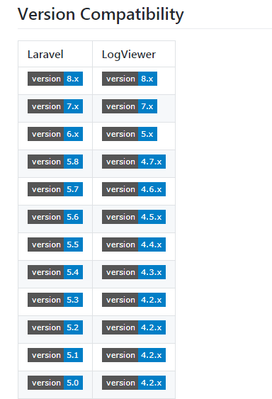
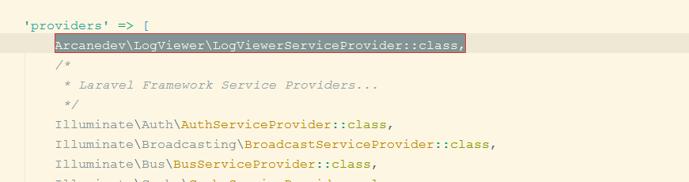
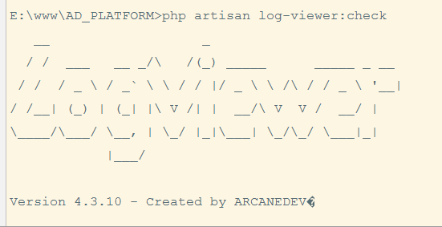
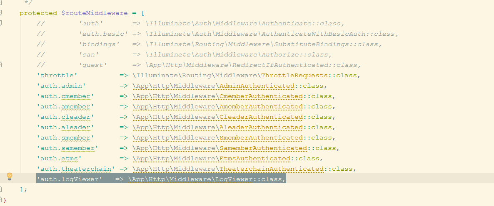
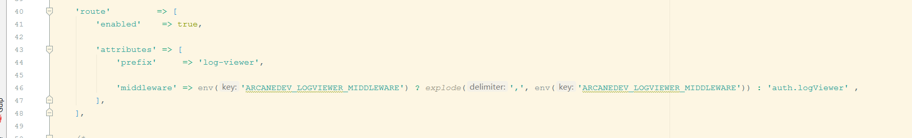
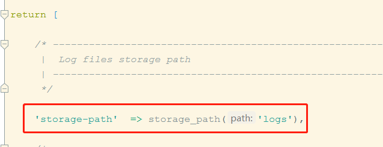
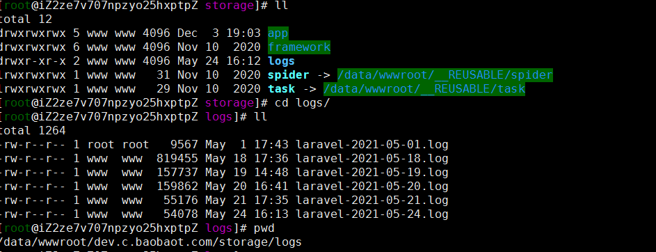
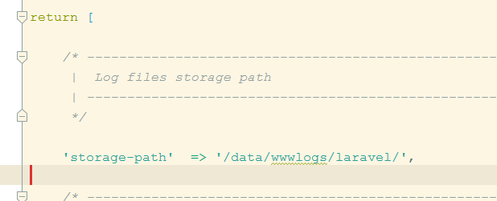
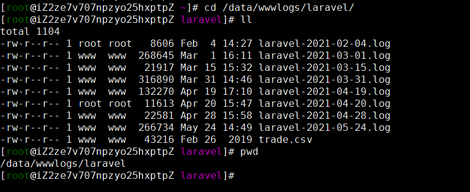

### log-viewer

[toc]

### 使用的步骤很简单：


##### 使用 composer 安装 composer require arcanedev/log-viewer:~4.6.0



##### 如果你的 laravel 日志还不是 daily 请设置为这个

```sh
config/app.php


'log' => env('APP_LOG', 'daily'),

'log_level' => env('APP_LOG_LEVEL', 'debug'),

```


##### laravel 版本低于 5.5 的，请把 Arcanedev\LogViewer\LogViewerServiceProvider::class, 加入服务提供者(config/app.php)



##### 执行 php artisan log-viewer:check 如果出现如下图，代表就成功了。



##### 如果想登录以后才可以查看日志，那么需要加入中间件

```sh
app/Http/Kernel.php

'auth.logViewer'   => \App\Http\Middleware\LogViewer::class,
```



##### 创建LogViewer中间件(app/Http/Middleware/LogViewer)

```sh
<?php

namespace App\Http\Middleware;

use Closure;
use Illuminate\Support\Facades\Cookie;

class LogViewer
{
    /**
     * Handle an incoming request.
     *
     * @param  \Illuminate\Http\Request  $request
     * @param  \Closure  $next
     * @return mixed
     */
    public function handle($request, Closure $next)
    {
        $user = $request->user();
        //超级管理员
        if (!$user->check() || !request()->user()->super) {
            return response()->view('page.errors.404');
        }
        return $next($request);
    }
}
```

##### 如果登录语言不是中文发话，可以修改配置（config/log-viewer.php）

```sh
'locale'        => 'zh',

'route'         => [
        'enabled'    => true,

        'attributes' => [
            'prefix'     => 'log-viewer',

            'middleware' => env('ARCANEDEV_LOGVIEWER_MIDDLEWARE') ? explode(',', env('ARCANEDEV_LOGVIEWER_MIDDLEWARE')) : 'auth.logViewer' ,
        ],
    ],
```




##### 日志的路径一定要写对

###### AD







###### 卖品



