# mysql索引的一些总结

[TOC]

### 1.索引的基本语法

```sql
create index 索引名称 on table(列的名称);
-- 添加索引
-- create index idx_name1 on cinema_sku_old(name1);

alter table 表名 add index 索引名称(列的名称);
-- 添加索引
-- alter table cinema_sku_old add index idx_name1(name1);

-- 该语句添加一个主键，这意味着索引值必须是唯一的，且不能为NULL
alter table tbl_name add primary key(column_list)

-- 这条语句创建索引的值必须是唯一的(除了NULL外，NULL可能会出现的多次)
alter table tbl_name add unique index_name(column_list)

-- 该语句指定了索引为FULLTEXT,用于全文索引
alter table tbl_name add fulltext index_name(column_list)


drop index idx_name1 on table;
-- 删除索引:
-- alter table cinema_sku_old drop index idx_name1;
-- drop index idx_name1 on cinema_sku_old;

-- 查看city表的索引
-- show index from city;

-- 注意:
-- 以上操作不代表生产操作,我们不建议在一个列上建多个索引
-- 同一个表中，索引名不能同名。
```

### 2.那些情况需要创建索引

1. **主键自动建立唯一索引**
2. **频繁作为查询条件的字段应该创建索引**
3. **查询中与其他表关联的字段，外键关系建立索引**
4. **频繁更新的字段不适合创建索引(因为每次更新不单单是更新记录，还会更新索引,加重了IO的负担)**
5. **where条件里用不到的字段不需要创建索引**
6. **单值/组合索引的选择问题，在高并发下倾向创建组合索引**
7. **查询中排序的字段，排序字段若通过索引去访问将大大提高排序速度**
8. **查询中统计或者分组的字段** 

### 3.那些情况不需要创建索引

1. **表记录太少**
2. **经常增删改查的表(提高了查询速度，同时确降低了更新表的速度，如对表进行insert,update,delete,因为更新表时，mysql不仅要保存数据，还要保存索引文件)**
3. **数据重复且分布平均的表字段，因此应该只为经常查询和经常排序的数据列建立索引。注意，如果某个数据列包含许多重复的内容，为它建立索引就没有太大的实际效果**

### 4.执行计划获取

> desc或者explain都可以

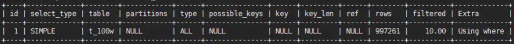

>  各个参数的意义 

#####  4.1  id 

 (select 查询的序列号，包含一组数字，表示查询中执行select字句或**操作表的顺序**)

三种情况：
 **id值相同，执行顺序由上至下** ，也就是如果是以下情况，mysql表的执行情况是t1,t3,t2的顺序查找。

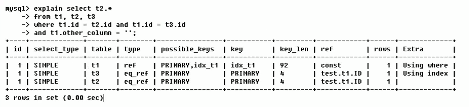

 **id值不相同** 。如果是子查询，id的序号会递增，**id值越大优先级越高，越先被执行**，也就是如果是以下情况，mysql表的执行情况是t3,t1,t2的顺序查找。

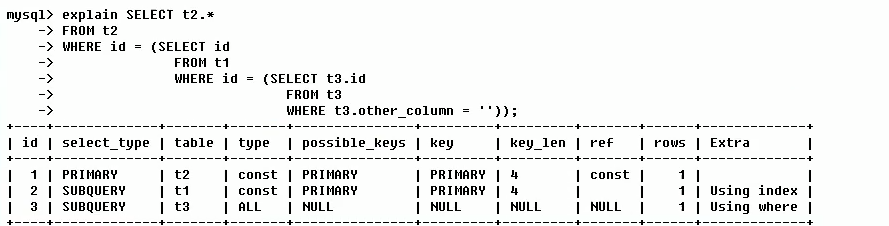

**id值相同不同，同时存在**。

> id如果相同，可以认为是一组，从上往下顺序执行；
>
> 在所有组中，id值越大，优先级越高，越先被执行
>
> 下表的derived2是衍生的意思，也就是衍生表，因为s1是一张虚表

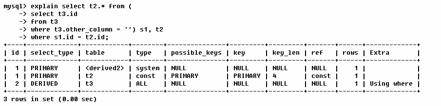

##### 4.2  select_type 

> 查询的类型，主要是区别普通查询，联合查询，子查询等的复杂查询。
>
> 类型有SIMPLE, PRIMARY, SUBQUERY, DERIVED, UNION, UNION RESULT

| 类型         |                                                              |
| ------------ | ------------------------------------------------------------ |
| SIMPLE       | 简单的select查询，查询中不包含子查询或者UNION                |
| PRIMARY      | 查询中若包含任何复杂的子部分，最外层查询被标记为PRIMARY（也就是最后加载的） |
| SUBQUERY     | 在select或where列表中包含了子查询                            |
| DERIVED      | 在from列表中包含的子查询被标记为DERIVED(衍生)mysql会递归执行这些子查询，把结果放在临时表里。 |
| UNION        | 若第二个select出现在**UNION**之后，则被标记为**UNION**；若**UNION**包含在from字句的子查询中，外层select将被标记为**DERIVED** |
| UNION RESULT | 从UNION表获取结果的select                                    |

##### 4.3  type 

> 访问类型排列
>
> (显示查询使用了何种类型，从**最好到最差**依次是：system > const > eq_ref > ref > range > index > All  )
>
> 一般来说，得保证查询至少达到range级别，最好达到ref.

| 类型   |                                                              |
| ------ | ------------------------------------------------------------ |
| system | 表只有一行记录（等于系统表），这是const类型的特例，平时不会出现，这个也可以忽略不计 |
| const  | 表示通过索引一次就找到了，const用于比较primary key或者unique索引。因为只匹配一行数据，所以很快如将主键置于where列表中，mysql就能将该查询转换为一个常量 |
| eq_ref | 唯一性索引扫描，对于每个索引键，表中只有一条记录与之匹配。常见于主键唯一索引 |
| ref    | 非唯一性索引扫描，返回匹配某个单独值的所有行。本质上也是一种索引访问，他返回所有匹配某个单独值的行，然而，它可能会找到很多符合条件的行，所有它应该属于查找和扫描的混合体 |
| range  | 只检锁给定范围的行，使用一个索引来选择行。key列显示使用了哪个索引，一般就是在你的where语句中出现了between、<、>、in等的查询，这种范围扫描索引扫描比全表扫描要好，因为它只需要开始于索引的某一点，而结束于另一点，不用全表扫描全部索引 |
| index  | Full Index Scan,index与All区别为index类型只遍历所以树。这通常比All快，因为索引文件通常比数据文件小。(**也就是说index和all都是读全表，但是index是从索引中读取的，而All是从硬盘中读取的**) |
| All    | Full Table Scan,将遍历全表以找到匹配的行                     |

##### 4.4  possible_keys

> 显示可能应用在这张表中的索引，一个或多个。查询涉及到的字段上若存在索引，则该索引将被列出。**但不一定是查询实际使用**。

##### 4.5  key

> 实际使用的索引。如果为NULL，则没有使用索引
>
> 查询中若使用了覆盖索引，则该索引仅出现在key列表中

##### 4.6  key_len

> 表示索引中使用的字节数，可通过该列计算查询中使用的索引的长度。在不损失精确性的情况下，长度越短越好。key_len显示的值为索引字段的最大可能的长度，**并非实际使用长度**，即ken_len是根据表定义计算而得，不是通过表内检索出的

##### 4.7  ref

> 显示索引的哪一列被使用了，如果可能的话，是一个常数。哪些列或常量被用于查找索引列上的值

##### 4.8  rows

> 根据表统计信息及索引选用情况，大致估算出找到所需的记录所需要读取的行数

##### 4.9  Extra

> 包含不适合在其他列中显示但十分重要的额外信息(**前三个比较重要**)
>
> 1. using filesort 说明mysql会对数据使用一个外部的索引排序，而不是按照表内的索引顺序进行读取。mysql中无法利用索引完成的排序操作称为“文件排序”。
>
> 2. using temporary 使用了临时表保存中间的结果，mysql在对查询结果排序时使用临时表。常见于排序order by和分组查询group by
>
> 3. using index 表示相应的select操作中使用了覆盖索引，避免访问了表的数据行，效率不错！如果同时出现using where,表明索引被用来执行索引键值的查找。如果没有同时出现using where，表明索引用来读取数据而非执行查找动作。
>
> 4. using where 表明使用了where过滤
>
> 5. using  join buffer 使用了连接缓存
>
> 6. impossible where   where子句的值总是false,不能用来获取任何元组
>
>    例如：select * from user where name = '张三' and name='李四';这样mysql会错乱
>
> 7. select tables optimized away 在没有group by子句的情况下，基于索引优化MIN/MAX操作或者对于mysql存储引擎优化count(*)操作，不必等到执行阶段再进行计算，查询执行计划生成的阶段即完成优化
>
> 8. distinct 优化distinct 操作，在找到第一匹配的元组后即停止找同样值的动作

### 5.索引优化

##### 单表分析

> 实例:  ，范围值后面的索引失效问题

```mysql
-- 创建一张表
MySQL [a]> select * from article_test;
+----+-----------+-------------+-------+----------+-------+---------+
| id | author_id | category_id | views | comments | title | content |
+----+-----------+-------------+-------+----------+-------+---------+
|  1 |         1 |           1 |     1 |        1 | 1     | 1       |
|  2 |         2 |           2 |     2 |        2 | 2     | 2       |
|  3 |         3 |           3 |     3 |        3 | 3     | 3       |
+----+-----------+-------------+-------+----------+-------+---------+
3 rows in set (0.00 sec)

-- 查询category_id为1且comments大于1的情况下，views最多的author_id。

-- sql 如下
explain select id,author_id from article_test where category_id=1 and comments>1 order by views desc limit 1;
```

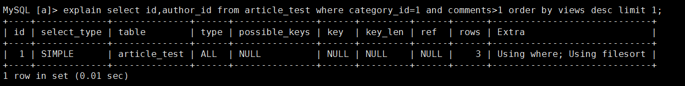

```sql
-- 结论：很显然，type是ALL，即是全表扫描，Extra里还出现了using filesort,也是最坏的情况，数据量大增，优化是必须的。

-- 开始优化
-- 建立索引
MySQL [a]> alter table article_test add index idx_ccv(category_id,comments,views);
Query OK, 0 rows affected (0.10 sec)
Records: 0  Duplicates: 0  Warnings: 0
-- 验证索引
```

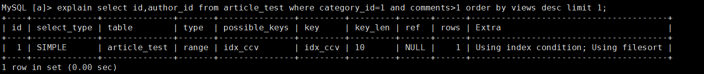

```sql
-- 从上图可以看出，出现了内排序。索引失败，删除索引
drop index idx_ccv on article_test;

-- 导致失败的原因
-- type变成了range，这是可以忍受的，但是出现内排序，这就很糟了。
-- 我们建立了索引为什么没用呢？这是因为按照btree索引的工作原理，先排序category_id，如果遇到相同的category_id则再排序comments，如果遇到相同的comments则再排序views。当comments字段在联合索引里处于中间位置时，因为comments>1的条件是一个范围值(也就是range),mysql无法利用索引再对后面的views部分进行检索，即range类型查询字段后面的索引无效。
-- 知道原因以后，继续建立索引
alter table article_test add index idx_cv(category_id,views);
-- 验证索引
```

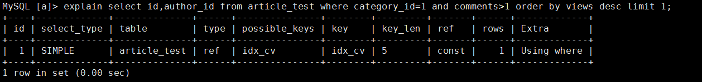

```sql
-- 结论：
-- 可以看到，type变为了ref，内排序也消失了，索引结果非常理想.
```

##### 两表分析

```sql
-- 下面开始explain分析
explain select * from class left join book on class.card = book.card;
-- 结论：type有ALL，表示全表扫描
-- 首先先加右表(也就是book)
-- 添加索引优化
alter table book add index y(card);
-- 验证索引
```

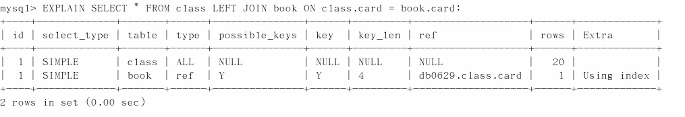

```sql
-- 然后添加相同的索引到左表(也就是class)
-- 添加索引优化
alter table class add index y(card);
-- 验证索引
```

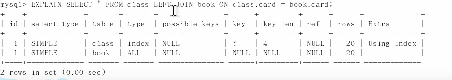

> 结论：可以看到第二行的type变为了ref，rows优化比较明显，显然是第一次建立的索引效果更好一些，这是由左连接特性决定的。left join条件用于确定如何从右边搜索行，左边一定都有，所以后边是我们的关键点，一定需要建立索引。(**也就是左连接加右表**，**右连接加左表**)

##### 三表分析

```sql
-- 三表连接查询
select * from class left join book on class.card = book.casr left join phone on book.card = phone.card;
```

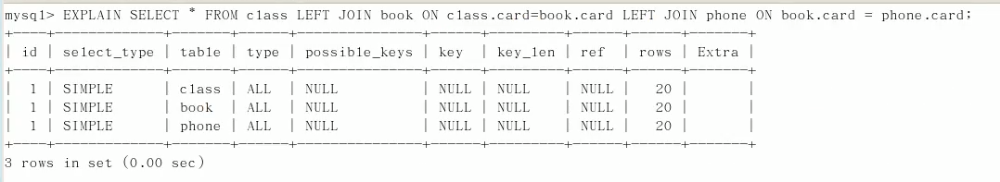

```sql
-- 建立索引
-- 按照两表建立索引原则，左连接应该建立在右表，也就是建立在book表和phone表里
-- 创建索引
alter table phone add index card(card);
alter table book add index card(card);
-- 我们查看一下效果
```

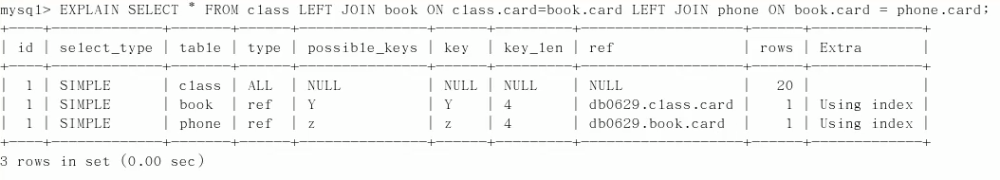

```sql
-- 后两行的type都是ref且总rows优化也很好，效果不错，因此三表查询和两表查询建立索引的方法是一样的，左连接加右表。
```

> 结论：
>
> join语句的优化
>
> 尽可能减少join语句中的Nested Loop(嵌套循环)的循环总次数：‘**永远用小结果集驱动大的结果集**(也就是我们说的，小表驱动大表)’
>
> 优先优化Nested Loop(嵌套循环)的内层循环;
>
> 保证join语句中被驱动表上join条件字段已经被索引
>
> 当无法保证被驱动表的join条件字段被索引且内存资源充足的前提下，不要太吝啬Join Buffer的设置

##### 什么是小表驱动大表

> 类似循环嵌套
>
> ```
> for(int i=5;.......)
> {
>      for(int j=1000;......)
>      {}
> }
> ```
>
> 如果小的循环在外层，对于数据库连接来说就只连接5次，进行5000次操作，如果1000在外，则需要进行1000次数据库连接，从而浪费资源，增加消耗。这就是为什么要小表驱动大表。

### 6.索引失效

##### **最好进行全值匹配**

##### **最佳左前缀法则**

> 如果索引了多列，要遵循最左前缀法则。指的是查询从索引的最左前列开始并且不跳过索引中的列

##### **不在索引列上做任何操作(计算、函数、（自动or手动）类型转换)，会导致索引失效而转向全表扫描**

```sql
-- 不走索引，因为tel类型为字符串，mysql会进行隐式转化
select * from t1 where tel=12345678911;
-- 加引号走索引
select * from t1 where tel='12345678911';
```

##### **存储引擎不能使用索引中范围条件右边的列**

```sql
-- 索引是a_b_c
select * from t1 where a='name1' and b>3 and c='name2';
-- 以上的sql索引只能走到b

-- 定值查询比select *要好很多，相同的sql，下面的写法要优于select *
select a,b,c from t1 where a='name1' and b>3 and c='name2';
```

##### **尽量使用覆盖索引(只访问索引的查询（索引列和查询列一致）)，减少select***

```sql
-- 索引为a_b_c
select * from t1 where a='name1' and b='name2' and c='name3';
select a,b,c from t1 where a='name1' and b='name2' and c='name3';
-- 第二条查询比第一条查询好
```

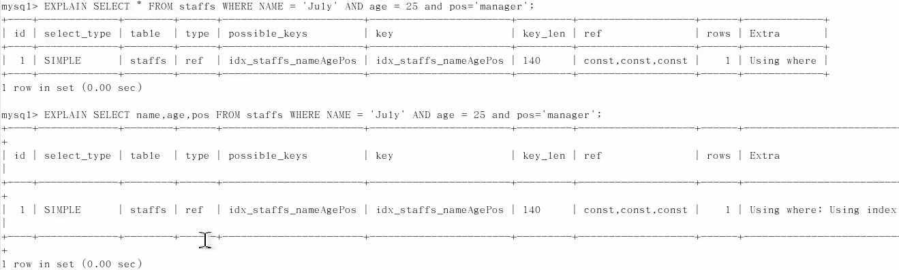

##### **不等于(!=或<>)的时候无法使用索引会导致全表扫描(一般情况下，具体问题还是得具体分析)**

```sh
1.使用 != 和 <> 的字段索引失效
2.!= 针对数值类型， <> 针对字符类型
3.若where中存在and，且and后的字段在混合索引中的位置比当前字段靠前where age != 10 and name='xxx' ，这种情况下mysql自动优化，将 name='xxx' 放在age ！=10 之前，name 依然能使用索引，只是 age 的索引失效
```

##### **is null,is not null也无法使用索引**(一般情况下，具体问题还是得具体分析)

```sh
MySQL中决定使不使用某个索引执行查询的依据就是成本够不够小，如果null值很多，还是会用到索引的。

亲测：
一个大概16万数据的表，如果只有10多个记录是null值，is null走索引，not null和!=没走索引，如果大部分都是null值，只有部分几条数据有值，is null，not null和!=都走索引。

#数据结构
CREATE TABLE s1 (
    id INT NOT NULL AUTO_INCREMENT,
    key1 VARCHAR(100),
    key2 VARCHAR(100),
    key3 VARCHAR(100),
    key_part1 VARCHAR(100),
    key_part2 VARCHAR(100),
    key_part3 VARCHAR(100),
    common_field VARCHAR(100),
    PRIMARY KEY (id),
    KEY idx_key1 (key1),
    KEY idx_key2 (key2),
    KEY idx_key3 (key3),
    KEY idx_key_part(key_part1, key_part2, key_part3)
) Engine=InnoDB CHARSET=utf8;
#16万的数据(可以用蠕虫复制造点假数据)
mysql> SELECT COUNT(*) FROM s1;
+----------+
| COUNT(*) |
+----------+
|    163840 |
+----------+
1 row in set (0.00 sec)

#下面来看效果
#下表中key1的值，有10条是为null的值，剩下的全部都是有值的，key2只有一条有值，其余全部都是null
```

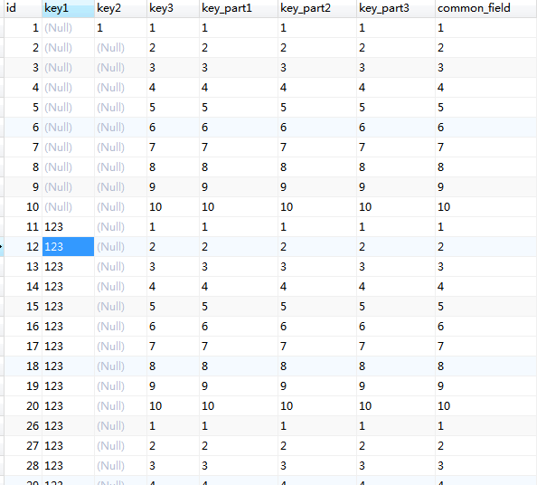

```sql
-- 可以看出如果只有10多个记录是null值，is null走索引，not null和!=没走索引，
explain SELECT * from s1 WHERE key1 is NULL;
```

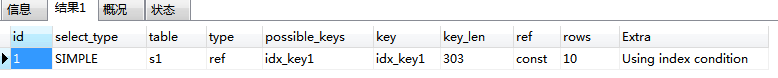

```sql
explain SELECT * from s1 WHERE key1 is NOT NULL;
```

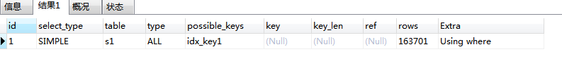

```sql
explain SELECT * from s1 WHERE key1 != '1';
```

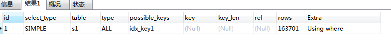

```sql
-- 如果大部分都是null值，只有部分几条数据有值，is null，not null和!=都走索引。
explain SELECT * from s1 WHERE key2 is NULL;
```

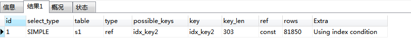

```sql
explain SELECT * from s1 WHERE key2 is NOT NULL;
```

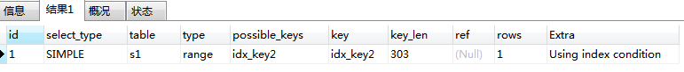

```sql
explain SELECT * from s1 WHERE key2 != '1';
```

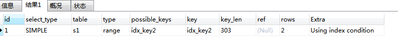

##### like以通配符开头(%ABC, %ABC%)mysql索引失效会变成全表扫描的操作**

```sql
-- 索引为name_age 
-- 如何解决like百分号索引失效的问题(select * from t1 where name like '%aa%')
-- 解决办法是用覆盖索引
select name,age from t1 where name like '%aa%';
select name from t1 where name like '%aa%';
-- 这种情况也是可以使用索引的，因为id是主键，也可以从索引中找，不需要查表
select id from t1 where name like '%aa%';--(如果不建立name_age索引，主键默认的索引是不走的)
select id,name from t1 where name like '%aa%';
select id,name,age from t1 where name like '%aa%';
select age from t1 where name like '%aa%';--这个也是可以走name_age索引的
select age,name from t1 where name like '%aa%';--这个也是可以走name_age索引的

-- 下面的sql是不走索引的(索引为name_age)
select * from t1 where name like '%aa%';
select id,name,age,email from t1 where name like '%aa%';

-- 以下情况也是可以走索引的
-- 索引为a_b_c
select * from t1 where a=3 and b like 'kk%' and c=4; -- 可以走索引a_b_c
select * from t1 where a=3 and b like '%kk' and c=4; -- 只能走到a_b
select * from t1 where a=3 and b like '%kk%' and c=4; -- 只能走到a_b
select * from t1 where a=3 and b like 'kk%kk%' and c=4; -- 可以走索引a_b_c
```

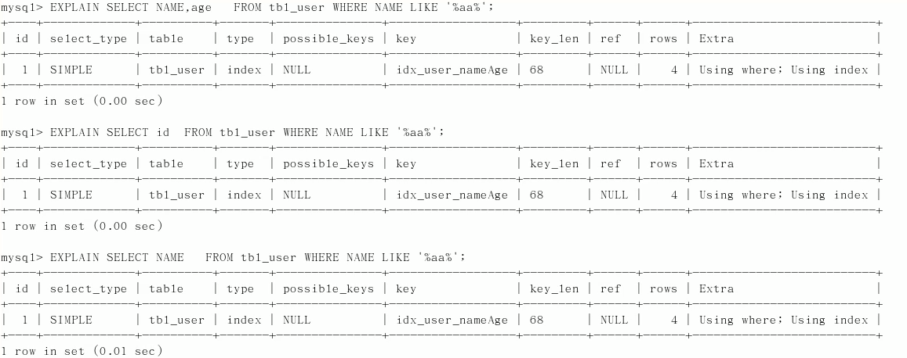

##### **字符串不加单引号索引失效**

```sql
-- name字段为valchar类型，以下两种写法都可以查出结果集
select * from t1 where name='2000';
select * from t1 where name=2000;

-- Extra里面出现Using index condition
MySQL [a]> explain select * from user_test where name='2000';
+----+-------------+----------+
| id | Extra                 |
+----+-------------+---------+
   1 | Using index condition |
+----+-------------+----------+
1 row in set (0.00 sec)

MySQL [a]> explain select name,age from user_test where name='2000';
+----+-------------+
| id | Extra       |
+----+-------------+
|  1 | Using where; Using index |
+----+-------------+
1 row in set (0.00 sec)
-- using index 和using where只要使用了索引我们基本都能经常看到，而using index condition则是在mysql5.6后新加的新特性
-- 简单来说，mysql开启了ICP的话，可以减少存储引擎访问基表的次数
-- 下面来简单的介绍一下这三者的区别

-- using index ：使用覆盖索引的时候就会出现

-- using where：在查找使用索引的情况下，需要回表去查询所需的数据

-- using index condition：查找使用了索引，但是需要回表查询数据

-- using index & using where：查找使用了索引，但是需要的数据都在索引列中能找到，所以不需要回表查询数据

-- 以上四点就能看出它们之前的区别，或许有部分人都存在疑惑 using index & using where 和using index condition那个比较好，从上面的的解释中就能看出是前者比较好，毕竟不需要回表查询数据，效率上应该比较快的。
-- 个人认为，Using index condition其实就是优化了Using where这种情况，有条件的也可以自己写个demo测试一下
```

##### **少用or，用它来连接时会索引失效**

 ```sql
-- 这种查询方法是不能用索引的
select * from t1 where name='张三' or name='李四';

-- or或in  尽量改成union
EXPLAIN  SELECT * FROM t1 WHERE telnum  IN ('110','119');
改写成：
EXPLAIN SELECT * FROM teltab WHERE telnum='110'
UNION ALL
SELECT * FROM teltab WHERE telnum='119'
 ```
##### **exists 和in**

```sql
-- 优化原则：小表驱动大表，即小的结果集驱动大的结果集。
select * from A where id in (select id from B)
-- 等价于
for select id from B 
for select * from A where A.id = B.id
-- 当B表的数据集小于A表的数据集时，用in优于exists
--------------------------------------------------------------

select * from A where exists (select 1 from B where B.id=A.id)
-- 等价于
for select * from A
for select 1 from B where B.id = A.id

--当A表的数据集小于B表的数据集时，用exists优于in


-- 例子：
-- 100个部门，5000个员工。tb_small_data（小表-部门表），tb_big_data（大表-员工表）。
-- 1.当B表的数据集小于A表数据集时，用in优于exists。
select * from tb_big_data A where A.deptno in (
    select B.deptno from tb_small_data B
)
-- B表为tb_small_data：100条数据，A表tb_big_data：5000条数据。

-- 将上面sql转换成exists：
select *from tb_big_data A where exists(select 1 from tb_small_data B where B.deptno=A.deptno);

-- 当A表的数据集小于B表的数据集时，用exists优于in
select *from tb_small_data A where A.deptno in(select B.deptno from tb_big_data B);

-- 将上面sql转换成exists：
select *from tb_small_data A where exists(select 1 from tb_big_data B where B.deptno=A.deptno);
```

> 总结：
>
> ==in后面跟的是小表，exists后面跟的是大表==。
>
> 简记：==in小，exists大==。
>
> 对于exists
>
> select .....from table where exists(subquery);
>
> 可以理解为：将主查询的数据放入子查询中做条件验证，根据验证结果（true或false）来决定主查询的数据是否得以保留。

### 7.实例简析

> 环境 ：
>
> 创建一张表test03;
>
> 创建索引c1234(c1,c2,c3,c4)

```sql
-- 建表
MySQL [a]> select * from test03;
+----+------+------+------+------+------+
| id | c1   | c2   | c3   | c4   | c5   |
+----+------+------+------+------+------+
|  1 | a1   | a2   | a3   | a4   | a5   |
|  2 | b1   | b2   | b3   | b4   | b5   |
|  3 | c1   | c2   | c3   | c4   | c5   |
|  4 | d1   | d2   | d3   | d4   | d5   |
|  5 | e1   | e2   | e3   | e4   | e5   |
+----+------+------+------+------+------+
5 rows in set (0.00 sec)
-- 添加索引
MySQL [a]> alter table test03 add index idx_c1234(c1,c2,c3,c4);
```

```sql
-- 根据创建的联合索引idx_c1234，分析sql的索引使用情况
-- 可以使用索引
explain select * from test03 where c1='a1';
explain select * from test03 where c1='a1' and c2='a2';
explain select * from test03 where c1='a1' and c2='a2' and c3='a3';
explain select * from test03 where c1='a1' and c2='a2' and c3='a3' and c4='a4';
explain select * from test03 where c1='a1' and c2='a2' and c4='a4' and c3='a3';

-- 索引走到c1_c2_c3
explain select * from test03 where c1='a1' and c2='a2' and c3>'a3' and c4='a4';

-- 可以用到索引idx_c1234，mysql优化器会调整位置
explain select * from test03 where c1='a1' and c2='a2' and c4>'a4' and c3='a3';

-- 如果查看执行计划显示只用到了c1_c2，但是严格来说，c3也用到了，不是用来查找，而是排序，索引是两大功能，查找和排序。
explain select * from test03 where c1='a1' and c2='a2' and c4='a4' order by c3;

-- 这个和上面的是一样的结果，索引只用到c1_c2
explain select * from test03 where c1='a1' and c2='a2' order by c3;

-- 虽然用到了c1_c2索引，但是会发生filesort，不建议这么写
explain select * from test03 where c1='a1' and c2='a2' order by c4;

-- 执行计划显示只用了c1一个字段索引，但是c2,c3用于排序，无filesort
explain select * from test03 where c1='a1' and c5='a5' order by c2,c3;

-- 和上面一条一样，只用了c1一个字段，但是出现了filesort
explain select * from test03 where c1='a1' and c5='a5' order by c3,c2;

-- 可以使用索引，c1,c2, 但是c2,c3用于排序，无fliesort
explain select * from test03 where c1='a1' and c2='a2' order by c2,c3;

-- 和上面的一样，和c5没有什么关系，c1,c2两个字段索引，但是c2,c3用于排序，无fliesort
explain select * from test03 where c1='a1' and c2='a2' and c5='a5' order by c2,c3;


-- c1,c2两个字段索引，但是c2,c3用于排序，无fliesort，这条sql和c5没什么关系，主要原因是where条件里有了c2这个条件已经是一个常量。如果把c2='a2'变为c2>'a2',那么结果仍然是出现filesort
explain select * from test03 where c1='a1' and c2='a2' and c5='a5' order by c3,c2;

-- 无filesort，其实group by的语法和order by 差不多，所以这条的索引情况等价于explain select * from test03 where c1='a1' and c4='a4' order by c2,c3;
-- group 表面是分组，但是分组之前必排序
explain select * from test03 where c1='a1' and c4='a4' group by c2,c3;
-- 有filesort,并且生成了临时表Using temporary
explain select * from test03 where c1='a1' and c4='a4' group by c3,c2;

```

### 8. order by

> order by字句，尽量使用index方式排序,避免使用filesort方式排序。
>
> order by 语句使用索引最左前列
>
> 使用where 语句与order by 语句条件组合满足索引最左前列原则

##### filesort的两种算法

如果不在索引列上,filesort有两种算法，mysql就要启动**双路排序**和**单路排序**

```sql
-- 双路排序：mysql4.1之前是使用双路排序，字面意思就是两次扫描磁盘，最终得到数据，读取行指针和orderby列，对他们进行排序，然后扫描已经排序好的列表，按照列表中的值重新从列表中读取对应的数据输出。从磁盘取排序字段，在buffer进行排序，再从磁盘取其他字段。
-- 取一批数据，要对磁盘进行两次扫描，I/O是很耗时的，所以在mysql4.1之后，出现了第二种改进的算法，就是单路排序。

-- 单路排序：从磁盘读取查询需要的所有列，按照orderby列在buffer对它们进行排序，然后扫描排序后的列表进行输出，它的效率更快一些，避免了第二次读取数据。并且把随机I/O变成了顺序I/O，但是它会使用更多的空间，因为它把每一行都保存在内存中了。

-- 但是单路排序也存在问题(方法B指单路排序)
-- 在sort_buffer中，方法B比方法A要多占用很多空间，因为方法B是把所有字段都取出来，所以有可能取出的数据的总大小超出了sort_buffer容量大小，导致每次只能取sort_buffer容量大小的数据，进行排序(创建tmp文件，多路合并)，排完再取sort_buffer容量大小，再排.....从而造成多次I/O;
-- 本来想省一次操作，最后反而导致了大量的I/O操作。


-- 优化策略
1.增加sort_buffer_size参数的设置
2.增大max_length_for_sort_data的参数设置

-- 提高order by的速度

1.order by 时，select *是一个大忌，最好是用多少取多少。

当query的字段大小总和小于max_length_for_sort_data而且排序字段不是TEXT|BLOB类型时，会用改进后的算法------单路排序,否则用老算法-------多路排序

两种算法的数据都有可能超出sort_buffer的容量，超出之后，会创建tmp文件进行合并排序，导致多次I/O，但是用单路排序算法风险会更大一些，所以要提高sort_buffer_size。

2.尝试提高sort_buffer_size

不用管哪种算法，提高这个参数会提高效率，当然，要根据系统的能力去提高，因为这个参数是针对每个进程的

3.尝试提高max_length_for_sort_data

提高这个参数，会增加用改进算法的概率。但如果设的太高，数据总容量超出sort_buffer_size的概率就会增大，明显症状是高的磁盘I/O活动和低的处理器使用率。
```

```sql
-- 实例
-- 索引为a_b

select * from t1 where a > 20 order by a;    -- 没有filesort

select * from t1 where a > 20 order by a,b;  -- 没有filesort

select * from t1 where a > 20 order by b;    -- 有filesort

select * from t1 where a > 20 order by b,a;  -- 有filesort

select * from t1 order by b;    			 -- 有filesort

select * from t1 where b > 20 order by b;    -- 有filesort

select * from t1 where b> 20 order by a;     -- 没有filesort

select * from t1 order by a asc, b desc;     -- 有filesort
```

##### 为排序使用索引

> mysql两种排序方式:  文件排序（filesort） 或 扫描有序索引排序（using index）, index效率高
>
> mysql能为排序与查询使用相同的索引

```sql
-- Key a_b_c(a,b,c) 索引为a_b_c
order by a   -- 可以使用索引，不会出现filesort
order by a,b  -- 可以使用索引，不会出现filesort
order by a,b,c  -- 可以使用索引，不会出现filesort
order by a desc, b desc, c desc -- 可以使用索引，不会出现filesort

-- 如果where使用索引的最左前缀定义为常量，则order by能使用索引
where a= '张三' order by b,c    -- 可以使用索引 不会出现filesort
where a= '张三' and b=2 order by c    -- 可以使用索引 不会出现filesort
where a= '张三' and b>2 order by b,c    -- 可以使用索引 不会出现filesort


-- 不能使用索引进行排序
order by a asc, b desc, c desc  -- 排序不一致
where g='张三' order by b,c    --  丢失a索引
where a= '张三' order by c   -- 丢失b索引
where a = 'zhangsan' orderby a,d  -- d不是索引的一部分
where a in(...) order by b,c -- 对于排序来说，多个相等条件也是范围查询
```

### 9. group by

> group by 实质是先排序后进行分组，遵照索引键的最佳左前缀
>
> 当无法使用索引列，增大max_length_for_sort_data参数的设置+增大sort_buffer_size参数的设置
>
> where高于having，能写在where限定的条件就不要取having限定了


