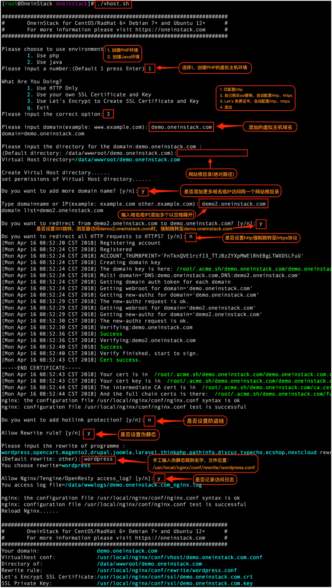
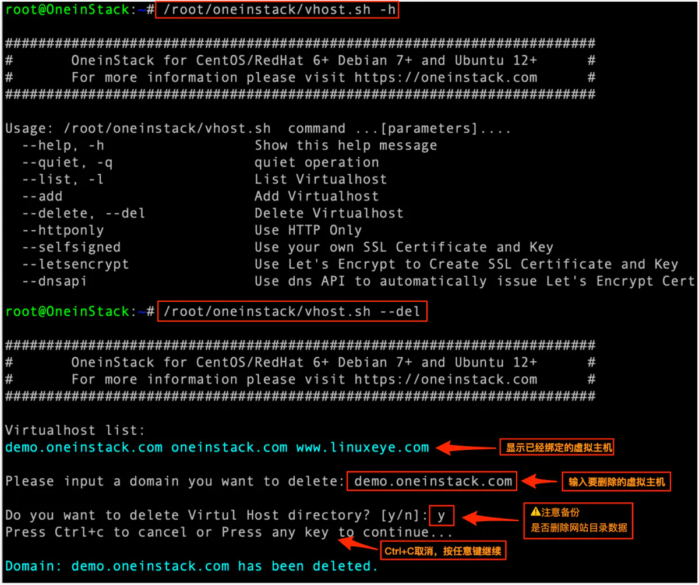

# oneinstack日常安装使用技巧

[TOC]
## 安装

```sh
yum -y install wget screen #for CentOS/Redhat
# apt-get -y install wget screen #for Debian/Ubuntu
wget http://mirrors.linuxeye.com/oneinstack-full.tar.gz #包含源码，国内外均可下载
tar xzf oneinstack-full.tar.gz
cd oneinstack #如果需要修改目录(安装、数据存储、Nginx日志)，请修改options.conf文件
screen -S oneinstack #如果网路出现中断，可以执行命令`screen -R oneinstack`重新连接安装窗口
./install.sh
```


## 连接不上navicate?

```sh
[root@centos7 ~]# iptables -I INPUT 4 -p tcp -m state --state NEW -m tcp --dport 3306 -j ACCEPT
[root@centos7 ~]# service iptables save
iptables: Saving firewall rules to /etc/sysconfig/iptables:[  OK  ]
```

## 如何添加附加组件？

```bash
~/oneinstack/addons.sh
```


## 如何添加虚拟主机？

```jsx
~/oneinstack/vhost.sh
```



## 如何删除虚拟主机？

```ruby
~/oneinstack/upgrade.sh --oneinstack #升级脚本工具，不影响正在运行环境
~/oneinstack/vhost.sh --del
```



## 如何管理FTP账号？

```bash
~/oneinstack/pureftpd_vhost.sh
```


## 如何备份？

```ruby
~/oneinstack/backup_setup.sh # Set backup options 
```


```bash
 ~/oneinstack/backup.sh # Start backup, You can add cron jobs
   # crontab -l # Examples 
     0 1 * * * ~/oneinstack/backup.sh  > /dev/null 2>&1 &
```

## 如何管理服务？

Nginx/Tengine/OpenResty:

```bash
service nginx {start|stop|status|restart|reload|configtest}
```

MySQL/MariaDB/Percona:

```bash
service mysqld {start|stop|restart|reload|status}
```

PostgreSQL:

```bash
service postgresql {start|stop|restart|status}
```

MongoDB:

```bash
service mongod {start|stop|status|restart|reload}
```

```bash
service mongod {start|stop|status|restart|reload}
```

PHP:

```bash
service php-fpm {start|stop|restart|reload|status}
```

HHVM:

```bash
service supervisord {start|stop|status|restart|reload}
```

**注**：hhvm进程交给supervisord管理，了解更多请访问《[Supervisor管理hhvm进程](https://blog.linuxeye.com/408.html)》
 Apache:

```bash
service httpd {start|restart|stop}
```

Tomcat:

```bash
service tomcat {start|stop|status|restart}
```

Pure-Ftpd:

```bash
service pureftpd {start|stop|restart|status}
```

Redis:

```bash
service redis-server {start|stop|status|restart}
```

Memcached:

```bash
service memcached {start|stop|status|restart|reload}
```

## 如何更新版本？

```bash
~/oneinstack/upgrade.sh
```


如若上图无OneinStack选项，请执行下面：

```bash
cd ~/oneinstack
curl http://mirrors.linuxeye.com/upgrade_oneinstack.sh | bash
```

## 如何卸载?

```bash
~/oneinstack/uninstall.sh
```

