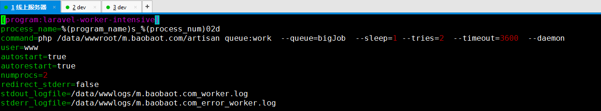
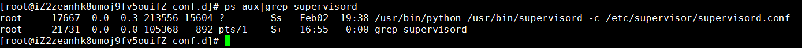
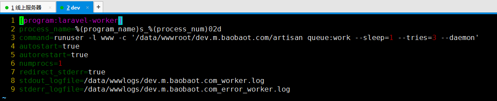

#  supervisor 安装配置使用 

[toc]

## 1.supervisor 简介

### 1.1 官网

 [supervisor 官网](http://supervisord.org/) 

### 1.2 介绍

> Supervisor 是一个进程控制系统。
> 它是一个 C/S 系统 (注意：其提供 WEB 接口给用户查询和控制)。
> 它允许用户去监控和控制在类 UNIX 系统的进程。
> 它的目标与 launchd、daemontools 和 runit 有些相似。
> 但是与它们不一样的是、它不是作为 init (进程号 pid 是 1) 运行。
> 它是被用来控制进程、并且它在启动的时候和一般程序并无二致。
> 那么通俗点，它的作用是什么？
> 你的 Nginx，Tomcat，memcache，Redis... 会崩么？
> 那你自己写的服务器监测脚本呢？
> 好吧、不要再纠结了、交给 Supervisor 吧！
> 它会帮你维护这些、即使它们不小心崩了、Supervisor 会帮你看住它们、维护它们。

## 2. 安装和配置

### 2.1 安装

> 我们这里只介绍 centos 安装方式 

```sh
yum install python-setuptools
easy_install supervisor
echo_supervisord_conf > /etc/supervisord.conf
```

### 2.2 配置

```sh
vi /etc/supervisord.conf
```

### 2.3（program）配置模版

```sh
[program:laravel-worker1]
process_name=%(program_name)s_%(process_num)02d
command=php /home/wwwroot/site.webshowu.com/artisan queue:work redis --sleep=3 --tries=3 --daemon
autostart=true
autorestart=true
user=root
numprocs=3
redirect_stderr=true
stdout_logfile=/home/wwwlogs/worker1.log
```

> 实例







### 2.4（program）配置说明

```sh
;*为必须填写项
;*[program:应用名称]
[program:cat]
;*命令路径,如果使用python启动的程序应该为 python /home/test.py, 
;不建议放入/home/user/, 对于非user用户一般情况下是不能访问
command=/bin/cat
;当numprocs为1时,process_name=%(program_name)s
;当numprocs>=2时,%(program_name)s_%(process_num)02d
process_name=%(program_name)s
;进程数量
numprocs=1
;执行目录,若有/home/supervisor_test/test1.py
;将directory设置成/home/supervisor_test
;则command只需设置成python test1.py
;否则command必须设置成绝对执行目录
directory=/tmp
;掩码:--- -w- -w-, 转换后rwx r-x w-x
umask=022
;优先级,值越高,最后启动,最先被关闭,默认值999
priority=999
;如果是true,当supervisor启动时,程序将会自动启动
autostart=true
;*自动重启
autorestart=true
;启动延时执行,默认1秒
startsecs=10
;启动尝试次数,默认3次
startretries=3
;当退出码是0,2时,执行重启,默认值0,2
exitcodes=0,2
;停止信号,默认TERM
;中断:INT(类似于Ctrl+C)(kill -INT pid),退出后会将写文件或日志(推荐)
;终止:TERM(kill -TERM pid)
;挂起:HUP(kill -HUP pid),注意与Ctrl+Z/kill -stop pid不同
;从容停止:QUIT(kill -QUIT pid)
;KILL, USR1, USR2其他见命令(kill -l),说明1
stopsignal=TERM
stopwaitsecs=10
;*以root用户执行
user=root
;重定向
redirect_stderr=false
stdout_logfile=/a/path
stdout_logfile_maxbytes=1MB
stdout_logfile_backups=10
stdout_capture_maxbytes=1MB
stderr_logfile=/a/path
stderr_logfile_maxbytes=1MB
stderr_logfile_backups=10
stderr_capture_maxbytes=1MB
;环境变量设置
environment=A="1",B="2"
serverurl=AUTO
```

### 2.5（inet_http_server）配置说明

```sh
#可以使用浏览器查看和控制进程状态
[inet_http_server]         ; inet (TCP) server disabled by default
port=0.0.0.0:9001          ; (ip_address:port specifier, *:port for all iface)
username=user              ; 用户名 (default is no username (open server))
password=123               ; 密码 (default is no password (open server))
```

## 3. 启动与关闭

### 3.1 启动 supervisor

```sh
supervisord -c /etc/supervisord.conf
```

### 3.2 关闭 supervisor

```sh
supervisorctl shutdown
```

### 3.3 重新载入配置

```sh
supervisorctl reload
```

# 说明 unix 系统进程信号

```sh
kill -1 //终端挂起或控制进程终止。当用户退出Shell时，由该进程启动的所有进程都会收到这个信号，默认动作为终止进程。
kill -2 //键盘中断。当用户按下组合键时，用户终端向正在运行中的由该终端启动的程序发出此信号。默认动作为终止进程。
kill -3 //键盘退出键被按下。当用户按下或组合键时，用户终端向正在运行中的由该终端启动的程序发出此信号。默认动作为退出程序。
kill -8 //发生致命的运算错误时发出。不仅包括浮点运算错误，还包括溢出及除数为0等所有的算法错误。默认动作为终止进程并产生core文件。
kill -9 //无条件终止进程。进程接收到该信号会立即终止，不进行清理和暂存工作。该信号不能被忽略、处理和阻塞，它向系统管理员提供了可以杀死任何进程的方法。
kill -14 //定时器超时，默认动作为终止进程。
kill -15 //程序结束信号，可以由 kill 命令产生。与SIGKILL不同的是，SIGTERM 信号可以被阻塞和终止，以便程序在退出前可以保存工作或清理临时文件等。
```

