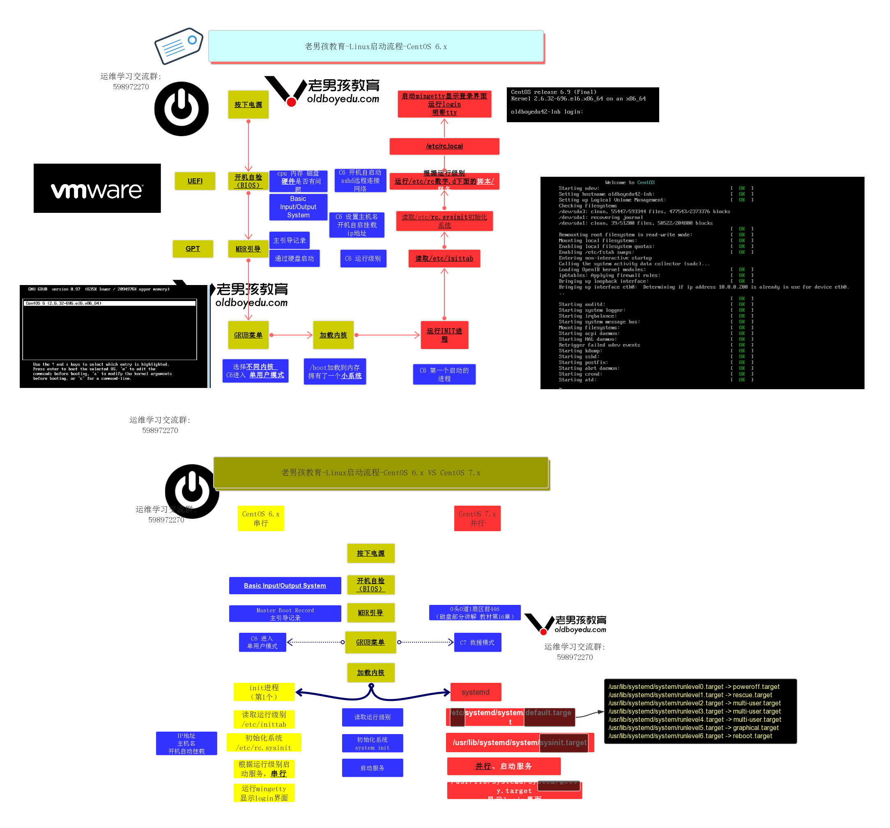

# 系统启动流程

[TOC]

### CentOS 7   并行 启动

1. 按下电源
2. 开机自检（Bios）                                             检查硬件信息是否存在问题
3. MBR引导                                                           可以加载磁盘引导系统启动
4. GRUB菜单                    可以选择使用的内核信息，可以选择是否采用救援模式进入系统，修复系统，重置密码
5. 加载内核信息                                                   可以更好控制管理硬件设备
6. 运行系统的第一个进程 systemd进程，控制后续进程并行启动
7. 读取系统运行级别（target）                          /etc/systemd/default.target
8. 完成系统初始化过程                                       加载初始化target文件  /usr/lib/systemd/system/sysinit.target
9. 执行/etc/rc.d/rc脚本                                       让开机自动运行的服务可以按顺序运行起来
10. 运行最后一个进程，minggetty进程              看到登录提示信息

### CentOS 6   并行 启动

1. 按下电源
2. 开机自检（Bios）                                         检查硬件信息是否存在问题
3. MBR主引导记录                                            可以加载磁盘引导系统启动
4. GRUB菜单                可以选择使用的内核信息，可以选择是否采用单用户模式进入系统，修复系统，重置密码
5. 加载内核信息                                                 可以更好控制管理硬件设备
6. 运行系统的第一个进程 init进程，控制后续进程串行启动
7. 读取/etc/inittab                                            识别系统运行级别
8. 执行/etc/rc.d/rc.sysinit脚本                       初始化主机名信息，网卡信息
9. 执行/etc/rc.d/rc脚本                                   让开机自动运行的服务可以按顺序运行起来
10. 运行最后一个进程，minggetty进程          看到登录提示信息

